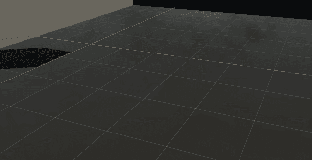

# 统一制作玻璃材料

> 原文：<https://medium.com/nerd-for-tech/making-a-glass-material-in-unity-eda50c616463?source=collection_archive---------0----------------------->

***在 Unity 中创建透明窗口效果***

从固体到玻璃

在 Unity 中创造一种基本的玻璃材料再容易不过了。今天，我们将看看如何快速创建一个。

玻璃材料只不过是经过一些调整的标准材料。