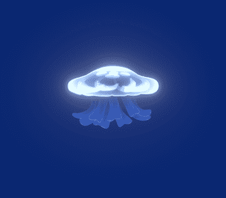

# 制作水母第二部分:Unity 实现和敌人行为

> 原文：<https://medium.com/nerd-for-tech/making-a-jellyfish-part-ii-unity-implementation-and-enemy-behavior-c80ad67e978f?source=collection_archive---------9----------------------->

在我上一篇文章中，我用 CorelDraw 举例说明了一个水母的敌人和一些相应的游泳动画帧。我在这篇文章中的**目标**是将艺术导入 Unity，制作动画，并创建一个与动画同步的游泳动作行为。让我们开始吧！