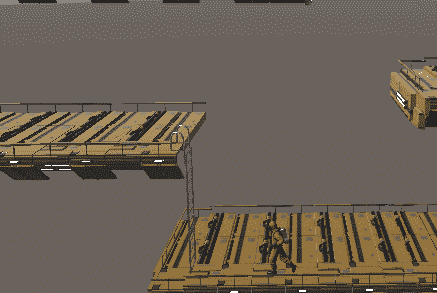
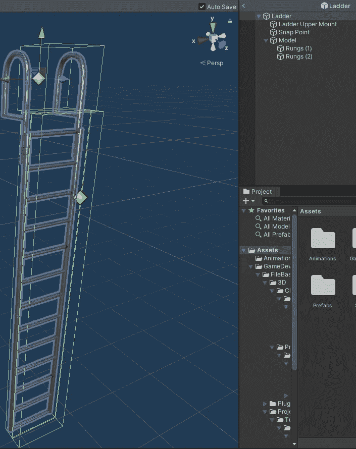
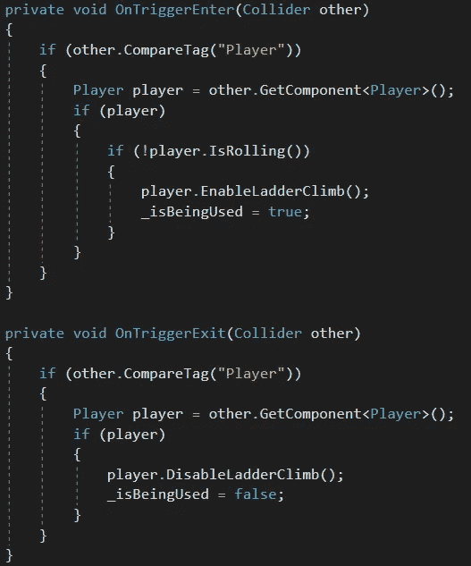
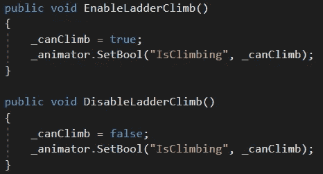
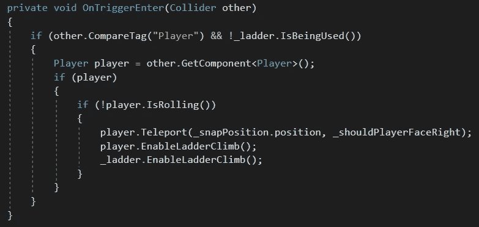
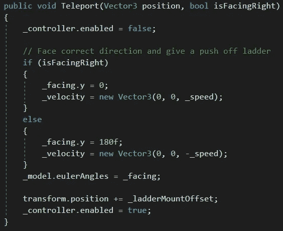
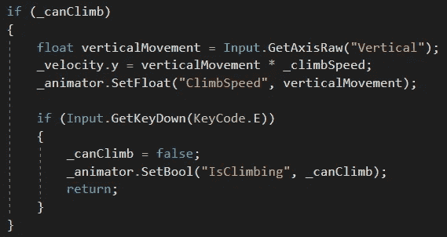

# 在团结中制造梯子

> 原文：<https://medium.com/nerd-for-tech/making-a-ladder-in-unity-24bec1655d23?source=collection_archive---------17----------------------->

**目标:**允许玩家爬上、爬下梯子。

我们的梯子看起来很复杂。

横档由两个对撞机组成。里面的是实心的，所以玩家不能穿过它。外面是触发碰撞器；当它检测到玩家已经触摸它时，它调用玩家的 *EnableLadderClimb* 方法，并将梯子本身标记为 *_isBeingUsed* 。同样，当玩家离开触发碰撞器时，它调用玩家的*disable adder clip*方法，并将 *_isBeingUsed* 标记为 *false。*

玩家身上的这两个方法只是简单地标记玩家是否在攀爬，并设置适当的动画状态。

*梯子上部支架*(上图中灰色标记的中心)是一个触发碰撞器，当玩家进入*时，如果*他们*而不是*已经在爬梯子，它会检测到玩家。如果满足这些条件，它将调用玩家的*瞬移*方法，传入梯子的*咬合点*(图中黄色标记)的位置，并告诉玩家面向哪个方向(朝向梯级)。然后它将调用玩家的 *EnableLadderClimb* 方法，如上所述，并告诉梯子它正在被使用。

玩家的*瞬移*方法禁用角色控制器。然后，它确保玩家面向正确的方向，并设置它向前移动的速度。玩家在梯子上不会向前移动，但是现在设置这一点很重要；如果玩家爬到梯子的顶端下马，会给玩家一点推力。如果没有这种推动，角色控制器会“卡”在顶部。设置好正确的朝向后，脚本将玩家移动到*捕捉点*——这就是我们禁用控制器的原因。如果我们不禁用它，我们会得到一些怪异的运动效果。现在，玩家在梯子上的正确位置面向正确的方向，我们重新启用角色控制器。

在玩家的 *CalculateMovement* 方法中，如果玩家正在攀爬，我们获取他们的输入，应用速度，并适当地制作动画。如果他们按下 *E* 键，他们将停止攀爬(这将使他们摔倒在地)。

这看起来很多，但是我们像一个合适的软件工程师一样把问题分解成小块。