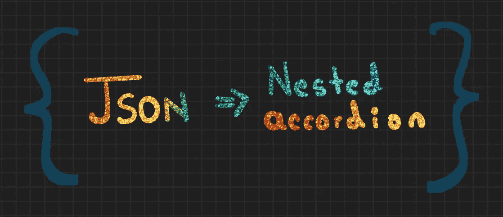
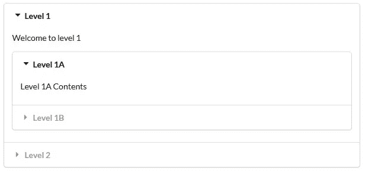
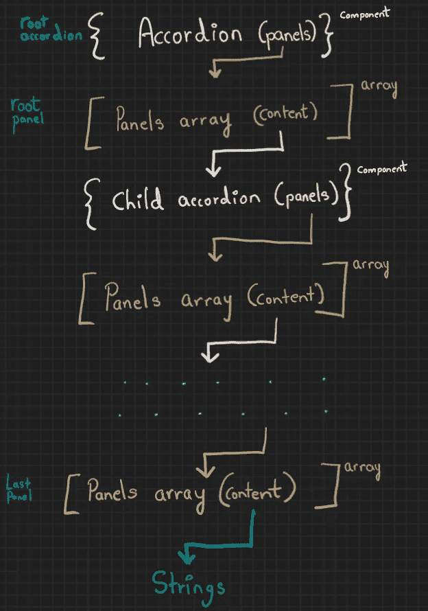
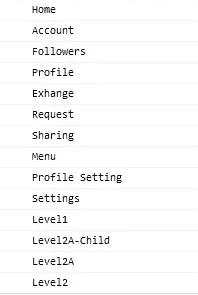
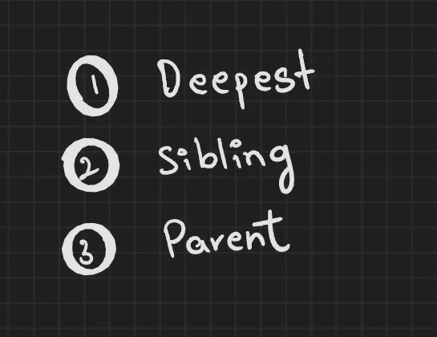

# 在 React 中从 JSON 制作嵌套手风琴

> 原文：<https://medium.com/nerd-for-tech/making-a-nested-accordion-in-react-from-json-7d307b038f84?source=collection_archive---------0----------------------->



**目录**
1。[创建我们的项目](#f825)
2。[理解语义-ui-反应嵌套手风琴](#979f)
3。从 json
4 制作嵌套手风琴。[工作示例](#4d2b)

# 🌠创建我们的项目

使用以下命令创建一个 react 应用程序。

```
## Make react app
npx create-react-app my-app## change directory
cd my-app
```

在首选编辑器中打开文件夹。在我们开始之前，我们需要[**semantic-ui-react**](https://react.semantic-ui.com/)**包，它将帮助我们渲染嵌套的手风琴。**

```
$  yarn add semantic-ui-react semantic-ui-css
## Or NPM
$  npm install semantic-ui-react semantic-ui-css
```

# **🌠**理解语义-用户界面-反应嵌套手风琴****

**在从 json 数据制作嵌套 accordion 之前，让我们试着熟悉一下 semantic-ui-react 包提供给我们的 n [ested accordion。如果你已经知道它是如何工作的，请跳过这一部分，看看下一步](https://react.semantic-ui.com/modules/accordion/)。**

**创建一个新文件。我们将它命名为 example.js，以匹配(semantic-ui-react)文档。该文件将包含以下代码。**

*   **这段代码允许我们呈现一个嵌套的 accordion(在添加 index.js 文件之后),如下所示。**

****

**一级手风琴**

1.  **分别从 react 和 semantic-ui-react 库中导入 React 和 Accordion(第 1 行和第 2 行)。**
2.  **根 accordion(第 34 行)将 rootPanels 作为面板属性的输入。因为我们想要一个 Level1 面板的子 accordion(第 29 行),所以我们称 Level1Content 组件(第 9 行)为它的内容。Level1Content 取另一组面板作为其面板道具。它没有任何子 accordion，所以我们传递一个简单的字符串作为它的内容(第 5 行和第 6 行)。**

**3.这同样适用于 2 级面板。希望我们能在这里看到模式。**

****

**更新 index.js 文件(在我们运行 create react app 命令时创建)以包含以下代码。**

1.  **我们需要确保添加样式表(第 7–11 行)。如果您想知道这些向嵌套的 accordion 组件添加了什么样式，我建议您注释掉这些行，并查看对呈现组件的影响。**
2.  **用 Container 包装我们的嵌套 accordion(在第 5 行作为“Example”导入),以给出一点余量。**

**这是语义用户界面反应文档中的一个工作示例。**

****嵌套折叠的语义-用户界面-反应沙箱****

# **🌠**用 json 制作嵌套手风琴****

**现在我们(希望)已经熟悉了 semantic-ui-react 包提供的嵌套 accordion，让我们看看如何从 json 创建嵌套 accordion。**

**首先更新 example.js 文件。让我们删除 example.js 中除导入之外的所有内容，然后像这样添加 json 数据。**

1.  **为了这篇文章的目的，我选择了一个例子，它有两行那么长，而且是嵌套的。这是为了让我们了解如何制定我们的 json 数据，以获得我们的嵌套手风琴。**
2.  **json 实际上只包括下面代码中提到的对象，我将把它称为**主对象**。**

```
{
    key : "String",
    title:"String",
    content:"Array including nested object"
}
```

**3.如果我们不需要子 accordion，内容键将包含一个空数组，如果我们需要子 accordion，则包含上面解释的主对象数组。**

**4.还要注意，json 数据被添加到一个数组中，因此我们可以有多个根级别面板。**

**最后，我们可以关注这个过程的核心，即递归遍历 json 并将其转换为嵌套 accordion 的函数。在 example.js 文件中追加以下代码。**

*   **accordify 函数将包含 json 数据的数组作为其参数。它将帮助我们递归地遍历 json。我们这样做是因为我们首先需要最深的主对象，这样我们就可以将它作为父 accordion 的输入。**
*   **如果我们在第 7 行的递归调用之后添加一个 console.log 语句，我们可以看到这个函数是如何遍历我们的输入的。**

```
accordify(*jsonData*[i]["content"]);console.log(*jsonData*[i]["key"])
```

*   **它先遍历到最深的{key:"string "，title:"string "，content:[ ]}对象(主对象)，然后移动到同级的兄弟对象(如果有的话)，再跳转到父手风琴，继续这个过程。**

********

*   **如果主对象有一个空数组作为内容键的值，也就是说它没有子 accordion，我们用 Accordion 包装它。标题组件(第 18 行-第 31 行)。当然，您可以使用任何其他组件。**
*   **如果主对象有一个非空数组作为内容键的值，也就是说它有一个子 accordion(这个子 accordion 本身还可以有一个子 accordion)，我们用 Accordion 包装它。折叠并将非空数组传递给它面板本身(第 10 行到第 16 行)。**
*   **如果我们想看看 json 数据在函数中运行后的实际情况，我们可以在函数调用后添加一个 console.log 语句，如下所示。**

```
console.log(JSON.stringify(jsonData,null,2))
```

*   **最后，我们将更新后的 json 数据提供给 Accordion 组件的 panels props，并将其导出。**

```
*const* AccordionExampleNested = () *=>* ( <Accordion *defaultActiveIndex*={0} *panels*={jsonData} *styled* />);
export default AccordionExampleNested;
```

*   **如果出于某种原因，您想知道这个函数执行需要多长时间，我们可以通过添加 performance.now()函数来实现，如下所示。对于示例中的 json，平均需要 3 毫秒。**

```
*var start= performance.now();* accordify(jsonData);
*var end= performance.now();
console.log("Call to accordify took " + (end - start) + " milliseconds.");*
```

*   **完成所有更新后，整个 example.js 文件应该如下所示。**

**下面是我们的 index.js 文件的样子。**

# **🌠工作示例**

**您可以在代码沙箱中使用这个工作示例。**

**或者克隆这个 [github repo](https://github.com/AshCatchEmAll/Accordify) 来查看工作示例。**

**看看我和我的团队在 [devpost](https://devpost.com/AshCatchEmAll?ref_content=user-portfolio&ref_feature=portfolio&ref_medium=global-nav) 上构建的其他项目。感谢您的阅读。**

**注意安全，✨🌸**