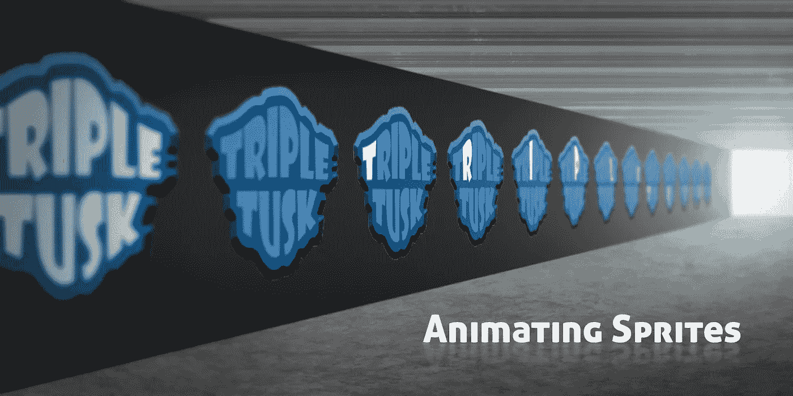

# 在 Unity 中制作一个简单的精灵动画

> 原文：<https://medium.com/nerd-for-tech/making-a-simple-sprite-animation-in-unity-38386413c753?source=collection_archive---------4----------------------->

在我的上一篇文章中，我在 CorelDraw 中创建了一个快速启动资产，使用了**文本**和**轮廓**，并应用了一些**效果**。我想让我的开机画面上的**字体**为**制作动画**，所以我用**精灵表**样式制作了我的开机画面的**副本**用于制作动画，并更改了字体上的**颜色**。我首先将所有的字体设置为浅色，然后关闭它。正如你在下面看到的，字母将一次循环一个，打开的**并…**