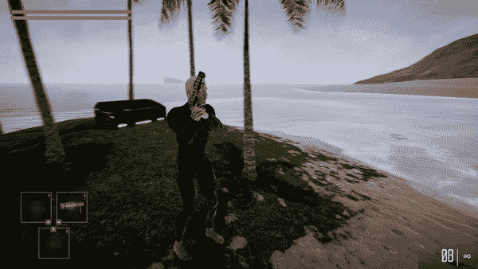

# 用时间轴制作一个宝箱系统

> 原文：<https://medium.com/nerd-for-tech/making-a-treasure-chest-system-using-timeline-7e6240271c57?source=collection_archive---------8----------------------->

打开宝箱的过场动画是目前游戏开发中的常见做法。现在我们已经牢牢掌握了 *Cinemachine* 摄像机和 *Unity* 中的*时间线*，让我们开始战利品吧！

这是我在这个例子中使用的所有东西，除了玩家对象。我的过场动画有一个空的父对象，名为*战利品盒导演*。在那里面是*战利品箱对象*，一个…