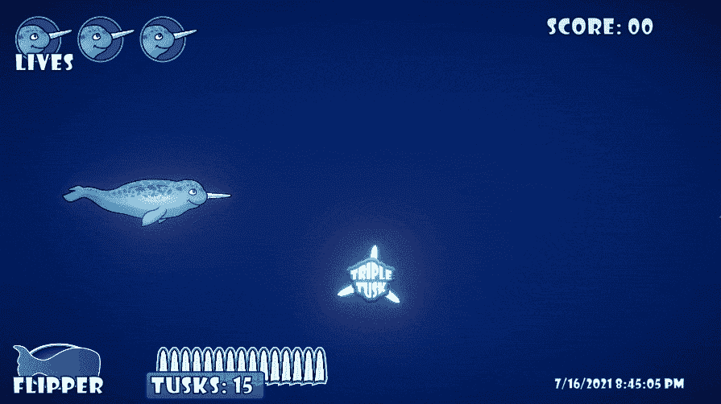

# 制作弹药装填电源第 2 部分:Unity 和 C#

> 原文：<https://medium.com/nerd-for-tech/making-an-ammo-reload-powerup-part-2-unity-and-c-54636c36bcd3?source=collection_archive---------19----------------------->

在我的上一篇文章中，我为我的 Unity 游戏中的玩家制作了一个弹药装填的道具，同时也制作了一些动画来增加趣味。我今天的**目标**是将艺术资产引入 Unity，为它们制作动画并实现功能。

在我打开 Unity 之前，我在我的资产文件夹，我的 Unity 项目文件夹中为我的**加电 PNG 文件**创建了一个**新文件夹**。