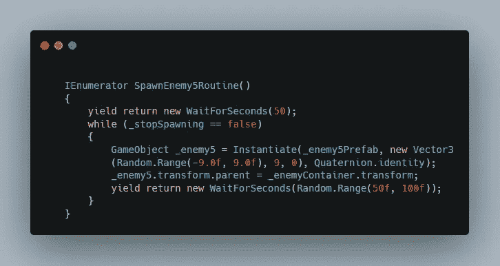
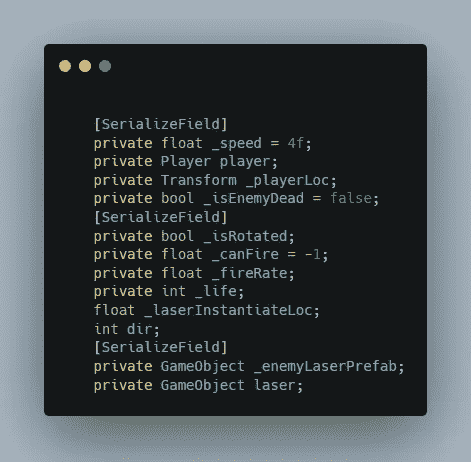
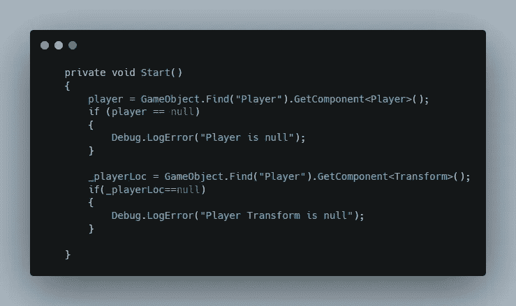
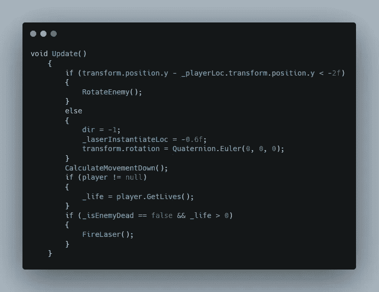
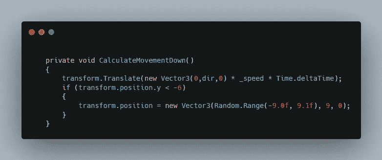
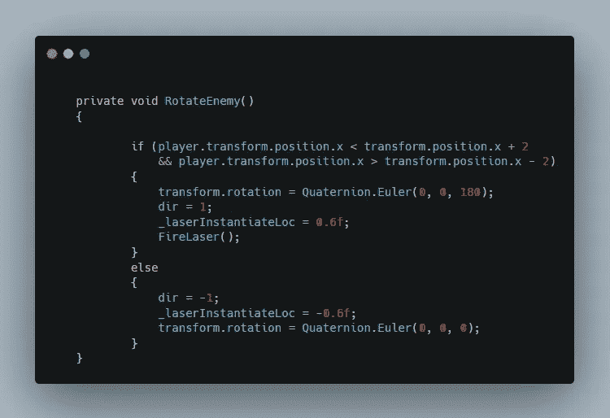
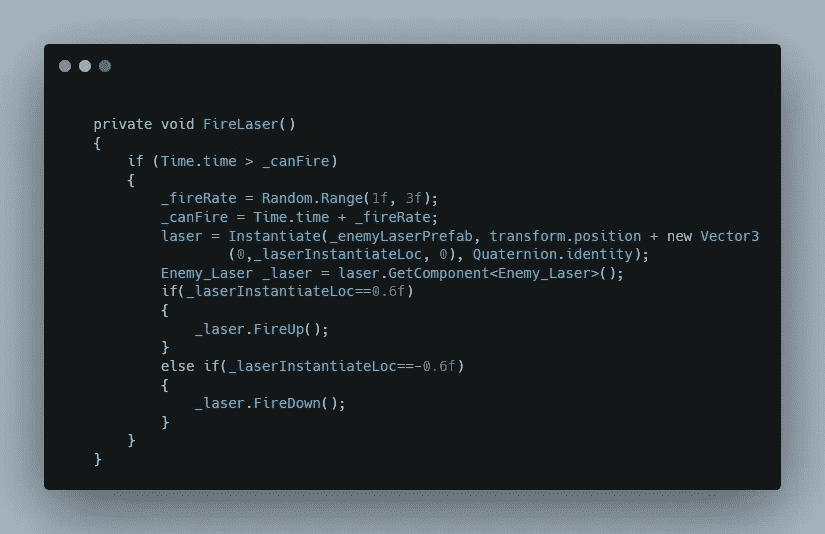
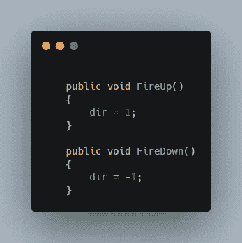
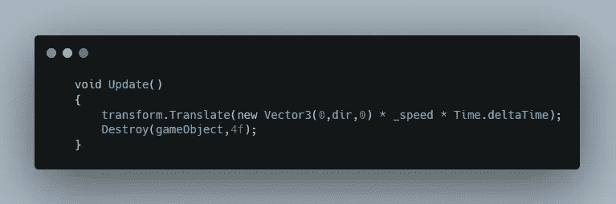
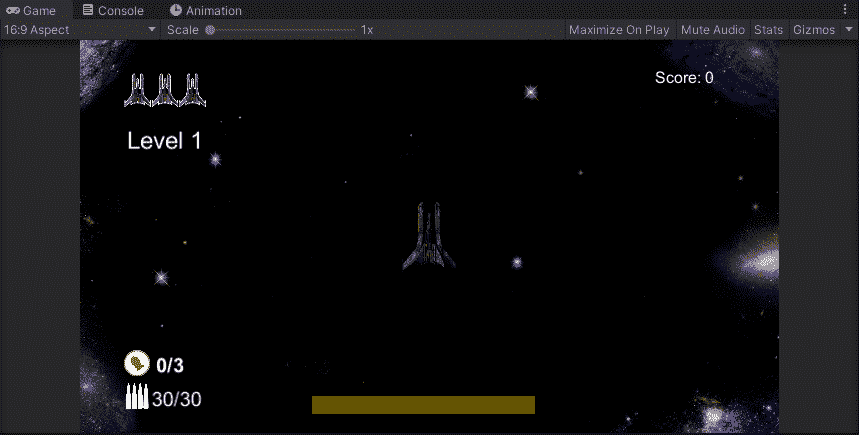

# 让敌人在玩家身后射击

> 原文：<https://medium.com/nerd-for-tech/making-enemy-shoot-when-behind-player-3981fe204f2d?source=collection_archive---------15----------------------->

第 48 天-制作 2D 太空射击游戏

**目标:**让敌人察觉到它在玩家身后，然后转身射击

让我们从产生一种新的敌人开始，这种敌人会表现出这些行为。

现在创建一个新的脚本，为你的新敌人创造一种行为。

在脚本中，声明在这个过程中需要的所有必要变量。当您根据需要添加功能时添加它们。

现在参考播放器脚本和播放器的位置转换。

现在在你的更新函数中，当敌人在玩家下方时，将你的敌人条件设置为旋转，否则将旋转设置为默认。

调用你的移动函数每一帧向下移动敌人，最后添加一个条件，只有当敌人和玩家都活着的时候才开火。

当玩家被调用时向下移动，当它超出 y 轴的边界后，它重置顶部的位置，以在 x 轴-9 和 9 之间的随机位置再次向下移动。

现在，当敌人的位置低于玩家的位置时，检查玩家是否在 x 轴上敌人的半径 2 以内。如果返回 true，那么旋转敌人看向相反的方向，否则将旋转设置为默认。

这里，当敌人发射激光时实例化激光，然后检查激光在哪里被实例化。如果它是敌人当前位置的正 0.6，那么这意味着敌人已经旋转并抬头朝向玩家，所以通过调用激光脚本中的 FireUp 函数将激光运动设置为 up，反之亦然。

在激光脚本中，创建一个 dir 变量，并将其默认值设置为-1，使其默认向下移动，当调用该函数时，激光运动的方向相应改变。

最后，根据 dir 变量的值上下移动激光。默认情况下，它将向下移动，当调用公共函数 FireUp 时，dir 值变为正值并开始向上移动，反之亦然。

这是最终的结果。