# 在 Swift 5 中不哭不闹地发出 http 请求😎—第一部分

> 原文：<https://medium.com/nerd-for-tech/making-http-request-without-crying-in-swift-5-part-1-8a99bc1460ce?source=collection_archive---------0----------------------->

嗯，在这里写斯威夫特似乎是一个梦想..让我告诉你原因。我在 swift 的旅程很差，也不是很长，但几个月前，我得到了一个像移动团队教师一样工作的机会，这份更好的工作改变了我的计划。这份工作带来了很好的想法和要执行的项目，所以我的第一个决定是使用本地开发应用程序。保持本土反应很难，但这个项目的正确选择(因为许多朋友知道我的背景和几乎所有的经验是 JS 栈)。这个挑战是展示我能力的绝佳机会..然而，项目开始了，我用来导入、安装等的许多东西在 Swift 中都不可用😪。让我饱受搜索和阅读之苦的最大任务之一是向 rest 服务发出 http 请求。我收到了很多错误，不知道为什么，也不知道如何发送参数和查询。在所有的努力和痛苦之后，我发现了一个很棒的库调用 [alamofire](https://github.com/Alamofire/Alamofire) 来做得更好，所以我将向你展示如何使用它，✌.

## 设置项目

让我们打开 Xcode 并点击新项目…首先要做的是创建 App 项目。

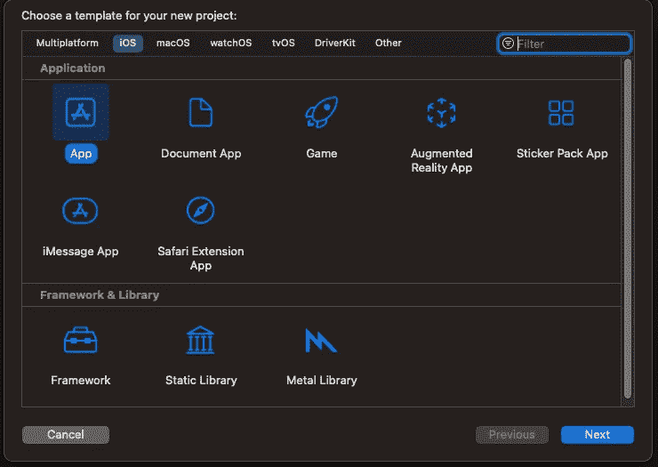

之后，我们可以为项目选择一个名称(无论你怎么想)，我将使用 MakingRequest，最重要的是选择“故事板”作为界面，它比这个项目的 SwiftUI 更好更容易。

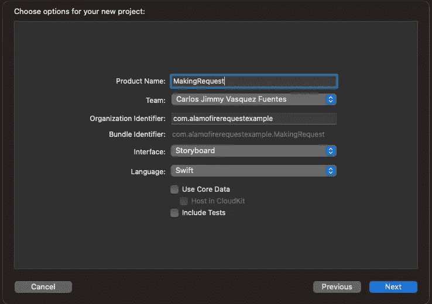

当我们的项目准备好了。我们应该看到类似这样的东西，我们只使用一个视图控制器来完成这个库的工作。

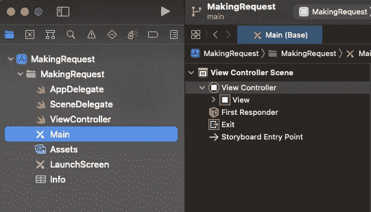

所以，在那之后..。我们只是在我们的视图中放了一个小的堆栈视图，在堆栈中我们将添加一个标签、文本视图和一个按钮。在这个例子中，我们不会使用样式，只是将资源添加到视图中，然后我们开始处理它。您会看到类似这样的内容:

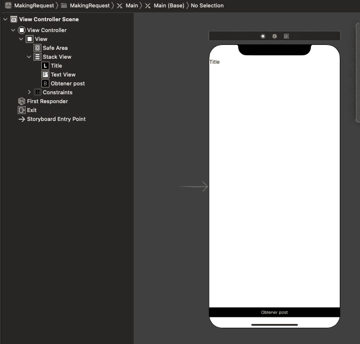

最后，要完成 UI，只需将每个资源的出口链接到视图，按钮的动作，并根据需要调用它们。

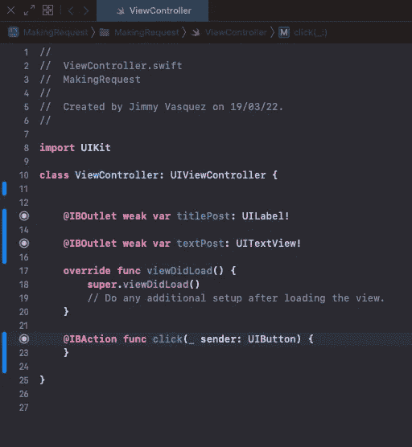

## 安装 Alamofire

从这篇文章好的和漂亮的部分开始，我们需要安装 alamofire。因此，让我们创建一个 pod 文件，以便能够添加库。只需转到控制台，移动到根项目目录并执行:

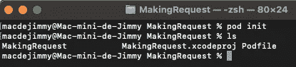

在我们创建“Podfile”文件后，您可以用您喜欢的编辑器打开它，并像这样添加库:

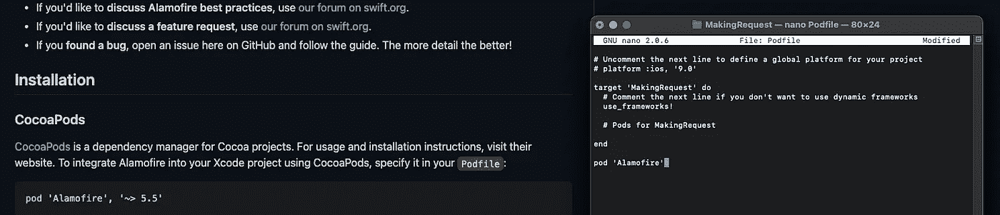

如果图像渲染质量不好，在文件末尾添加:
pod‘Alamofire’
你可以放你喜欢的版本，但如果我们只放 alamo fire，默认情况下我们会收到最新的版本。保存并关闭文件，然后执行:“pod 安装”

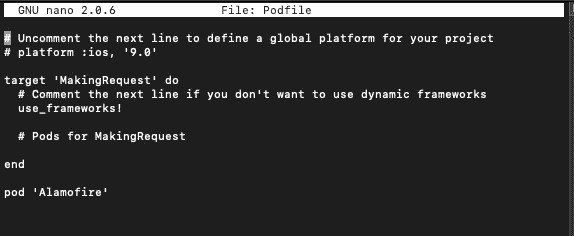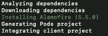

所以，最后我们有了一个新的文件调用。workspace。从现在开始，我们将打开工作空间而不是 xcodeproject。

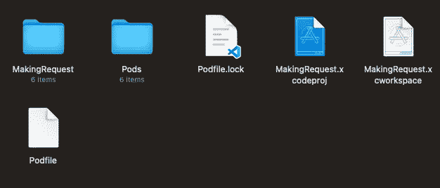

## 发出 GET 请求

正如您将在 Alamofire 文档中看到的，发出 HTTP 请求的最简单方法是导入库，获得 AF 实例和返回响应的方法请求。检查当用户单击按钮时执行的示例:

我们使用这个免费的 API 来举例。

所以，在短短几行中，我们做了一个请求…🤓
当您在调试控制台中看到响应时，问题就来了:

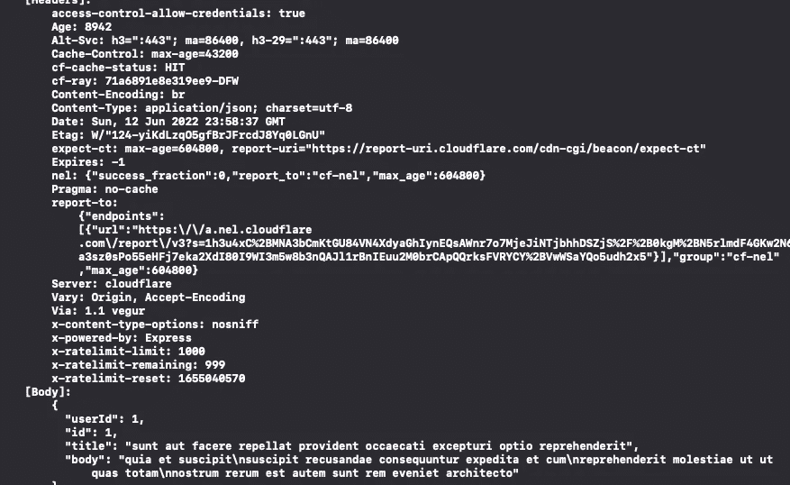

WTF？一大堆数据，等等…最后一部分有个东西叫身体！
是的！主体是我们从 API 中需要的真实数据。在这种情况下，我们可以发出请求，获取数据并查看它。但这不是访问数据的正确方式，例如，如果我们想设置一系列电影、链接或其他东西，我们目前还不能做到。
我们正在调试模式下打印，这就是我们看到大量数据的原因，所以下一步是处理和定制响应(是的，我们还没有完成😭)

## 定制和处理响应

就像我说的，我们有回应，但不是以我们需要的方式…

***有什么好办法？***
首先，在 Swift 中几乎一切都与结构有关，所以我们将创建两个结构来管理响应。如果我们复制用于请求数据的 URL，并将其放在浏览器的新选项卡中，然后转到。我们将看到来自 API 的响应:

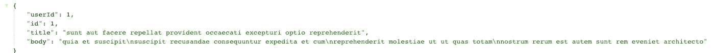

浏览器向我们显示来自 API 的响应，我们可以看到四个属性:userId、Id、title 和 body。这就是为什么我们需要用这些数据创建一个“模型”，在你的文件的最后部分创建一个新的结构(在你的视图控制器之外)。此外，我们现在有了成功数据的模型，但缺少错误的模型，让我们创建一个通用的错误模型(在一个真实的示例中，后端团队为您提供了 API 中的正确错误模型)。注意，两个结构都实现了 Decodable，第二个使用了 Error，因为我们需要它们从 API 中解码相同类型的数据。你应该有两个模型:

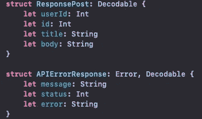

提示:如果您在浏览器中看到的数据与我的例子不一样，您可以使用这个 chrome 扩展来格式化您的 json:

链接:[https://chrome . Google . com/web store/detail/JSON-formatter/bcjindcccaagfpapjjmafapmmgkkhgoa？hl=es](https://chrome.google.com/webstore/detail/json-formatter/bcjindcccaagfpapjjmafapmmgkkhgoa?hl=es)

最后，也是最重要的一步。根据 Alamofire 文件:

> 阿拉莫菲尔的`DataRequest`和`DownloadRequest`都有对应的响应类型:`DataResponse<Success, Failure: Error>`和`DownloadResponse<Success, Failure: Error>`。这两者都由两个泛型组成:序列化类型和错误类型。默认情况下，所有响应值都会产生`AFError`错误类型(即`DataResponse<Success, AFError>`)。Alamofire 在其公共 API 中使用更简单的`AFDataResponse<Success>`和`AFDownloadResponse<Success>`，它们总是有`AFError`错误类型。`DataRequest`的子类`UploadRequest`使用相同的`DataResponse`类型。

因此，我们可以创建或覆盖自己的处理程序，实现 Alamofire 的 ResponseSerializer 类，而不是默认使用响应处理程序。为此，我们将使用我们创建的第二个模型，如果处理程序获得成功响应，我们应该返回从调用我们的方法传递的自定义模型。但是，我们返回一个 APIErrorResponse 实例，这部分是导入的，因为您可以根据后端的响应来更改或创建您的自定义处理程序。当我在 Alamofire 文档中阅读这一部分时，很难管理许多关于捕捉错误和返回数据的概念，这就是为什么我写了一个通用版本，并让您在下面的项目中实现它。只需创建一个新的 swift 文件，并将其命名为“APIResponseSerializer”。这是代码。

要了解更多关于创建或覆盖序列化程序的信息，您可以点击这里[查看](https://github.com/Alamofire/Alamofire/blob/master/Documentation/Usage.md#response-handling)。

现在，通过我们新的自定义序列化程序，我们在代码中更改了这一部分，而不是使用我们调用的默认响应。responseAPI 并向其传递您需要的成功数据的模型，在本例中我们创建 ResponsePost 模型来获取数据并添加 switch 语句来评估响应。我们可以获得成功数据模型或失败数据模型(APIErrorResponse)，打印数据并查看结果:

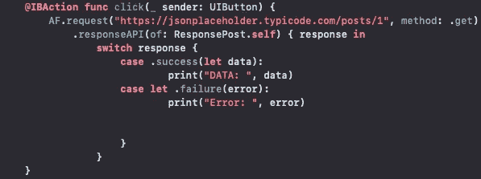

我们启动应用程序，点击按钮，然后…魔法🤩🤩🤩！
这是一个很好的回应，我们可以更好地处理它。新的响应序列化程序为我们提供了 ResponsePost 模型的一个实例，因此我们可以获得我们想要的参数:

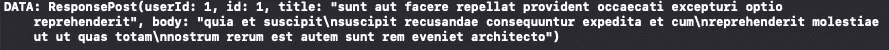

最后，为了完成这一部分，我们将使用 API 响应中的 body 参数来更改 TextView 中的默认数据。只需在 print witch 将文本值设置到响应正文之后添加这一行。

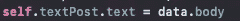

我们重新加载应用程序，点击按钮，耶！就是这样！👏👏👏我们可以从 API 请求数据，解码响应并使用数据来更改应用程序中的数据。

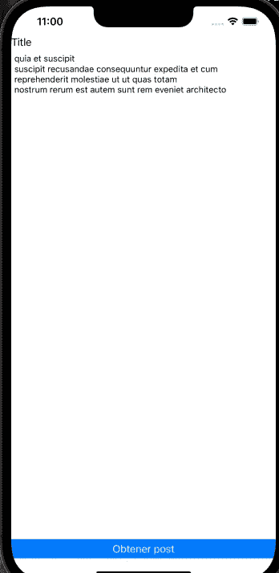

祝贺👀！您已经学会使用 Alamofire 以最简单的方式发出 http 请求，现在您可以使用它来改进您的 swift 应用程序，或者将具有大量网络功能的旧应用程序改为这种方式。

## 后续步骤

1.  在下一篇文章中，我们将发布、上传和删除请求
2.  发送数据的方式
3.  API 中的标题和授权

✍和波斯特与❤由[吉米瓦兹](https://jimmyvazz-me.netlify.app/)