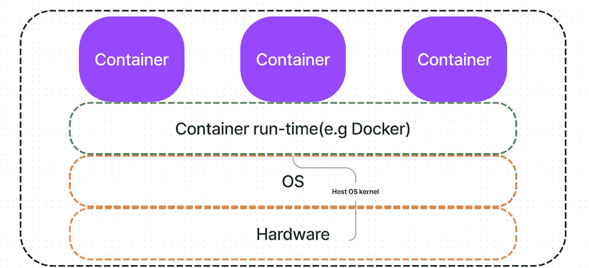
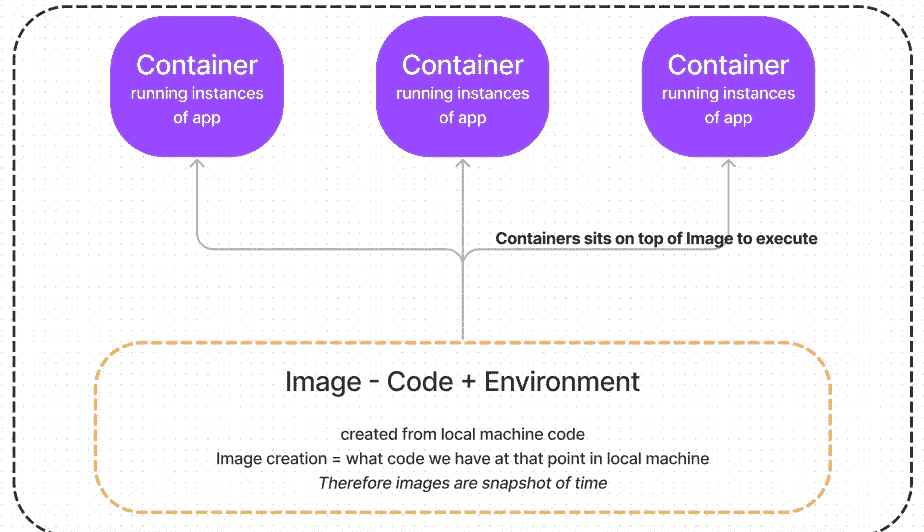

# 理解容器

> 原文：<https://medium.com/nerd-for-tech/making-sense-of-containers-d69d81bdc8e9?source=collection_archive---------4----------------------->

请在此阅读 Docker 先决条件

# 为什么是集装箱？

我们在开发一个 app 的时候，选择 JS、Python、Java 等语言。这些语言需要被执行，因此我们需要一个像 node JS 这样的运行时环境。这个节点 JS 有不同的版本。当我们在开发时，我们可能会使用较新的版本，但是当我们进入生产时(即在服务器中)，我们可能会得到较旧的版本。

这就是生产和开发环境不匹配的情况。为了解决这个问题，我们可以将系统(服务器)分成许多机器。这不能像硬盘和 CPU 分割那样通过物理方式实现，但可以通过软件实现。这个概念叫做**虚拟化**，相应的拆分资源的软件叫做**虚拟机监控程序**。这种创建新机器的想法被称为**虚拟机**。

我们创建的每个虚拟机都是相互独立的，我们构建的每个应用程序都必须有单独的操作系统、依赖关系等。对于每个虚拟机。这导致了另一个问题，假设我们有 app1，app2 和 app3 有相同的操作系统(Linux)；如果我们将它们放入虚拟机，我们需要在三个不同的虚拟机中安装三次相同的 Linux 操作系统。

因此，除了主机操作系统之外，每个虚拟机都有单独的操作系统。这个操作系统被称为'**客户操作系统**'。*这实质上意味着操作系统不会在虚拟机之间共享*。

请记住，操作系统消耗了大部分存储空间，因为即使你的应用程序只有 10MB，它也至少需要 400 MB。

从商业角度来看，如果有任何方法可以跨应用程序共享操作系统，那么它可以节省数十亿美元的成本。这种跨应用程序共享操作系统的技术被称为“**容器**”。当然，除了操作系统共享，容器还有很多优点。

容器化利用了主机操作系统中的内核，而内核是分割 CPU、内存等硬件的内核。为了一个特殊的任务。

# 什么是容器？

> ***容器=独立运行的软件。***

**自足的**——所有的东西本身都是可用的

**软件**——软件是我们创建的一个应用程序，基本上是一大块*代码*

**运行**——软件需要运行的基本上是*依赖*和*环境*

这一点的实现基本上与*面向对象编程概念*(即**类**和**对象**)相同——将有**一个类**，我们可以像**一样创建许多我们想要的** **实例**(**对象**)。模板是类，执行是由对象完成的。

该技术中的类等价物是'**图像**，对象等价物是'**容器**。这些图像是容器技术的可共享部分。

如前所述，图像是创建容器的模板。因此我们可以得到*标准图像*(从 *Docker hub* )或*定制图像*(我们自己)。标准图像可在 docker hub 网站上获得；它们包含应用程序的基本设置。

我们在 ***docker 文件*** 里面创建一个图像。由此，我们将创建许多容器(即*实例*)。

代码和环境会在映像中，容器在运行一个 app — ***存储、内存等的时候会用到代码和环境。，将由容器*** *决定。*容器中运行的东西与本地机器隔离。

我们总是可以从零开始建立一个图像，但这很麻烦。因此，我们将始终建立一个现有的图像像官方图像像一个节点从 docker 枢纽的图像。*该基本映像将包含所需的操作系统和设置。*

我们在本地机器上有源代码和依赖/环境。然后，我们将源代码依赖环境复制到该时间点的映像中。然后，我们将基于图像运行容器。

但是这里要注意的一点是，当我们在图像创建后更改源时，它不会自动反映在**图像**以及相应的**容器**中。

> **这向我们证明了图像是时间的快照。**

*容器在图片上添加另一层*。容器执行在创建的映像上运行代码所需的命令。这证明了我们的容器分配资源、内存等等。它不会从映像中再次复制代码，因此 Docker 是高效的。

**重述**:

**图片:创建容器的蓝图**

**容器:我们使用蓝图(图像)创建的实例**

**所以一个图像却有许多容器**

*原载于 2022 年 4 月 29 日*[*【https://www.pansofarjun.com】*](https://www.pansofarjun.com/post/containers)*。*