# 理解 Git 和 GitHub—I[集中式与分布式 VCS，Git-GitHub，工作-暂存-回购]

> 原文：<https://medium.com/nerd-for-tech/making-sense-of-git-and-github-i-central-vs-distributed-vcs-git-github-working-staging-repo-ae78c83fce3e?source=collection_archive---------1----------------------->

# 我们为什么需要 Git？

没有 Git，现代软件开发是不可能的。相信这不是轻描淡写。今天，软件开发有许多合作者和团队，他们致力于单个源代码，因为软件应该有单个源代码来运行，而不能有多个源代码。但是没有一个开发者我们是无法构建海量软件的，我们需要更多的开发者来支持我们。

问题是如果我们有多个合作者，我们如何维持一个单一的来源。

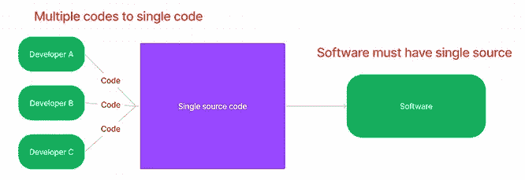

我们需要在中心的东西来转换多个到单一的来源。这叫做**中央集权制**。

*   所有开发人员必须访问这个集中。
*   所有开发人员都可以对系统中的代码进行更改。
*   在任何一点上，它应该给软件一个真实的单一来源。

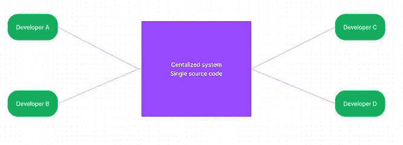

**我们来创造场景:**

假设开发人员 A 是团队领导，他首先将代码放在一个集中的系统中。剩下的开发人员从这个集中的系统中获取代码，该系统的第一个代码由团队领导更新。

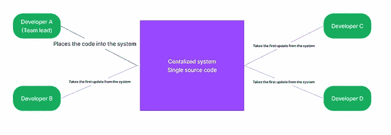

在 git 竞技场中，

这个集中的系统= **储存库**。

从库中取出代码并应用到你的代码= **更新**。

您正在应用您在代码中所做的更改，并将您的代码发送到 repository = **提交**。

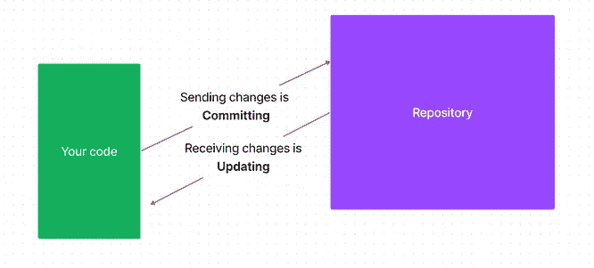

回到场景，假设*开发人员 C* 对代码做了一些更改，而 ***将这些更改提交给*** 存储库。

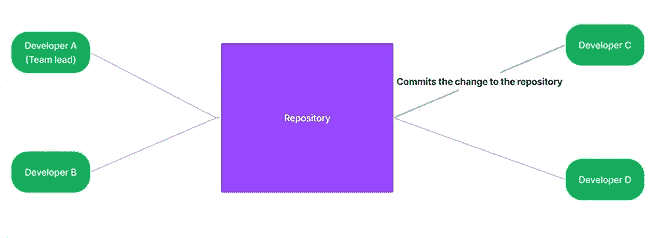

现在，存储库包含了与开发人员 A(团队领导)的第一次提交不同的代码。第一次提交之外的附加代码

此外，请注意，其余的开发人员仍然在旧代码上工作，因为他们没有从存储库中更新变更。

如果开发人员 B 想要提交他对存储库所做的更改，会发生什么呢？

开发人员 B 的本地代码进行了更改，而由开发人员 C 更新的存储库的新代码是不同的。

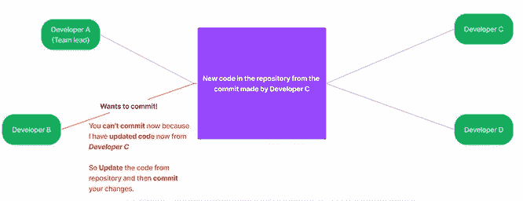

更新必须先于任何提交**。**

所有提交都存储在中央存储库中，并且总是指向最新的提交。每次提交(对代码的更改)都会创建代码的一个新的**版本**。这被称为**版本控制系统。**

当您在存储库中遵循上述类型的版本控制时，它被称为**集中式版本控制系统(CVCS)** 。

## Git 不是**集中式版本控制系统(CVCS)！**

我们创建一个单一的中央存储库，为最终软件创建一个单一的源。

因此，谁来控制这里的版本？它是**中央储存库**。如果一个*新手，*，比如说，*开发人员 D，*更改了代码，并将更改提交给中央存储库，那该怎么办？？任何高级开发人员都喜欢并且需要在将他们的变更提交到存储库之前更新来自开发人员的代码。

开发者 D 代码有一些 bug 怎么办？

如果开发人员 D 不小心删除了代码中的关键变量怎么办？

我们可能会问很多这样的问题，因为在将代码提交到中央存储库之前，我们缺少一个审查过程。

我们需要一个版本控制系统，我们还需要确保只有高质量的代码才能到达仓库。我们需要确保所有开发人员都可以更改代码。

> *Git 是一个* ***分布式版本控制系统(DVCS)。***

让我们把 CVCS 改成 DVCS。

观察**版本控制**正从**中央**变为**分布式**。

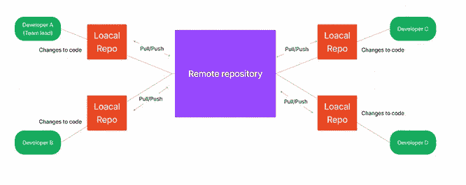

在这里，代码的版本控制首先被分发到本地存储库，最终版本在远程存储库(中央)。本地回购在开发者的本地机器里。

现在是时候公布 **Git** 和 **GitHub** 了。

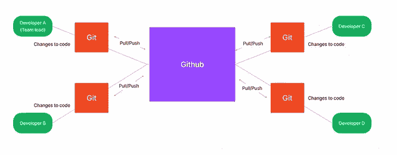

> ***Git*** *=本机回购。*
> 
> ***GitHub****=云上回购托管服务。*

## 放大到本地回购部分(Git)！

记住新手(开发人员 D ),在提交到中央回购之前，任何高级开发人员都不会审查对代码的更改。Git 是如何解决问题的？

Git 在您的文件夹和本地 repo 之间创建了一个层。

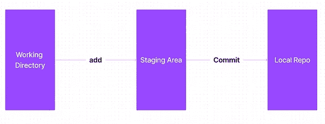

无论 git 初始化哪个文件夹，这个文件夹都被称为工作目录 **(Directory = Folder)。**

**如何初始化你文件夹里的 git？**

从你的终端键入***‘git init’***，其中目录指向目标文件夹。*(假设你有一些使用终端的基础知识)*

当你从任何目录初始化 git 时，你会得到一个**。git** 文件夹在同一个目录下。

在提交对本地机器上的 git repo 的任何更改之前，您有机会在 **staging area** 中查看它。

我们将进一步说明，

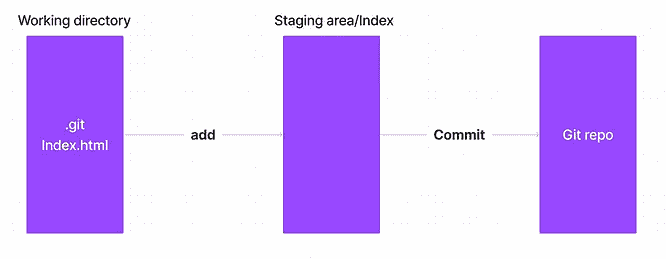

当你首先给 *git 状态*，即没有*时，添加*和*提交之前完成的*。

你得到了，

```
on branch master  --> Main branch is master No commits yet --> We don't do any commits yet **Untracked files:** (use "git add <file>..." to include what will be committed) *Index.html* Nothing was added to the commit, but untracked files are present (use "git add" to track)
```

由于*Index.html*没有被版本控制系统 **Git** 跟踪，所以会在**未跟踪文件下。**

让我们将*添加到*文件中，

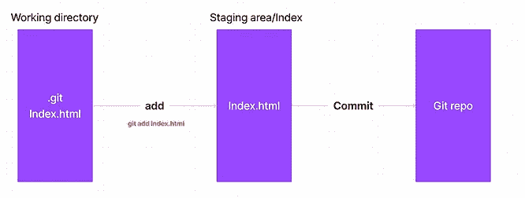

现在让我们给 *git 状态*，

```
on branch master  --> Main branch is master No commits yet --> We don't do any commits yet. **Changes to be committed:  (use "git rm --cached <file>..." to unstage)** *Index.html*
```

现在，Index.html 面临着即将到来的变革。

我们现在将提交文件，

> 当我们提交时，我们应该**总是**包含一个**消息**。

命令和标志是 ***git commit -m "Index.html 已提交"*** *，其中-m 是标志，后跟双引号中的提交消息。*

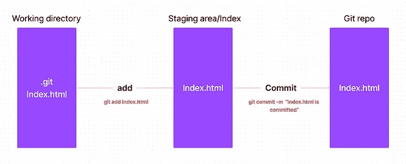

*注意:这个帖子不是关于* ***如何的。git'*** *文件夹(本地回购)内部保存文件，因为那是另一个话题。*

```
[master (root-commit) 069667a] Index.html is committed --> **Ensures file is committed to a local repo** 1 file changed, 5 insertions(+) **--> 1 file changed(Index.html), and I've added 5 lines there and hence 5 insertions** create mode 100644 Index.html
```

让我们修改一下**Index.html、**

***记住了！***

***Index.html 已经被提交(即，它在本地回购中，因此它被本地回购跟踪)。***

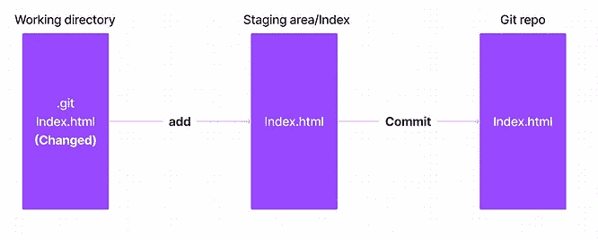

我们现在给 ***git 状态*** 。

```
On branch master **Changes** not staged for commit:   
(use "git add <file>..." to update what will be committed)   
(use "git restore <file>..." to discard changes in working directory) **modified:   Index.html** no changes added to commit (use "git add" and/or "git commit -a")
```

观察这里，

**“未准备提交的更改”**显示，因为 git 已经跟踪了 Index.html。现在，您更改了工作目录中文件的一些内容，但没有移动到索引/暂存区域；因此，它显示*变化未标记*。

我们现在将*添加*这些变化。

*git 添加 Index.html*

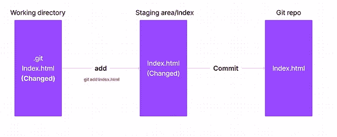

给予 *git 状态，*

```
On branch master **Changes to be committed:**   (use "git restore --staged <file>..." to unstage) modified:   Index.html
```

观察，

> ***"未准备*提交的*更改。"***

**转换成**

> ***“待提交的变更”***

让我们现在发出一个信息

*git commit -m "Index.html 被更改，我想在本地 repo(git)中提交它。”*

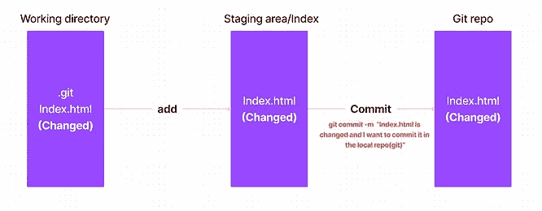

现在给 *git 状态*，

```
[master e3935b4] Index.html is changed, and I want to commit it in the local repo(git) 1 file changed, 3 insertions(+)
```

## 整体概述:

*git 初始化* →初始化 git 储存库

三个阶段，

> 工作目录— ->暂存区→本地 Repo(git)

当*中没有放置暂存的*和*本地*回购时，**号**文件被 ***跟踪*** 被 git。因此我们得到，

**【未跟踪文件】**在 git 状态下，

> **"未跟踪的文件** " =相应的文件没有被 git 跟踪。

当你在暂存区/索引区添加一个特定的文件时，我们得到，

git 状态下的**【待提交变更】**。

> **“要提交的更改”** =相应的文件在暂存区/索引中，但不在本地 repo 中。

当您*在本地回购中更改已经*提交*的文件*时，我们得到，

**git 状态中的“未准备提交的更改**”。

> **“提交未暂存的变更**”**=**对应的文件已经在 git repo 中，但是现在在工作目录中有一些变更，相关的变更没有添加到暂存区。

当您将更改的文件添加到临时区域/索引时，我们会得到，

git 状态中的**【待提交变更】**。

> 因此，**“要提交的更改”=** 已更改的文件在暂存区中，但没有提交到本地回购。

*原载于 2022 年 10 月 30 日*[*https://www.pansofarjun.com*](https://www.pansofarjun.com/post/making-sense-of-git-and-github-i)*。*