# 理解 Git 和 GitHub-II[暂存和提交、提交历史、差异]

> 原文：<https://medium.com/nerd-for-tech/making-sense-of-git-and-github-ii-staging-and-committing-commit-history-difference-f411265e48dc?source=collection_archive---------5----------------------->

这是这篇文章[(理解 Git 和 GitHub — I)](https://www.pansofarjun.com/post/making-sense-of-git-and-github-i) 的延续。请在继续之前阅读。

我们将在工作目录中创建一个新文件 *Index.css* 。

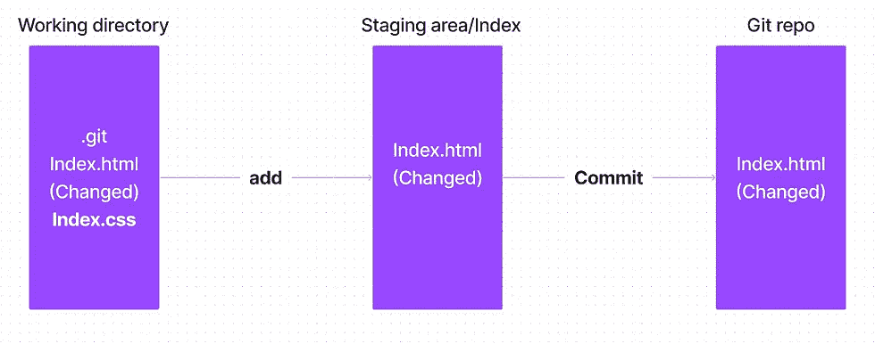

如果我们现在给 ***git 状态*** 会是什么输出？

本地 repo(git)是否跟踪新添加的文件？不要！。因此它是一个**未跟踪文件**。

```
On branch master
Untracked files:
  (use "git add <file>..." to include in what will be committed)
        Index.css

nothing added to commit but untracked files present (use "git add" to track)
```

我们将向临时区域/索引添加一个 Index.css。

给 *git 添加 Index.css，*


**该文件是否提交给本地回购？**没有！。因此，在*下将提交变更。*

该文件是否已经存在？不要！。因此它是新文件。

```
On branch master
Changes to be committed:
  (use "git restore --staged <file>..." to unstage)
        new file:   Index.css
```

我们将致力于本地回购。

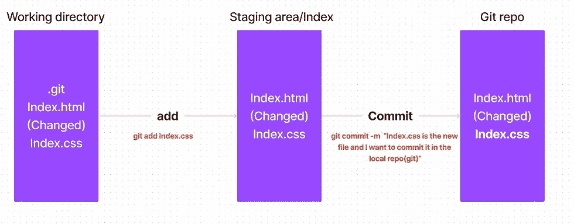

相应的 git 状态将是，

```
[master 6b558f4] Index.css is the new file, and I want to commit it in the local repo(git)
 1 file changed, 8 insertions(+)
 create mode 100644 Index.css
```

我们做了许多提交和添加，让我们看看我们的提交历史。

在终端输入 ***git log*** ，

结果会是，

```
commit 6b558f457206fceff293f29b141ab2a137a2e544 (HEAD -> master)
Author: <your git username>
Date:   <Time stamp>

    Index.css is the new fil,e and I want to commit it in the local repo(git)

commit e3935b49f94745a9944809a14da60217f403f912
Author: <your git username>
Date:   <Time stamp>

    Index.html is changed, and I want to commit it in the local repo(git)

commit 069667a685050a170b829964d0391eca08990283
Author: <your git username>
Date:   <Time stamp>

    Index.html is committed
```

如果我们需要知道每个提交中发生了什么，

键入 ***git log — stat，***

```
commit 6b558f457206fceff293f29b141ab2a137a2e544 (HEAD -> master)
Author: <your git username>
Date:   <Time stamp>

    Index.css is the new file and I want to commit it in the local repo(git)
 Index.css | 8 ++++++++
 1 file changed, 8 insertions(+)

commit e3935b49f94745a9944809a14da60217f403f912
Author: <your git username>
Date:   <Time stamp>

    Index.html is changed, and I want to commit it in the local repo(git)

 Index.html | 3 +++
 1 file changed, 3 insertions(+)

commit 069667a685050a170b829964d0391eca08990283
Author: <your git username>
Date:   <Time stamp>

    Index.html is committed

 Index.html | 5 +++++
 1 file changed, 5 insertions(+)
```

用一行程序输出，

键入 ***git 日志—单行，***

```
6b558f4 (HEAD -> master) Index.css is the new file, and I want to commit it in the local repo(git)

e3935b4 Index.html is changed, and I want to commit it in the local repo(git)

069667a Index.html is committed
```

# 列出文件:

为了简单起见，我们将创建一个新的存储库，并将两个文件添加到登台区。我希望这时候你能独立完成。确保您有 **git bash** (当您在机器上安装 git 时会自动安装)。 *Git bash 是一个命令行接口，基本上，我们可以在这里使用 Linux 命令。*

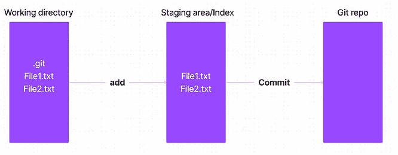

我们将在工作目录中创建一个新文件，

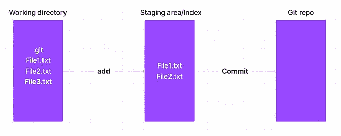

只需在 git bash 终端中键入 **ls** ，

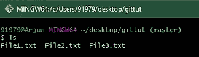

**‘ls’**命令会给你**工作目录**中的所有文件。

如果你想让所有文件都在**暂存区**中，你需要给**加上前缀 git** ，因为暂存区在 **git 中。**命令是 **git ls-files，**

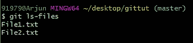

我们在暂存区中只有文件 1 和文件 2。

好了，让我们将 *File3.txt* 添加到暂存区，

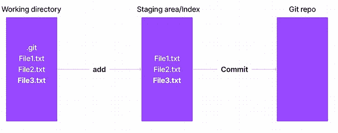

现在，

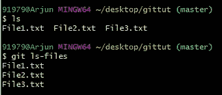

现在 **ls** 和 **git ls-files** 保持不变。

寻找差异:

我们知道三个层次，

> **工作目录** — → **暂存/索引/缓存**—>**本地回购**

一旦你执行了**第一次提交**，所有级别的文件都会存在。

然后**在**工作目录**中修改**并将**添加到**暂存区**中。**

然后**将修改后的**文件提交给**本地回购**。

现在你可能正在**工作目录**中**进行一些修改**。

当然，在不同的级别之间会有一些不同，无论是在文件内容、目录、添加的新文件等方面。

**如何发现各个层次的区别？**

为了说明，我们将只有一个文件 **File.txt.**

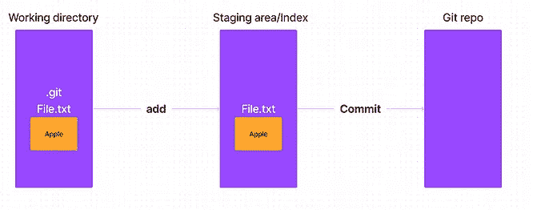

## 找出暂存目录和工作目录之间的差异:

记住命令 **git diff** ，这个命令是关键。

您发现暂存目录和工作目录中 File.txt 的内容有什么不同吗？**不**！。

*所以****git diff*******file . txt****不会给你任何东西*。*

*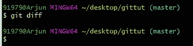*

*让我们更改工作目录中的内容，*

*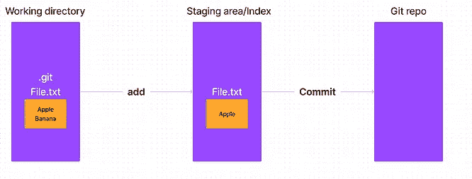*

*你发现区别了吗？是啊！第二行增加“**香蕉**”。*

*所以***git diff*******file . txt***会给你结果，**

**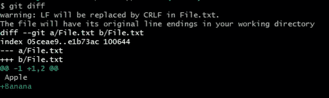**

**留下警告。**

```
**diff --git a/File.txt b/File.txt**
```

****diff — git** →这表示 git diff 是我们使用的命令。**

****a** /File.txt →源文件→旧版本文件→暂存区复制。**

****b** /File.txt →目的地→文件新版本→更改→工作目录复制。**

****索引 05ceae9..e1b73ac 100644** →元数据，是 git 内部存储数据的方式(哈希和模式)。我们暂时离开吧。**

****———a/file . txt**→源副本(Staging)中缺少**。****

******++ ++ b/file . txt**→有东西**加**到目的副本(工作目录)。****

****@@ -1 +1，2 @@ **这将包含关于源文件和目标文件中的更改的元数据。******

****然后，****

******苹果** →【空格】苹果→空格表示内容不变。****

******+Banana**→+Banana→[**+]**表示添加到目标副本(工作目录)中的内容。****

****因此[ **-minus]** 表示在目标副本中缺失。****

## ****在工作目录和最后一次提交之间:****

****本地回购由一系列提交组成，头**指向最近的提交。******

****但是等等，如果我们现在提交，那么**“Banana”**会在提交里面移动吗？不，因为提交发生在暂存区，而暂存区副本中不包含**【香蕉】**。****

****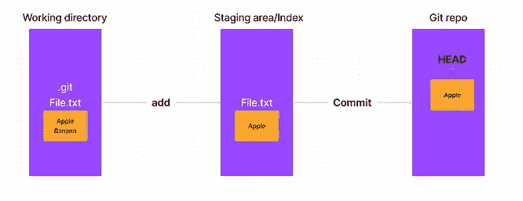****

****让我们将**猫**添加到工作目录下的 File.txt 中，****

****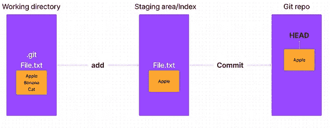****

****现在命令是什么？相同的 **git diff** 带有不同的选项。****

****所以 *git diff HEAD File.txt* 会给你，****

****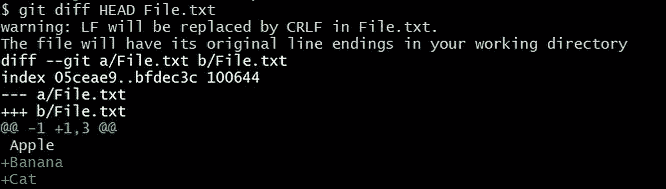****

****这里的源头是什么？旧版本=本地回购=上次提交=头。****

****这里的目的地是哪里？较新版本=工作目录。****

******因此，与旧版本相比，我们在新版本中添加了*香蕉*和*猫*。******

## ****在**暂存区**和**最后一次提交**之间:****

****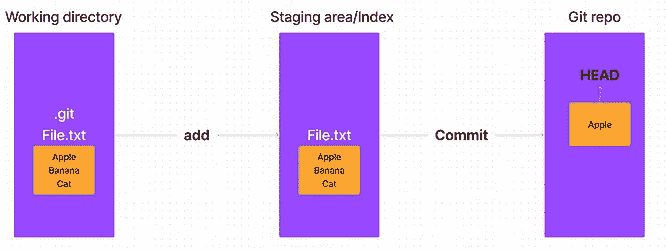****

****命令是什么？相同的 **git diff** ，带选装件**头**和**——分阶段。******

*******git diff—staged HEAD file . txt***的结果会是，****

****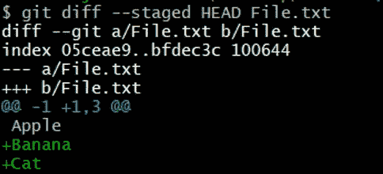****

## ****在工作目录和特定提交之间:****

****HEAD 总是指向最近提交的。那么，我们如何找到具体的提交？简单的通过"**提交 ID "。******

****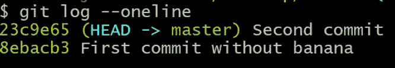****

****注意:HEAD 总是指向最后一次提交。****

****我们将工作目录与 id 为 **8ebacb3 的第一次提交进行比较。******

****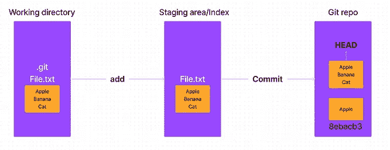****

****命令是***git diff 8 ebacb 3 file . txt***结果是，****

********

****类似地，对于**分阶段**和**特定提交**，****

****命令是***git diff—staged******8 ebacb 3 fiie . txt .*******

****在承诺之间，我们需要付出****

*******git diff<commit-id><commit-id>file . txt .*******

*****最初发表于 2022 年 10 月 31 日*[*https://www.pansofarjun.com*](https://www.pansofarjun.com/post/making-sense-of-git-and-github-ii)*。*****