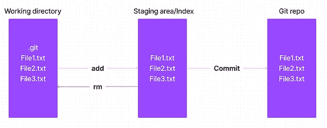
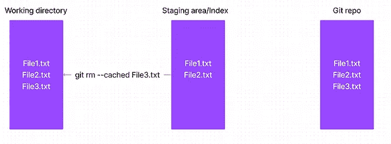
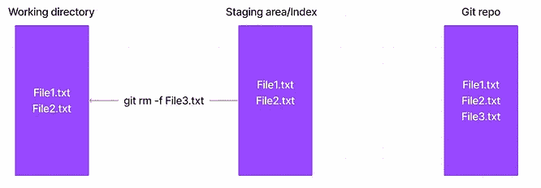
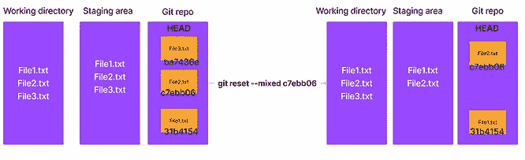
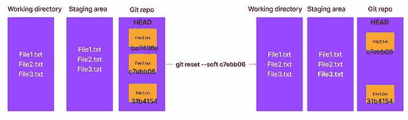
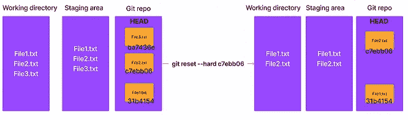
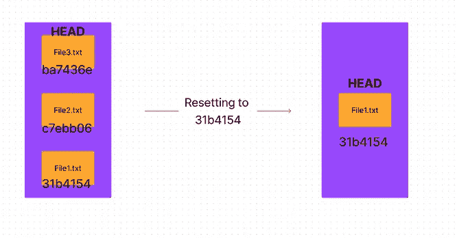
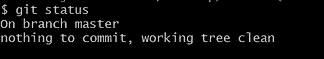
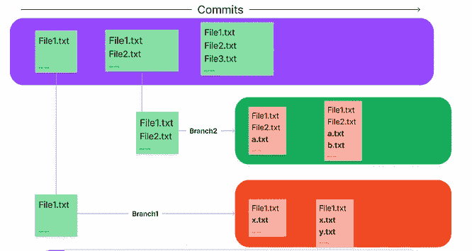

# 理解 Git 和 GitHub-III[重置、分支]

> 原文：<https://medium.com/nerd-for-tech/making-sense-of-git-and-github-iii-reset-branching-87f12127e66d?source=collection_archive---------3----------------------->

本帖是本 [**帖**](https://www.pansofarjun.com/post/making-sense-of-git-and-github-ii) 的延续。

> 暂存=缓存=索引。



我们使用什么命令？

如果只需要从暂存区删除，使用 **git rm *—缓存的* <文件名>** 。

如果您需要从临时区域和工作目录中删除，

使用 **git rm *-f* <文件名>。**



**注意:Git repo 没有任何影响，仍然包含 file 3 . txt。**

**在本地回购中移除:**

本地回购从中转区获得一份拷贝。因此，删除或重置特定的提交，我们需要考虑登台区副本。

命令是 ***git 复位<模式> < commit_id >。***

重要的模式是，

*   —混合(默认)
*   —柔软
*   —硬

**—混合(暂存和回购拷贝均已删除)。**



**—软(仅删除回购副本)**



**—硬拷贝(工作、暂存和回购拷贝已移除)**



重置提交时，此后提交的所有其他提交都将被删除。



**分工:**

如果你想在短时间内在你的应用上实现两个特性，你会怎么做？

**约束条件是，**

不管特性的代码是什么，现有的代码都不应该被改变或改进。

该功能的代码是对现有应用程序代码的附加。

该功能的代码必须在末尾与现有代码相结合。

**欢迎来到 git 分支！**

当没有创建分支时，git 会把你放在主分支中。它也被称为**主**分支。



注:**上支主。**


当你给' **git branch，'**你通过前缀 **'* . '得到你在哪个分支上**

如果 git 默认创建并把你放在一个分支上，你也可以创建并在分支之间切换，对吧！

您可以为 feature1 和 feature2 创建两个新分支，并且独立于彼此和主分支处理这些分支。嗯！那是从 git 的角度给你的分工！

## **创建 git 分支**

我们从另一个分支创建一个分支。因此，第一个分支由默认分支(**主**)构成。

创建分支后，它将继承父分支的所有内容。

您需要进行更改并分别提交它们。它们是相互独立的。

令人困惑，让我来举例说明，

**注意:分支是在 git 中创建的，并从 git 回购的角度进行处理。**



## 动手操作:

我们将在 git 中完成上面的演示。

初始化 *git init* 。

添加并提交 *File1.txt* 。

给 *git 分支*现在，

```
$ git branch 
* master
```

所以我们在**主**分支中(默认由 git 创建)。

但是我们需要从这个提交中创建第一个分支。

命令是什么？ **git 分支<分支名称>** → **git 分支*分支 1。***

这就创建了**分支 1。**

我们在哪个分支上？类型 *git 分支*。

```
$ git branch
  Branch1
* master
```

注意**分支 1** 被创建，但是**我们是在**上**主**分支 **(*)。**

我们将转移到分支 1。

命令是什么？**git check out<branch name>**→**git*check out branch 1***

```
$ git checkout Branch1
Switched to branch 'Branch1'
```

类型 *git 分支*，

```
* Branch1
  master
```

所以我们现在在 Branch1 上 **(*)** 。

我们将在这个分支中创建 **x.txt** 和 **y.txt** 。

键入 *git 状态*现在，

```
$ git status
On branch Branch1
Untracked files:
  (use "git add <file>..." to include in what will be committed)
        x.txt
        y.txt

nothing added to commit but untracked files present (use "git add" to track)
```

我们将在 Branch1 中添加并提交这两个文件。

好的， **file1.txt** 从主分支继承到哪里？

键入' **ls'** 来显示工作目录中的文件，

```
$ ls
File1.txt  x.txt  y.txt
```

是的，我们得到了 File1.txt 以及 x 和 y。

**集结地**呢？键入 *git ls-files。*

```
$ git ls-files 
File1.txt 
x.txt 
y.txt
```

我们将搬回总分行。

键入 ***git 结帐主。***

我们将创建 File2.txt 并提交它。

键入**‘ls’**和**‘git ls-files’。**

```
$ ls
File1.txt  File2.txt
```

```
$ git ls-files
File1.txt
File2.txt
```

您是否注意到工作目录和临时区域会随着分支的变化而变化？

> 因此**工作**和**暂存区**取决于分支。

我们将从这里创建**分支 2** 。

但是这一次，我们将使用一个命令来创建和切换。

命令是，

**git checkout -b Branch2**

```
$ git checkout -b Branch2
Switched to a new branch 'Branch2'
```

我们将创建 **a** 和 **b** 并在 **Branch2** 中提交。

现在给 **ls** 和 **git ls-files，**

```
$ ls
File1.txt  File2.txt  a.txt  b.txt
```

```
$ git ls-files
File1.txt
File2.txt
a.txt
b.txt
```

我们现在将签出主分支并创建 File3.txt。

因此，我们完成了上图的动手操作。

*原载于 2022 年 11 月 2 日 https://www.pansofarjun.com**的* [*。*](https://www.pansofarjun.com/post/making-sense-of-git-and-github-ii)