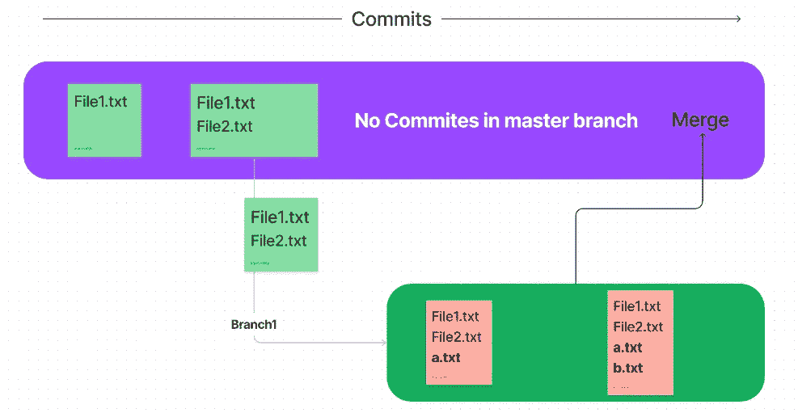
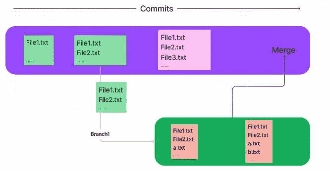
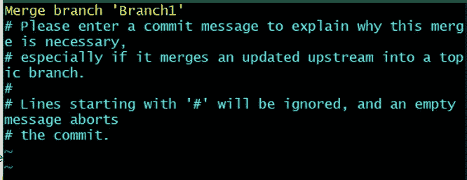
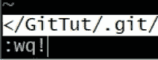
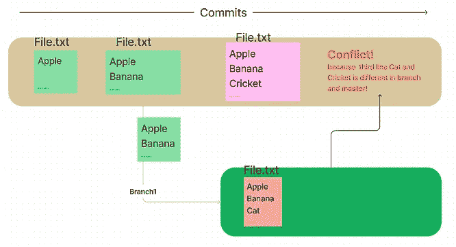
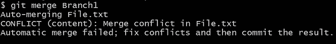
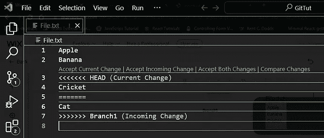
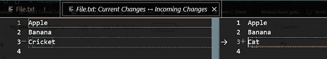
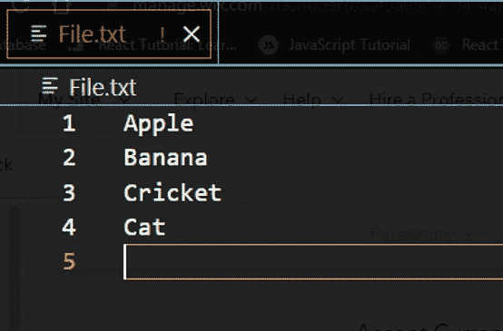

# 理解 Git 和 GitHub—IV[合并和冲突]

> 原文：<https://medium.com/nerd-for-tech/making-sense-of-git-and-github-iv-merging-and-conflict-ccdbe438f6f1?source=collection_archive---------3----------------------->

这部分是本帖的延续— [理解 Git 和 GitHub — III【重置，分支】](https://www.pansofarjun.com/post/making-sense-of-git-and-github-iii)

如果创建了分支，它需要与父分支(主分支)合并。它是最终部署的主分支。这叫做 **git 合并**。

我们将举例说明**合并**，



注意:

1)一旦**分支 1** 被创建，在**主**分支中没有进一步的提交。

2)这种类型的合并被称为**‘快进合并’**

## 动手操作:快速合并

我希望您现在可以自己创建分支和提交了。因此，我们将专注于合并。

*你需要将* ***切换*** *到* ***主*** *分支现在因为我们需要在父级合并。*

命令是**git merge<branch _ name>→git merge branch 1。**

```
$ git merge Branch1
Updating 46e757c..0992851
Fast-forward
 a.txt | 1 +
 b.txt | 1 +
 2 files changed, 2 insertions(+)
 create mode 100644 a.txt
 create mode 100644 b.txt
```

现在给出 git log——来自主分支的一行，

```
$ git log --oneline
0992851 (HEAD -> master, Branch1) Branch1 second commit
988b839 Branch1 first commit
46e757c master second commit
3f09835 Master first commit
```

这是一个简单的 **git 快速前进合并**，当主分支中没有提交时发生。

另一个场景，



当在创建 Branch1 之后在主分支中有提交时，它被称为**三向合并**。

## 动手:三向合并

相同的设置，但是这一次，在主分支中有一个额外的提交。

现在从*主*分支给 *git 合并分支 1* 。

它会打开一个这样的编辑器，



只需按下 escape 键并键入' **:wq！'**【保存并退出命令】



现在你会得到，

```
$ git merge Branch1
Merge made by the 'recursive' strategy.
 a.txt | 1 +
 b.txt | 1 +
 2 files changed, 2 insertions(+)
 create mode 100644 a.txt
 create mode 100644 b.txt
```

这种合并被称为“三向合并”这不同于‘快进合并’，因为‘三向合并’创建了一个新的提交，称为**合并提交**。

给***git log—one line***现在，

```
$ git log --oneline
bb817f9 (HEAD -> master) Merge branch 'Branch1' --> New commit is created by git itself.
910f028 master third commit
d56617b (Branch1) Branch1 second commit
5dc103d Branch1 first commit
e2b8c5b master second commit
7486cd4 Master first commit
```

## 解决合并中的冲突:

当**主**和**分支**在**同一**文件上工作时产生冲突。相应的文件将在主服务器和分支服务器中提交。因此，当你合并时，冲突就出现了。

要合并，我们需要手动解决冲突。

## 动手:合并冲突

为此，我将使用 **VS 编辑器**进行说明。为了更好地理解，我们将处理单个文件。



当你把上面的都设置好并试着合并，你会得到，



你将得到**冲突**消息。它会提示您修复冲突并提交结果。

在 VS 代码中，你得到



接受当前的变化。

接受传入的更改。

接受这两个更改。

比较变化。

如果你比较变化，你会得到，



我们将给 ***接受这两种变化。***



这就是我们如何手动解决冲突。

请记住，我们需要提交对回购的更改。

给 ***git log — oneline*** ，

```
$ git log --oneline
565d87c (HEAD -> master) Resolved to merge conflict
813d82d Third line from master1
621e707 (Branch1) Third line from Branch1
009477f Second line
ea358f0 First line
```

这次合并提交是由我们手动完成的。

自动合并和提交不会发生，因为会出现冲突。

记住，自动合并发生在一个没有冲突的'**三路合并'**。

我希望这篇文章能让你对融合和冲突有一个大致的了解。

*原载于 2022 年 11 月 3 日 https://www.pansofarjun.com*[](https://www.pansofarjun.com/post/making-sense-of-git-and-github-iv-merging-and-conflict)**。**