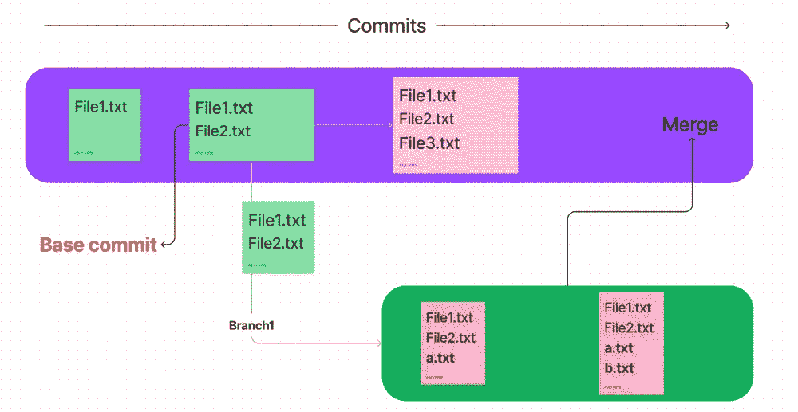
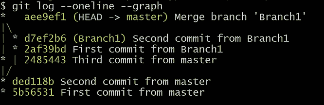
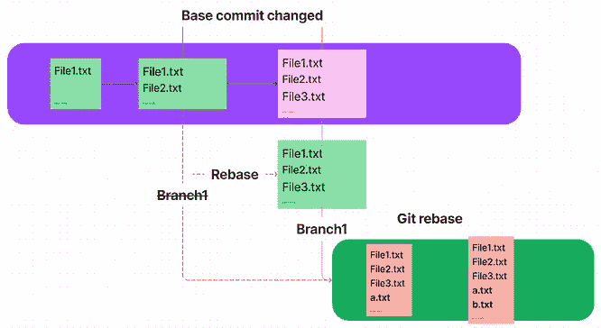
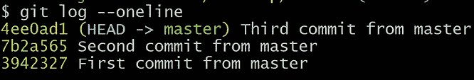
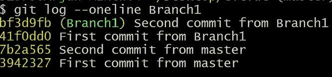
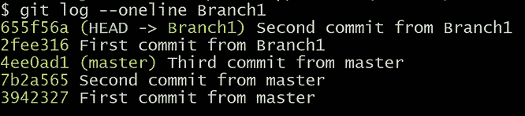
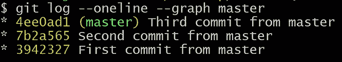
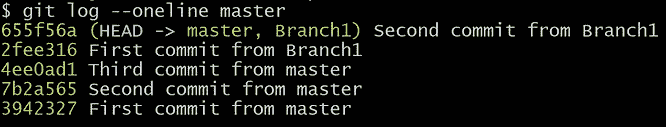
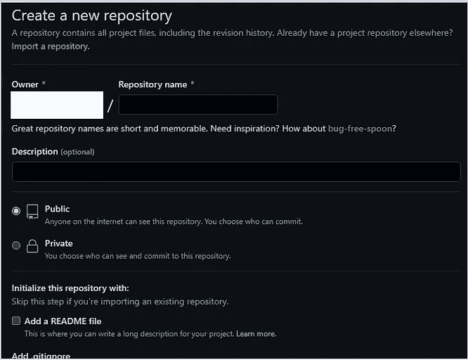
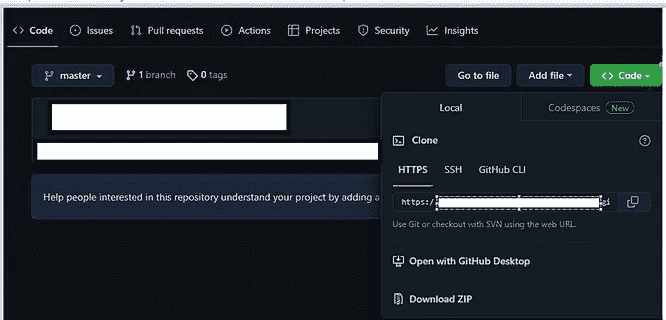

# 理解 Git 和 GitHub — V [Rebase，GitHub ]

> 原文：<https://medium.com/nerd-for-tech/making-sense-of-git-and-github-v-rebase-github-89c98052548f?source=collection_archive---------4----------------------->

## 你厌倦了合并和解决冲突吗？

我们对**‘快进合并’**没有意见，因为它没有创建自动生成的合并提交。

当你观察**快进**和**三路合并**的区别时，这一切都取决于**基数**提交。

## 什么是基本提交？



基础提交是**分支起源于**的**提交**。

这里，Branch1 的基础提交是在包含 **File1.txt** 和 **File2.txt.** 的**主**上的提交

> *当你做* ***分支*** *时，你就有了* ***非线性提交历史*** *。*

## 那么什么是非线性提交历史呢？

如上图所示，像往常一样进行设置。

合并它。这里不会有冲突。如果您想要冲突，在两个分支上的同一个文件中进行更改。然后解决冲突，合并。

反正合并之后，

键入 ***git log — oneline — graph →这将以图形格式显示提交历史。***



从上图来看，

我们可以推断 ded118b(来自主设备的第二次提交)是基础提交，因为 **Branch1** 是从该提交创建的。

如果您看到提交历史记录，

**注意**:【每个 ***** 都是提交】

在提交历史中，我们没有一条直线路径(线性历史)，而是两条不同的路径(非线性)。

为了使提交历史**线性**，我们需要在 git 中**重置**并**合并**。

> **=将基础提交更改为主分支中的最新提交。**

**

## *实践:Git rebase*

*如上图所示，在 git 中进行设置。*

*请记住，在更改基本提交时会创建一个新的提交。因此**提交** - **id 在**之前，而**在**之后**不同**。*

*我们会证明以上的一切。*

*我们将从第二次提交(基本提交)创建一个分支。那就换个基础。*

*在重置**提交历史**之前，请注意**提交 id** 。*

***主分支提交历史:***

**

***分支 1 提交历史:***

**

***哪个分公司在换底座**？分支 1。*

*所以从 **Branch1 执行 rebase 是显而易见的。***

*命令是什么？ ***git rebase 主*** 。*

*键入 **git rebase master** 然后 git log-one line，*

**

> *注意:**第三次提交被插入**，并且在它的上面，**分支 1** 提交被插入了**新提交 id**。这被称为**重定基准**。*

****由于提交 id 在变化，基础提交也在变化，如果许多开发人员在一个特定项目上合作，我们无法跟踪所有的提交历史。如果远程存储库和更多的合作者在那里，不建议改变基础。****

****但是我们可以在我们的本地回购中使用它，因为我们完全控制它！****

****同样，我们的原始提交被复制了一个新的 id。****

## *在 master 里提交历史呢？*

**

*它没有反映在主分支中，所以我们需要**合并**，因为我们只做了**rebase**。*

*我们需要从哪里合并？**高手**分支！*

*转到 master 并键入 **git merge Branch1，***

*给 **git commit —现在一行**，*

**

*是的，我们合并了。*

*这就是 git 中重新定基的全部思想。*

## *GitHub:*

*我们知道 **Git** 是本地存储库，而 **GitHub** 是一个**远程**存储库。所谓远程，我指的是位于世界某处的某个服务器，它存储着我们的知识库。*

*我们可以在 GitHub 中拉取和推送代码。*

*在此之前，我们需要在 GitHub 中创建一个存储库。你可以用邮件 id 在 GitHub 里开一个账户，基本说明在他们的网站上有。*

*开户后，我们需要点击网站上的**新建**按钮来创建一个存储库。*

**

*您需要给出这个 repo 的存储库名称和描述。*

*您可以将其设置为公共或私有。*

*创建回购后，您可以克隆或拉取。创建存储库后，您可以将代码放在那里。*

*由于 GitHub 提供云服务，我们可以在同一个回购上与许多开发者合作。*

*如果任何人想获得代码，他们需要**克隆**回购。*

*给 **git 克隆<网址>，***

*你可以在回购协议中找到网址，*

```
*git clone https://github.com/pansofarjun/github.git*
```

**

*然后就可以开始编码使用 git 了。*

*如果您想在上发送或接收来自**的代码，***

*你需要在 GitHub repo 中推拉。*

*现在您已经克隆了代码，它成为了本地机器上的 git 存储库。但是每次在 GitHub 里推或者拉，都需要记住回购的网址。*

*Git 有一种方法可以解决这个问题:它会记住 URL 并将其指定为' **origin '***

*所以，*

```
*git push origin master --> Sends the code
git pull origin master --> Takes the code*
```

> ***拉** =克隆+合并你的代码。这对团队合作来说是必不可少的。*

**原载于 2022 年 11 月 15 日*[*【https://www.pansofarjun.com】*](https://www.pansofarjun.com/post/making-sense-of-git-and-github-v-rebase-github)*。**