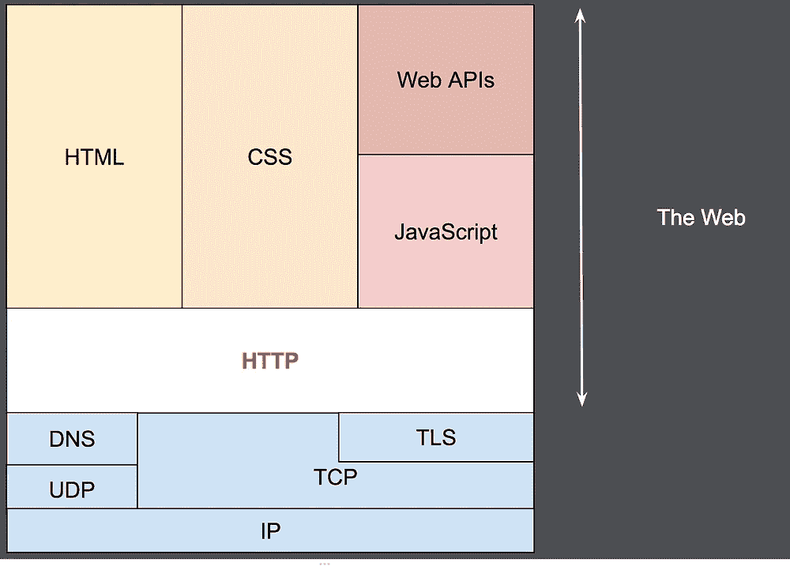
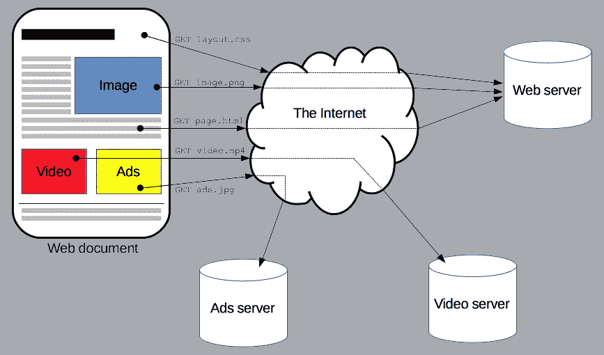

# 理解 HTTP-II

> 原文：<https://medium.com/nerd-for-tech/making-sense-of-http-ii-9bb479431a41?source=collection_archive---------4----------------------->

我们知道互联网是一个更广泛的术语，网络是它的应用之一。简单地说，互联网是多个设备的连接。我们可以利用这个连接做任何我们想做的事情，包括计算机病毒、黑客攻击等等。最广为人知的应用之一是 **Web** 。

这个 Web 位于应用层(TCP/IP 套件)。这一层中的一个协议叫做 **HTTP** 。它是网络上任何数据交换的基础。无论是你的博客、社交媒体等等。，一切都用 HTTP。

资料来源:MDN

HTTP 基于客户机-服务器模型。**客户端**大多是网络浏览器，**服务器**通常是你想要的网页所在的地方，像谷歌、雅虎、脸书等。

在这里，客户端和服务器通过交换单独消息进行通信。客户端向服务器发送名为 **Request、**的消息，服务器向客户端发送名为 **Response 的消息。**

我们知道像脸书这样的网页有图像、视频、文本等。在他们身上。所以 HTTP 必须应用于所有这些格式。

资料来源:MDN

**基本流程:重述**

所以整体画面看起来是这样的。

*   您的笔记本电脑向位于世界遥远地方的某个服务器发送请求。
*   您的笔记本电脑(物理设备)只处理数字信号，但对于数据传输，我们使用模拟信号。这种转换是由一种叫做**调制解调器的设备完成的。**这发生在**物理层**层。
*   所以你的数据被转换成模拟信号，但它需要被传输到一个特定的目的地(服务器)。这是由**路由器完成的。**这基本上是在**网络**层。通常，数据以数据包的形式发送，每个数据包使用不同的路径(路由器)到达最终目的地。
*   如果您要将数据分段成数据包，那么必须有一些规则来对数据包进行分段。这就是礼仪的用武之地。**互联网协议(IP)** 描述了数据包的结构。
*   如果数据包有多个，则需要将它们组装在一起。这发生在**运输**层。为了确保数据包被正确组装，我们需要一些正确的协议。这个协议叫做**传输控制协议(TCP)。**
*   不要和图层混淆，因为这里很多东西是重叠的。层只是一个模型，用来解释在引擎盖下发生的事情。
*   从本质上说，如果使用 IP，数据将被打包并通过路由器发送。但是如果使用 TCP over IP，我们会收到每个收到的数据包的确认。
*   因此，IP 上的 TCP 实现了连接的可靠性。
*   在这个 TCP/IP 上，我们有一个**应用**层。该应用层使用下面的层，并将其用于各种目的。其中一个目的就是**网站。**
*   此网站用于加载网页。作为一个**客户端**(网页浏览器)我们发送一个请求，从**服务器**(网页代码所在的地方)加载网页。这是基于请求和响应消息的。加载网页/获取数据的协议叫做 **HTTP** 。
*   *HTTP 为计算机之间的相互通信提供了一种标准化的方式。HTTP 规范中规定了客户端请求数据格式和服务器响应数据格式。*

*原载于 2022 年 8 月 12 日 https://www.pansofarjun.com***。**