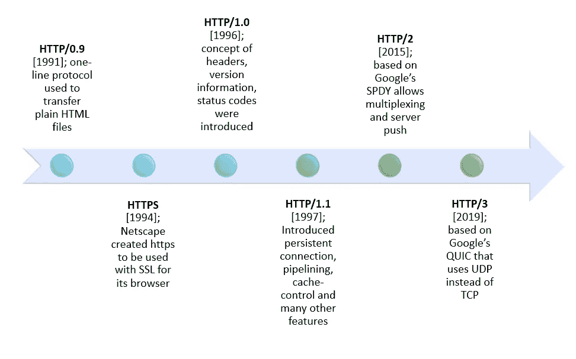

# 理解 HTTP-III

> 原文：<https://medium.com/nerd-for-tech/making-sense-of-http-iii-26ef19c6007b?source=collection_archive---------4----------------------->

在上一篇[文章](https://www.pansofarjun.com/post/http-a-layman-s-guide-ii)中，我们得出结论，HTTP 是在 web 上发送和接收消息的基础协议(一组规则)。它为客户机请求和服务器响应提供了一种规定的格式。这些请求/响应位于 TCP 之上，确保接收到正确的数据。



# HTTP 的演变:

## 为什么我们需要超文本？

将超文本视为文档的链接。文档包含信息，信息作为数据传递。超文本的整个概念是复制像字典、百科全书等书籍。，在机器上。如果你有一本百科全书，就说你想读地理方面的。您将在目录中搜索地理位置，并转到相应的页码。如果我们希望计算机也是如此呢？地理(文字)和地理(页面)的内容之间一定有某种联系。这种链接是通过电脑上的**超文本**实现的。在这种情况下，文本'**地理**'变成了链接到其内容的超文本。

## 网络的构建模块:

*   同一个百科全书从 A 到 z 可能有很多文本，这些文本要转换成超文本。必须有某种格式来安排这些文本作为超级文本。这种格式叫做 **HTML** 。它是超文本标记语言。它是 ***标记*** ，因为它需要复制一个页面(在本例中是百科全书的索引页)，如页眉、布局、内容和页脚。

> *标记是指以特定的方式构建。*

*   一个**协议**在网络上交换 HTML。HTTP 就是这么来的。
*   **客户端**显示被称为 web 浏览器的 HTML 文档(解析到人类可读)。
*   **服务器**提供对文档的访问。

## **HTTP 的阶段**

起初，它只有获取 HTML 文档的功能。只有 **get** 请求和响应是简单的 **HTML 文档**如果 HTML 文档不可用，单独的 HTML 文档显示不可用消息。

```
request:
get encyclopedia.htmlresponse:
<html>encyclopedia…..</html>
```

这里只能传输 html 文件。响应中没有标头或状态代码。

后来 http 开始了版本控制，如下图。响应的第一行包含状态代码和状态消息。html 以外的文档可以借助头中的 content-type 进行传输。这个阶段使用 **HTTP 头添加关于请求和响应的元数据。**

```
**request**:   
**get encyclopedia.html HTTP/1.0** 
**User-Agent**: chrome/windows 10 - to identify the browser and OS of origin of the request **response**:  **200 Ok** 
**Date**: date and time of response 
**server**: Whatever the server, you send requests on the web 
**Content-Type**: text/html 
<html>encyclopedia.....</html>
```

## HTTP — 1.1

它是 HTTP 的第一个标准化版本。

包括**流水线。** HTTP 1.0 对于每个请求和响应都需要一个全新的 TCP 连接。假设你使用脸书，它有文本、音频和图像。图像和音频将从不同的请求中获取，因为**内容类型**不同。这意味着页面没有完全显示；因此，我们需要一个新的 TCP 连接来传输图像。这缩短了等待时间。

**HTTP 1.1 中的管道**允许在第一个请求的答案完全传输之前发送第二个请求。

主机标题:服务器可以有很多应用程序。服务器只有一个 IP 地址。服务器不知道请求的目的地(即哪个应用程序)。这个主机头告诉哪个应用程序。

然后 HTTP 2.0 就进化了。HTTP 的发展基本上是为了提高可靠性、安全性、安全性、加密和扩展功能，以满足现代 web 的需求。记住这一点。您可以在 MDN 文档中了解更多信息。

*原载于 2022 年 8 月 13 日 https://www.pansofarjun.com**的* [*。*](https://www.pansofarjun.com/post/making-sense-of-http-iii)