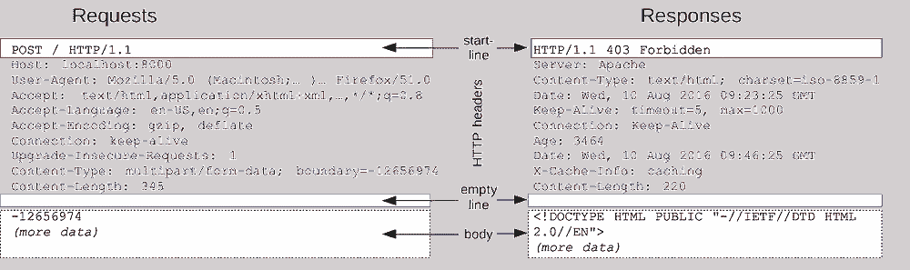
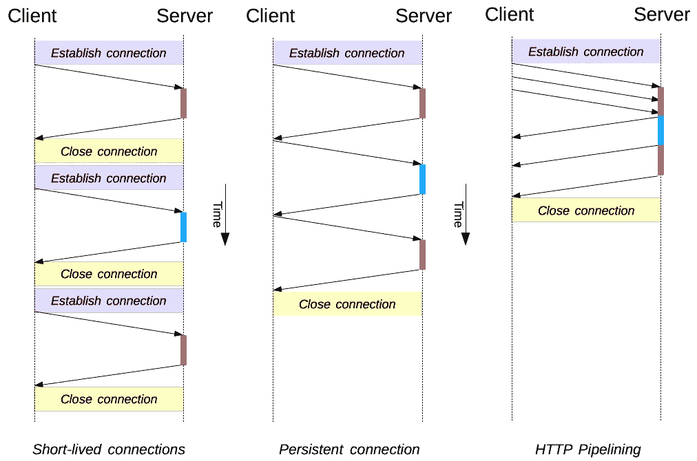

# 理解 HTTP-IV

> 原文：<https://medium.com/nerd-for-tech/making-sense-of-http-iv-203c7fc9b35b?source=collection_archive---------5----------------------->

我们将看到 HTTP 消息的结构。消息可以是请求和响应。消息是文本。通常，web 开发人员不会处理这些消息，而是由 web 浏览器来处理。

消息中的第一行称为**‘Start line’**，并且始终是一行。

然后是一组 HTTP 头，如键:值对。

表示元数据结束的空行。

空行之后，则体来。它由请求或响应数据组成。

HTTP 消息的 start-line 和 HTTP 头统称为请求的 ***头*** *，而其净荷称为 ***体*** 。*



资料来源:MDN

# 请求消息:

## 起始行:

包含 HTTP 方法，如动词 GET、POST、PUT 或名词(HEAD 和 OPTIONS)。

```
Start line 
[http method] [target/url] [http version]
```

## 标题:

它遵循键值对的结构。我们将在后面看到许多标题。

## 正文:

它可以是基于内容类型和内容长度头的单个资源体，也可以是 Html 表单中的多资源体。

# 响应消息:

这里的起始线称为**‘状态线’。**它包含

```
Status line 
[http version] [status code] [status text] 
HTTP/1.1 404 Not found
```

请求消息的相同结构也适用于这里的头部和主体。

## 连接管理:

这里的连接是指 TCP 连接。

如果在每个请求-响应周期都建立了一个新的 TCP 连接，则称为**短期连接。**

具有相同 TCP 连接的多个请求-响应周期— **持久连接。**

在同一个 TCP 连接中发送连续的 http 请求而不等待相应的响应— **流水线。**



资料来源:MDN

默认情况下，HTTP 1.1 默认使用持久连接。

> 今天，每一个符合 HTTP/1.1 的代理和服务器都应该支持**管道**，尽管许多在实践中有限制:这是没有现代浏览器默认激活这个特性的一个重要原因。

*原载于 2022 年 8 月 13 日*[*https://www.pansofarjun.com*](https://www.pansofarjun.com/post/making-sense-of-http-iv)*。*