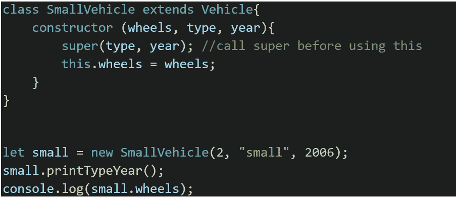

# 理解 JavaScript 中的对象和面向对象编程

> 原文：<https://medium.com/nerd-for-tech/making-sense-of-objects-and-object-oriented-programming-in-javascript-226fd0414961?source=collection_archive---------13----------------------->



我想谈谈 JavaScript 中的对象以及它们是如何用于面向对象编程(OOP)的。我将谈一点关于对象和它们的属性，以及关于带有构造函数和类的 OOP。

我将报道:

1-什么是对象？

2-作为属性集合的对象

JavaScript 对象

4-克隆对象-引用类型

5 —一般的面向对象编程

JavaScript 中的面向对象编程

7 —使用什么类型的 OOP？

# 1 —什么是对象？

对象用于保存不同类型的数据。JavaScript 中拥有对象的一种常见方式是这样的:

`{name:”my name”, age: “my age”}`

但是在 JavaScript 中，除了原始类型，所有东西都是对象。即使是基本类型，也有办法将它们创建为对象，而不仅仅是基本类型。

```
const num = 19;
console.log(typeof(num));//returns **number**
console.log (num **===** 19); //returns **true**const num2 = **new Number**(20);
console.log(typeof(num2)); //returns **object**
console.log (num **===** 20); //returns **false**
```

JavaScript 在命名属性时也非常灵活，我将在下一节展示这一点。

# 2-作为属性集合的对象

请看下面的例子，了解我们使用对象属性的不同方式。

```
//label the property and assign it a value
let someObject = {
     **property1**:"prop1",
     property2: "prop2"
}
console.log(someObject.**property1**); //prints prop1
console.log(someObject.**property101**); // prints undefined
```

属性可以包含函数:

```
const someObject = {
     prop1:function () {console.log("I am 1");},
}someObject.prop1;//will not do anything (not calling the function)
someObject.**prop1()**;//prints "I am 1"
let aux = someObject.prop1; // assign the function
**aux();** // prints "I am 1"
```

属性可以根据另一个变量命名:

```
const **propertyName** = "Jane";//use **[]** to use the variable name
const someObject = {
     **[propertyName]**:"hello"
}console.log(someObject**.Jane**);//prints "hello"
console.log(someObject**[propertyName]**); //prints "hello" 
```

**注意如何使用变量来访问属性我们没有使用点符号，而是用括号符号代替**。当访问嵌套属性时，可以使用点和括号符号的组合。

如果我们愿意，我们也可以这样做:

```
const someObject = {
     **[2+2]**:"hello"
}//access with [] notation.
console.log(someObject**[4]**); //prints "hello"
console.log(someObject**[1+3]**); // prints "hello"
```

要添加额外的属性，我们只需使用它，它就会被添加。

```
const someObject = {
     p1:"hello"
}
someObject.p2 = "hello 2"
console.log(someObject.p2); //prints "hello 2"
```

要删除属性，我们需要执行以下操作:

```
const someObject = {
     p1:"hello 1",
     p2:"hello 2"
}console.log(someObject.p2); //prints "hello 2"
**delete** someObject.p2;
console.log(someObject.p2); // prints undefined.
```

# JavaScript 对象

除了上面的例子中所展示的，对象还可以用其他方式创建，其中之一就是使用 Object()构造函数。JavaScript 对象是 Object 的实例。

```
const someObject = {
     p1:"hello 1",
     p2:"hello 2"
}const anotherObject = **new Object**();
anotherObject.p1 = "from new 1";
anotherObject.p2 = "from new 2";console.log(typeof(someObject)); //they both print "object"
console.log(typeof(anotherObject));
```

对于对象类型，我们得到“值”、“条目”和“键”方法，如下所示。

```
const someObject = {
     p1:"hello 1",
     p2:"hello 2"
}console.log(**Object.values**(someObject));//[ 'hello 1', 'hello 2' ]
console.log(**Object.keys**(someObject));//[ 'p1', 'p2' ]
console.log(**Object.entries**(someObject));//[ [ 'p1', 'hello 1' ], [ 'p2', 'hello 2' ] ]
```

当您将对象创建为常量时，对象变量本身将是常量，但属性不是。

```
**const** someObject = {
     p1:"hello 1",
     p2:"hello 2"
}//This will throw an "Assignment to constant variable" error.someObject **= {p1:"hey"};**//but this will work
**const** someObjec2t = {
     p1:"hello 1",
     p2:"hello 2"
}
someObject2**.p1** = "modifed";
```

如果希望整个对象是一个常量，可以执行以下操作，这不会引发错误，但不会更改属性:

```
const obj1 = **Object.freeze**({prop1: 'hey const 1', prop2: "hey const 2"});
obj1.prop1 = "CHANGED IT";
console.log(obj1.prop1);//prints "hey const 1"
```

作为 Object 的实例，我们的对象将拥有一些方法，即使我们没有创建它们，我们也可以使用它们。其中一个允许我们检查一个对象是否有属性。

```
const obj1 = {
     p1 : "I am 1",
     p2 : "I am 2"
}console.log(**obj1.hasOwnProperty("p3")**);//false
console.log(obj1.hasOwnProperty("p1"));//true
```

# 4-克隆对象-引用类型

对象是引用类型。这意味着当我们复制或传递它们时，我们实际上是在移动保存对象的内存引用，而不是对象(及其内容)的副本。当我们将一个对象变量赋给另一个对象变量时，对象“说”的是“这里，这是我的数据所在的盒子，我会与你分享它，如果你改变它，你也会为我改变它。”

```
//create object and primitive
const obj**1** = { p:**1**};
const x = **1**;//assign them to new variables
const obj2 = obj1;
let y = x;//change the recently created variables
obj**2**.p = **2**;
y = **2**;//check the values of all
console.log("objects");
**console.log(obj1.p);// 2, the content in the box has changed to 2
console.log(obj2.p);//2**
console.log("primitives")
**console.log(x);//1
console.log(y);//2**
```

因此，如果我们想要的是一个行为类似于原始类型副本的副本，我们需要做我们称之为**深度克隆**的事情。使用深度克隆，所有属性都将获得一个新副本。

```
const obj1 = { p:1};
const obj2 = **JSON.parse(JSON.stringify(obj1))**;obj2.p = 2;console.log(obj1.p); //1
console.log(obj2.p); //2
```

我已经谈到了对象的常规赋值，它只是与另一个变量共享内存位置，还谈到了使用 JSON 获得一个**深度克隆**。还有一种两者兼而有之的叫做**浅克隆**。在浅层克隆中，对象的基本元素将被复制，但引用类型仍将共享内存位置。

请参见以下示例:

原始(值):

```
let obj1 = { p:1};
let obj2 = **Object.assign({},obj1)**; // or **{...obj1};**
obj2.p = 2;
console.log(obj1);//{ p: 1 }
console.log(obj2);{ p: 2}
```

数组(引用)。请注意将属性重新指定给新数组和更改数组本身之间的区别。改变数组本身会影响两个对象，因为我们改变了数组所在的盒子的内容。对于 obj2，我们为它分配了一个新数组:

```
let obj1 = { p:[1,2,3,4]};
let obj2 = Object.assign({},obj1);
let obj3 = Object.assign({},obj1);obj2.p **= [5,6];**
obj3.**p.push(1000);**console.log(obj**1**);
console.log(obj**2**);
console.log(obj**3**);//the above will print:
//{ p: [ 1, 2, 3, 4, **1000** ] }
//{ p: [ 5, 6 ] }
//{ p: [ 1, 2, 3, 4, **1000** ] }
```

一个对象(引用):

```
let **obj1 = { p:{a:1, b:2, c:["a"]}};**
let obj2 = Object.assign({},obj1);
let obj3 = Object.assign({},obj1);obj2.p = {a:2, b:3, c: ["b"]};obj3.**p.a** = **3**;//Notice this one will change for both
obj3.**p.c.push**("AAAAAAA");console.log(obj1);
console.log(obj2);
console.log(obj3);//Will print
{ p: { **a: 3**, b: 2, c: [ 'a', **'AAAAAAA'** ] } }
{ p: { a: 2, b: 3, c: [ 'b' ] } }
{ p: { **a: 3**, b: 2, c: [ 'a', **'AAAAAAA'** ] } }
```

# 5 —一般的面向对象编程

在 OOP 中，我们以对象为中心编写代码。OOP 将提供封装、抽象、继承和多态。

**封装**:拥有方法和它们所作用的数据，并对外隐藏细节。

**抽象**:对对象隐藏细节降低了复杂性。函数可以使用对象及其方法，而不必知道它们是如何工作的。

**继承**:你可以利用已经执行你需要的功能的对象(或类)，这样你就不必重新发明轮子。

**多态性**:不同的类(对象)可以使用同一个接口。方法重载就是一个例子。方法名是相同的，但是根据传递给它的参数，执行的事情会有所不同。

# JavaScript 中的面向对象编程

我们已经看到了面向对象的基本方式。我前面提到过，当我们创建一个对象时，我们正在创建一个 object 类型的实例。对象有一些静态方法(需要通过对象使用)和一些实例方法(可以通过实例调用)。让我们看几个方法，我们的对象可以使用，因为对象。

```
let ob = { p1:"hello", p2:"good morning", p3:"bye"};
//STATIC Object.isFrozen()
console.log(**Object.isFrozen(ob)**);//false//INSTANCE Object.prototype.hasOwnProperty()
console.log(**ob.hasOwnProperty("p1")**);//true
```

让我们看看如何用 OOP 获得更多。

**用构造函数创建对象**

我们将使用一些函数来创建新对象。标准是以大写字母开始命名这些函数。

下面我们正在创建一个新的车辆类型的对象。

```
function **V**ehicle(typearg, yeararg){
     **this**.type = typearg;
     **this**.year = yeararg;
}let cartype = **new Vehicle**("car", 2003);console.log(**Object.getPrototypeOf(cartype)**); //Vehicle {}
console.log(cartype.type); //car
console.log(cartype instanceof Vehicle); //true
console.log(Vehicle.prototype); //Vehicle {}
```

对车辆原型更详细的观察

```
*{constructor: ƒ}* constructor: *ƒ Vehicle(typearg, yeararg)* arguments: null
caller: null
length: 2
name: “Vehicle”
prototype: {constructor: *ƒ*}
__proto__: *ƒ ()*
```

如果我们希望原型有一个变量在车辆的所有实例中共享(而不是每个实例都有自己的副本),我们可以这样做:

```
function Vehicle(typearg, yeararg){
     this.type = typearg;
     this.year = yeararg;
}
Vehicle.**prototype.maxwheels** = 6;
let cartype = new Vehicle("car", 2003);
console.log(Vehicle.prototype);//the vehicle prototype will not look like this
*{****maxwheels: 6****, constructor: ƒ}* maxwheels: 6
constructor: *ƒ Vehicle(typearg, yeararg)* __proto__: Object
```

让我们在原型改变后检查实例。记得我说过，添加到原型的属性将在不同的实例之间共享，所以它并不真正属于实例。

```
function Vehicle(typearg, yeararg){
     this.type = typearg;
     this.year = yeararg;
}
**Vehicle.prototype.maxwheels = 6;**let cartype = new Vehicle("car", 2003);console.log(cartype.maxwheels); //6console.log(cartype.**hasOwnProperty**("**type**")); //true
console.log(cartype.**hasOwnProperty**("**maxwheels**"));//**false**
```

注意:您也可以通过赋值将原型设置为一个全新的原型，但是如果您这样做，您需要在其中包含构造函数(constructor:Vehicle ),因为它将被赋值移除。

就像你可以给原型添加一个属性一样，你也可以添加一个方法。

```
function Vehicle(typearg, yeararg){
     this.type = typearg;
     this.year = yeararg;
}Vehicle.prototype.maxwheels = 6;
Vehicle.prototype.**printMyInfo** = function () {
     console.log(this.type);
     console.log(this.year);
     console.log(this.maxwheels);
}let cartype = new Vehicle("car", 2003);
cartype.**printMyInfo**();//prints
car
2003
6
```

不要为此使用箭头函数，因为箭头函数不会得到它们自己的“this”,“this”将引用全局范围。即使是常规函数，我们也会对“这个”得到的东西感到惊讶。请参见下面的示例。

```
function Vehicle(typearg, yeararg){
     this.type = typearg;
     this.year = yeararg;
}
Vehicle.prototype.maxwheels = 6;
Vehicle.prototype.**functionWithFunction** = function () {
   console.log(**this**);
   function **innerFunction**() {
       console.log(**this**);
   }
   **innerFunction**();
}
let cartype = new Vehicle("car", 2003);
cartype.functionWithFunction();//both functions will not have the same value for "this"
//the inner function has this set to global.
**Vehicle** { type: 'car', year: 2003 }
**Object [global]** {
  global: [Circular],
  clearInterval: [Function: clearInterval],
  clearTimeout: [Function: clearTimeout],
  setInterval: [Function: setInterval],
  setTimeout: [Function: setTimeout] {
    [Symbol(nodejs.util.promisify.custom)]: [Function]
  },
  queueMicrotask: [Function: queueMicrotask],
  clearImmediate: [Function: clearImmediate],
  setImmediate: [Function: setImmediate] {
    [Symbol(nodejs.util.promisify.custom)]: [Function]
  }
}
```

这意味着我们将无法通过内部函数中的“this”来访问对象属性。要解决这个问题，我们可以这样做:

```
function Vehicle(typearg, yeararg){
     this.type = typearg;
     this.year = yeararg;
}
Vehicle.prototype.maxwheels = 6;
Vehicle.prototype.functionWithFunction = function () 
     console.log(this);
     c**onst self = this;**
     function innerFunction() {
          console.log(**self**);
     }
     innerFunction();
}let cartype = new Vehicle("car", 2003);cartype.functionWithFunction();//prints
Vehicle { type: 'car', year: 2003 }
Vehicle { type: 'car', year: 2003 }
```

那么，如果我们想拥有另一个继承自 vehicle 的小型 Vehicle 类型的对象呢？这就是我们如何用构造函数获得继承。

```
function **Vehicle**(typearg, yeararg){
     this.type = typearg;
     this.year = yeararg;
}Vehicle.prototype.**printType** = function () {
     console.log(this.type);
     console.log(this.year);
}//new constructor function inheriting from Vehicle
function **SmallVehicle**(**wheels, type, year**) {
     **Vehicle.call(this, type, year);**
     this.wheels = wheels;
}
**SmallVehicle.prototype = Object.create(Vehicle.prototype);**
Object.**defineProperty**(SmallVehicle.prototype, 'constructor', {
    ** value: SmallVehicle,**
     enumerable: false,
     writable: true });let small = new SmallVehicle(2, "small", 2006);
small.**printType**();
```

如果需要，我们可以添加针对小型车辆原型的功能。在我看来，上述作品得到继承，但它有点丑陋。我更喜欢上课。

**用类创建对象**

我们在 JavaScript 中并没有真正的类，因为在幕后它们会被转化为我们见过的构造函数，但是就编码而言，它们看起来很像类。

上面带有额外静态方法的 Vehicle 和 SmallVehicle 类如下所示。

```
**class Vehicle**{
     **constructor**(typearg, yeararg){
          this.type = typearg;
          this.year = yeararg;
     }
     //getter
     **get** theType(){
          return this.type;
     }
     //setter
     **set** theYear(year){
          this.year = year;
     }
     //Just a method
     printTypeYear (){
          console.log(this.type);
          console.log(this.year);
     } static printSomething(){
          console.log("printing something");
     }
}**class SmallVehicle extends Vehicle**{
     **constructor** (wheels, type, year){
          **super**(type, year); //**call super before using "this"**
          this.wheels = wheels;
     }
}let small = **new** SmallVehicle(2, "small", 2006);
small.printTypeYear();
console.log(small.wheels);
small.**theYear** = 2011; //use the getter
small.printTypeYear();
SmallVehicle.printSomething(); //static method//the above will print
small
2006
2
small
2011
printing something
```

注意:不要在构造函数中放入超过你需要的代码。构造函数将在每次使用 new 创建新对象时运行。

注意:你不必在 getter 和 setter 方法的名称中使用 get 和 set，但这是一个好主意(尽管我上面没有提到)。

# 7 —使用什么类型的 OOP？

有些人喜欢使用构造函数，有些人喜欢类语法。这是一个偏好的问题。我更喜欢这些类，因为我习惯了 C#，它看起来更熟悉(也更简洁)。

感谢您的阅读。我希望这有助于澄清事情。