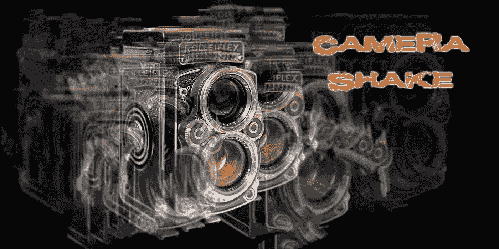

# 让相机在没有插件的情况下统一抖动

> 原文：<https://medium.com/nerd-for-tech/making-the-camera-shake-in-unity-without-plugins-f3eaef8a38f5?source=collection_archive---------12----------------------->

在游戏中加入相机抖动是增加玩家沉浸感的好方法。它增加了像爆炸或正在造成伤害的事件的巨大影响。在这篇文章中，当我的游戏中的玩家受到伤害时，我最终需要使相机抖动。

首先，我创建一个新的**空游戏对象**并将其命名为 **Camera_Holder** ，然后让我的**主相机**成为相机的**子相机**