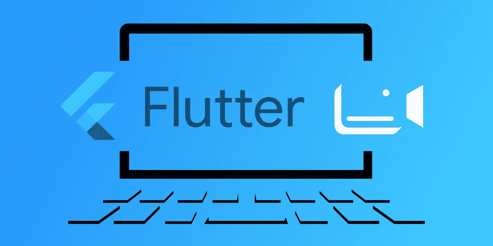
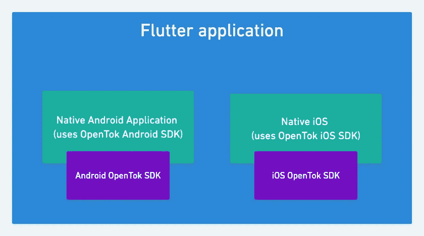
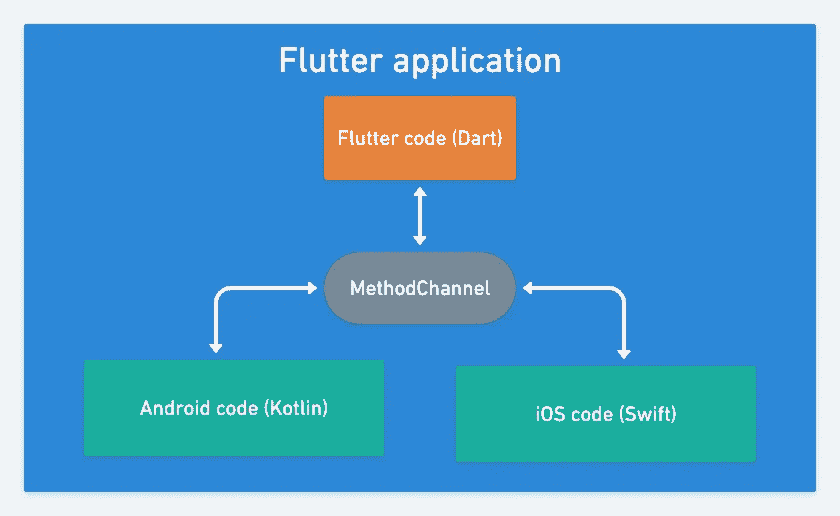

# 使用 Vonage Video 和 Flutter 进行视频通话

> 原文：<https://medium.com/nerd-for-tech/making-video-calls-using-vonage-video-and-flutter-9bcda59249e7?source=collection_archive---------7----------------------->

Flutter 越来越受欢迎，所以我们决定构建一个简单的应用程序，允许在两个设备之间进行视频通话。用于构建该应用的两项技术是 Flutter 和 Vonage 视频 SDK。让我们快速回顾一下这些技术:

*   [Flutter](https://flutter.dev/) —开源 UI 软件开发套件，用于开发 Android、iOS、Linux、Mac 的跨平台应用。主要的编程语言是 [Dart](https://dart.dev/) 。
*   [Vonage Video](https://tokbox.com/developer/sdks/android/) —用于在各种设备之间建立视频通话。使用的编程语言是 Android 平台的 [Kotlin](https://kotlinlang.org/) 和 iOS 平台的 [Swift](https://www.swift.com/) 。

这款应用相当于基本视频聊天应用([基本视频聊天 Android](https://github.com/opentok/opentok-android-sdk-samples/tree/main/Basic-Video-Chat) / [基本视频聊天 iOS](https://github.com/opentok/opentok-ios-sdk-samples/tree/main/Basic-Video-Chat) )。以下是该应用程序的主要功能:

*   连接到 Vonage 视频会话
*   向会话发布音频-视频流
*   订阅另一个客户端的音频-视频流

> 注意:应用程序源代码可在 [GitHub](https://github.com/opentok/opentok-flutter-basic-video-chat) 上获得。

颤振是这里的主要技术。它是用于构建运行在 Android 和 iOS 上的移动应用程序的基础。它将负责管理和显示 UI，并且包含应用程序逻辑。这样，应用程序逻辑只需为两个平台编写一次。

在引擎盖下，这个 Flutter 应用程序将使用 [Android Vonage 视频 SDK](https://tokbox.com/developer/sdks/android/) 和 [iOS Vonage 视频 SDK](https://tokbox.com/developer/sdks/ios/) (通过 Android/iOS 原生项目):

平台(Android，iOS)本机代码通过使用 Flutter [方法通道](https://api.flutter.dev/flutter/services/MethodChannel-class.html)与 Flutter 通信，该方法通道使用方法调用。MethodChannel 作为 Flutter 和原生代码之间发送消息的桥梁(加入原生 Android 项目和原生 iOS 项目)。这允许我们登录用户并设置视频会话以进行视频通话:

Flutter 可以向应用程序的本机(Android / iOS)部分发送消息，应用程序的本机部分可以向 Flutter 发回消息。Flutter 调用`initSession`方法，并将`apiKey`、`sessionId`和`token`传递给本地代码，以启动 Vonage 视频会话。本机代码将通知应用程序的 Flutter 部分成功登录(或出错)，Flutter 端代码将更新 UI。

> 注意:Flutter 应用程序可以打包成 Android 或 iOS 应用程序，但不能同时打包成两种应用程序。当目标平台设置为 Android 时，MethodChannel 与 Android 原生应用程序代码进行通信。当目标平台设置为 iOS 时，MethodChannel 与 iOS 原生应用程序代码进行通信。

要运行[应用程序](https://github.com/opentok/opentok-flutter-basic-video-chat)，你必须安装 Flutter。这因平台而异，你可以在[详细说明](https://flutter.dev/docs/get-started/install)中看到。

> 注意:确保运行`flutter doctor`来验证你的本地颤振设置。

要登录 Vonage 视频会话，您需要一个 [Vonage 视频帐户](https://tokbox.com/account/#/)，并生成`initSession`、`apiKey`和`sessionId`。您可以在 [Vonage 视频仪表盘](https://tokbox.com/account/#/)中获取这些值。现在打开`main.dart`文件，并在相应的变量中使用这些值:

启动手机应用程序开始视频通话。

> 注意:您可以使用 [Developer playground](https://tokbox.com/developer/tools/playground/) 连接到运行 Flutter 应用程序的移动设备的同一个会话。

# 摘要

还有几个[弊端](https://github.com/opentok/opentok-flutter-basic-video-chat#known-issues)，但是旋舞和 Vonage 视频的整体整合还是比较流畅的。即使没有原生的 Flutter 包，也可以快速创建一个完全成熟的 Flutter 应用程序，该应用程序在引擎盖下利用 Vonage 视频移动 SDK，并在 Android 和 iOS 设备上运行。

*原载于*[*https://learn . vonage . com/blog/2021/07/06/making-video-calls-using-vonage-video-and-flutter/*](https://learn.vonage.com/blog/2021/07/06/making-video-calls-using-vonage-video-and-flutter/)