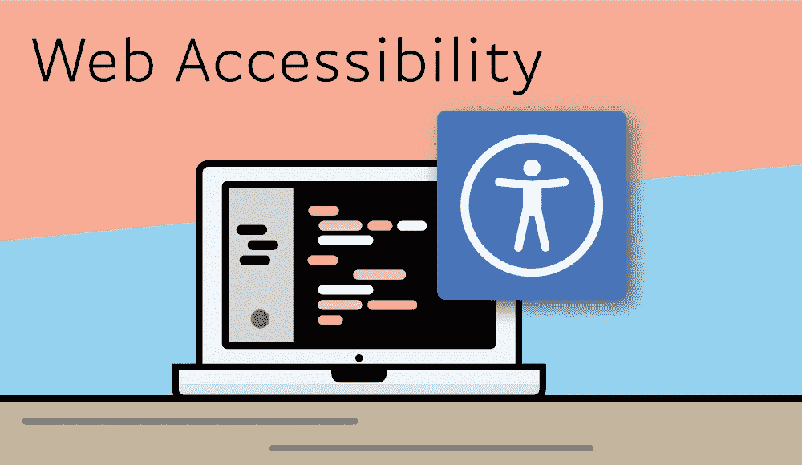

# 使网站可访问

> 原文：<https://medium.com/nerd-for-tech/making-websites-accessible-2e056927ccc6?source=collection_archive---------7----------------------->

21 世纪开发的网站不能把可访问性想当然。事实上，在许多地方，组织有法律义务使他们的网站无障碍。让所有用户都能访问网站是正确的做法。令人欣慰的是，今天可访问性是一件大事，有许多不同的技术可以使网站更容易访问。



网页可访问性

## 什么是网页可访问性？

网页可访问性背后的核心思想是，无论是否残疾，每个人都可以使用网站。一个可访问的网站将允许任何用户，甚至是残疾人，在不明显减少内容或整体用户体验的情况下，执行网站的核心功能。例如，有视觉障碍的人可能看不到网站上的图像，但仍然可以通过替代方式向他们提供关于图像内容和性质的信息。

网页可访问性的目的是设计和开发无论用户的残疾类型如何都可以使用的网站。在这方面，网站开发人员必须预见到他们的网站将被患有各种不同残疾的用户使用，包括:

*   **视觉障碍** —失明或弱视的用户。这些用户有时会使用屏幕阅读器来浏览网站，或者更喜欢网站的缩放版本。
*   **听力障碍** —失聪或听力低下的用户。当提供字幕时，这些用户可以最好地体验多媒体内容。
*   **行动障碍**——行动受限或无法使用鼠标浏览网站的用户。这些用户有时只能通过键盘与网站互动。

上面的例子只是用户可能有的一些可能的残疾或损伤。了解一些用户在访问互联网信息时所面临的挑战，对于理解网页可访问性的重要性至关重要。

# 帮助即将到来—可访问性标准

因为网页可访问性的主题是如此重要和复杂，所以有许多资源可以帮助网页设计者和开发者实现解决方案，使网站更容易访问。大多数资源都是基于万维网联盟(W3C)发布的网络内容可访问性指南(WCAG)。关于网页可访问性的一些最佳资源包括:

*   [**网页内容无障碍指南(WCAG)概述**](https://www.w3.org/WAI/standards-guidelines/wcag/) —官方标准的良好起点。
*   [**Mozilla 开发者网络—可访问性**](https://developer.mozilla.org/en-US/docs/Learn/Accessibility) —关于可访问性的精彩概述和教程。
*   [**A11y 项目**](https://www.a11yproject.com/) —基于社区的无障碍资源。
*   [**Web aim—Web Accessibility in Mind**](https://webaim.org/)—一个有很多文章和工具来提高可访问性的网站。

这些只是众多可用资源中的一部分，也是了解该主题更多信息的良好起点。在一些关于可访问性的资源中还包含了检查表，这些检查表有助于检查是否符合最新的可访问性标准。

# 使网站可访问

有许多不同的技术可以用来提高可访问性。例如，视障用户经常使用屏幕阅读器，如 [JAWS](https://www.freedomscientific.com/products/software/jaws/) 、 [NVDA](https://www.nvaccess.org/) 或 [VoiceOver](https://www.apple.com/accessibility/mac/voiceover/) 为用户读出网站内容。为了让这种体验尽可能有回报，web 开发人员必须对网站进行编码，以适应这些用户。下面讨论一些用于提高可访问性的技术。

## 可访问的 HTML

HTML 中用来构建网站的元素和标签同时具有结构和语义的含义。例如，`<header>`、`<nav>`、`<main>`和`<footer>`元素都有特殊的语义值，供屏幕阅读器在读取网站内容时使用。同样，其他元素，如锚标记、列表、表单、块引号和图像，也有语义含义，可以是交互式的。使用这些元素很重要，因为它们旨在减少屏幕阅读器遇到的混乱。

```
<main>
  <h1>Same as the Page Title</h1>
  <p>paragraph content goes here...</p>
</main>
```

一些 HTML 元素提供了内置的方法来提高它们的可访问性。最明显的例子是图像。对于有视觉障碍的用户，图像是不可见的。在这些情况下，提供一些文本内容来描述图像中显示的内容非常重要。这可以通过使用 **alt** 属性来完成。屏幕阅读器将读出 alt 属性中的文本，并为用户提供这种类型的信息。

```

```

## WAI-ARIA 有一个资源可以帮助提高

一个网页上的不同元素对于屏幕阅读器来说是 [WAI-ARIA](https://www.w3.org/WAI/standards-guidelines/aria/) ，可访问的富互联网应用的可访问性标准。WAI-ARIA 为元素定义了一组角色和属性，以提高它们的可访问性。例如，元素可能用于装饰目的，但对于具有屏幕阅读器的用户来说没有意义。WAI-ARIA 提供了一种方法来从屏幕阅读器中删除这些类型的元素，以避免混淆。

```
<!-- Using the role="presentation" attribute will tell screen readers to ignore the element -->
<!-- Screen readers will also skip over content with an empty alt attribute -->

```

## 可访问的 CSS

CSS(层叠样式表)主要用于设计网站的样式，可以在提高可访问性方面发挥重要作用。例如，可以使用较大的文本尺寸来使内容更易于阅读。定义提供足够对比度的颜色也是可访问性的一个重要部分。最后，CSS 可以用来从网站的显示中移除元素，它们会被屏幕阅读器忽略。

```
/* Make the text larger */
h1 {
  font-size: 4rem;
}/* Good contrast between background and text */
header {
  background-color: #000;
  color: #fff;
}
```

## 键盘可访问性

对于只使用键盘访问网站的用户来说，一些重要的可访问性技术包括提供跳过导航链接并直接进入主页内容的方法。这将帮助用户避免在每个页面上听到一长串的导航链接，尤其是当他们知道他们想要访问什么内容的时候。这可以通过使用*跳转到内容*链接来实现，该链接可以让用户前进到页面的主要内容。

```
#skip-link {
  position: absolute;
  left: -999em;
}#skip-link:focus {
  position: relative;
  top: 0;
}<body>
  <a id="skip-link" href="#main-content">Skip to Content</a>
  <nav>
    <ul>
      <li>navigational links...</li>
    </ul>
  </nav>
  <main id="main-content">
    <h1>Main Page Content Title</h1>
  </main>
</body>
```

使用 tab 键为用户提供网站的逻辑进程也很重要。此外，当网页上的元素被聚焦时，可以查看网页但使用键盘浏览页面内容的用户需要清晰的视觉提示，通常在元素周围有突出的色盲安全边框。

另一个重要的考虑是帮助用户浏览网页时不出现任何意外问题。例如，当使用模态框时，重要的是允许用户使用键盘在模态中前进，并为用户提供一种在上下文中前进以及在不被困住的情况下退出的方法。这个概念被描述为[无键盘陷阱](https://www.w3.org/TR/UNDERSTANDING-WCAG20/keyboard-operation-trapping.html)，在 W3C 网站上有详细描述。

## 减少运动

对于一些用户来说，网页中包含快速或持续运动或动画或网页上的交互元素的网站可能会导致头晕等问题，甚至在最严重的情况下诱发癫痫发作。建议限制动画的数量，但在动画确实有显著运动的情况下，开发者可以提供一个*减少运动*的选项。现代操作系统上的用户能够指示他们更喜欢减少的运动，然后浏览器使用该减少的运动来请求符合该设置的动画版本。

# 结论

这些只是可以用来提高网站可访问性的许多考虑因素和技术中的一部分。最重要的是，不要认为一个网站可以被访问，而不去努力让它可以被访问。作为任何现代网站设计和开发工作流程的一部分，良好的规划和优先考虑可访问的用户体验是至关重要的。易访问的网站也能够被最大数量的人使用，这应该是每个网站的目标。