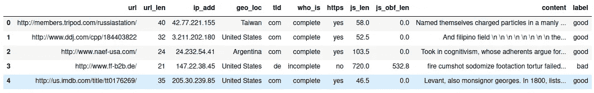
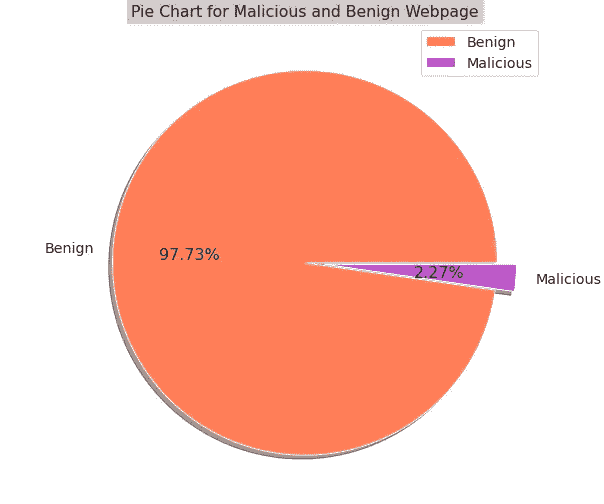
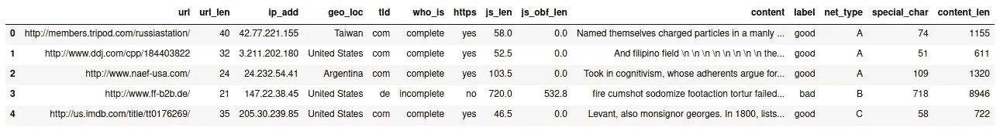
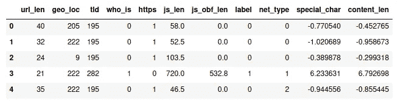
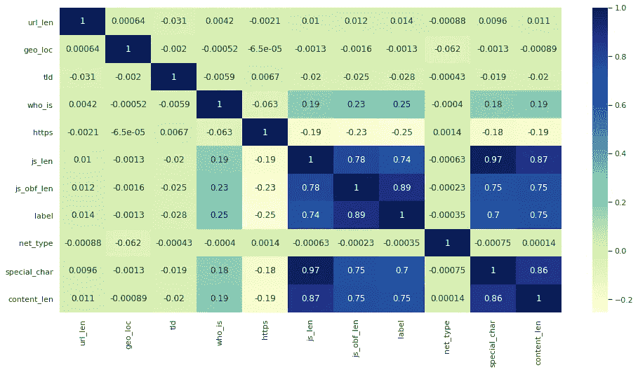
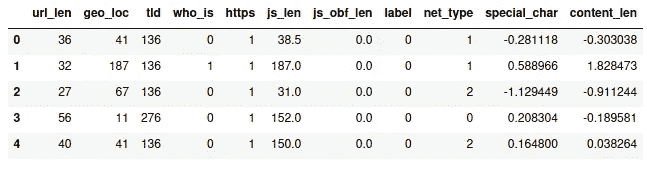
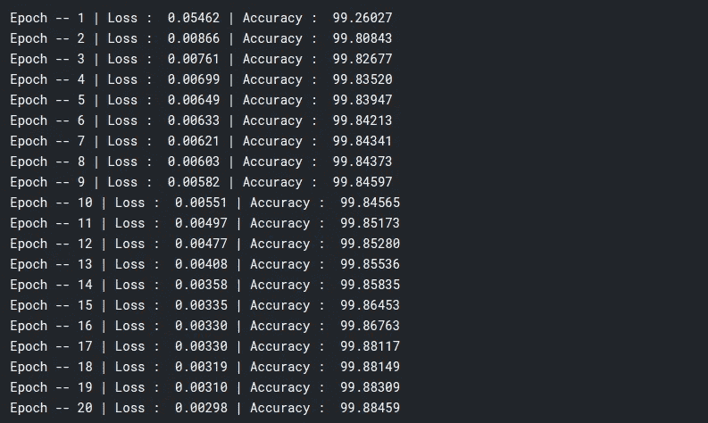
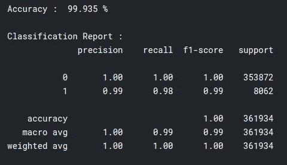
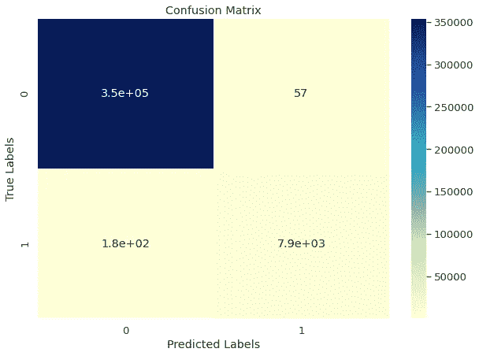

# 使用 DNN 的恶意网页分类器

> 原文：<https://medium.com/nerd-for-tech/malicious-webpage-classifier-using-dnn-pytorch-ee6402663c58?source=collection_archive---------13----------------------->

[](https://ophtek.com/wp-content/uploads/2019/08/website-malware-removal-tool.png)

恶意网页是在您的系统上安装恶意软件的页面，这些恶意软件会破坏计算机的运行，收集您的个人信息，最糟糕的情况还有很多。对互联网上的这些网页进行分类是为用户提供安全浏览体验的一个非常重要的方面。

目标是将网页分为两类*恶意*【不良】和*良性*【良好】网页。针对特定目标，首先对数据集进行预处理，并训练 DNN 模型，该模型在 Pytorch 中实现。

项目中使用的数据集取自[门德利数据](https://data.mendeley.com/datasets/gdx3pkwp47/2)。数据集包含原始网页内容、地理位置、javascript 长度、网页的模糊 JavaScript 代码等特征。该数据集包含大约 150 万个网页，其中 120 万个用于训练，30 万个用于测试。数据集的片段如下所示。



资料组

数据集高度倾斜，97.73%的数据集是良性网页，2.27%是恶意网页，因此仔细选择评估指标非常重要，因为仅仅是准确性并不能给出正确的评估，所以我们将使用 f1_score、recall 和混淆矩阵。



高度倾斜的数据集

现在，首先我们将导入所有需要的库。

```
*# Importing the Required Libraries*

import pandas as pd
import numpy as np

import matplotlib.pyplot as plt
import seaborn as sns

import torch
import torch.nn as nn
import torch.nn.functional as F
import torch.optim as optim
from torch.utils.data import Dataset, DataLoader
from sklearn import metrics
from sklearn.preprocessing import LabelEncoder, StandardScaler
```

在导入所有需要的库之后，我们将导入数据集，然后对其进行预处理并向数据集添加一些特性。【在预处理和特征工程之前进行大量探索性数据分析，并在 [Kaggle](https://www.kaggle.com/sumitm004/malicious-webpage-classifier-using-dnn-pytorch) 的完整笔记本中给出。我们将添加的功能是“网络类型”、“原始内容中特殊字符的数量”和“内容的长度”。

```
# Importing the dataset
df_train=pd.read_csv("../input/Webpages_Classification_train_data.csv")df_test=pd.read_csv("../input/Webpages_Classification_test_data.csv")# Dropping the redundant column
df_train.drop(columns = "Unnamed: 0", inplace = True)
df_test.drop(columns = "Unnamed: 0", inplace = True)
```

现在，我们将编写一些函数来添加提到的功能，这些函数包含在名为“preproc”的类中，第一个函数是计算原始内容中的特殊字符，第二个函数是使用 IP 地址分配网络的类型(“A”、“B”和“C”)，有关更多信息，请访问[网络类](https://docs.oracle.com/cd/E19504-01/802-5753/6i9g71m2o/index.html#planning3-fig-11)。

```
class **preproc**:

    *# Counting the Special Characters in the content*
    def count_special(string):
        count = 0
        for char **in** string:
            if **not**(char.islower()) **and** **not**(char.isupper()) **and** **not**(char.isdigit()):
                if char != ' ':
                    count += 1
        return count

    *# Identifying the type of network [A, B, C]*
    def network_type(ip):
        ip_str = ip.split(".")
        ip = [int(x) for x **in** ip_str]

        if ip[0]>=0 **and** ip[0]<=127:
            return (ip_str[0], "A") elif ip[0]>=128 **and** ip[0]<=191:
            return (".".join(ip_str[0:2]), "B") else:
            return (".".join(ip_str[0:3]), "C")
```

现在，使用函数生成特征，并获取原始内容的长度。

```
*# Adding Feature that shows the Network type*df_train['Network']= df_train['ip_add'].apply(lambda x : preproc.network_type(x))#Getting the Network typedf_train['net_part'], df_train['net_type'] = zip(*df_train.Network)
df_train.drop(columns = ['Network'], inplace = True)

*# Adding Feature that shows the Number of Special Character in the Content*df_train['special_char'] = df_train['content'].apply(lambda x: preproc.count_special(x))*# Length of the Content*df_train['content_len'] = df_train['content'].apply(lambda x: len(x))
```

现在，在标注编码和归一化之前将要素添加到数据集中，



特征工程后的训练数据

我们将预处理数据集并删除不需要的列，我们将使用 scikit-learn LabelEncoder 进行标签编码，使用标准标量进行标准化。我们将删除列—*【URL】**【IP _ add】*和*【内容】*。并对其进行预处理。这里， *le_dict* 和 *ss_dict* 具有标签编码器实例和标准标量实例，因此我们可以对测试数据集使用相同的实例。

```
*# This le_dict will save the Label Encoder Class so that the same Label Encoder instance can be used for the test dataset*le_dict = {}

for feature **in** ls:
    le = LabelEncoder()
    le_dict[feature] = le
    df_train[feature] = le.fit_transform(df_train[feature])

# Encoding the Labels
df_train.label.replace({'bad' : 1, 'good' : 0}, inplace = True)*# Normalizing the 'content_len' and 'special_char' in training data*
ss_dict = {}

for feature **in** ['content_len', 'special_char']:
    ss = StandardScaler()
    ss_fit = ss.fit(df_train[feature].values.reshape(-1, 1))
    ss_dict[feature] = ss_fit
    d = ss_fit.transform(df_train[feature].values.reshape(-1, 1))
    df_train[feature] = pd.DataFrame(d, index = df_train.index, columns = [feature])
```

预处理后的训练数据，



预处理后的训练数据

我们将绘制要素相关性热图，以查看要素与标注的相关性。

```
*# Pearson Correlation Heatmap*
plt.rcParams['figure.figsize'] == [18, 16]
sns.set(font_scale = 1)

sns.heatmap(df_train.corr(method = 'pearson'), annot = True, cmap = "YlGnBu");
```

有一些有趣的事情需要注意， *'content_len'* ， *'special_char'* ， *'js_obf_len'* ， *'js_len* '与标签的正相关度非常高。对恶意网页和良性网页有更多有趣的发现。(请查看完整的 [Kaggle 笔记本](https://www.kaggle.com/sumitm004/malicious-webpage-classifier-using-dnn-pytorch)以了解广泛的 EDA)



特征关联热图

现在继续预处理，我们将对测试数据应用相同的函数并执行相同的过程。[我将展示如何使用相同的 *le_dict* 和 *ss_dict* 进行标签编码和标准化，因为前面的特征工程步骤是相同的。]

```
*# Using the same label encoders for the features as used in the training dataset*for feature **in** ls:
    le = le_dict[feature]
    df_test[feature] = le.fit_transform(df_test[feature])

df_test.label.replace({'bad' : 1, 'good' : 0}, inplace = True)*# Normalizing the 'content_len' and 'special_char' in testing data*ss_fit = ss_dict['content_len']d = ss_fit.transform(df_test['content_len'].values.reshape(-1, 1))
df_test['content_len'] = pd.DataFrame(d, index = df_test.index, columns = ['content_len'])

ss_fit = ss_dict['special_char']d = ss_fit.transform(df_test['special_char'].values.reshape(-1, 1))
df_test['special_char'] = pd.DataFrame(d, index = df_test.index, columns = ['special_char'])
```

预处理后的测试数据，



预处理后测试数据

现在所有的预处理都完成了，我们将使用 PyTorch 进行建模，首先，我们必须定制数据集和数据加载器。

我们将设置配置类，包括*批量*、*设备* (CPU 或 GPU)、*学习速率*和*时期*。

```
*# Configuration Class*
class **config**:
    BATCH_SIZE = 128
    DEVICE =  torch.device("cuda:0" if torch.cuda.is_available() else "cpu")
    LEARNING_RATE = 2e-5
    EPOCHS = 20
```

现在，我们将使用 PyTorch 的“dataset”和“data loader”创建自定义数据集和数据加载器。为了进行测试，我们将批大小设置为 1。 *df_train_loader* 和 *df_test_loader* 是我们将用于训练和测试的最终数据加载器。

```
*# Making the custom dataset for pytorch*class **MaliciousBenignData**(Dataset):
    def __init__(self, df):
        self.df = df
        self.input = self.df.drop(columns = ['label']).values
        self.target = self.df.label

    def __len__(self):
        return (len(self.df))

    def __getitem__(self, idx):
        return (torch.tensor(self.input[idx]), torch.tensor(self.target[idx]))*# Creating the dataloader for pytorch*def create_dataloader(df, batch_size):
    cls = MaliciousBenignData(df)
    return DataLoader(
        cls,
        batch_size = batch_size,
        num_workers = 0
    )

df_train_loader = create_dataloader(df_train, batch_size=config.BATCH_SIZE)
df_test_loader = create_dataloader(df_test, batch_size = 1) *# Here for testing using the batch size as 1*
```

定制数据加载器已经完成了！！现在是制作模型的时候了，我们暂时保持 DNN 的简单。

```
*# Making the DNN model*class **dnn**(nn.Module):
    def __init__(self):
        super(dnn, self).__init__()

        self.fc1 = nn.Linear(10, 64)
        self.fc2 = nn.Linear(64, 128)
        self.fc3 = nn.Linear(128, 128)
        self.out = nn.Linear(128, 1)

        self.dropout1 = nn.Dropout(p = 0.2)        
        self.dropout2 = nn.Dropout(p = 0.3)
        self.batchn1 = nn.BatchNorm1d(num_features = 64)
        self.batchn2 = nn.BatchNorm1d(num_features = 128)

    def forward(self, inputs):

        t = self.fc1(inputs)
        t = F.relu(t)
        t = self.batchn1(t)
        t = self.dropout1(t)
        t = self.fc2(t)
        t = F.relu(t)
        t = self.batchn2(t)
        t = self.dropout2(t)
        t = self.fc3(t)
        t = F.relu(t)
        t = self.out(t)

        return t
```

现在，我们将把模型转移到适当的设备上(在 config 类中给出)。模型的标准和优化器将分别是[*BCEWithLogitsLoss*](https://pytorch.org/docs/stable/generated/torch.nn.BCEWithLogitsLoss.html)和 [*亚当*](https://pytorch.org/docs/master/generated/torch.optim.Adam.html) 。

```
*# Transfer the model on the device -- 'GPU' if available or Default 'CPU'*
model = dnn()
model.to(config.DEVICE)*# Criterion and the Optimizer for the model*
criterion = nn.BCEWithLogitsLoss()
optimizer = optim.Adam(model.parameters(), lr= config.LEARNING_RATE)
```

我们将编写一个非常基本的二进制精度函数，它将计算每个历元的二进制精度。这里 PyTorch 的 sigmoid 和 round 函数用于获得预测。

```
def binary_acc(predictions, y_test):
    y_pred = torch.round(torch.sigmoid(predictions))
    correct = (y_pred == y_test).sum().float()
    acc = torch.round((correct/y_test.shape[0])*100) return acc
```

最后，我们将编写训练函数和评估函数(在 PyTorch 中非常常见)。

训练函数将接受*【设备】**【数据加载器】**【优化器】**【准则】*和*【模型】*本身作为参数。我们将使用 BCEWithLogitsLoss 计算纪元损失，并使用我们编写的二进制精度函数计算精度。

```
*# Training function*

def train_model(model, device, data_loader, optimizer, criterion): *# Putting the model in training mode*
    model.train()

    for epoch **in** range(1, config.EPOCHS+1):
        epoch_loss = 0
        epoch_acc = 0
        for X, y **in** data_loader:

            X = X.to(device)
            y_ = torch.tensor(y.unsqueeze(1), dtype = torch.float32)
            y = y_.to(device)

            *# Zeroing the gradient*
            optimizer.zero_grad()

            predictions = model(X.float())

            loss = criterion(predictions, y)
            acc = binary_acc(predictions, y)

            loss.backward() *# Calculate Gradient*
            optimizer.step() *# Updating Weights*

            epoch_loss += loss.item()
            epoch_acc += acc.item()

        print (f"Epoch -- **{**epoch**}** | Loss : **{**epoch_loss/len(data_loader)**:** .5f**}** | Accuracy : **{**epoch_acc/len(data_loader)**:** .5f**}**")
```

评估功能将非常相似，但我们首先将模型置于评估模式。我们将使用 *torch.no_grad()* 来减少内存消耗。评估函数将返回 *'y_test_al'* 和 *'y_pred'* ，它们分别是真实标签和预测值。

```
*# Evaluation Function*

def eval_model(model, device, data_loader):
    *# Putting the model in evaluation mode*
    model.eval()

    y_pred = []
    y_test_al = []

    with torch.no_grad():
        for X_test, y_test **in** data_loader:
            X_test = X_test.to(device)

            predictions = model(X_test.float())
            pred = torch.round(torch.sigmoid(predictions))

            y_test_al.append(y_test.tolist())
            y_pred.append(pred.tolist())

        *# Changing the Predictions into list* 
        y_test_al = [ele[0] for ele **in** y_test_al]
        y_pred = [int(ele[0][0]) for ele **in** y_pred] *# the format of the prediction is [[[0]], [[1]]]*

        return (y_test_al, y_pred)
```

现在，一切都已完成，我们现在要做的就是训练模型，评估模型并检查其性能。对于训练，我们只调用训练函数。

```
*# Training the Model*
train_model(model, config.DEVICE, df_train_loader, optimizer, criterion)
```



培训报告(20 个时期)

对于评估，调用评估函数。我们将拥有列表形式的真实标签和预测，并且可以使用来自 sklearn 的指标。

```
*# Evaluating the model and getting the predictions*
y_test, preds = eval_model(model, config.DEVICE, df_test_loader)
```

我们将使用来自 *sklearn.metrics* 的分类报告，并使用 *seaborn* 绘制混淆矩阵的热图。

```
*# Classification Report*
cls_report = metrics.classification_report(y_test, preds)

print ("")
print (f"Accuracy : **{**metrics.accuracy_score(y_test, preds)*100 **:** .3f**}** %") 
print ("")
print ("Classification Report : ")
print (cls_report)# Setting the params for the plot
plt.rcParams['figure.figsize'] = [10, 7]
sns.set(font_scale = 1.2)

*# Confusion Matrix*
cm = metrics.confusion_matrix(y_test, preds)

*# Plotting the Confusion Matrix*
ax = sns.heatmap(cm, annot = True, cmap = 'YlGnBu')
ax.set(title = "Confusion Matrix", xlabel = 'Predicted Labels', ylabel = 'True Labels');
```



分类报告



混淆矩阵

在这里，我们可以忽略准确性，因为它只是有偏差，但我们可以看到 f1_score 和 recall score 非常好，根据混淆指标，我们的模型可以很好地对网页进行分类。因为我们知道我们的数据集是有偏差的，所以我们忽略了准确性。

这里最有趣的是‘special _ char’，‘content _ len’，‘js _ len’和‘js _ obf _ len’与标签具有非常高的正相关性，因此它们是判断模型性能的最重要的特征。有许多有趣的发现，恶意和良性网页，由于我们的模型能够执行好。(我强烈推荐查看 [Kaggle 笔记本](https://www.kaggle.com/sumitm004/malicious-webpage-classifier-using-dnn-pytorch)中的 EDA)。

我还在数据集上训练了 3 个机器学习模型进行比较，并使用 Flask 和 PyWebIO 部署了它们。我只运行了 DNN 模型的 kaggle 笔记本。所有模型的全部代码和部署都在我的 [Github](https://github.com/SumitM0432/Malicious-Webpage-Classifier) 上。

另外，我还在学习，所以非常感谢你的反馈:)

**链接:**

[1]Github—[https://github.com/SumitM0432/Malicious-Webpage-Classifier](https://github.com/SumitM0432/Malicious-Webpage-Classifier)

[2] Kaggle 笔记本—[https://www . ka ggle . com/sumitm 004/恶意-网页-分类器-使用-dnn-pytorch](https://www.kaggle.com/sumitm004/malicious-webpage-classifier-using-dnn-pytorch)

[3]数据集—【https://data.mendeley.com/datasets/gdx3pkwp47/2 