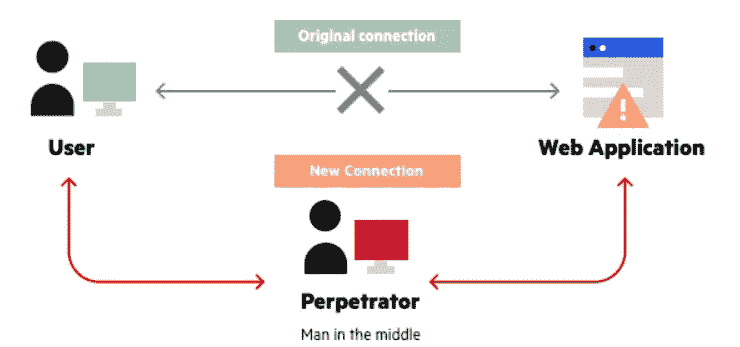
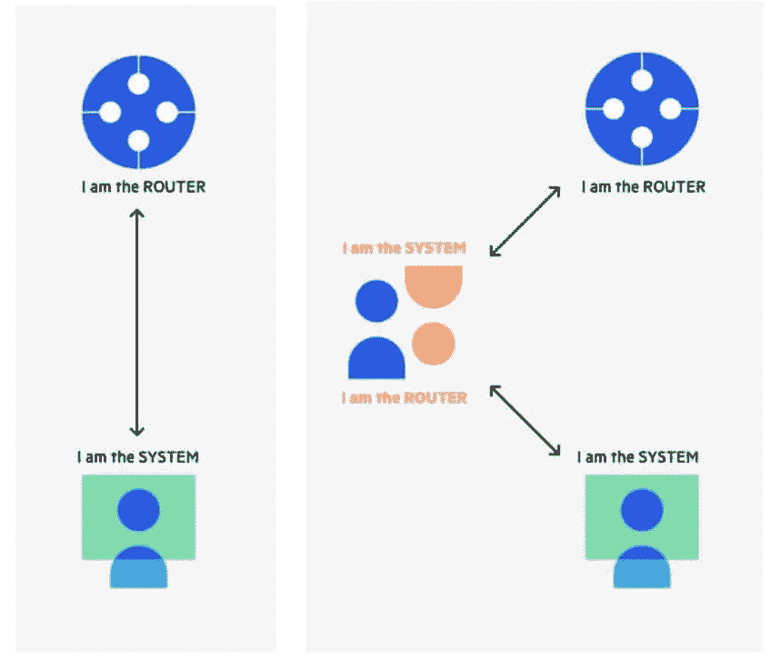
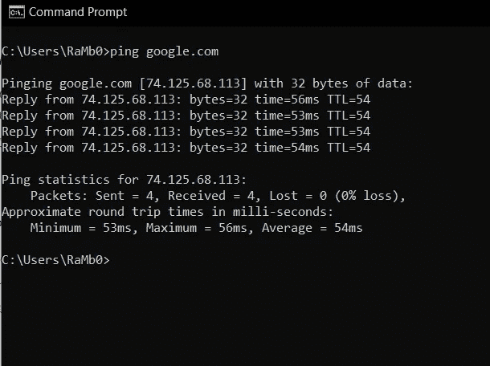
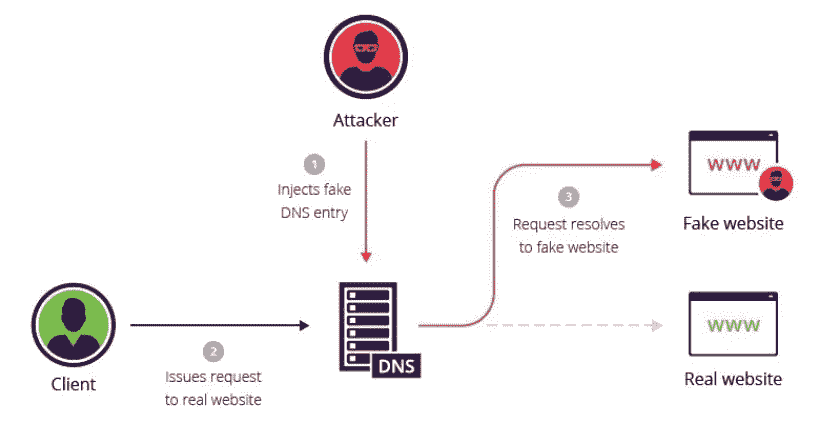

# 中间人(MITM)攻击(第 1 部分— ARP 中毒和 DNS 欺骗)

> 原文：<https://medium.com/nerd-for-tech/man-in-the-middle-mitm-attack-part-01-arp-poisoning-dns-spoofing-51ad724edd6b?source=collection_archive---------6----------------------->

(来源:[https://blog . malware bytes . com/101/2018/07/when-three-not-a-crowd-man-in-the-middle-mitm-attacks-explained/](https://blog.malwarebytes.com/101/2018/07/when-three-isnt-a-crowd-man-in-the-middle-mitm-attacks-explained/))

大多数年轻人玩网络游戏对吗？有一次，我们玩了一个游戏，叫做“**谷仓伙伴**”。在那个游戏中，我们有自己的农场，一个小房子，还有其他动物，像马、牛等等。我们还可以养一只狗来保护农场，防止其他玩家从我们的农场偷东西。那时是上学时间，所以我的一些朋友家里没有电脑。所以他们把他们的脸书证书给了一个有电脑的朋友，并说每天打开他的 Facebook，在游戏中喂狗，否则狗会睡觉。在这里，他怎么能保证他的朋友不会看他的信息，或者像他的朋友一样给别人发短信。你认为这是黑客行为吗？技术上没有。

# MITM

这代表中间人攻击，它发生在攻击者将自己置于用户和应用程序之间的通信中，监听或模仿其中一方，使其看起来好像正在进行定期信息交换。这种攻击通常是窃取个人信息，如账户信息、卡信息和凭证。大多数攻击都是针对要求登录的商业、金融网站。

MITM 攻击(来源:[https://www . imper va . com/learn/application-security/man-in-the-middle-attack-mitm/](https://www.imperva.com/learn/application-security/man-in-the-middle-attack-mitm/))

这是一种窃听攻击的形式，攻击者会中断正在进行的对话或数据传输。如上图所示，攻击者在将自己置于传输的“中间”后，伪装成真正的双方。这允许攻击者截取来自双方的数据和信息，同时还以可能不被发现的方式向真正的参与者提供恶意链接或其他信息。

MITM 攻击有几种类型，

*   ARP 缓存中毒
*   DNS 欺骗
*   IP 欺骗
*   无线网络窃听
*   会话劫持

让我们来讨论一些 MITM 攻击类型。

# ARP 缓存中毒

## **什么是** **ARP？**

ARP 代表**地址解析协议**。在局域网(LAN)中，它是一种将动态互联网协议(IP)地址链接到固定物理机器地址(MAC 地址)的协议。这个过程非常重要，因为 IP 和 MAC 地址长度不同，所以必须进行适当的转换，以便系统可以相互识别。现在主要使用的是 32 位长的 IPV4，但是 MAC 地址是 48 位长的。所以最终，ARP 会将 IP 地址(32 位)转换为 MAC 地址(48 位)，反之亦然。ARP 工作在数据链路层和网络层之间，因为数据链路层主要考虑 MAC 地址，而网络层涉及 IP 地址。

## ARP 是如何工作的？

当数据包到达主机网关时，映射过程开始，数据包提示 ARP 选择与 IP 地址匹配的 MAC 地址。主机将在它的 ARP 缓存中查找该特定 IP 地址的预先存在的转换，如果它不存在，则 ARP 过程将发生。

假设有 PC1 和 PC2，PC1 想要向 LAN 网络中的 PC2 发送数据。为此，PC1 应该知道 PC2 的 MAC 地址，这是通过转换 PC2 的 IP 地址实现的。一旦获得 PC2 的 MAC 地址，PC1 会将其存储在 ARP 缓存中(以便在需要时快速加载)。然后它发送数据包。

> ARP 仅将 32 位 IP 地址转换为 48 位 MAC 地址，因此仅适用于 IPv4。但是当数据包使用 IPv6 发送时，将使用邻居发现协议。[点击此处](https://ieeexplore.ieee.org/document/8022867)了解更多关于 NDP(邻居发现协议)的信息

## ARP 中毒

(来源:[https://www . imper va . com/learn/application-security/ARP-spoofing/](https://www.imperva.com/learn/application-security/arp-spoofing/))

这是攻击者拦截目标用户和路由器之间的通信的地方。为此，攻击者必须能够访问特定的网络。在数据传输过程中，需要考虑三件事情，例如 IP 地址(逻辑地址)、子网掩码(IP 的范围)和默认网关(作为特定网络端点的路由器的 IP 地址)。假设在包含路由器 a 的网络中有 PC1(目标)和 PC2(攻击者)。在这种情况下，假设 PC1 想要在 web 上搜索某个内容，那么它会通过询问哪台设备具有特定的网关地址来广播默认网关及其 IP 地址。除了路由器 a 之外，所有设备都会忽略。现在，该路由器会将其 MAC 地址发送给 PC1 进行确认，因此 PC1 会将该地址存储在其 ARP 缓存中。因此，PC2 知道 PC1 想要连接互联网，因为它广播了该消息。现在，PC2 可以清除目标的 ARP 缓存，因为它已经从广播消息中知道了 PC1 的 IP 地址。(有特定的工具可以发送伪造的 ARP 响应，如 Arpspoof 或 Driftnet ),因此 PC2 会在删除 PC1 的 APR 缓存后发送其 MAC 地址。因此，现在 PC1 会认为 PC2 的 MAC 地址就是路由器的地址，并会更新 ARP 缓存。现在，所有网络流量都将发送到 PC2，PC2 会将其发送到路由器，反之亦然。因此，从技术上讲，PC1 不知道 PC2 处于网络流量的中间并监控着一切。

可以通过检查 ARP cahe(在 cmd 中键入`apr -a`，它将显示 IP 和 MAC)来识别。因此，如果有两个 IP 地址有相同的 MAC 地址，那么这意味着系统受到了攻击。使用双向 SSL 也是防止这种攻击的方法之一。如果它们是双向 SSL，攻击者即使得到消息也无法解密。下一种方法是使用静态 ARP，这样可以防止设备监听 ARP 响应。我们所要做的就是定义静态 ARP 映射。我们还使用**包过滤**解决方案，通过检查是否有任何冲突的源信息来识别中毒的 ARP。

# DNS 欺骗

## 什么是 DNS

它代表**域名系统**，这就像你手机里的联系人列表，把人们的名字和电话号码对应起来。每个网站都有其唯一的 IP 地址，所以当网络人口增加时，人们不可能记住所有网站的 IP 地址。这就是 DNS 的用武之地。这将使网站的唯一 ID 与人类可读的域名相匹配。有几个网站，我们可以购买域名，这样我们就可以分配到我们自己的网站。举个例子，

如果你想知道谷歌的 IP 地址，有几种方法可以找到，我给你看一个。你所要做的就是打开你的命令提示符并键入`ping google.com`，你将得到如下所示的内容，

正如你所看到的，当我用 IP 地址 ping 谷歌 it 响应时(这是一个动态的 IP 地址，DNS 将为谷歌提供大量的 IP 地址。OS 和浏览器会不时地打乱列表)。

## DNS 是如何工作的？

加载网站时涉及四个主要 DNS 服务器，

*   **DNS recursor** —它负责通过 web 浏览器接收来自客户端的查询，并发出附加请求。
*   **根域名服务器**——负责将人类可读的域名翻译成 IP 地址。基本上，这是对其他特定位置的参考。
*   **TLD 域名服务器** —这是顶级域名服务器，这是搜索特定 IP 的下一步。这包含主机名的最后一部分。(在[www.google.com，](http://www.google.com,)顶级域名服务器是“com”)
*   **权威域名服务器**—这是进行搜索的最后一个位置，如果特定服务器可以访问所请求的网站，那么它会将 IP 地址返回到发出初始请求的初始位置(DNS recursor)的主机名。

假设用户在浏览器中请求 google.com(只是一个例子)。该请求将首先到达通常由互联网服务提供商操作的**递归解析器(DNS 递归器)**。所以这个会跟**根服务器对话。然后根服务器将与世界上所有其他知道 TLD DNS 细节的 DNS 服务器连接。最重要的是，有这么多的服务器支持根服务器，所以 DNS 将确保用户发送到离他很近的服务器。所以每个 TLD 域名服务器都存储 TLD 和二级域名。因此，TLD 域名服务器将返回域名服务器的 IP 地址。现在域名服务器将从递归解析器获得查询，DNS 服务器知道整个域的 IP 地址。现在，google.com 将被发送到递归解析器。所以现在浏览器将能够加载递归解析器给出的 IP 地址。最后，浏览器可以通过请求该网站来显示该网站的内容。**

现在让我们看看使用 DNS 的攻击是如何发生的，

(来源:[https://www . imper va . com/learn/application-security/DNS-spoofing/](https://www.imperva.com/learn/application-security/dns-spoofing/))

DNS 欺骗也称为 DNS 缓存中毒。在这里，攻击者将更改 DNS 记录，这有助于将在线网络流量重定向到看起来像原始网页的虚假网站。假设攻击者创建了一个伪造的脸书登录页面并修改了 DNS 记录。他还制作了一个食物折扣海报样本作为点击诱饵。所以现在当客户看到海报时，他可能想得到折扣。因此，当他点击它重定向到虚假网站，这是一个 fb 登录页面在这种情况下。因此，客户将输入他的用户名和密码，脸上带着灿烂的笑容赎回折扣。现在，通过假冒网站，攻击者将能够获得用户名和密码，有时攻击者会再次将其重定向到官方网页以再次登录。通常我们不介意对吗？我们可能会想，哦，也许我输入了错误的密码，并再次尝试，显然这将打开他的个人资料，因为这是官方页面。

因此，如果你是第一次访问一个网站，这些细节将被保存在您的本地 DNS 缓存中，您可以通过在命令提示符中键入`ipconfig/displaydns`来查看。

## 我们如何防止 DNS 欺骗

*   使用 **DNS 欺骗检测工具** —这将在发送响应之前扫描所有传入的数据。
*   使用**域名系统安全扩展(DNSSEC)** —这是一组协议，充当 DNS 的额外一层，并监控其数据交换。
*   使用**端到端加密(SSL)**
*   作为用户，如果你发现任何可疑的东西，我们可以刷新 DNS 缓存。要刷新 DNS 缓存，只需转到 CMD 并键入`ipconfig/flushdns.`
*   使用 VPN 也更好，因为它提供了一个已经使用端到端加密的专用 DNS 服务器。

这就是了，我将在接下来的文章中讨论其余的攻击和预防方法。

# 参考

 [## 什么是 MITM(中间人)攻击| Imperva

### 一个男人在中间(MITM)攻击是一个通用术语，指的是当一个犯罪者将自己置身于…

www.imperva.com](https://www.imperva.com/learn/application-security/man-in-the-middle-attack-mitm/)  [## 中间人攻击:教程和示例| Veracode

### 虽然拦截正在进行的传输的核心概念保持不变，但有几种不同的方法…

www.veracode.com](https://www.veracode.com/security/man-middle-attack)  [## 什么是地址解析协议| Fortinet

### 地址解析协议(ARP)是连接不断变化的互联网协议(IP)的协议或过程…

www.fortinet.com](https://www.fortinet.com/resources/cyberglossary/what-is-arp)  [## IPv6 邻居发现协议规范、威胁及对策综述

### 邻居发现协议(NDP)是互联网协议第 6 版(IPv6)套件的核心协议。背后的动机…

ieeexplore.ieee.org](https://ieeexplore.ieee.org/document/8022867)  [## 什么是 ARP 欺骗| ARP 缓存中毒攻击解释| Imperva

### 地址解析协议(ARP)是一种协议，它使网络通信能够到达网络上的特定设备

www.imperva.com](https://www.imperva.com/learn/application-security/arp-spoofing/) 

[https://www.cloudflare.com/learning/dns/what-is-dns/](https://www.cloudflare.com/learning/dns/what-is-dns/)

 [## 域名系统(DNS)的工作原理- Verisign India

### 域名系统(DNS)是互联网的核心部分，提供了一种匹配名称的方法(您所在的网站…

www.verisign.com](https://www.verisign.com/en_IN/website-presence/online/how-dns-works/index.xhtml)  [## 什么是 DNS 欺骗？-key dn 支持

### 当特定的 DNS 服务器的记录被恶意“欺骗”或更改以将流量重定向到…

www.keycdn.com](https://www.keycdn.com/support/dns-spoofing)  [## 什么是 DNS 欺骗|缓存中毒攻击示例| Imperva

### 域名服务器(DNS)欺骗(也称为 DNS 缓存中毒)是一种攻击，在这种攻击中，被篡改的 DNS 记录被用来…

www.imperva.com](https://www.imperva.com/learn/application-security/dns-spoofing/)