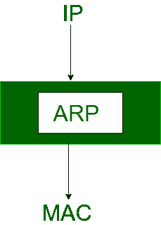
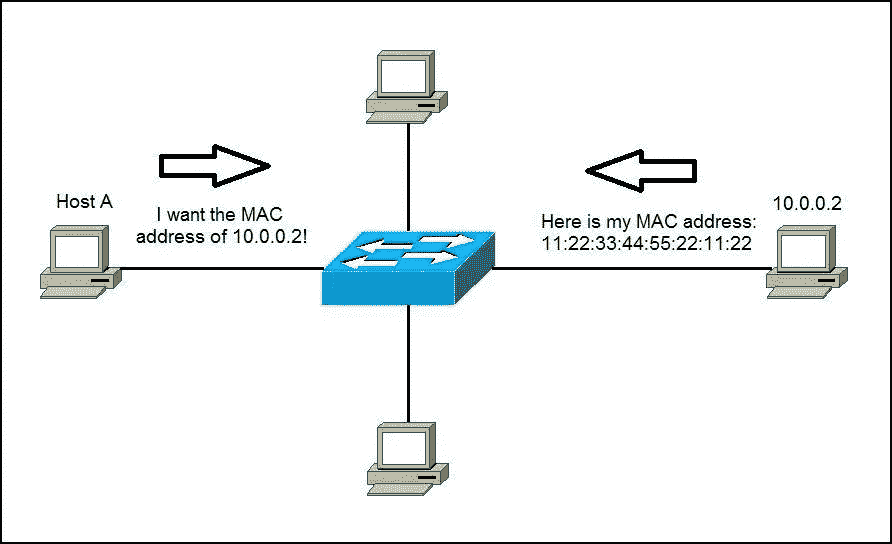
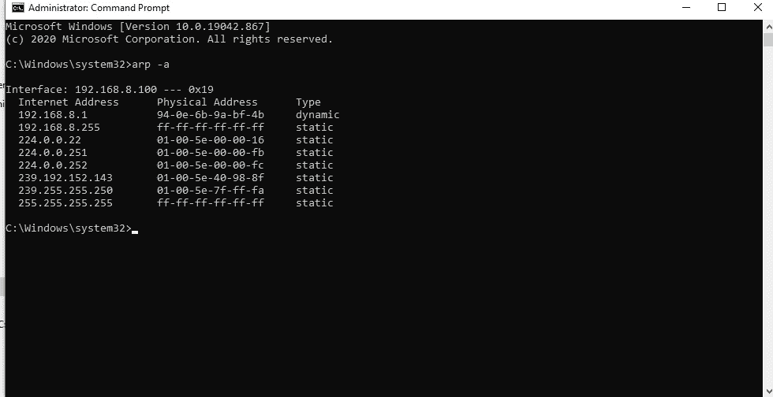
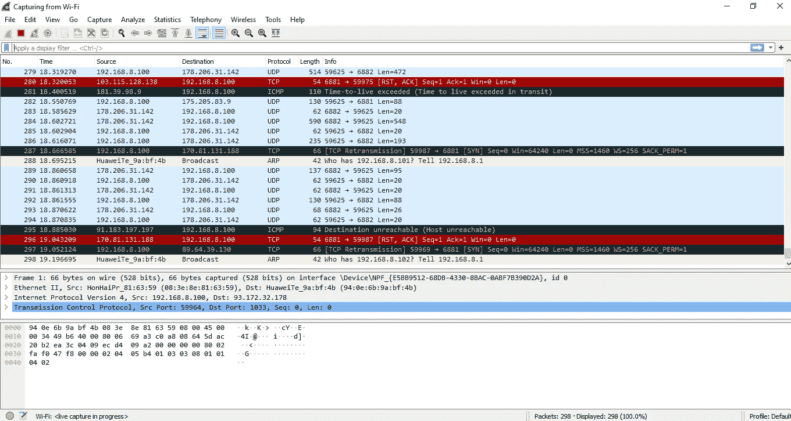

# 中间人(MITM)攻击和 ARP 中毒

> 原文：<https://medium.com/nerd-for-tech/man-in-the-middle-mitm-attacks-arp-poisoning-e9ca951c6140?source=collection_archive---------6----------------------->


这个博客会给你关于 MITM 攻击和 ARP 中毒的信息。那么让我们看看什么是中间人(MITM)攻击和一些常见的类型。

# 中间人(MITM)攻击


中间人(MITM)攻击是一种网络攻击，在这种攻击中，攻击者将自己置于用户和应用程序之间的对话中，或者窃听并中断两个人之间的现有对话或数据传输。因此，我们可以简单地说，中间人攻击是一种窃听攻击，攻击者中断双方之间现有的对话或数据传输。所以基本上中间人攻击需要三方。受害者，受害者试图与之交流的实体，以及中间的人，他拦截了受害者的交流。

攻击者可能会破坏数据或窃取个人信息(登录凭证、帐户详细信息、信用卡号)或破坏通信。网络罪犯可以利用 MITM 攻击以各种方式控制设备。一些常见的 MITM 攻击是，

1.  ARP 中毒
2.  DNS 欺骗
3.  电子邮件劫持
4.  HTTPS 欺骗
5.  IP 欺骗

# 什么是 ARP 协议



在了解 ARP 中毒之前，我们需要了解 ARP 协议。所以首先让我们了解一下 ARP 协议。**地址解析协议(ARP)** 是一种通信协议，用于发现与 OSI 模型的网络层地址(IPv4 地址)相关联的数据链路层地址(媒体访问控制(MAC)地址)。所以如果你对 OSI 模型没有任何概念，你可以通过下面的链接来了解它。我已经发表了一篇关于 OSI 模型的文章。

[](https://dilshanukwattage.medium.com/an-overview-of-http-and-osi-model-492837e83ec8) [## HTTP 和 OSI 模型概述

### 什么是 HTTP

dilshanukwattage.medium.com](https://dilshanukwattage.medium.com/an-overview-of-http-and-osi-model-492837e83ec8) 

大多数计算机程序/应用程序使用逻辑地址(IP 地址)来发送/接收消息，然而实际的通信是通过物理地址(MAC 地址)**进行的。**所以目的是获取目的 MAC 地址，帮助与其他设备通信。这就是 ARP 发挥作用的地方。使用 ARP，我们可以获得特定 IP 地址的 MAC 地址。

# ARP 如何工作



当一台新计算机加入局域网时，它会被分配一个唯一的 IP 地址用于识别和通信。想象一下上图中主机一台设备要和 IP 地址为 10.0.0.2 的设备进行通信。那么 ARP 是干什么的呢？

ARP 向源网络的所有设备广播数据包。因此，实际的 IP 所有者将识别数据包，这意味着设备将 IP 地址识别为自己的 IP 地址，然后设备使用目的地的 MAC 地址来响应源地址。然后 ARP 更新缓存以备将来参考，并继续通信。

因此，ARP 缓存是地址解析协议条目的集合，这些条目是在将 IP 地址解析为 MAC 地址时创建的，以便计算机可以有效地与该 IP 地址进行通信。IPv4 以太网中的所有操作系统都有一个 ARP 缓存。每当主机请求 MAC 地址以便向 LAN 中的另一台主机发送数据包时，它都会检查其 ARP 缓存，查看 IP 到 MAC 地址的转换是否已经存在。如果是，则不需要新的 ARP 请求。如果转换不存在，则发送网络地址请求。当我们考虑 ARP 缓存的大小时，它是有限的，并且会定期清理条目以释放空间。所以 ARP 缓存表会定期更新。在清理过程中，未使用的条目以及与当前未开机的计算机通信的任何不成功尝试都会被删除。

# 什么是 ARP 中毒

**ARP 中毒也称为 ARP 欺骗**是一种中间人(MITM)攻击。在 ARP 中毒中，攻击者通过局域网发送虚假的 ARP 消息。因此，攻击者的 MAC 地址将与该特定网络上的另一台计算机或服务器的 IP 地址相链接。那么攻击者将会接收到针对该特定 IP 地址的任何数据，因为攻击者的 MAC 地址将会连接到该网络的真实 IP 地址。ARP 欺骗可以使恶意方拦截、修改甚至停止传输中的数据。

# 如何识别 ARP 中毒攻击

所以我们怎么知道我们被攻击了。因此，我们可以打开命令提示符(终端)并输入下面的命令。

```
**arp -a**
```

一旦你按下回车键，你会看到一些 IP 地址和 MAC 地址，如下所示。



所以在这里**如果你有两个不同的 IP 地址，但有相同的 MAC 地址(物理地址),那么你可以确认你受到了 ARP 攻击。**所以在上表中你看不到那样的东西。看看下面的图片。所以，如果你受到 ARP 中毒攻击，就会是这个样子。


因此，在大型网络中，您可以使用 Wireshark 来识别攻击者正在进行的通信类型并获取更多相关信息。Wireshark 是一款开源的免费网络数据包分析器，用于实时捕获和分析网络流量。



# 如何防范 ARP 中毒攻击

因此，让我们讨论一下如何防止 ARP 中毒攻击。这里有一些我们可以预防的方法，

**1。** ⁠使用虚拟专用网络

VPN 允许设备通过加密隧道连接到互联网。但是请记住使用付费的 VPN 服务，因为没有人会免费提供任何东西，里面有一些我们看不到的东西。所以请记住。VPN 使得所有的通信都被加密，对于 ARP 欺骗攻击者来说毫无价值。

**2。使用静态 ARP** ⁠

您可以为 IP 地址定义静态 ARP 条目，然后阻止设备侦听该 IP 地址的 ARP 响应。

**3。使用 ARP 检测工具**

当你专注于预防时，确保你有一个检测方法。因此，如果您愿意，您可以使用第三方检测工具，它将帮助您发现欺骗攻击何时发生，以便您能够阻止它。

**4。使用包过滤** ⁠

包过滤和检查有助于在中毒数据包到达目的地之前将其捕获。它可以过滤和阻止显示任何冲突源信息的恶意数据包。

所以我希望你获得了你的知识，对 MITM 攻击和 ARP 中毒有了一些了解，所以我会在接下来的博客中发表关于 DNS 欺骗的文章。所以保持联系。

# 参考

[](https://www.imperva.com/learn/application-security/arp-spoofing/) [## 什么是 ARP 欺骗| ARP 缓存中毒攻击解释| Imperva

### 地址解析协议(ARP)是一种协议，它使网络通信能够到达网络上的特定设备

www.imperva.com](https://www.imperva.com/learn/application-security/arp-spoofing/) [](https://www.geeksforgeeks.org/how-address-resolution-protocol-arp-works/) [## 地址解析协议(ARP)是如何工作的？- GeeksforGeeks

### 大多数计算机程序/应用程序使用逻辑地址(IP 地址)来发送/接收消息，然而…

www.geeksforgeeks.org](https://www.geeksforgeeks.org/how-address-resolution-protocol-arp-works/) [](https://searchnetworking.techtarget.com/definition/Address-Resolution-Protocol-ARP) [## 什么是地址解析协议(ARP)，它是如何工作的？WhatIs.com 的定义。

### 地址解析协议(ARP)是一个将动态互联网协议地址(IP 地址)映射到

searchnetworking.techtarget.com](https://searchnetworking.techtarget.com/definition/Address-Resolution-Protocol-ARP) [](https://us.norton.com/internetsecurity-wifi-what-is-a-man-in-the-middle-attack.html) [## 什么是中间人攻击？

### 中间人攻击就像偷听一样。当数据在计算机和服务器之间传送时，网络罪犯…

us.norton.com](https://us.norton.com/internetsecurity-wifi-what-is-a-man-in-the-middle-attack.html) [](https://www.imperva.com/learn/application-security/man-in-the-middle-attack-mitm/) [## 什么是 MITM(中间人)攻击| Imperva

### 一个男人在中间(MITM)攻击是一个通用术语，指的是当一个犯罪者将自己置身于…

www.imperva.com](https://www.imperva.com/learn/application-security/man-in-the-middle-attack-mitm/)