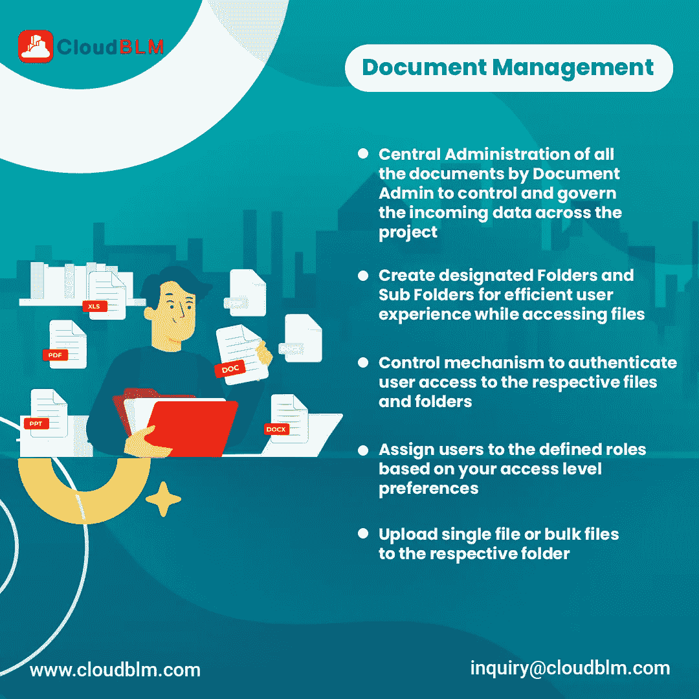
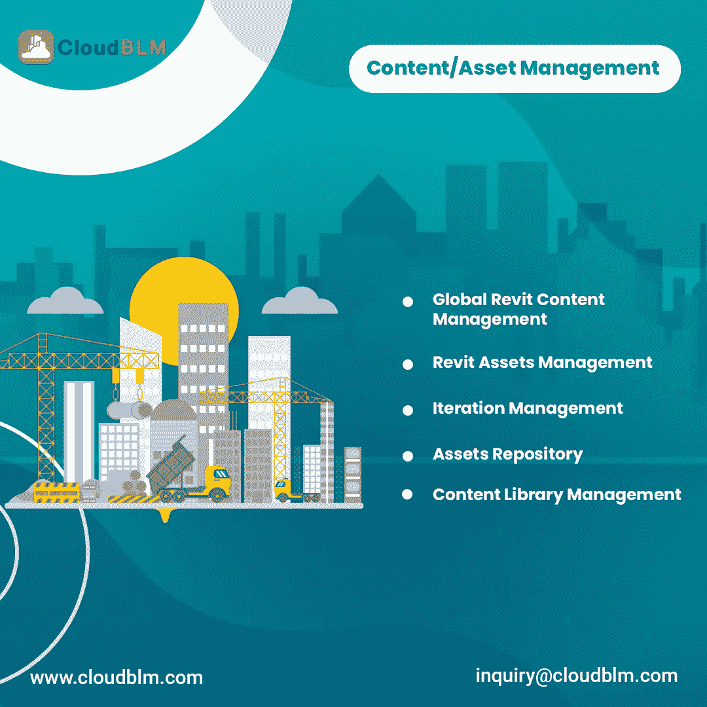
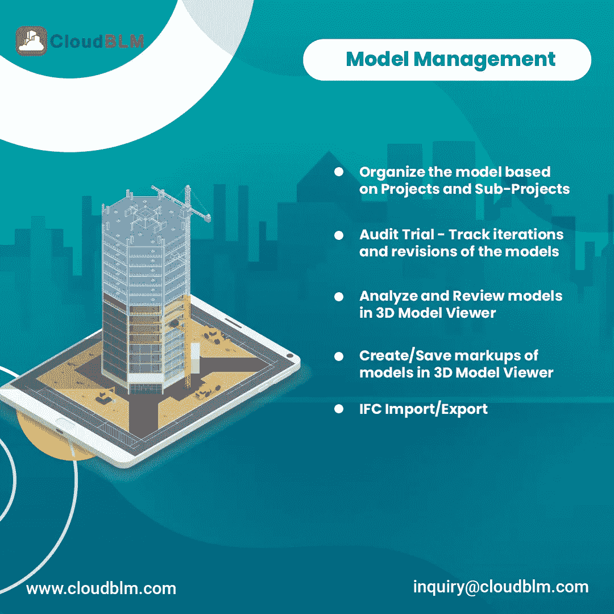
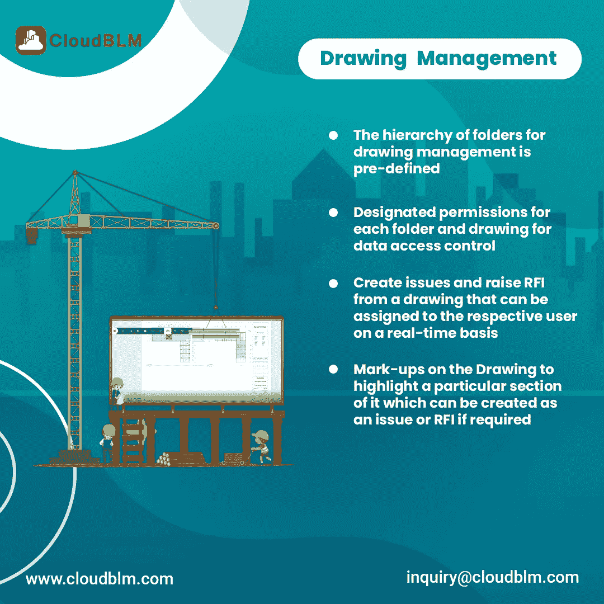

# 利用通用数据环境软件，轻松管理您的建设项目

> 原文：<https://medium.com/nerd-for-tech/manage-your-construction-project-without-troublesome-by-utilizing-common-data-environment-software-af1fa8575844?source=collection_archive---------14----------------------->

公共数据环境是四个关键模块的主管。此外，它还充当中央存储库，团队成员可以从任何地方访问文件或信息，并高效、透明地推动您的项目。

**这四个关键模块是:**

**文档管理**

**模特管理**

**图纸管理**

**内容/资产管理**

**例如:**

各行各业的人都参与了建筑工程。那么，没有协调，人们怎么能得到信息呢？这也是 cloudblm 提供建筑项目解决方案的原因。

通过通用数据环境软件，项目经理、工程师、建筑师、设计师和其他人可以从任何地方共享和访问信息、文件和设计。此外，它可以以高效和透明的方式推动项目。

**在建筑行业，有各种类型的构造如**

1.  商业建筑
2.  住宅建设
3.  购物中心建设
4.  工业建筑
5.  星球建设

每种类型的建设项目都有许多文档活动，如计划、设计、蓝图、文档共享、图形表示，

我们都很清楚，无论是小型还是大型的建设项目都拥有大量的数据。你认为手工处理数据容易吗？。不。此外，管理和保存数据

**例如:**

如果手动处理建筑项目工作(不使用任何软件),可能会错过一些重要方面，如几何数据、计划、测量等。

许多施工团队在有效处理施工数据方面存在巨大的瓶颈。因此，建设项目管理软件是高效、无缺陷地处理数据的最佳方式之一。用户可以在使用通用数据环境软件时体验到这一点。

**什么是常用数据环境软件:**

[通用数据环境软件](https://www.cloudblm.com/common-data-environment.html)是基于云的数字化平台，用于现代建设项目。此外，它还充当中央存储系统。不同的组织和人员可以在一个地方共享、访问任何东西，如计划、蓝图、文档、合同签纸。

众所周知，无论是小型还是大型的建设项目都拥有大量的数据。你觉得手动处理容易吗？

例如:

如果手工处理，建筑项目工作(不使用任何软件)有机会错过一些重要的方面，如几何数据，计划，测量和更多。

许多施工管理团队在有效处理施工数据方面存在巨大的瓶颈。因此，建设项目管理软件是高效、无缺陷地处理数据的最佳方式之一。用户可以在使用施工管理软件时体验到这一点。

用户可以设置层级选项，因此可以控制谁应该阅读机密文档。此外，没有负责人的允许，任何人都不能访问文件。

**开场白:**

**什么是文档管理？**

**文档管理软件如何为建设服务？**

文档管理就是有效地管理你的文档，用户可以很容易地以适当的方式分类文档。

**文档管理软件如何帮助施工**

如果您手动执行，那么施工文档活动可能是最耗时的活动。每个建设项目都有许多文档活动，如许可、合同文件、计划、蓝图、数据和信息。

众所周知，建设项目涉及各种文件活动。因此，手动处理所有事情并不容易，建筑行业也变得越来越复杂。

**施工文档软件是一个基于云的平台，用于现代施工项目。**用户可以根据文件夹对文档进行分类。

参与建筑项目的各种专业人员，如承包商、工程师、工艺师等等。

谁知道，如果所有人都在不同的国家，您如何组织项目文档呢？您如何在负责人之间共享文档？。

所以，这就是为什么 clouldblm 提供最好的施工文档管理软件，在一个地方管理所有文档。此外，可以从世界任何地方获取信息。

**内容:**

使用全局资产管理和 Revit 内容管理系统来维护和管理全局和项目资产(Revit 内容)及其相应的库，从而在整个项目中实施组织标准。

**大型建筑**

如果没有建筑计划，有可能建造一栋大楼吗？不是。建筑工程包括图纸、蓝图、项目计划等等。

建筑专业人员，如工程师、承包商、管理员和其他人员，将他们的绘图计划合并到一个地方。此外，他们可以在一个计划内弥补、分享和创造。

施工图管理软件赋予用户多种选择，如存储、方便地访问文档、数字化文档、可以设置层次；还有更多。

施工图管理工具可以轻松连接第三方应用程序。

**施工中的模型管理:**

从创作 CAD 工具发布的模型根据项目、子项目及其与父模型的关系进行组织

**施工中的图纸管理:**

图纸管理只是作为一个中央存储系统，用户可以保存所有类型的图像，如三维，二维和设计图像。

**列举建筑行业面临的挑战**

**少合作:**

建筑工作不是一个人的家务活。在施工过程中涉及到各种各样的人群。每项工作都依赖于每一个人，所以合作是施工项目中的一项重要工作。

1.  **时间浪费**
2.  **更耗费成本**

如果在建筑工程中合作较少，上述情况就会发生。

**数据效率降低或丢失数据:**

建筑工程的每个阶段都有大量与建筑相关的数据。如果遗漏了任何数据，进一步的施工过程就不容易了。如果没有建筑软件，处理数据是不容易的。

**没有合适的工作流程:**

各种团队参与施工中的各种工作。没有团队内部和其他团队之间的合作，就不可能在建筑项目中制定适当的工作流程。每个团队应该互相交流，然后才能理解进一步的过程。

**缺乏沟通:**

通信是建筑行业的一个重要方面。每次都记住所有的东西并不容易，比如尺寸、设计和蓝图。在施工管理软件的帮助下，任何对话都不会忘记(测量、设计和蓝图)。

**简单来说:**

如今各种类型的建筑正在发展。手动完成所有工作(测量、设计和蓝图)并不容易，也无法将所有人联系在一起

比如(工程师、建筑师、承包商)。因此，[建筑管理软件](https://www.cloudblm.com/index.html)的 cloudblm 为建筑行业提供了多种解决方案，例如可以在一个地方连接所有设备、数字化存储