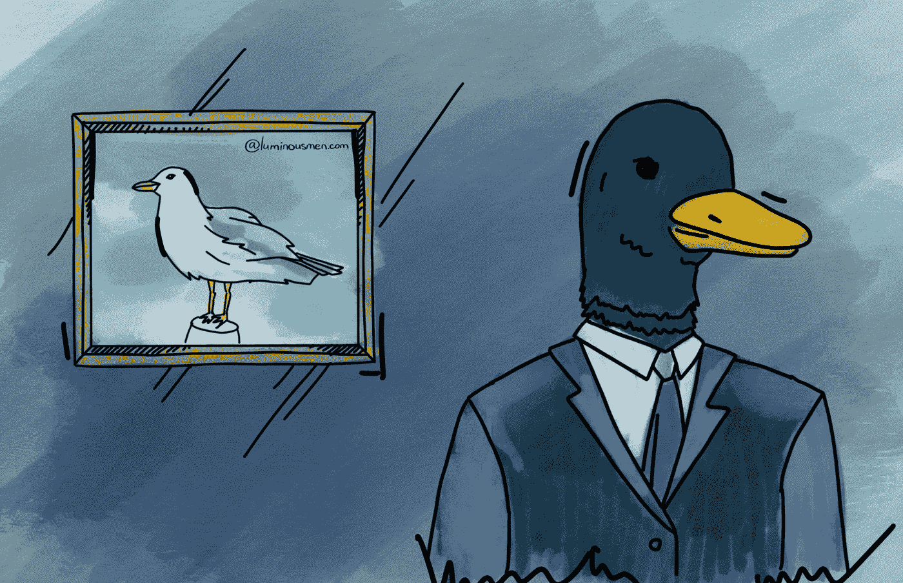

# 管理不是晋升

> 原文：<https://medium.com/nerd-for-tech/management-is-not-a-promotion-846d927c7a19?source=collection_archive---------1----------------------->

嘿！最近怎么样？我要抱怨一下。我能坐下吗？

你学习，你在职业阶梯上成长:初级、中级、高级，在一些公司——校长、建筑师。更高的水平显示了你的技术背景以及一定的知识广度，当然还有软技能。但是然后呢？当旧的任务不再那么令人兴奋时，一个工程师应该做什么，下一步该去哪里仍然不是…