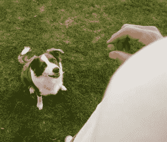

# 管理容器

> 原文：<https://medium.com/nerd-for-tech/managing-containers-c98844b1e43d?source=collection_archive---------2----------------------->

一个 **Docker 文件**是构建 Docker 图像的文本文件。该文本文件包含关于容器的特定说明。要构建 Docker 文件，请遵循以下步骤。

举个例子，

*来自节点* →来自 docker hub 中的官方节点映像(这将是基础映像)

*WORKDIR*T6*。/app* →这将是在映像上构建的所有容器的工作目录，即所有、运行、复制命令将在工作目录中执行

*运行 npm 安装* →安装 package.json 中的所有包

*复制* ***。******/*app***→将本地机器当前目录下的所有文件夹复制到容器工作目录(app)*

**CMD ['node '，' filename.js']* →该语句只有在我们创建一个**容器**时才会被执行。CMD 命令的主要目的是启动容器中所需的软件*

# *Docker 命令:我们在命令提示符中键入的内容:*

*创建图像→ *docker build* 。*

*任何带有— *help* 的命令都会给你所有相关命令的描述*

*我们基于图像构建容器→*docker run<image _ name>**

**docker 运行< image_name >* 将基于图像创建新的容器。*

*如果我们想启动一个现有的容器，该怎么办？*

*有两种模式——**附着**(显示 console.log)和**分离**模式(不显示 console.log)*

**docker 运行< image_name >* →创建新容器并打印所有 console . logs→默认为附加模式。*

**docker Run****-d****<image _ name>→*以分离模式运行容器——即容器打印的输出不可见，命令提示符/终端不等待容器停止。*

**docker start<container _ name>**

**docker start-a<container _ name>**

*之前我们可以通过-i 标志使它具有交互性(在终端中使用给定输入)*

# *删除图像和容器*

**docker ps* →列出所有正在运行的容器*

**docker ps -a* →列出所有运行和停止的集装箱*

**docker 图像* →列出所有本地存储的图像*

**docker RM<container _ name>*→移除集装箱*

**docker RMI<image _ name>*→删除图像*

*删除图像时需要注意的一点是，它没有任何容器，包括停止的容器*

# *命名图像和容器*

***我们给一个容器命名的时候叫做 name，给一个图像命名的时候叫做 Tag**。*

*标签由两部分组成— *名称:标签* →节点(名称):14(版本)*

**原载于 2022 年 5 月 3 日 https://www.pansofarjun.com***。***