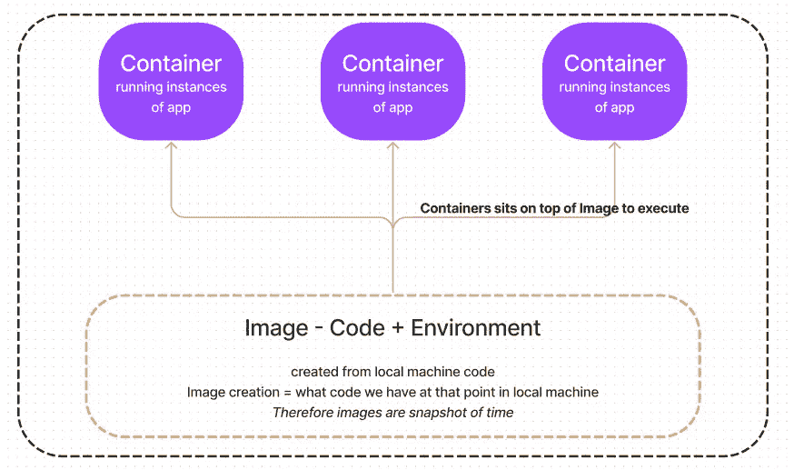

# 管理容器中的数据

> 原文：<https://medium.com/nerd-for-tech/managing-data-in-containers-bc49cefadab2?source=collection_archive---------0----------------------->

我们在本地机器上有代码和它的环境(例如节点依赖)。我们创建一个 docker 文件，并指示他们创建一个图像。映像是只读的，它在代码创建的特定时间拍摄代码的快照。因此我们需要容器来运行它们。永远记住这样一个事实，即*容器在它们上面添加了一个额外的层，而不是从它被创建的映像*中复制代码。



1.  一旦我们创建了**图像**和**容器**，它们将从本地机器中隔离出来
2.  图像是只读的——我们不能重写图像中的代码
3.  容器是图像之上的一个读写层

# 但是等等！容器中的书写层来自哪里？

答案来自代码本身。说一个类似登录表单和注册表单的代码。当我们通过提供详细信息注册到网站时，它将进入数据库并被保存。然后，它将创建一个像脸书注册定制的个人资料网址。

这里的问题是从永久数据演变而来的，因为到目前为止，我们已经看到了存储临时数据的方法，这些临时数据在创建容器时会派上用场并且是默认的。但是对于永久数据，我们需要另一种工具来填补丢失数据的空白。

这个工具必须找到连接到本地机器/主机的方法，因为这是永久性的。docker 领域中的这些工具被称为**卷和绑定挂载。**

> ***卷是主机硬盘上的文件夹，映射到 docker 容器内的文件夹。***
> 
> **因为是主机中的文件夹，所以是永久的*。与容器的连接使它们之间能够通信***

我们遇到的问题叫做**数据持久化。**有些数据需要在容器被移除后仍然可用。这是通过与本地计算机文件夹建立连接来完成的。

当你创建一个图像时，给指令 ***卷[“任意 docker 文件夹”]*** 。该指令将连接到只有 Docker 知道的本地机器文件夹。*因此，卷完全由 docker 管理，并与所有本地机器进程隔离*。

当你运行一个基于镜像的容器(有 volume 指令)时，就会创建一个 VOLUME，这个名字是 docker 自己随机给定的——这叫做**匿名 Volume** 。

因为匿名卷是由 docker 自动创建的，所以它被绑定到一个特定的容器，一旦该容器被删除，它就会自动删除( **— rm 命令**)

因为我们对跨所有容器的数据持久性感兴趣，所以我们需要找到一种方法，即使容器被删除，也不要删除卷。这是在**命名卷**的帮助下完成的。因此，在创建容器时，添加一个命令。即使在移除容器后，该卷仍会存在

*注意:命名卷和匿名卷都有用例*

由于卷完全由 docker 本身控制，我们的本地更改不会反映在 docker 文件系统中——无论如何，这都是我们想要的隔离。

但是在开发过程中，我们不能每次修改源代码都创建新的映像。这是在**绑定坐骑的帮助下完成的。**在此给出指令中的绝对路径，而不是卷名-

```
'-v [local machine folder]:['container folder that needs to be connected to local machine']
```

绑定挂载并不完全由 docker 本身控制，因为我们有意将本地机器文件夹附加到容器上。


来源:Docker 网站

**重述**:

*容器是读写的——它们在图像*上添加一个薄的 ***读写层***

**容器移除后容器数据无法持久化—* ***卷*** *为解决方案**

**容器无法与主机文件系统交互—* ***绑定挂载*** *是解决方案**

**原载于 2022 年 5 月 5 日 https://www.pansofarjun.com*[](https://www.pansofarjun.com/post/managing-data-in-containers)**。***