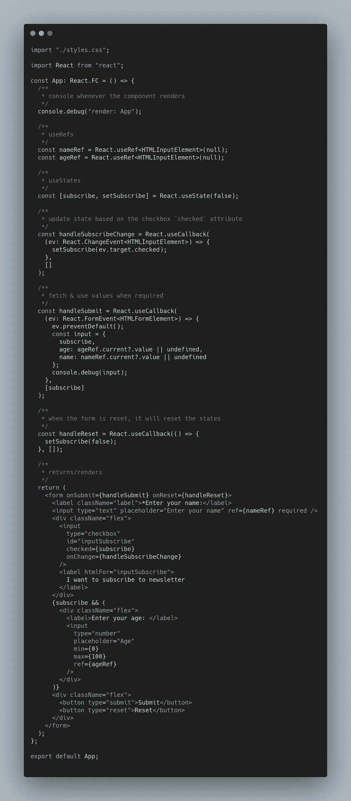

# 管理 ReactJS 中的表单和输入字段

> 原文：<https://medium.com/nerd-for-tech/managing-forms-and-input-fields-in-reactjs-c5cae53512f?source=collection_archive---------10----------------------->

安妮·斯普拉特在 [Unsplash](https://unsplash.com/s/photos/small-pot?utm_source=unsplash&utm_medium=referral&utm_content=creditCopyText) 上的照片

当您开始在 React 中创建大量依赖于表单和用户输入的网站时，您可能会遇到以下问题:当我们开始着手这个项目时，我们显然做到了。

*   呈现包含`Form`的组件变得很昂贵。
*   对第一个问题实施变通办法会使状态与`UI`不一致。

# 解决办法

## 说明

我们并不总是需要维护包含用户输入的值的状态，除非组件必须对它执行一个动作，或者您更喜欢称它为什么。维护输入字段的引用，并在需要时通过`refs`访问值，即在用户提交表单后，这就足够了，这将使包含`form`的组件仅在需要时重新呈现，我们将使 UI 和值保持一致。

` App` `component`

## 沙箱

您可以访问下面的沙盒，它是根据上述解决方案开发的。