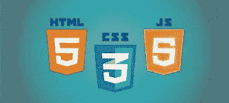
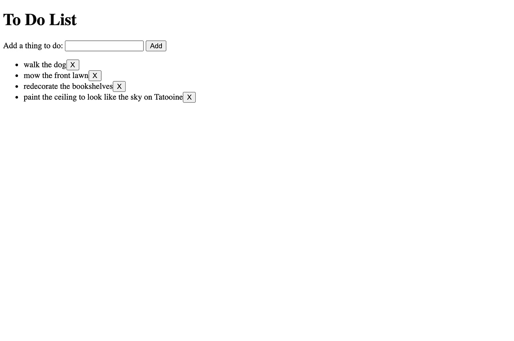
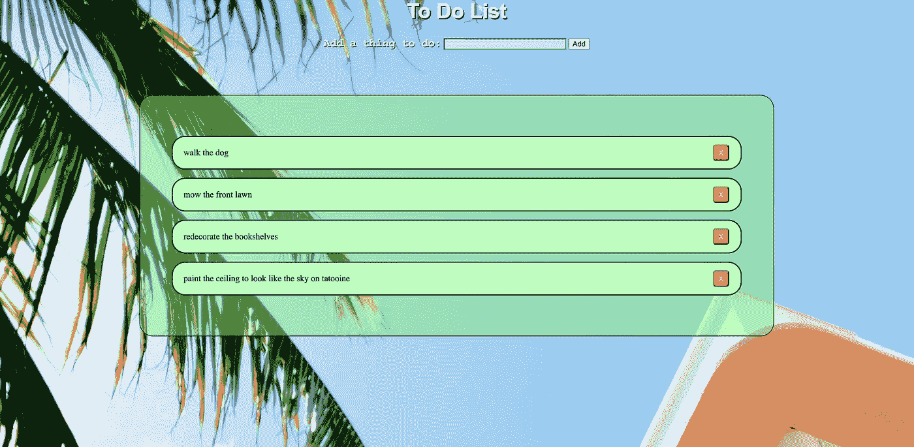
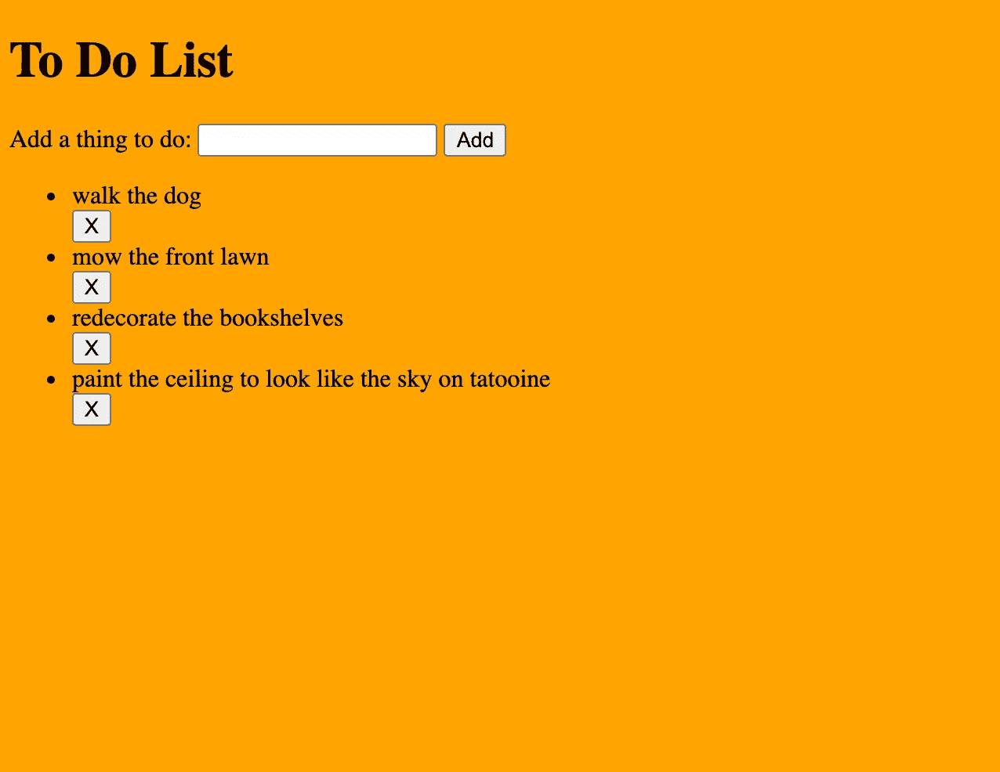
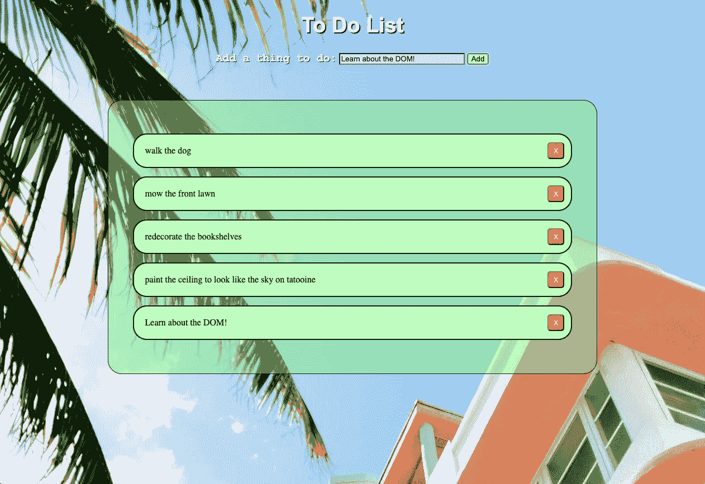

# 用 HTML、JavaScript 和 CSS 操作 DOM:第 2 部分

> 原文：<https://medium.com/nerd-for-tech/manipulating-the-dom-with-html-javascript-and-css-part-2-fa2498a4b163?source=collection_archive---------6----------------------->

在本条目的第 1 部分中，我们讨论了如何设置 boiler plate HTML 文件并使用 JavaScript 操作 DOM。这篇博客会稍短一些，主要关注一些基本的 CSS 功能和应用程序样式的最佳实践。我们将从对 HTML 做一些小的调整开始，但首先让我们谈谈 CSS。

## 级联样式表

CSS 或级联样式表描述了我们的 HTML 元素将如何在网页上显示。我们使用 CSS 选择器’从我们的 DOM 中选择特定的 HTML 元素，并对它们应用样式；这可以是颜色、字体大小、在页面上的位置，以及你能想到的任何东西。在这篇博客中，我们将把我们的 web 应用程序引自:

我们上次课程结束时的非风格化应用程序

对此:

完成造型

## 微小调整

在我们进入 CSS 之前，我们将对 JavaScript 和 HTML 做一些小的调整，以使样式更容易。我们将从 *index.js* 文件开始。

上次我们编辑 JavaScript 文件时，它看起来像这样:

旧的 JavaScript 文件

我们只是要在这里做一点小小的调整。请注意，在第 23 行和第 24 行，我们创建了一个“li”和一个“button”元素，然后我们将 button 元素追加到第 36 行的 li 中。这对于一个基本的应用程序来说很好，但是为了使添加样式更容易，将列表项和按钮包装在一个 div 中，然后添加 div 会更有意义。我们的 JavaScript 将如下所示:

更新列表功能已更新

除了添加 div 之外，我们还给每个元素一个 className 属性，这相当于给 HTML 标签添加一个类。如果用 HTML 写出来，应该是这样的:

li 和 button 标记呈现在 div 标记内

index.html 的档案还会有一个小的调整。我们将把*标签、输入、*和*按钮*标签包装在一个 div 中，并给它一个类“new-todo-container”。

# 导入 CSS

现在，我们已经对 HTML 和 JavaScript 做了一些调整，以使样式更加简单，我们可以开始样式化了！我们将在主目录中创建一个名为 *styles.css* 的文件，并将其导入到我们的 HTML 中。您可能已经猜到了。css 扩展名表示该文件的内容将用 CSS 编写。

为了将这个文件导入到 HTML 中，我们使用了一个*链接*标签来定义这个文件和一个外部源之间的关系。*链接*标签将有一个‘rel’属性，描述这个文档和我们链接到的文档之间的关系，在这种情况下，它将被定义为*样式表*。*链接*标签也有一个‘href ’,它是我们链接的文档的 URL， *styles.css* 。*index.html*文件现在应该如下所示:

链接标签放在 html 文档的头部

# CSS 选择器

在 CSS 中，我们使用选择器来指定我们想要在文档的哪个部分添加样式。你可以在这里查看所有选择器[的列表，但是我们将回顾一些最常用的选择器来帮助你开始设计你的应用程序。我们可以从最基本的选择器开始，通过 HTML 元素标签名称进行选择。](https://www.w3schools.com/cssref/css_selectors.asp)

查看我们的 HTML 文件，我们可以看到所有的元素都存在于*主体*标签中。通过输入“body”并添加花括号，我们使用 body 标签作为选择器来添加我们放在括号中的任何样式！让我们试试下面的代码来改变背景颜色。

这里用“背景”代替“背景色”也可以

刷新你的浏览器，你会看到变化！

请注意，由于我们之前对 HTML 和 JavaScript 进行了更改，应用程序的布局略有不同

但是，不建议按元素选择。虽然我们可能正在使用一个小的应用程序，但是大多数网页都非常大，并且有许多不同的组件，这些组件在许多不同的地方使用相同的元素。为此我们上课。正如我在这篇博客的第 1 部分中提到的，类允许我们轻松地选择在样式表中引用哪个 HTML 元素。通过在类名前面键入一个.(句点)，我们可以引用任何元素，而不管它的名称，只要它有那个类名。

这里我们引用了类名为“new-todo-container”的 *div* 元素，它包装了我们的标签、输入和按钮标签，用于添加 todo 元素。设置为“居中”的“文本对齐”属性将选定元素内的文本设置为在该元素的中心生成。由于 div 标签占据了屏幕的整个宽度，所以文本出现在屏幕的中间！

另一个常见的 CSS 选择器是“id”属性。要引用具有特定 id 的元素，只需在 id 名称前面加一个# (hashtag)。Id 选择器实际上比其他选择器优先，所以使用它们并不总是一个好主意。一般来说，使用类选择器是引用 HTML 样式的最佳方式。

# 特征

CSS 中的特殊性决定了什么样式将应用于什么元素，尤其是在样式重叠的地方。CSS 文件从上到下读取，使用最新的样式作为元素的优先级。如果我们有一个 CSS 文件，在第 5 行将所有的 *h1* 标记定义为蓝色，然后在第 25 行将它们重新定义为红色，那么将使用最近的声明，并且 *h1* 标记将为红色。

一般来说，这是非常标准的编程行为，但是假设你有一些 CSS 将 h1 定义为蓝色，但是也有一个类选择器将一个特定的类设置为红色。类似于以下内容:

在这种情况下，顺序并不重要，因为当类选择器出现在 HTML 元素上时，它将优先考虑

如果我们将类‘an-h1-tag’应用到一个 *h1* 元素，它将覆盖一般的 *h1* 标签样式，并且类选择的样式将优先。

另一种证明特异性的方法是堆叠或组合选择器。如果我们以来自应用程序的 HTML 为例，我们有一个 *div* ，它是一个*标签、输入*和*按钮*标签的父标签。我们没有用任何类型的类或 id 来指定标签，所以我们可以通过向所有的*标签*标签添加样式来指定一些 CSS，但是如果我们在应用程序中的其他地方使用了一个标签，并且想要应用不同的样式呢？通过组合包含标签的 *div* 和*标签*本身的选择器，我们可以指定我们只想向特定 div 中的特定标签添加样式。

字体粗细决定了字符的粗细

注意上面包含了一个空格。“新待办事项容器”和“标签”。空格表示下一个选择器将是第一个选择器的子级，如果我们要删除空格，这个 CSS 将寻找一个类为“new-todo-container”的元素，并且也是一个标签。我们可以根据需要将尽可能多的选择器链接在一起，您可能会发现在处理非常大的应用程序时这是非常必要的。

# 使用图片

如果你有一些 HTML 的背景知识，你可能熟悉使用 *< img/ >* 标签来显示来自 URL 的图片。但是如果我们想使用我们自己下载的图像呢？如果我们想将背景设置为图像呢？我们可以使用 CSS 来解决实现这一点。

首先，我们开始在项目的主目录中创建一个名为“assets”的文件夹。该文件夹的名称可以是您想要的任何名称，但是因为它将存储我们应用程序的“资产”，所以通常的做法是将该文件夹命名为“资产”。

为了找到我们想要的图片，我喜欢使用一个叫做[unsplash.com](https://unsplash.com/)的网站来获得免费的库存图片。我决定用我找到的一张照片，上面有美丽的蓝天和一棵棕榈树。我发现的另一个 CSS 技巧是，图像和配色方案给你的应用程序一种特定的感觉，这种感觉会产生情感反应。由于我们的应用程序是一个待办事项应用程序，我决定使用这个蓝天图像，因为它感觉积极向上，谁知道呢，它甚至可以激励用户完成他们列表上的更多项目！配色方案背后也有很多心理学，如果我说我知道所有这些，那是在骗你，但是如果你真的感兴趣，我建议你花时间去研究什么样的配色方案能唤起什么样的情感。

一旦我们下载了我们的图像，我们把它放在“资产”文件夹。现在，我们可以在应用程序的任何地方访问它！打开 *styles.css* 文件，我们已经有了一个普通橙色的背景。考虑到这相当难看，我们很乐意用下面的语法来改变它:

相对路径以.开头，表示当前目录，但是如果您在根目录中，也可以使用不带句点的“/”。这将取决于应用程序文件夹和文件的结构

在这里，我们将背景的高度设置为 100%，以覆盖整个 body 元素，我们的“背景”样式接受一个参数“url ”,该参数被传递到我们的图像的相对文件路径！这里的“背景尺寸”告诉我们，我们希望调整图像的大小，以覆盖 100%的身体高度，而不是保留下载时的原始尺寸。

# CSS 网格和 Flexbox

在 CSS 中还有两个非常流行和重要的属性我想在这里谈谈，它们是 CSS Grid 和 Flexbox。当我了解 CSS Grid 并开始将它整合到我的应用程序中时，我的设计能力显著提高了。Flexbox 和 Grid 都是 CSS 中的工具，有助于更容易地设计页面布局。我写了一整篇关于网格和 FlexBox [的博客，你可以在这里阅读](https://aidankmcbride.medium.com/css-tips-and-tricks-81d3c641428)，但是现在要明白 FlexBox 是一维布局，而网格是二维布局。

在我们的应用程序中，我们将使我们的待办事项列表成为一个网格，这样每个待办事项 *div* 都可以在网格中成为自己的一行。我们将 display 属性设置为 grid，然后为网格定义模板行和列，以指示我们需要多少行和列。在这里，我们几乎可以使用任何单位，像素或百分比或 em，但我们将使用“fr”单位。“fr”单位是整个空间的一部分，因此通过将一行设置为“1fr”并将第二行设置为“2fr”，第一行将是空间的 33.33%，而第二行将是剩余的 66.67%，即总网格空间的 1/3 和 2/3。r

list-stlye: none 删除呈现无序列表项时默认添加的项目符号

上面的论点让我们不知道最小行大小可以是 0，最大行大小可以是 1fr。我不打算在这个应用程序中应用所有的风格，这将是不必要的和漫长的阅读。许多 CSS 样式实际上是非常自明的，例如 grid-row-gap 决定了网格中每行之间的距离。基于此，您可能会推断出“网格-列-间隙”会实现什么…

# 包扎

我不会遍历我们应用程序的 CSS 的每一部分，而是将完成的文件贴上注释来描述一些不太明显的样式。我们在这里已经讨论了很多，最重要的是讨论了基础知识和一些概念，帮助您开始将 CSS 添加到应用程序中。很多 CSS 都是反复试验的，很多都是在尝试不同的想法，看看什么能让你的应用程序看起来更好。

完成的 CSS

我们完成的申请

如果你已经在博客上写了这么多，我想你对 Web 开发还是个新手，如果是这样的话，我给你的建议是先熟悉基础知识！获得使用选择器和嵌套选择器的经验，确保您的样式完全符合您想要的元素，并使用 Grid 和 Flexbox 构建应用程序的布局。有许多库可以用来设计你的应用程序，但是对于前端 Web 开发来说，对 CSS 及其工作原理的深刻理解是必要的。

当视频完成时，这个博客将链接到一个 YouTube 视频，该视频详细介绍了这里介绍的相同概念，并添加了我没有介绍的样式。欢迎在此留下反馈，提出问题，观看视频。一如既往，快乐编码！

*资源:*

 [## 特征

### 特异性是浏览器决定哪些 CSS 属性值与某个元素和……最相关的手段

developer.mozilla.org](https://developer.mozilla.org/en-US/docs/Web/CSS/Specificity)  [## 美丽的免费图像和图片| Unsplash

### 美丽的，免费的图片和照片，您可以下载并用于任何项目。比任何版税免费或股票…

unsplash.com](https://unsplash.com/)  [## CSS 选择器参考

### 组织良好，易于理解的网站建设教程，有很多如何使用 HTML，CSS，JavaScript 的例子…

www.w3schools.com](https://www.w3schools.com/cssref/css_selectors.asp)  [## CSS 教程

### CSS 是我们用来设计 HTML 文档样式的语言。CSS 描述了 HTML 元素应该如何显示。这个…

www.w3schools.com](https://www.w3schools.com/css/)