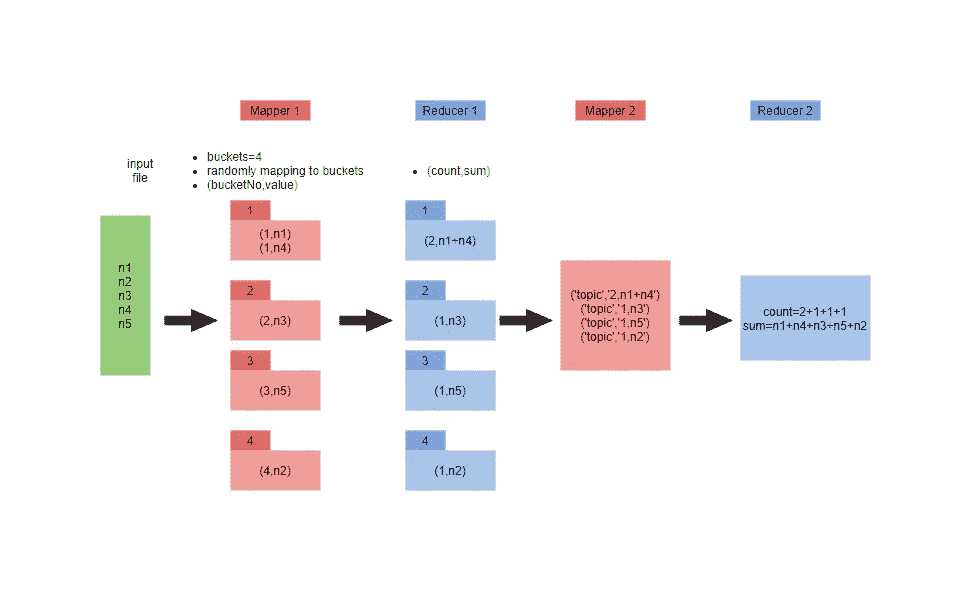
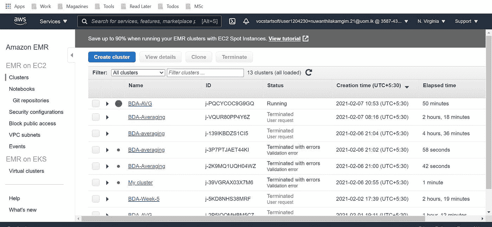
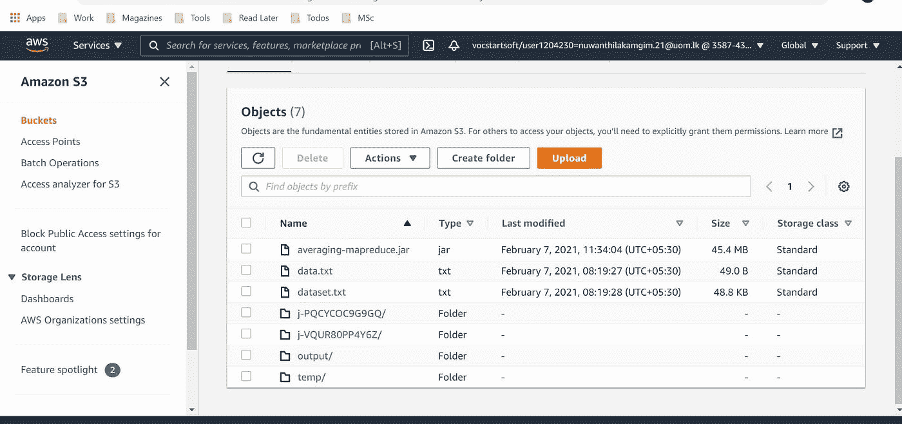
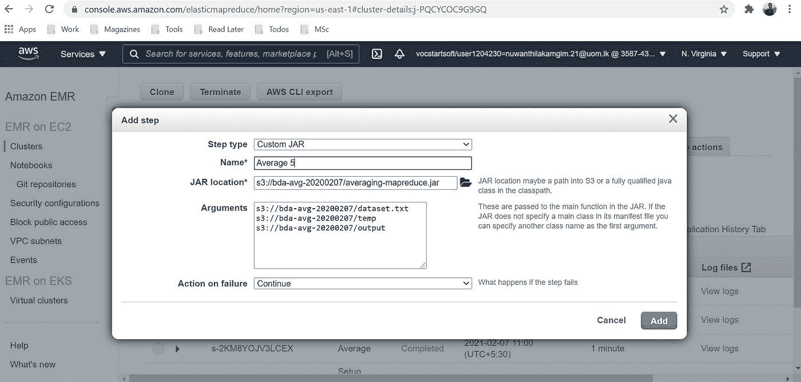
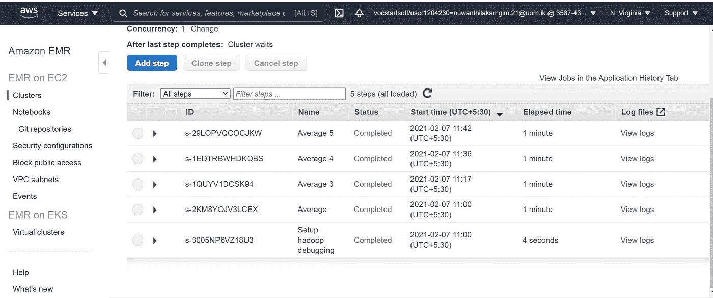

# MapReduce —让我们平均一下数字

> 原文：<https://medium.com/nerd-for-tech/mapreduce-lets-average-numbers-f3648cc7b006?source=collection_archive---------3----------------------->

在大数据环境中，MapReduce 扮演着重要的角色。它是大多数大数据框架的底层技术——如 apache hadoop、spark +许多其他平台。在本文中，我们不打算学习 MapReduce，而是解决一个大数据问题。

最近，我想在庞大的数据集中平均数字。举个例子，假设我有这样的数字，

1,2,3,4,…,18889008983748983484,…,170329034734838232803

因此，这可能是一个包含数 TB 数据的大数据集，我们无法在单台机器上处理它。那么我们如何尽可能简单地解决这个大数据问题呢？

## 最笨的解决方案(但是有效！)

最简单的方法是将每个数字映射到一个键，比如`(1,x)`，这里 x 代表数据集中的数字。因此，所有的数字将被加载到一个键和减速器将减少他们所有。这种方法并没有真正利用 MapReduce 框架的优势。这更像是简单循环平均算法的开销。所以我们必须找到一个技巧来将数据集分布到多个键上。

## 更好的解决方案

在这里，我们将跨多个键分布映射数据集，并使用多个归约器进行归约。

这是流程图。



这种方式将通过链接使用两个 MapReducers。

我们去实施吧。[点击此处查看完整代码](https://github.com/isurunuwanthilaka/map-reduce-average-java)

## 阶段 1 映射器

```
public static class PrimaryMap extends MapReduceBase implements Mapper<LongWritable, Text, IntWritable, IntWritable> {
        public void map(LongWritable key, Text value, OutputCollector<IntWritable, IntWritable> output, Reporter reporter) throws IOException {
            int max = 4;
            int min = 1;
            Random r = new Random();
            int t = r.nextInt(max) + min;
            IntWritable bucketNo = new IntWritable(t);
            IntWritable number = new IntWritable(Integer.valueOf(value.toString()));
            output.collect(bucketNo, number);
        }
}
```

在这种情况下，我们得到`(line no, number)`作为`(K,V)`，但是数字对我们来说是唯一重要的东西。为了分配这些数字，我们将这些数字随机分配到桶中(这里我们有 4 个桶)。换句话说，bucket no 表示该数据点的键。在这个例子中，我们有 4 个键。因此，`(K1,list(numbers)),...,(K4,list(numbers))`将在减速器阶段接收。

## 一期减速器

```
public static class PrimaryReduce extends MapReduceBase implements Reducer<IntWritable, IntWritable, IntWritable, IntWritable> {
        public void reduce(IntWritable key, Iterator<IntWritable> values, OutputCollector<IntWritable, IntWritable> output, Reporter reporter) throws IOException {
            int sum = 0;
            int count = 0;
            while (values.hasNext()) {
                sum += values.next().get();
                count = count + 1;
            }
            output.collect(new IntWritable(count), new IntWritable(sum));
        }
    }
```

在这里，我们累加这些数字，然后求总和并计数。所以`PrimaryReduce`会将`(count,sum)`返回为(K，V)。这些结果将被临时保存到文件系统中，这是多作业链的一个缺点。

## 第二阶段映射器

```
public static class SecondaryMap extends MapReduceBase implements Mapper<LongWritable, Text, Text, Text> {
        private Text one = new Text("One");
        public void map(LongWritable key, Text value, OutputCollector<Text, Text> output, Reporter reporter) throws IOException {
            output.collect(one, value);
        }
    }
```

现在，我们需要将所有数据放在一个键上，这样我们就可以轻松地计算平均值。简单。看看代码就知道了。

## 二期减速器

```
public static class SecondaryReduce extends MapReduceBase implements Reducer<Text, Text, Text, Text> {
        public void reduce(Text key, Iterator<Text> values, OutputCollector<Text, Text> output, Reporter reporter) throws IOException {
            Integer sum = 0;
            Integer count = 0;
            while (values.hasNext()) {
                String value = values.next().toString();
                String[] temp = value.split("\\s+");
                if (temp.length == 2) {
                    sum += Integer.valueOf(temp[1]);
                    count += Integer.valueOf(temp[0]);
                }
            }

            String avg = String.valueOf(sum.doubleValue() / count);
            output.collect(new Text("output"), new Text(avg));
        }
    }
```

现在`key="one"`将获得所有的`sum,count`，因此我们运行平均函数，将总数和计数相加，以获得最终总数和最终计数。平均值就是简单的`sum/count`，我们输出为`("output",average)`，所以这个结果将再次保存在 HDFS 中。

现在链接所有的函数，如在[Average.java](https://github.com/isurunuwanthilaka/map-reduce-average-java/blob/master/java-code/src/main/java/com/isuru/Average.java)

## 让我们在 AWS EMR 集群上进行测试。



该步骤成功完成后，检查 S3 中的`/output`文件夹以获得结果。

编码快乐！

*原载于 2021 年 4 月 16 日*[*https://isurunuwanthilaka . github . io*](https://isurunuwanthilaka.github.io/software-engineering/2021/04/16/avg-mapreduce)*。*