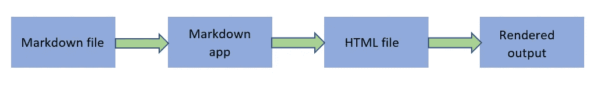

# 降价指南

> 原文：<https://medium.com/nerd-for-tech/markdown-guide-e7d14be3328c?source=collection_archive---------4----------------------->


Sofya 在 [Unsplash](https://unsplash.com?utm_source=medium&utm_medium=referral) 拍摄的照片

大家好！😃

通过这篇 Markdown 指南文章，我将讨论什么是 Markdown，为什么它很重要，它是如何工作的，以及在使用 Markdown 时你必须知道的主要功能。所以，继续读下去，对你搜索的题目有更好的理解！

**什么是降价销售？**

Markdown 是由 John Gruber 在 2004 年创建的，它已经成为有史以来使用最广泛的标记语言之一。Markdown 是一种简单的免费标记语言，您可以使用 Markdown 向纯文本文档添加格式化组件。此外，Markdown 可用于制作各种内容，包括笔记、演示文稿、文档、网站和简历。由于其适应性，Markdown 在作者、开发者和内容创作者中越来越受欢迎。
要指定哪些单词和短语在 Markdown 格式的文档中应该有明显的外观，您必须向文本添加 Markdown 语法。放心吧！🤗通过这篇文章，您将了解所有的基本语法。一些文本编辑器应用程序可以用来给一个纯文本文件添加 Markdown 格式元素。或者，您可以使用适用于 macOS、Windows、Linux、iOS 和 Android 的几种降价程序之一。此外，还有几个基于网络的工具是专门为减价写作设计的。您可能无法实时预览格式化的文档，具体取决于您使用的应用程序。但这不是问题。因为降价语法应该是可读的。这意味着即使没有渲染，Markdown 文件中的文本也可以阅读。

**它是如何工作的？**

在 Markdown 中编写时，文本存储在具有. md 或。降价扩展。然后，Markdown 格式的文件被转换成 HTML 或打印就绪的文档。为此，我们需要一个能够处理降价文件的降价应用程序。我们可以看到有几个应用程序，它们都将 Markdown 格式的文本转换为 HTML，以便可以在 web 浏览器中显示。

示例:[迪林杰](https://dillinger.io/)

Markdown 应用程序使用称为 *Markdown 处理器*(“解析器”或“实现”)的东西来获取 Markdown 格式的文本，并将其输出为 HTML 格式。此时，您的文档可以在 web 浏览器中查看，或者与样式表结合并打印出来。您可以在下面看到该过程的可视化表示。



降价过程

酷！😎现在我们可以使用降价语法了！

**降价语法。**

因为 Markdown 的目标是成为尽可能简单的标记语言，所以 Markdown 语法实际上是不言自明的。但是，在使用它之前，您必须先熟悉标记元素。为了方便起见，我将在这个主题下提到最重要的功能。

Markdown 使用特定的符号作为标记。我们来辨认一下。

*   **星号** : *
*   **连字符** : -
*   **下划线** : _
*   **圆括号**:()
*   **方括号** : []
*   **花括号** : {}
*   **周期**:。
*   **感叹号**:！
*   **磅(标签)** : #
*   **反勾**:`号
*   **反斜杠** : \
*   **波浪号** : ~
*   **管道** : |

**加粗**

在 markdown 中加粗文本是很容易的。你只需要星号或下划线。

```
__Bold text one__**Bold text two**
```

**斜体**

我们在创建文档时需要的另一个主要功能。同样，您可以使用星号或下划线将斜体功能应用到文本中。

```
_Italic text one_*Italic text two*
```

**斜体和粗体**

```
___Italic and bold text one___***Italic and Bold text two***
```

**删除线**

在 Markdown 中，波浪号连续使用两次，以删除文本。

```
~~This is a strikethrough text~~
```

**标题**

在 Markdown 中，英镑(标签)符号通常用于制作标题。它被插入到相应文本的前面，并带有一个空格。使用额外的井号使标题在层次结构中变得更小和更高。与 HTML 类似，这允许标题有多达六个级别。

```
# Heading 1
## Heading 2
### Heading 3
#### Heading 4
##### Heading 5
###### Heading 6
```

**段落**

当我们在 Markdown 中写普通的段落时，没有这样的区别。只有在需要分隔两段的时候，才应该在两段之间留一个空行。

**行情**

在 Markdown 中，使用 blockquote 元素来指示文本特定部分中的引号。大于号用于此目的(>)。

```
>This is the first quote section.>The section continues here.>This is the second type of the quote section.This section also continues in the second line
```

**列表**

要创建一个无序列表，有三种方法可以使用。使用加号、连字符或星号。

```
**+** Type one- Type two* Type three
```

对于有序列表，我们可以直接使用数字。

```
1\. One2\. Two3\. Three
```

Markdown 还为您提供创建清单的选项。这些出现在一个可以通过点击来激活的框中。创建列表时，您也可以添加勾号。为此，请插入方括号和 x。

```
[X] Option one[ ] Option two[ ] Option three
```

**表格**

管道允许在 Markdown 中绘制表格。每个细胞由一根管子隔开。要创建在视觉上不同于其余内容的标题行，可以用连字符突出显示相应的单元格。

```
| Column 1 | Column 2 || ------ | ------ || Content-column 1 | Content-column 2 || Content-column 1 | Content-column 2 |
```

**代码**

要在 Markdown 中将文本标记为代码，需要使用反勾号。

```
`This is a code`.
```

如果您的代码需要反勾号:

```
``This is a `code with backtick`.``
```

如果你把代码作为标签，使用下面的降价。

```
```shCode line oneCode line two```
```

**链接和图像**

当您需要将文本作为超链接放置而不显示原始链接时:

```
This is a [Link]([https://example.com/](https://example.com/)).
```

当你需要把原来的链接作为超链接。

```
<https://example.com>
```

与超链接一样，图像也可以添加到 Markdown 文档中。要添加图像，请以感叹号开始。然后，再次插入包含图像可选文本的方括号和包含图像 URL 的圆括号。

```
)
```

**评论**

当你需要添加一些你不想在浏览器中显示的注释时，你可以使用下面的语法。

```
[//]: # (This is a comment)
```

你想自己尝试以上所有的降价语法吗？赶快试试在线编辑器吧！

👉【https://dillinger.io/ 

希望你能从这篇文章中得到一些重要的东西。感谢阅读！💖

[](https://www.buymeacoffee.com/sachinibhagya)