# 市场篮子分析

> 原文：<https://medium.com/nerd-for-tech/market-basket-analysis-1c38613fdd6b?source=collection_archive---------3----------------------->

> 经常想知道你是如何来到一个预算严格的购物中心，但最终总是超出预算，因为你认为这很划算？

# 那我可能要说:“不是你的问题，是他们的问题。”👀


Viki Mohamad 在 [Unsplash](https://unsplash.com?utm_source=medium&utm_medium=referral) 上拍摄的照片

# **什么是购物篮分析？**

购物篮分析是一种**数据挖掘**技术，零售商通过更好地了解客户的购买模式来提高销售额。**它涉及分析大型数据集，如购买历史、揭示产品分组以及可能一起购买的产品。**

# **它在现实生活中究竟是如何运作的？**

购物篮分析是大型零售商用来发现商品之间关联的关键技术之一。**它的工作原理是寻找在交易中频繁出现的项目组合。换句话说，它允许零售商识别人们购买的商品之间的关系。**

为了更容易理解，可以从超市购物的角度来考虑购物篮分析。**购物篮分析获取交易级别的数据，该数据列出了客户在一次购买中购买的所有商品**。该技术确定购买的产品与其他产品的关系。

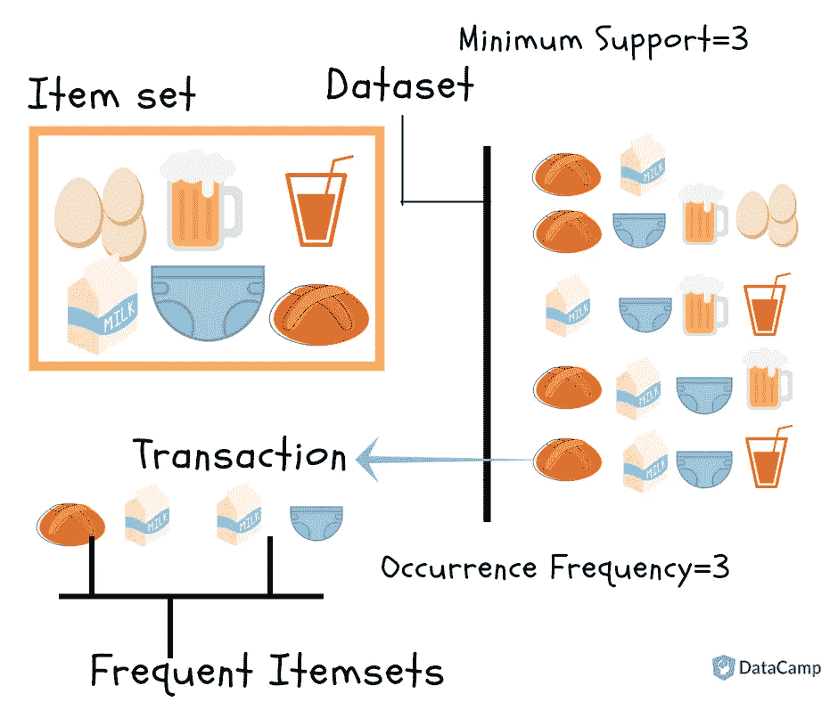

www.datacamp.com

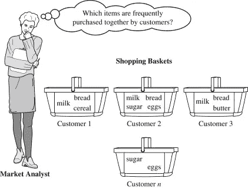

它按照上图中描述的频繁项集的逻辑工作。因此，看起来购买**牛奶**的人也购买**面包**，有趣的是，我们还可以看到购买**牛奶**的人也购买**尿布**(可能是因为他们可能有了孩子)。

# 那么如何发现这样的关联规则呢？

关联规则被广泛用于分析零售购物篮或交易数据，并且旨在基于强规则的概念，使用感兴趣的度量来识别在交易数据中发现的强规则。

> **“经常一起买”** →联想
> 
> **“买了这件商品的顾客也买了”** →推荐

然后，这些关系被用于构建包含所购买商品的 If-Then 规则的配置文件。例如:

```
If {A} Then {B} : A => B
```


首先，我们需要了解一些技术术语:

*   **支持**
*   **信心**
*   **抬起**

1.**支持度**:支持度是指项目集在数据集中出现的频率。数学上，

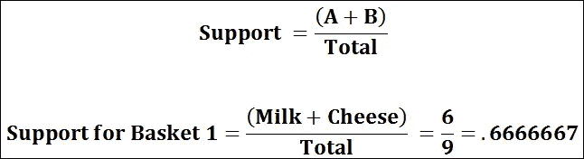

2.**置信度**:规则的置信度是包含{B}中所有项目的交易数和包含{A}中所有项目的交易数与包含{A}中所有项目的交易数之比。数学上，

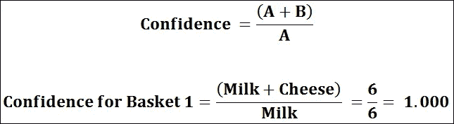

3.**提升**:第三个指标叫做提升或提升比率，是信心与预期信心的比率。预期置信度是置信度除以 b 的频率。提升告诉我们一个规则在预测结果方面比一开始就假设结果要好得多。提升值越大，关联越强。简单地说，如果 X 和 Y 是独立的，规则的提升是观察到的支持与预期的支持之比。数学上，

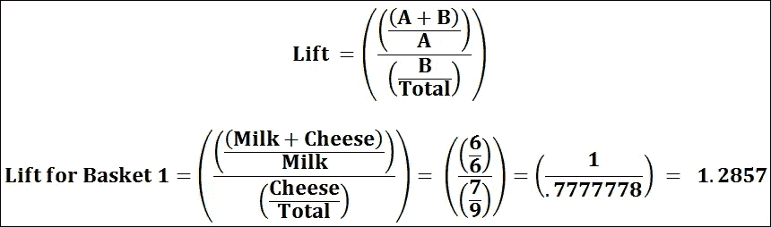

例如:

*   假设有 100 个客户。
*   其中 10 人买了牛奶，8 人买了黄油，6 人两样都买了。
*   买了牛奶= >买了黄油
*   **支持** = P(牛奶&黄油)= 6/100 = 0.06
*   **信心** =支持/P(黄油)= 0.06/0.08 = 0.75
*   **lift** =置信度/P(牛奶)= 0.75/0.10 = 7.5

现在，假设你很熟悉这些术语，我们可以从一些技术实现开始。

您可以在以下网址查看我的实际实现:

[https://github . com/Tirth-1999/Market-Basket-Analysis/blob/main/Market % 20 Basket % 20 Analysis % 20 using % 20 python . ipynb](https://github.com/Tirth-1999/Market-Basket-Analysis/blob/main/Market%20Basket%20Analysis%20Using%20Python.ipynb)

# 从导入执行购物篮分析所需的库开始(即 MBA)

*   我们将需要 Numpy 和熊猫进行基本的数据清理和数据准备
*   我们将需要 Matplotlib 来可视化市场分布
*   最后，我们需要安装“先验”库来执行 MBA

```
pip install apyori
```

## 让我们导入所有这些，并开始清理数据

```
import numpy as np
import pandas as pd
from apyori import apriori
import matplotlib.pyplot as plt
```

## 让我们来阅读由提供的 CSV 文件:

[](https://github.com/Tirth-1999/Market-Basket-Analysis/blob/main/groceries_final.csv) [## 1999 年第三次/市场篮子分析

### 所有关于市场篮子分析。通过创建一个关于…的帐户，为 Tirth-1999/市场篮子分析的发展作出贡献

github.comDon 别忘了分叉资源库](https://github.com/Tirth-1999/Market-Basket-Analysis/blob/main/groceries_final.csv) 

```
marketdf = pd.read_csv("groceries_final.csv",header = None)
display(marketdf.head())
print(marketdf.shape)
```

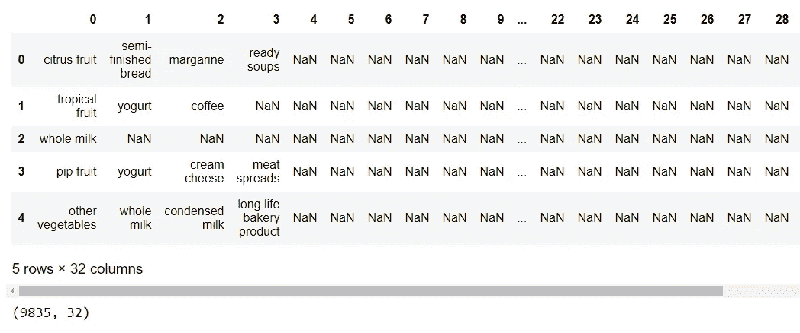

输入数据集

## 我们可以看到，数据集包含 9835 行事务，其中包括多个项目；

*   有些项目不太常见
*   其他的几乎在每笔交易中重复

因此，我们需要过滤掉事务数据集，以获得一些选择标准，如**事务的最小长度**和**更频繁的项目**等

解决方案:我们创建了一个名为“ **prune_Dataset** ”的函数；过滤掉无关紧要的数据

## 它需要的参数:

*   **input_df** :输入数据集
*   **长度 _ 交易**:要求最小长度
*   **total_sales_perc** :仅考虑达到给定销售百分比的项目，即市场份额

## 让我们创建一个函数来帮助我们修剪数据集。

```
def prune_Dataset(input_df= marketdf,length_trans = 2,total_sales_perc = 0.40):
    final_df2 = pd.DataFrame()
    for i in range(input_df.shape[0]):
        cnt = 0
        new_input = input_df.iloc[:][i:i+1]
        for j in range(new_input.shape[1]):
            if new_input.iloc[:,j].isnull().bool():
                if cnt <= length_trans:
                    break
                if cnt == 31:
                    final_df2 = final_df2.append(new_input,ignore_index=True)
            cnt+=1
    dict2 = dict()
    for i in range(final_df2.shape[1]):
        for j in range(final_df2.shape[0]):
            if final_df2[i][j] == "nan":
                continue
            elif final_df2[i][j] in list(dict2.keys()):
                dict2[final_df2[i][j]] += 1
            else:
                dict2[final_df2[i][j]] =1               
    total_purchase = sum(list(dict2.values()))
    market_sort = []
    for i,j in sorted(dict2.items(), 
                      key=lambda item: item[1], reverse = True):
        market_sort.append([i,j,float(int(j) * 100   /total_purchase)])
    new_market_df = pd.DataFrame(market_sort,columns=["item_name","item_count","item_perc"])
    new_market_df2 = new_market_df[new_market_df["item_name"].isnull() == False]
    new_total_purchase = sum(new_market_df2["item_count"])
    new_market_df3 = new_market_df2[["item_name","item_count"]]
    li = []
    for i in range(new_market_df3.shape[0]):
        li.append(float(new_market_df3["item_count"][i:i+1] / new_total_purchase))
    new_market_df3.insert(2,"item_perc",li,True)
    out_df = pd.DataFrame()
    for i in range(new_market_df3.shape[0]):
        if sum(new_market_df3["item_perc"].head(i)) > total_sales_perc:
            out_df = new_market_df3.head(i-1)
            break
    final_list = [final_df2,new_market_df2,new_market_df3,out_df]
    return final_list
```

## 哇哦。！那个功能很酷吧？

它为我们提供了一个符合过滤标准的输出数据集；所以让我们看看我们有什么。

```
final_market_list = prune_Dataset()
final_item_df = final_market_list[0]
display(final_item_df.head(20))
```

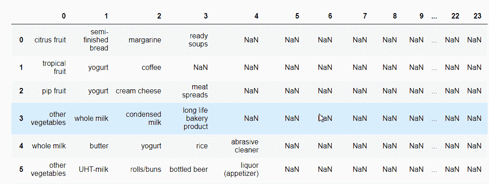

输出数据集

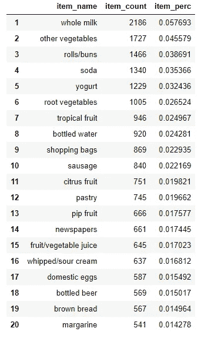

市场份额排名前 20 的售出商品列表

我们有这些数据框架:

1.  最终 _df2
2.  新 _ 市场 _df2
3.  新 _ 市场 _df3
4.  out_df

这些所有的数据帧包含相同的数据，但它们采用某种格式，如 **new_market_df2 包含*NaN*(即空值)，而 new_market_df3 不包含**之间的微小差异。因为我们将来可能需要这些数据集，所以我们也通过列表返回它们。

现在，我们还确保我们也执行一些探索性的数据分析，以便我们可以可视化一些销售。

1.  让我们来看一下“**项目计数**与“**项目名称**”的对比

```
plt.figure(figsize=[16,7])
plt.bar(output_df["item_name"],output_df["item_count"])
plt.ylabel("Item Numbers ->")
plt.xlabel("Item Names ->")
plt.xticks(rotation = 90)
plt.show()
```

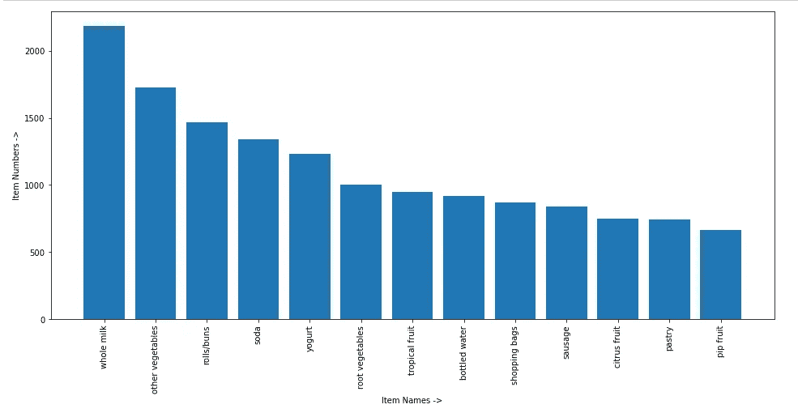

输出 df 仅包括 40%的最常见项目

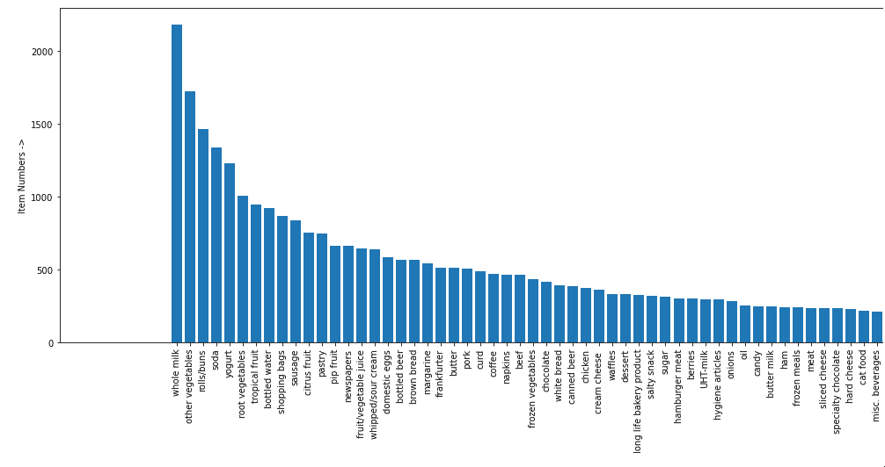

最终项目无空包括所有项目

2.让我们来形象化“**项目百分比**”与“**项目名称**”的对比

```
plt.figure(figsize=[16,7])
plt.bar(output_df["item_name"],output_df["item_perc"])
plt.ylabel("Item Percentage ->")
plt.xlabel("Item Names ->")
plt.xticks(rotation = 90)
plt.show()
```

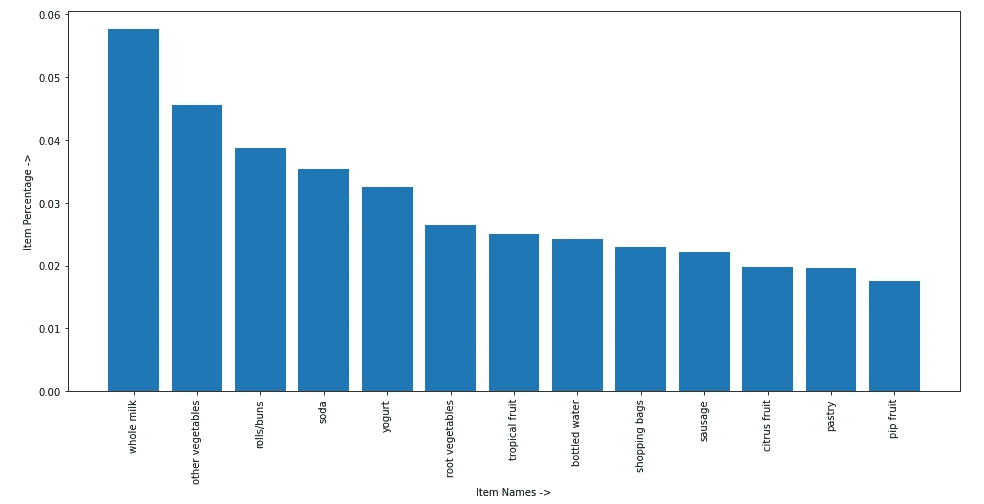

输出 df 仅包括 40%的最常见项目

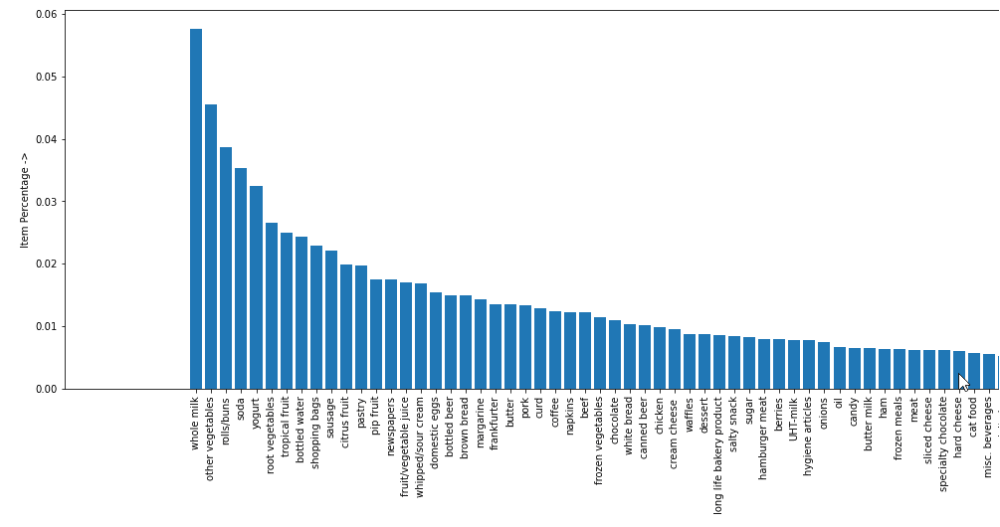

最终项目无空包括所有项目

这看起来很完美；现在我们有了过滤后的数据集，所以是时候**实际应用购物篮分析**了，但是为此，我们需要创建关联规则，所以让我们开始吧。

我们将使用先验库来生成这些关联规则，但是需要注意的是:

*   **只能处理列表列表形式的数据，不能处理 pandas 数据帧。**

```
records = []
row = final_item_df.shape[0]
col = final_item_df.shape[1]
for i in range(0,row):
    records.append([str(final_item_df.values[i,j]) for j in range(0, col)])
```

## 现在我们有了列表的列表，所以让我们生成一些关联规则

```
association_rules = apriori(records, min_support=0.0045, min_confidence=0.2, min_lift=3, min_length=2)
association_results = list(association_rules)
print(association_results)
```

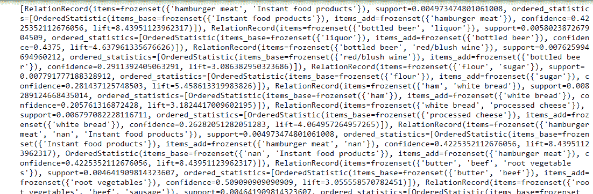

关联规则的输出

## 呜哇！！我们已经创建了关联规则，但是我们必须让它们看起来更好，所以我们必须格式化输出。

```
results = []
for item in association_results:
    pair = item[0]
    items = [x for x in pair]

    consequent = str(items[0])
    antecedent = str(items[1])
    support = str(int(float(str(item[1])[:7]) * 100000))
    confidence = str(item[2][0][2])[:7]
    lift = str(item[2][0][3])[:7]

    rows = (consequent,antecedent,support,confidence,lift)
    results.append(rows)

    final_result = pd.DataFrame(results,columns=['Consequent','Anticedent','Support','Confidence','Lift'])
```

## 最后，让我们看看关联规则是什么样子的

```
final_result= final_result.sort_values("Support",ascending=False, ignore_index=True)
final_result = final_result[(final_result["Consequent"] != 'nan') & (final_result["Anticedent"] != 'nan')]
display(final_result)
```

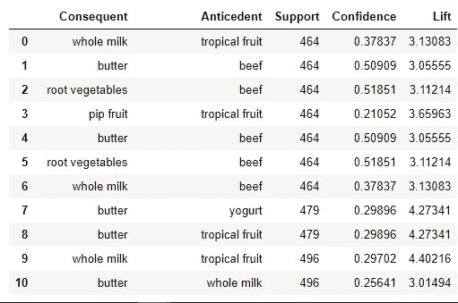

基于事务的 10 大关联规则

我们得到了 51 个关联规则的列表。所以让我们格式化它们

```
for i in range(final_result.shape[0]):
    print(f"Seems like people who are buying {final_result.Anticedent[i:i+1].values[0]} are more likely to buy {final_result.Consequent[i:i+1].values[0]}.")
```

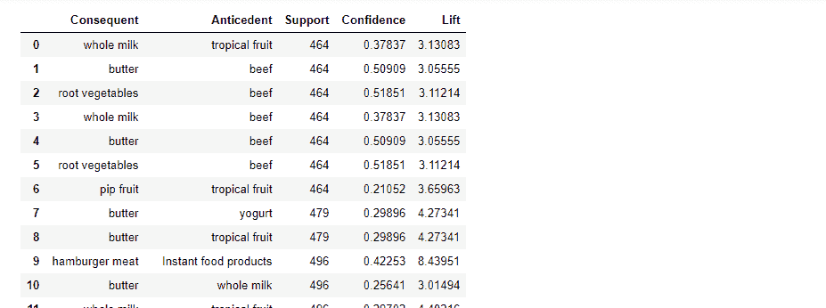

所有关联规则发现

# 在这些关联规则的帮助下，让我们执行市场篮分析

1.  **要么把它们放在一起，这样我们可以增加这家店的销售额**
2.  另外，我们还可以把它们放在极端的点上(只给那些最有信心的人)，并在中间放些其他东西，以吸引更多的购物者。
3.  我们可以在购买先行项目的基础上为后续项目制定折扣方案。

因此，在这些知识的帮助下，我们可以大幅提高我们的销售额。

# 购物篮分析的实际应用

当听到购物篮分析时，人们会想到购物车和超市购物者。重要的是要认识到，市场篮子分析还可以应用于许多其他领域。对于大多数互联网用户来说，市场购物篮分析的一个例子是亚马逊潜在感兴趣的产品列表。亚马逊告知顾客，购买了他们正在购买的商品的人也查看或购买了另一份商品清单。下面列出了市场篮分析在各种行业中的应用:

1.**零售**。在零售业中，购物篮分析可以帮助确定哪些商品是一起购买的，哪些是按顺序购买的，哪些是按季节购买的。这可以帮助零售商确定产品布局和促销优化(例如，结合产品激励)。卖汽水薯条或者汽水饼干有意义吗？

2.**电讯**。在电信行业，高流失率仍然是一个越来越令人担忧的问题，市场购物篮分析可用于确定客户正在使用的服务和购买的套餐。他们可以利用这些知识，将营销工作导向更有可能走上相同道路的客户。

3.**银行**。在金融领域(例如银行业)，购物篮分析可用于分析客户的信用卡购买情况，以建立欺诈检测目的和交叉销售机会的档案。

4.**保险**。在保险业，市场篮分析可用于建立档案，以检测医疗保险索赔欺诈。通过构建索赔概要，您可以使用概要来确定在指定的时间段内是否有多个索赔属于某个特定的索赔。

5.**医学**。在医疗保健或医学领域，购物篮分析可用于共病状况和症状分析，从而更好地识别疾病概况。它还可以用来揭示不同基因之间或环境影响和基因表达之间的生物学相关联系。

还有更多的领域需要介绍，但现在您已经很好地理解了。

# 结论

尽管是一个相对简单的算法，**购物篮分析是从你的客户那里发现隐藏模式的快速简单的第一步**。另一个 [Mlxtend](http://rasbt.github.io/mlxtend/) 是一个 Python 库，它为这类应用程序实现了 Apriori 算法。这里可以找到介绍教程[。](http://pbpython.com/market-basket-analysis.html)

# 现在你知道了，不是你，而是他们让你超出预算😂✌ ...

# 所以，下次你父母问你超出预算的原因，你知道该怎么回答了。😏💪😎享受吧。

希望这篇文章能给你带来一些好的东西。

```
if Good == “Yes”:
    print(“
           Please show your love through ,
           Claps 👏, 
           Love 🤍 and 
           sharing it to others 👩‍🤝‍🧑🏼
         ”)
else :
    print(“Would surely improve more to get to your satisfaction!”)
```

安静点。