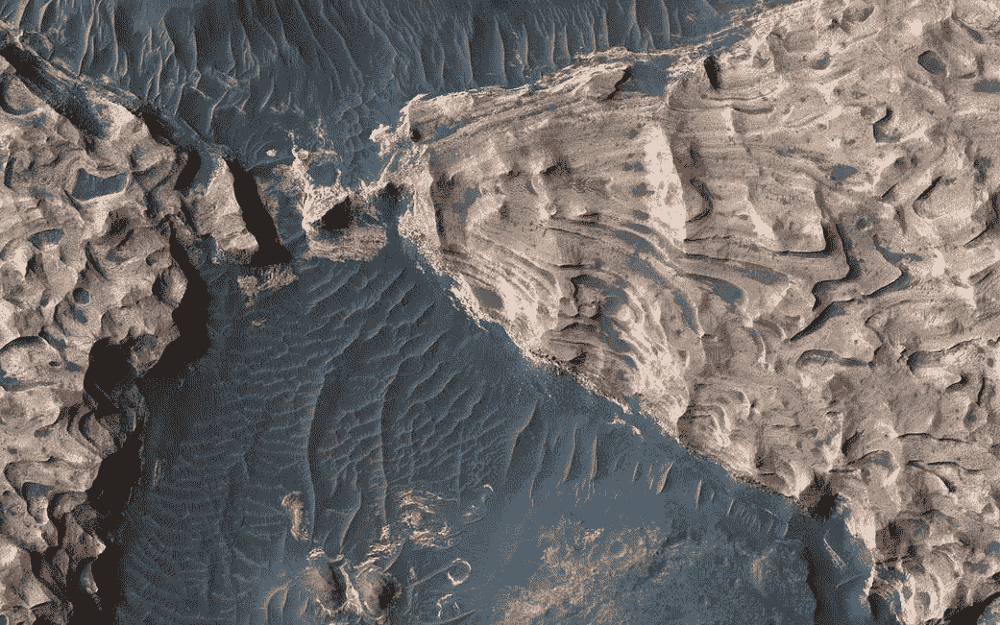

# 火星本月获得了五个新朋友，这是一个值得纪念的科学时刻。

> 原文：<https://medium.com/nerd-for-tech/mars-gains-five-new-friends-this-month-in-a-scientific-moment-to-be-remembered-1bc7e7140235?source=collection_archive---------13----------------------->

火星南部高地，来源: [NASA](https://www.nasa.gov/mission_pages/mars/images/index.html)

太空是孤独的，然而，由于 2020 年 7 月的一个合适的发射窗口，火星将在这个月接收五个新朋友！(2021 年 2 月)

你可能已经听说过美国宇航局的毅力漫游者，但你知道毅力在船上有一个偷渡者吗？