# 使用 Seaborn 掌握 Python 中的数据可视化

> 原文：<https://medium.com/nerd-for-tech/mastering-data-visualization-in-python-using-seaborn-cbe542ecdad0?source=collection_archive---------6----------------------->

想象一下，给你一个包含某个组织过去 10 年销售额的电子表格，要求你找出销售额最高的一年和销售额最低的一年:

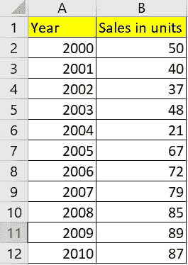

从这里，你可以浏览所有的数字，并推断 2009 年销售额最高，2004 年销售额最低。

但是，现在看一下相同数据的图形表示:

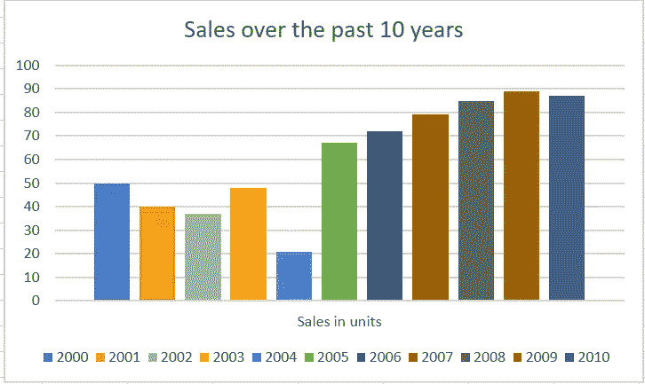

现在是不是变得更容易，更快地推断出同样的答案，我们之前已经得到了答案。大脑解读条形的颜色和高度比解读一串数字更快，推断答案也更快。

在上面的场景中，我们只处理了 10 个销售年度，而在现实世界中，我们处理的是巨大的电子表格，以及数百万个这样的数字，这对于大脑来说是一项困难而乏味的工作，难以跟上海量数据的步伐。如果呈现数据的图像版本，人类的眼睛和大脑会变得更加容易和舒适，大脑可以更快地从中得出见解和结论。这构成了现代数据分析的核心基础:从数据中发现见解，回答问题，并严格使用数据驱动的方法来推动业务。因此，数据可视化构成了数据分析不可或缺的支柱。

当谈到数据可视化时，有太多的选项可供选择:一个简单的条形图可以帮助我们根据相应的高度区分数据点，或者一个简单的饼图可以帮助我们了解不同数据点相对于彼此的比例。选择哪种可视化，完全取决于我们正在处理的数据的类型，更重要的是，我们试图从数据中回答什么问题，即我们希望我们的数据以什么方式说话！

有多种平台使我们能够管理数据并从中创建有凝聚力的图形视图，通过在很短的时间内创建信息丰富的图表，帮助我们更好地探索和理解我们的数据。Python 有自己内置的、非常丰富的数据可视化库，名为 ***Seaborn*** ，它有一个出色的可视化调色板，我们可以用它来从我们的数据中获得洞察力。

Seaborn 建立在另一个统计库 ***Matplotlib*** 的基础上，形成了 Python 在机器学习领域被广泛用于分析庞大数据集的重要基础。

Seaborn 提供了不同种类的图表和可视化，我们需要选择一个最能描述我们的数据的图表，并针对我们试图得出的答案。在本文中，我们将探索 Seaborn 提供的一些最重要和最常用的图，这些图广泛用于数据分析和机器学习领域。

….

## 数据点之间存在什么样的关系？…关系图:

很多时候，当我们第一次接触一个数据集时，我们倾向于找出不同特征之间存在什么样的关系:如果一个特征的值上升，另一个特征的值会下降吗？它们之间有什么有意义的联系吗？

*relplot()* 是最常用的 seaborn 函数，它帮助我们可视化特征之间的统计关系，创建有启发性和易于理解的图，可以解释复杂和庞大的数据集。

relplot()有两种类型:默认类型是散点图，第二种是折线图。

**散点图:**

当两个变量都是数字时，使用散点图。它描绘了两个变量的联合分布，即两个变量如何一起变化，并帮助我们了解它们之间是否有任何关系。

让我们使用 tips 数据集来理解散点图。

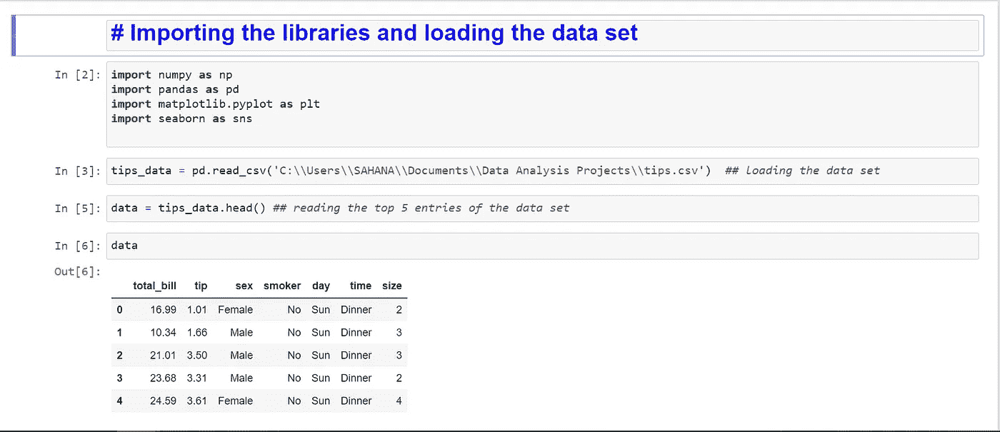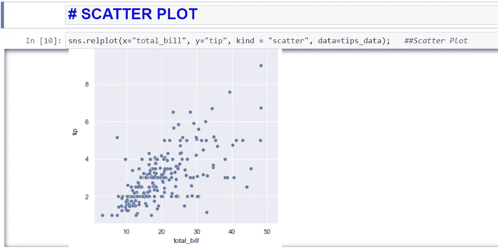

散点图显示总账单和小费金额如何一起变化

如果我们浏览小费数据集中的数字，我们将很难快速回答小费和顾客的总账单之间是否存在任何关系。散点图很容易地向我们表明，这两个变量之间存在着很强的正相关关系:随着账单总额的增加，小费的数额也趋于增加。

通常散点图以二维绘制，但是我们可以通过使用调色板为第三个变量添加第三维。“色调”参数允许我们这样做。例如，我们可以使用“吸烟者”作为第三个变量，然后散点图将看起来像这样:

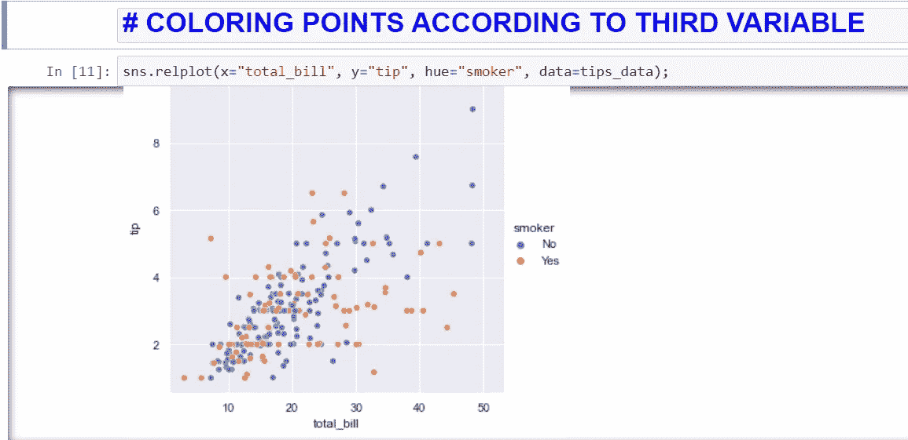

散点图显示总账单和小费之间的关系，根据“吸烟者”进行着色

上面的图做了同样的工作，额外的功能是根据顾客是否吸烟来给点着色。

我们甚至可以为第三个变量使用不同类型的项目符号，以获得更全面的视图。“样式”参数允许我们这样做。

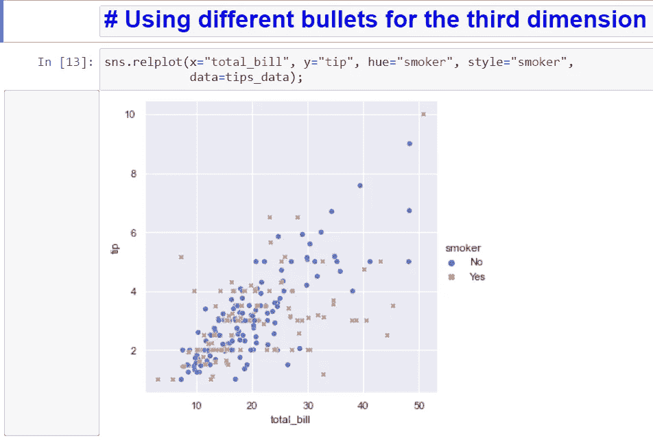

**线条图:**

就像散点图一样，折线图也是一种关系图。当我们想要直观显示一段时间内的数据趋势时，可以使用折线图。这可以通过直接使用 lineplot()函数或使用 relplot()函数并将种类强制为“line”来实现。

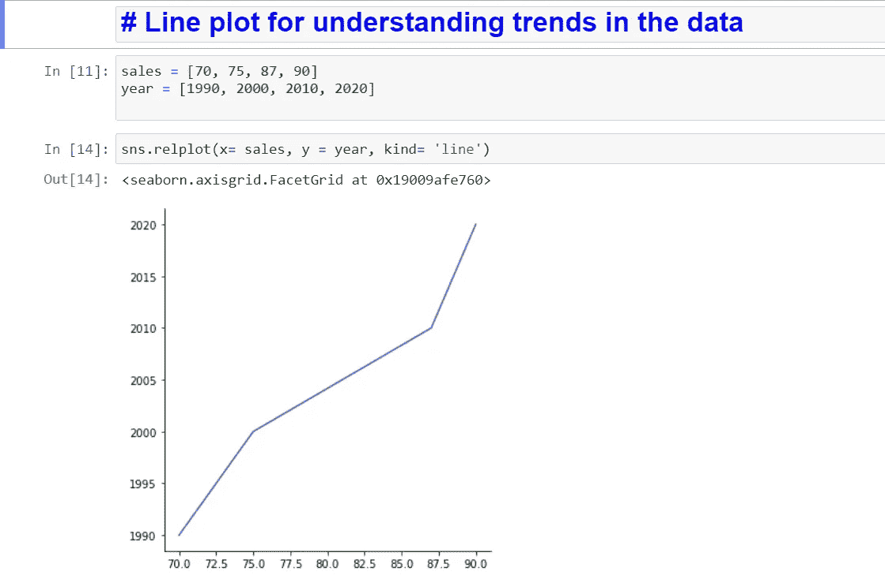

从这个线状图中，我们很容易理解这些年的销售趋势。通过扫描一个大数据集的数据，这变得很难理解，这个数据集包含了过去 100 年的数百万个数据。那时，这种描述时间序列数据的折线图就派上用场了。

我们还可以通过在列中加入第四个变量来显示多重关系。例如，我们可以在小费数据集中，在两个不同的时间:午餐和晚餐，看到总账单与小费的关系。在这里,“时间”成为第四个变量，它将两个图以列的形式分开。“col”参数有助于我们实现这一目标。

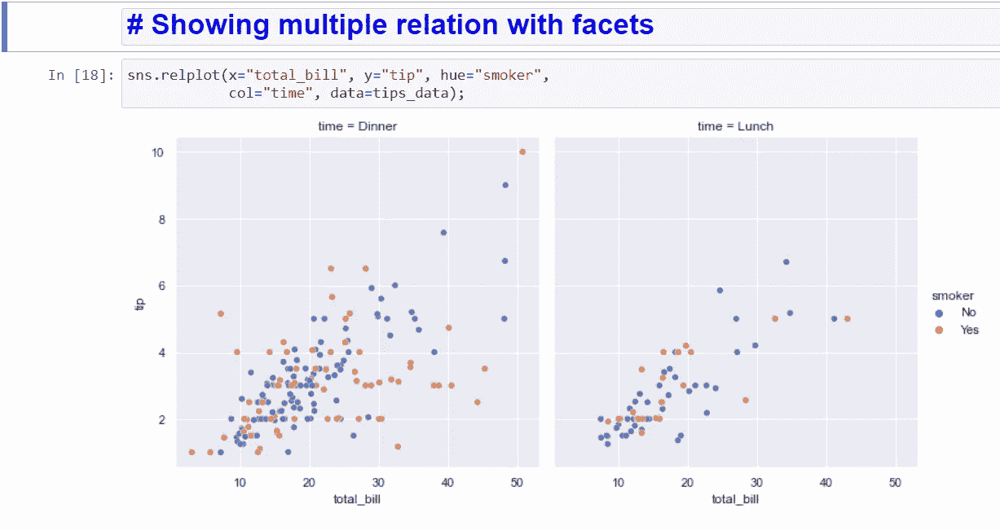

…….

## 数据是如何分布的？…分布图:

在数据的统计分析中，我们经常想知道我们的数据是如何分布的。它是平均分布在平均值的两边，还是向左或向右倾斜，或者它遵循其他一些奇怪的分布，需要不同的建模。

分布图回答了一系列问题，如观察值的范围是什么，数据的中心趋势是什么(均值、中值、众数)，数据集中是否有任何观察值与其余观察值相比非常奇怪(这些奇怪的点称为异常值)。

让我们用企鹅数据集来理解一些分布图。

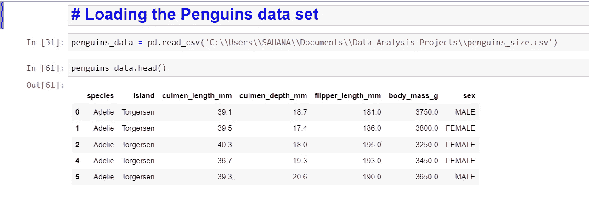

**单变量直方图:**

直方图是数据分布的近似表示。它将数据集中的整个值范围划分为桶或箱，然后绘制每个箱中的观察频率，即每个桶中有多少次观察。

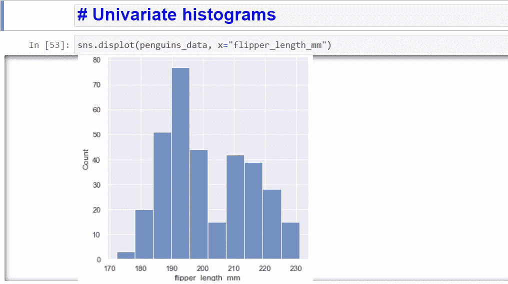

上图显示了企鹅鳍状肢长度的直方图。首先，通过将数据集中鳍状肢长度值的整个范围划分为间隔来创建箱，然后将观察频率放入相应的箱中。我们可以很容易地计算出，最大数量的观测值的鳍状长度在 190 毫米到 200 毫米之间。

我们可以根据我们的需要，通过操纵箱的数量来改变间隔的数量。

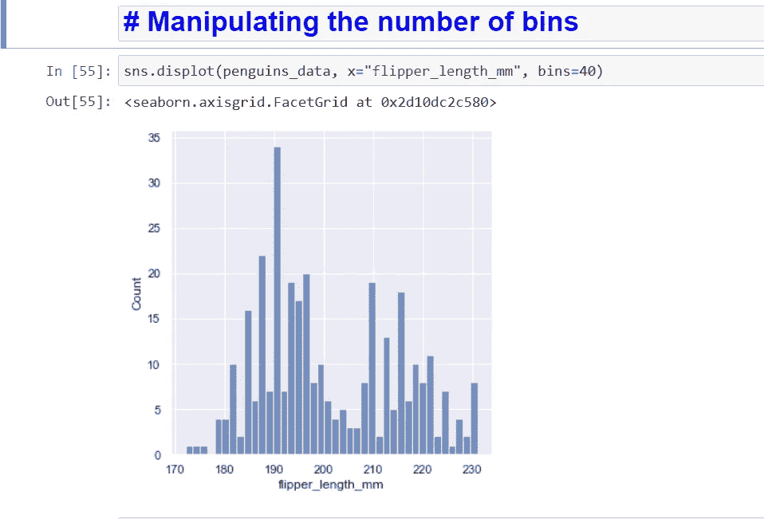

箱子数量= 40

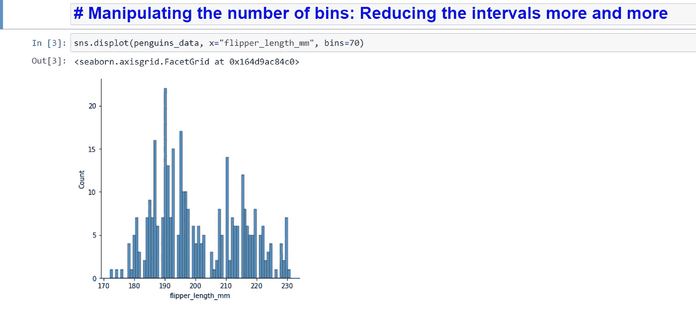

箱子数量= 70。直方图变得更加扭曲

请注意，随着我们不断增加箱的数量，分布变得越来越精确，因为我们正在接近绘制每一个观察值，而不是创建桶的间隔并将观察值组合在一起。

像散点图一样，我们可以在单变量直方图上增加一个维度，以获得更多信息。另一个变量上最常见的条件直方图类型是“堆栈”和“步进”。

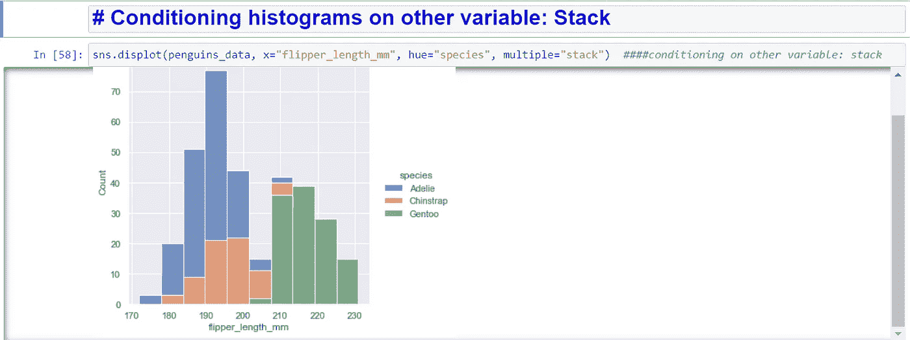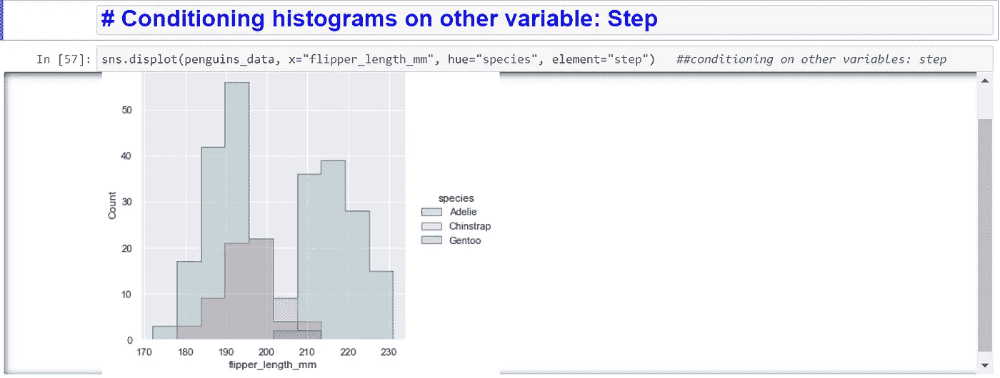

上面的特征让我们可以根据不同的种类来观察企鹅脚蹼长度的分布。这里，变量“物种”是添加到单变量直方图的第二维度。

正如我们对散点图所做的那样，我们也可以为直方图创建多个面。例如，我们希望在两个单独的列中查看鳍状肢长度的频率，一个是雄性企鹅，另一个是雌性企鹅。这可以通过将“col”参数设置为等于“sex”变量来实现。

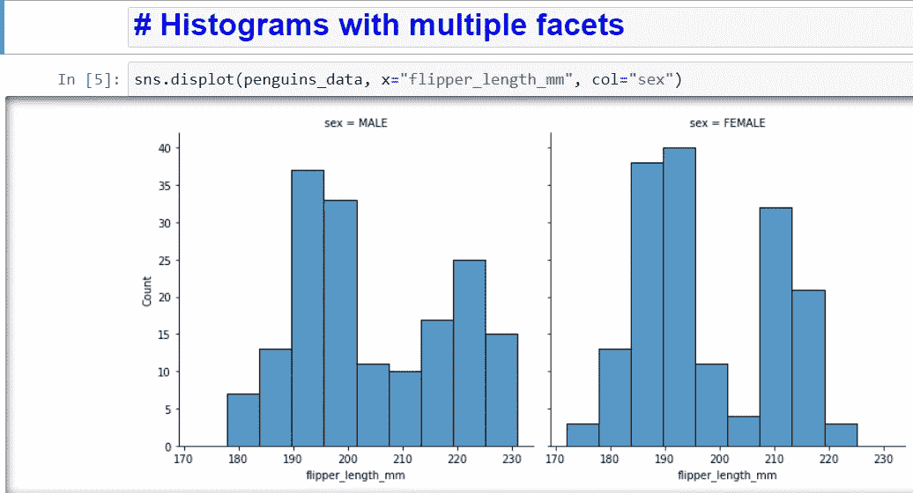

**核密度估计:**

核密度估计或 KDE 是一种估计随机变量概率密度函数的方法。

直方图看起来有点不规则，因为它使用一堆条形来描述每个条形中的观察频率。有时，我们可能希望使用更平滑的数据分布估计，而不是使用一堆条形，这更接近实际情况。基本上，KDE 将每个观察值平滑成小的密度凸起，然后将所有这些凸起相加，得到最终的密度估计值。在 KDE，每一次观测都贡献了一个小区域，就像它真实值周围的一堆沙子。这些被称为内核。最终的密度曲线是通过将所有的观测区域叠加成一个完整的整体而建立起来的。计算曲线

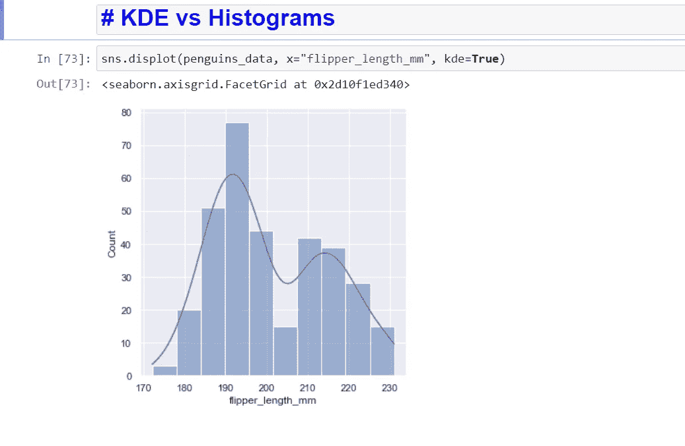

企鹅鳍状肢长度的直方图，带有估计的核密度曲线

对于直方图，每个观察值在各自的间隔仓中基于它们的频率相互堆叠，并产生不同大小的桶。另一方面，KDE 的目标是描绘一个更平滑的直方图。它没有描述精确的数据点，但给出了一个潜在的分布，而不知道观察值的真实值。

核估计器消除了每个观测值在该观测值的局部邻域中的贡献。在直方图的情况下，这消除了对柱宽度和柱端点的依赖性。

为核估计器选择合适的带宽对于获得最优估计是很重要的。非常低的带宽显示尖峰曲线，表明平滑量太低，一些尖峰可能只是由随机性引起的。另一方面，非常高的带宽可能会导致过度平滑，表明一些重要的结构可能已经模糊和平滑，否则就会产生尖峰。

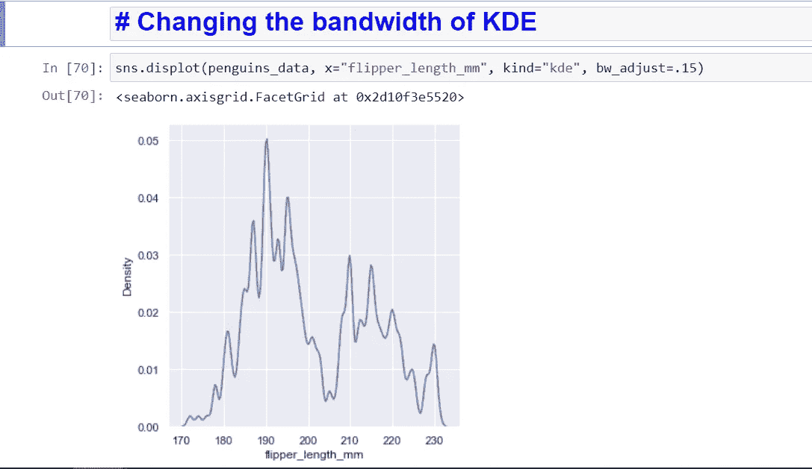

带宽= 0.15，太不稳定，有许多尖峰:平滑不足

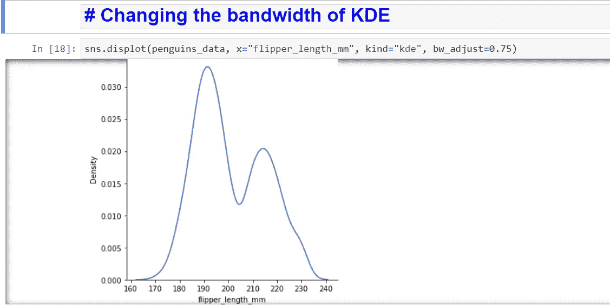

带宽= 0.75，最佳地描述了数据的分布

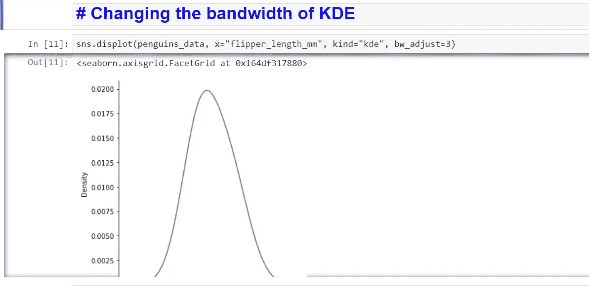

带宽= 3，过度平滑，重要尖峰模糊

像直方图一样，我们也可以绘制 KDE，以第二个变量为条件。例如，我们希望基于三种不同种类的企鹅，可视化脚蹼长度的核密度估计。

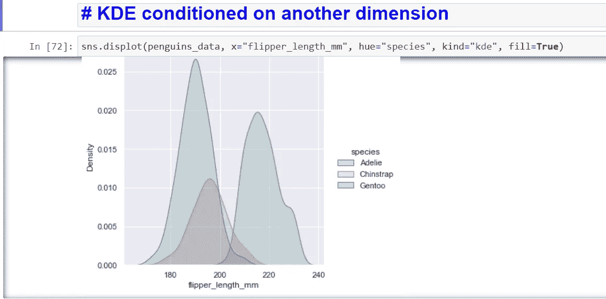

三种不同企鹅的核密度估计图

…..

**可视化二元分布:**

到目前为止，我们已经用单个变量或以第二个变量为条件绘制了直方图。我们可以绘制二元直方图，看起来像瓷砖，而不是 bin。双变量直方图用填充颜色显示每个图块内的观察计数。

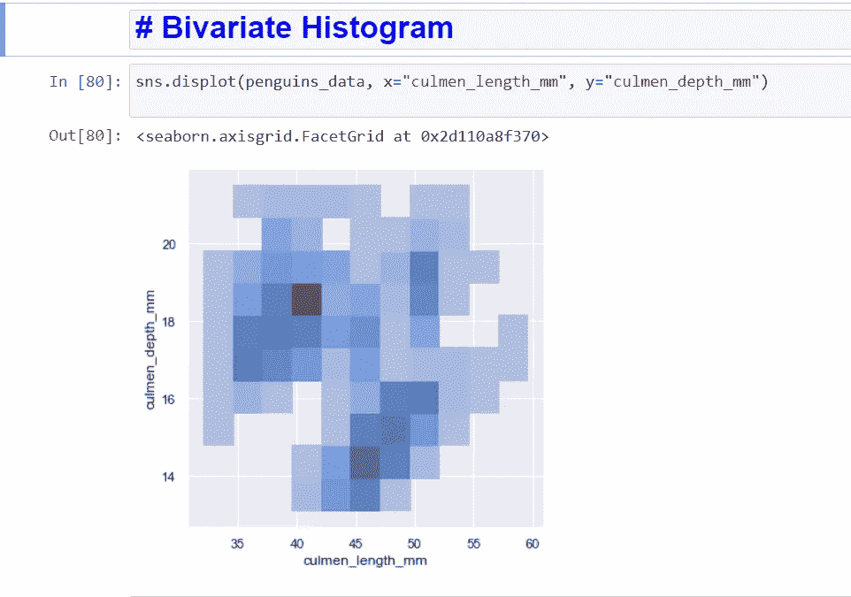

显示两个变量分布的二元直方图

二元直方图，根据企鹅的种类进行着色

二元直方图也可以以第三个变量为条件，这将产生不同颜色的轮廓集。然而，如果条件分布之间有很强的重叠，颜色就会混淆，这种方法无法产生生动的视觉效果。

类似地，双变量核密度估计平滑了观察值，并绘制了 2D 密度的等高线。这也可以以第三个变量为条件，如双变量直方图的情况。

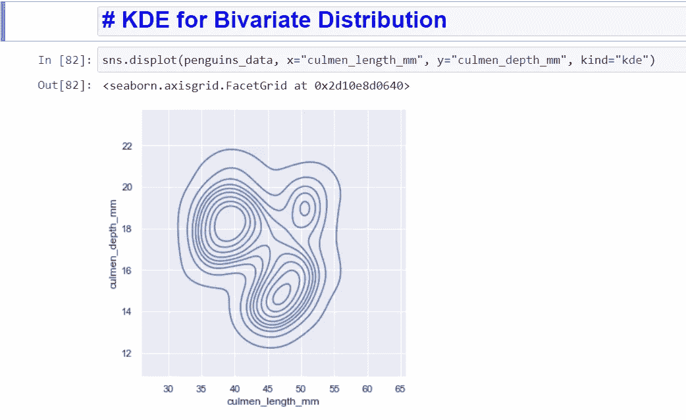

核密度估计:二元分布的 2D 等高线

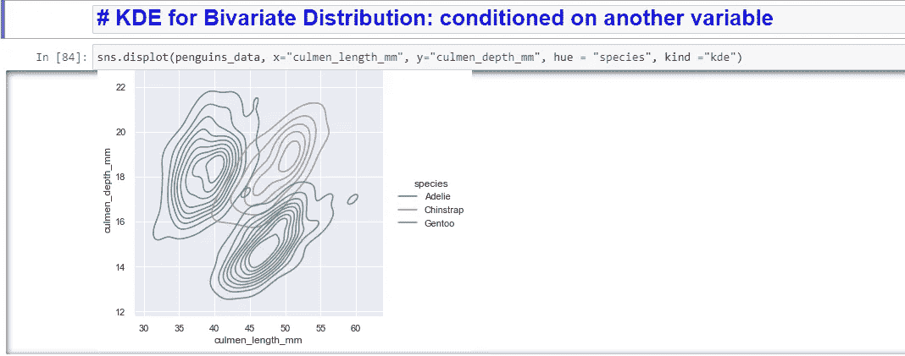

核密度估计:以第三个变量“物种”为条件

**热图:**

热图是一种 2D 图形视图，其中各个数据点用颜色表示。它基本上显示了单个观测值的大小或“热度”或强度。

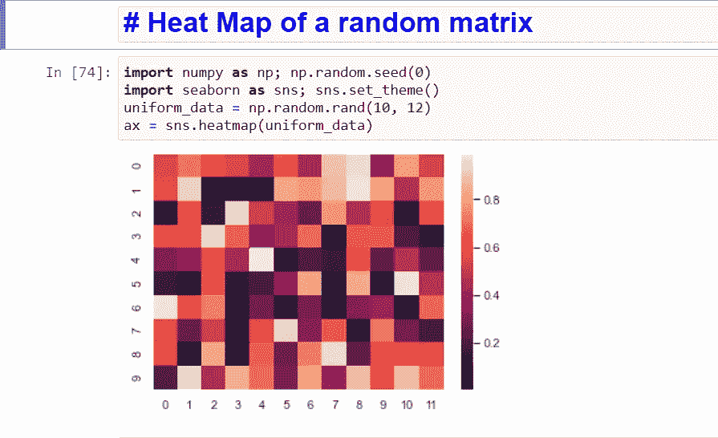

为随机 10*12 矩阵生成的热图

上面的 Python 代码生成了一个 10*12 的随机数矩阵。热图显示了由函数“rand”生成的各个数字的大小。这允许我们估计单个观测值的贡献，而不需要实际知道它们的原始值。

…..

## 处理分类数据？…分类图:

到目前为止，我们已经看到了如何可视化数字数据。但通常，在现实世界中，我们必须处理分类数据。Seaborn 提供了多种可视化和分析分类数据的方法。

**分类散点图:群集图:**

蜂群图或蜂群图显示了数据沿分类轴的分布，避免了数据点之间的重叠，清楚地显示了观察值在不同类别中的分布情况。

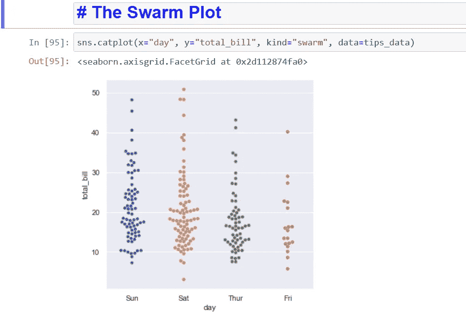

显示一周中不同日期总账单分布的群集图

例如，我们希望在 tips 数据集中看到总账单和一周中不同日子之间的关系。这里的“天”是一个分类变量，从周日到周六有 7 个不同的类别。上面的群集图显示了总账单是如何关联的，以及它们在一周中各天的分布。

类似于数字散点图，我们也可以为群集图添加另一个维度。例如，下面的群集图显示了总账单与一周中各天的关系，以变量“性别”为条件。

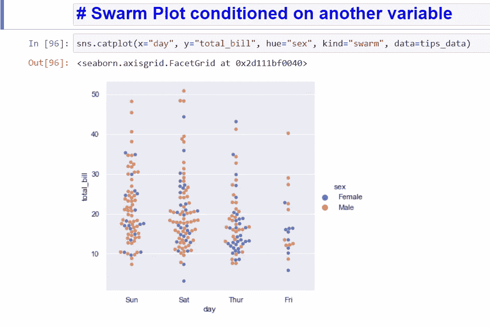

显示一周不同天总账单分布的群集图，按客户的“性别”划分

**大型数据集类别内的数据点分布:箱线图:**

随着数据集规模的增长，解释单个观测值的分布变得越来越困难。对于较大的数据集，通常建议对数据进行 5 点汇总，这样便于可视化和解释。

*5 点总结:*

箱形图代表数据集的 5 个数字，最小值、最大值、样本中值、第一个四分位数和第三个四分位数。

**最小值(第 0 百分位)**:这是数据集的最低数据点，不包括任何极端值或异常值。

**最大值(第 100 个百分点):**这是数据集中排除任何极端值或异常值后的最高数据点。

**中位数(第 50 个百分位数):**这是数据集按升序排列时的中间值。对于偶数个观察值，它被计算为数据集的两个中间值的平均值。

**第一个四分位数(第 25 个百分位数):**是数据集下半部分的中位数。

**第三个四分位数(第 75 个百分位数):**是数据集上半部分的中位数。

> *逐步绘制方框图:*

箱形图由两部分组成:箱形图和须状图。

让我们考虑以下数据点:

5, 7, 4, 3, 6, 1,8

第一步:按升序排列数据点:1，3，4，5，6，7，8

第二步:求中位数:对于奇数个数据点，中位数是中间值，本例中为 5。

第三步:找到第一个四分位数:第一个四分位数或 Q1 是位于样本中位数左边的数据点的中位数。在这种情况下，Q1 = 3。

第四步:找到第三个四分位数:第三个四分位数或 Q3 是位于样本中位数右侧的数据点的中位数。这种情况下，Q3 = 7。

箱线图从 Q1 到 Q3，垂直线穿过数据集的中间值。胡须在一侧从 Q1 延伸到最小值，在另一侧从 Q3 延伸到最大值。5 点摘要大约将数据分成 4 个部分，每个部分包含 25%的数据。

我们将**四分位数范围**定义为第 75 百分位和第 25 百分位之间的差值。IQR = Q3 — Q1。IQR 是对数据集可变性的一种度量，描述了数据的分散或变化。

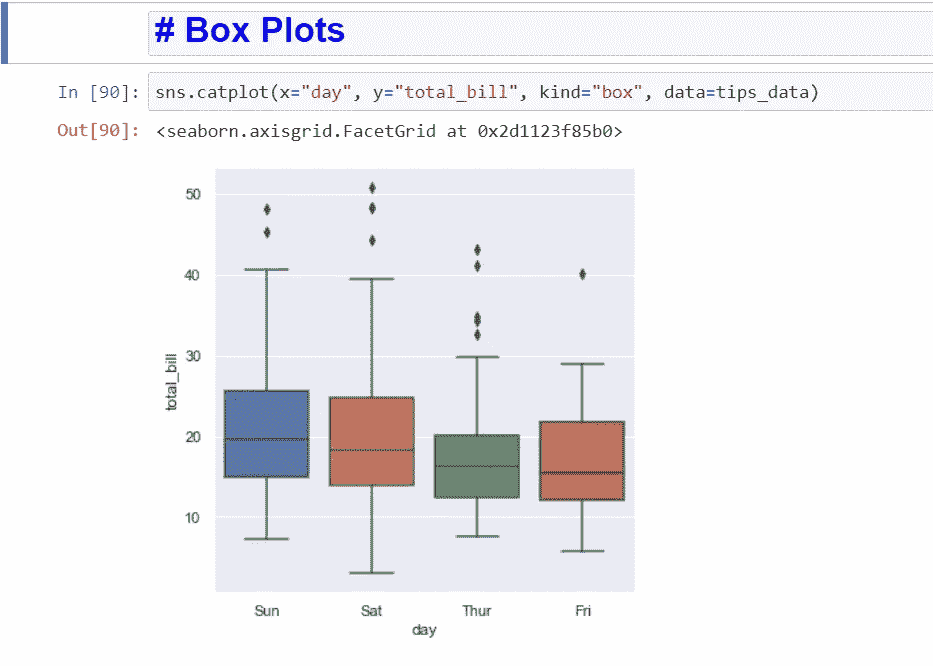

上面的 Python 代码生成了箱线图，显示了一周中不同日子总账单金额的变化。请注意，异常值或极值点不会被图捕获，而是显示为胡须外的点。

像其他图一样，箱线图也可以以另一个变量为条件。例如，我们希望绘制一周中不同日期的总账单金额分布图，根据客户是否吸烟的类型进行分类。

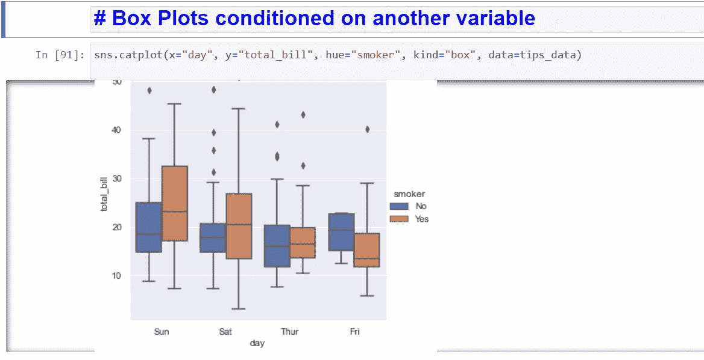

结合箱线图，显示一周内不同日期总账单金额的 5 点汇总和异常值，由变量“吸烟者”分隔

**小提琴剧情:**

violin 图类似于 box 图，其附加特征是使用密度曲线显示一个或多个类别的数字数据分布。与仅显示数据的 5 点汇总的箱线图不同，violin 图显示了数据的分布，包括数据中的峰值(如果存在)。它在中心线的每一侧使用旋转的核密度图，显示每个观察值的概率密度值，由核估计器平滑，类似于前面讨论的 KDE。

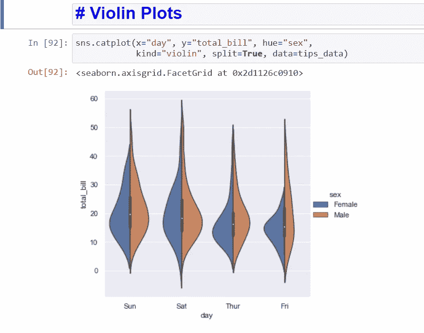

Violin 图显示了一周中不同天的观测值的核密度图

Violin 图可以与 swarm 图重叠，生动地显示数据点的分布以及密度曲线是如何产生的。

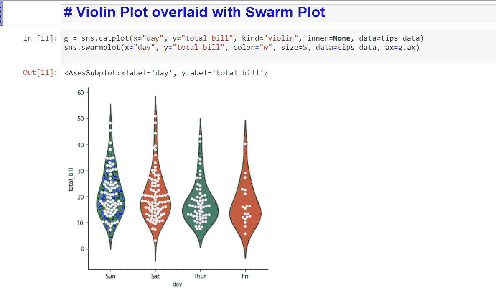

Violin 图与 swarm 图合并，用于更好地表示数据点的分布

**联合剧情:**

联合图用于查看两个变量之间的关系以及它们各自的分布。联合图使用散点图描述两个变量之间的关系，直方图描述两个变量的个体分布。

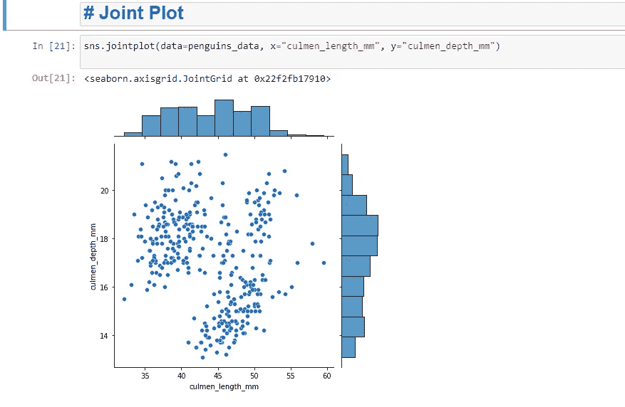

两个变量的联合图，通过直方图显示各自的分布，通过散点图显示联合分布

**双人剧情:**

配对图是联合分布和边际分布的混合，显示数据集中所有变量的单变量分布，以及它们与数据集中所有其他变量的成对关系。Pair Plot 提供了一种简单的方法，可以在一张图片中轻松直观地显示整个数据集的趋势。

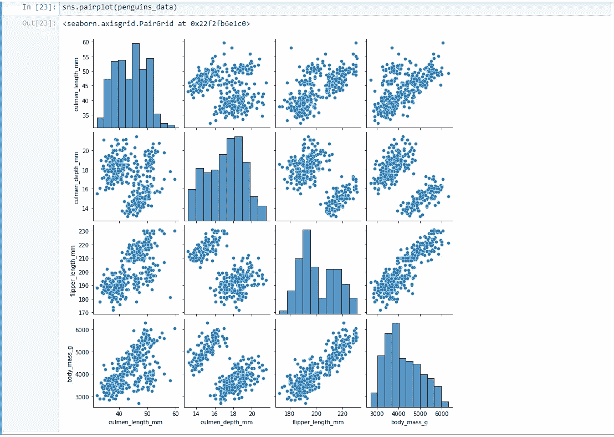

企鹅数据集的配对图

**结束语:**

Python 中还有许多可视化图，上面提到的是数据分析和机器学习领域中一些最常用的图。从 Python 提供的绘图调色板中，我们的目标始终是选择最能描述我们的数据的一个，并回答特定于我们的业务和需求的问题。