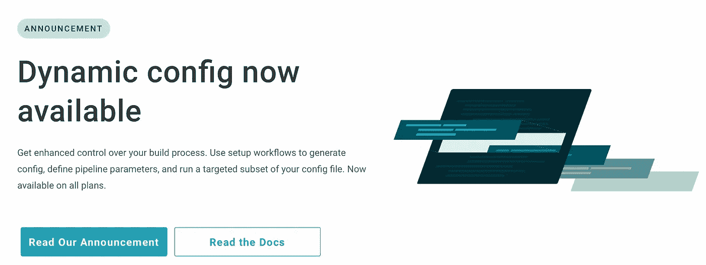
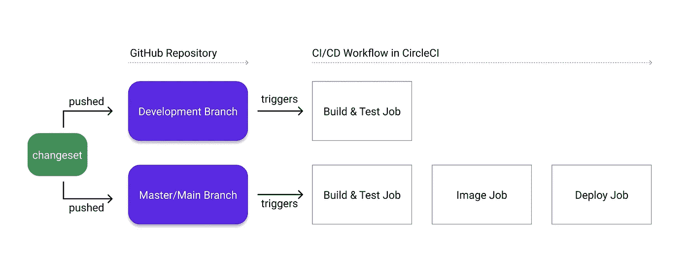
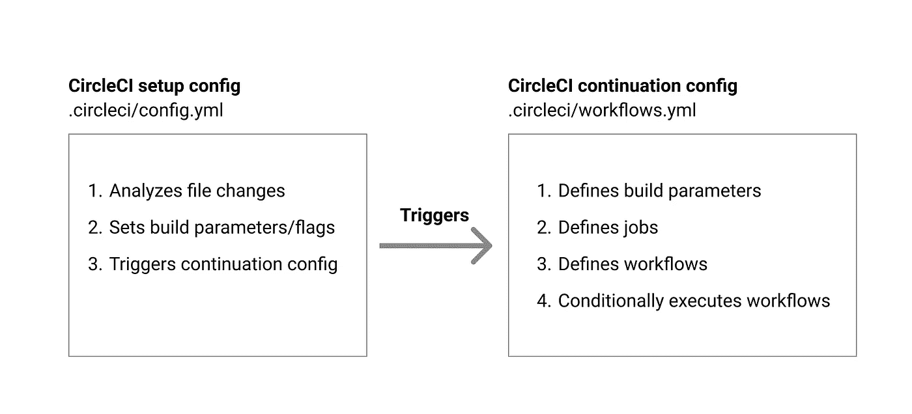
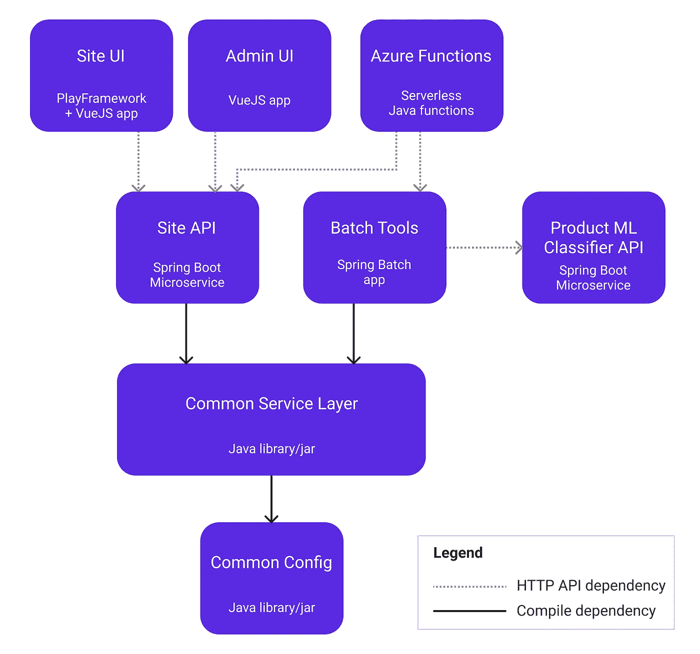
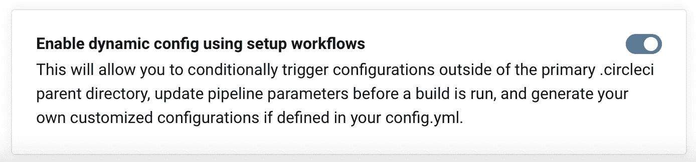
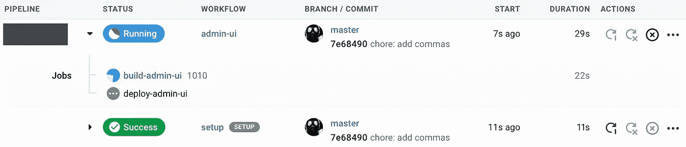
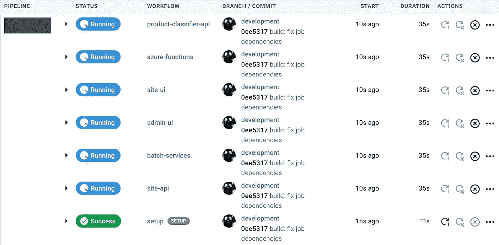

# 使用 CircleCI 的新动态配置掌握 MonoRepos

> 原文：<https://medium.com/nerd-for-tech/mastering-monorepos-with-circlecis-new-dynamic-config-2e187fe7934c?source=collection_archive---------0----------------------->

您是否曾希望将您的微服务、库和应用整合到一个 monorepo 中，但由于管理构建和部署过于困难而避免这样做？如果是这样，不要再烦恼了…

在本文中，我将带您了解**如何设置 CircleCI 来分析 monorepo** 中的文件更改，然后触发 CircleCI 管道，由**构建并部署 monorepo** 的特定子部分。当应用于您自己的项目时，这可以通过在您的 repo 中的最小模块集上选择性地执行工作流来显著地简化您的 CI/CD 管道并降低成本。

坚持阅读，实现 monorepo 涅槃…


看守的泽尼亚塔被克劳迪奥·阿莫罗索[超越](https://www.artstation.com/claudioamoroso)

# 它是如何工作的？

这现在是可能的，这要感谢 [CircleCI 刚刚宣布的](https://circleci.com/blog/introducing-dynamic-config-via-setup-workflows/)的一个强大功能，叫做**动态配置**。



在深入研究这个特性之前，让我们回顾一下我们对 monorepos 和 CircleCI piplines 的了解。

# MonoRepos

可以肯定地说 **monorepos 在开发者中可能会非常两极分化**。有些人更喜欢应用程序、库或微服务存在于自己的专用存储库中。还有一些人更喜欢一个超级整体仓库。

我喜欢 monorepos，因为它有很多好处，比如**简化的代码重用、跨模块/应用的原子提交、更简单的依赖管理和全面的搜索。**

一个主要的缺点(到目前为止)是**随着 monorepo 的增长，难以扩展构建和部署过程**。CircleCI 的动态配置完全改变了…

# 传统环形管道

在 CircleCI 中，工作流通常在变更被推送到存储库分支时被触发。采用连续部署的项目可能有一个触发构建/测试工作流的`development`分支和一个触发构建/测试/docker-image/deploy 工作流的`master`分支。



连续部署管道的一个例子

开箱即用， **CircleCI 工作流不容易根据作为传入变更集的结果而改变了**的文件/模块进行更改。这意味着您必须“构建世界”，以确保可能受变更集影响的模块被重新构建以合并它。

**在拥有许多模块/应用/库的大型 monorepo 中，这是无法扩展的。**像谷歌、脸书、优步和推特这样的大公司(它们都雇佣超级 monorepos)有基础设施来构建复杂的工具来处理这个问题。得益于 CircleCI 的动态配置和两个强大的 orb，这对于较小的公司和团队来说更容易实现。

# 了解动态配置

为了在 monorepo 中设置选择性构建，我们首先需要理解动态配置是如何工作的。

在标准的“静态”存储库中，`.circleci/config.yml`文件定义了项目的命令/作业/工作流。

使用动态配置时，该过程分为两个阶段:设置*阶段和继续*阶段。静态配置文件在*设置*阶段执行，可以:**

1.  动态生成另一个配置文件，用于*延续*阶段
2.  通过将当前变更集与基本修订进行比较来分析文件更改
3.  设置将被传递到*延续*阶段的构建参数/标志
4.  触发*延续*阶段

操作 1 对于非常高级的管道非常有用，但对于在 monorepo 中实现选择性构建是不必要的。因此，在本练习中，我们将只执行操作 2、3 和 4。



CircleCI 选择性构建的设置阶段和延续阶段

支持这一强大功能的两个 orb 是:

1.  [circle ci/路径过滤](https://circleci.com/developer/orbs/orb/circleci/path-filtering)
2.  [circleci/continuation](https://circleci.com/developer/orbs/orb/circleci/continuation)

`circleci/path-filtering` orb 允许您定义应用于 git commit diff 的正则表达式，然后根据已经更改的文件/文件夹设置特定的构建参数。

在引擎盖下，`circleci/path-filtering` orb 调用`circleci/continuation` orb 来启动*延续*阶段配置，并将构建参数传递给它。

# 我的单回购结构

在深入 CircleCI 配置文件的细节之前，我将解释一下我为 [StyleGuise](https://www.styleguise.net) 使用的 monorepo 以及其中的各种模块/服务。



monorepo 中主要模块的高级视图

通过虚线箭头连接的模块表示必须独立构建/部署的“弱”依赖性。他们所依赖的上游契约应该在不破坏下游模块的情况下发展。

实线箭头表示“强”编译时依赖关系。当上游模块发生变化时，必须重建“强连接”的下游模块。

在文件系统上，monorepo 如下所示:

```
monorepo
  |
  |-- service
  |   |-- site-api
  |   |    \-- pom.xml
  |   |-- batch
  |   |    \-- pom.xml
  |   |-- common (service-layer)
  |   |    \--pom.xml
  |   |-- pom.xml
  |
  |-- data (common-config)
  |    \-- pom.xml
  |
  |-- ui (site-ui)
  |   |-- build.sbt
  |   |-- package.json
  |
  |-- admin-ui
  |   |-- package.json
  |
  |-- product-classifier
  |   |-- api
  |   |    \-- pom.xml
  |   |-- trainer
  |   |    \-- pom.xml
  |   |-- common
  |   |    \-- pom.xml
  |   |-- pom.xml
  |
  |-- functions (azure serverless functions)
  |   |-- pom.xml
  |
  |-- pom.xml
```

如您所见，有多种构建工具用于构建各种子系统:maven(针对 Java 模块)、node . js+vue-CLI+web pack+dart-sass(针对 VueJS 模块)和 sbt(针对基于 scala 的 web 前端)。

Java 应用程序中还使用了各种各样的库。例如，产品分类器使用 [deeplearning4j](https://deeplearning4j.org) ，无服务器功能依赖于 [Azure 特定的库](https://github.com/Azure/azure-sdk-for-java)。为了避免库/jar 文件之间的交叉污染，这些模块彼此完全独立，拥有自己的`pom.xml`文件，并构建在隔离的 CircleCI docker 作业中。

顶层`pom.xml`负责定义子模块、插件和库版本。

# 启用动态配置

在 CircleCI 项目设置中，在“高级”选项卡下，动态配置处于打开状态。



如果你忘记这样做，你可能会在你的 CircleCI 仪表盘上看到一个错误，比如
`Continuation config contains setup stanza whilst not in setup anymore.`

# CircleCI 设置配置. yml

*设置*相位配置非常简单。

当 CircleCI 执行这个工作流时，`path-filtering/filter`作业在触发工作流的提交和基础修订之间生成一个 git diff。

在我的例子中，我已经将我的基础修订定义为`master`分支。当与我的`master`分支相比时，任何推送到我的`development`分支的提交将固有地产生差异。

一旦我准备好将变更部署到产品中，`development`就被合并到`master`中，并被推送到 GitHub。orb 足够智能，可以检测到与基础修订版相同的分支上的提交。在这个场景中，orb 将新提交与`master`分支(又名`HEAD~1`)上的前一个提交进行比较。

然后将在`mapping`块中定义的正则表达式应用于 git diff 文件列表。`mapping`块由空格分隔的三元组组成:

```
<regexp applied to file list> <build property> <property value>
```

如果一个`regular expressions`匹配，那么其相应的`build property`被设置为已定义的`property value`。

在我的例子中，属性只是作为标志，通知由`config-path`指定的*延续*配置文件中定义的工作流。

# CircleCI 延续工作流. yml

延续文件定义了构建参数(第 7 行)、作业(第 51 行)和工作流(第 260 行)。

值得注意的是，每个构建参数默认为`false`。这确保了工作流仅在*设置*阶段配置确定 monorepo 的相应子部分已更改时执行。

使用`when`块有条件地执行每个工作流(第 262、276、290、300、310、320 行)。使用`or`条件(第 263、277 行)触发具有多重/传递子依赖的模块。

最后，只有在`master`分支上发生提交时，部署作业才会被触发。

# 您将在 CircleCI 仪表盘上看到的内容

这里您可以看到对`monorepo/admin-ui`模块进行更改的结果。请注意*设置*阶段工作流程上的特殊**设置**标签，表明 CircleCI 识别了它。



这里您可以看到一个影响所有模块的更改的示例。



# 结论

CircleCI 动态配置是一个非常强大的特性，可以在运行时简化和操作构建，具有巨大的成本节约潜力。这个例子只是开始触及可能的表面…但它清楚地表明，monorepos 和基于文件更改的选择性构建管道最终是可以实现的。CircleCI 团队推出这一惊人功能的主要道具！感谢阅读！


Zenyatta 在和平的阴影下