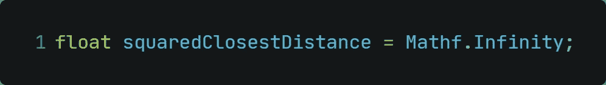
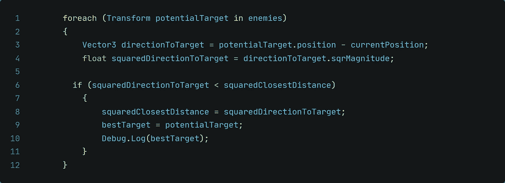
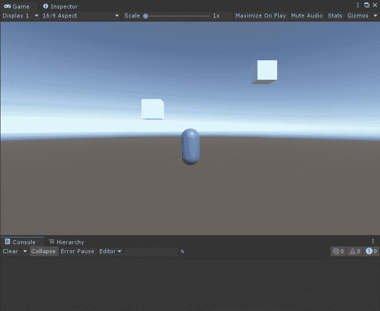

# Unity 中的数学——计算距离最近的敌人的距离

> 原文：<https://medium.com/nerd-for-tech/math-in-unity-calculate-the-way-to-the-closest-enemy-f5e8049ba98a?source=collection_archive---------11----------------------->

## 嗯……哪一个敌人是应该被摧毁的？

[GR Stocks](https://unsplash.com/@grstocks?utm_source=medium&utm_medium=referral) 在 [Unsplash](https://unsplash.com?utm_source=medium&utm_medium=referral) 上拍照

当你开发一个游戏的时候，你可能需要在屏幕上计算出最接近的敌人。让那成为因为你想要实现一个以最近的敌人为目标的能力提升，或者有另外一个想法为什么你想要这样做。让我们在今天的文章中找出如何做到这一点！

**一、目标** 屏幕上我们有一个玩家和两个敌人。由于我们只想瞄准最近的敌人，所以我们需要计算最近的敌人。选定的敌人将被打印到控制台上。

**二。理论-我们必须做什么？** 为了能够计算出最近的敌人，我们首先要 ***检测是否有游戏对象*** 。与红外激光相比。激光是一条直线，只要有东西在它中间，它就会断裂或缩短。然后，激光确实知道中间有东西。如果安装到报警系统中，这将是报警系统继续运行的触发器。我们将对 Mathf 做同样的事情。Infinity 这里基本上就像一个红外传感器。它将在整个世界空间中画一条线，当中间有东西时，它将被切断。

在我们知道场景中至少有一个游戏对象后，我们需要 ***计算场景中每个游戏对象的距离*** 。

接下来是 ***比较所有计算出的距离*** 并选择最接近或最小的一个。

就我个人而言，我不知道如何比较所有的方向，并谷歌它。通过那次[研究](https://forum.unity.com/threads/clean-est-way-to-find-nearest-object-of-many-c.44315/)，我也发现了一些优化技巧！
来，看一看:

> 对于任何通过谷歌搜索到达这里的人来说，tomvcds 给出的答案是好的，但肯定应该通过比较距离平方而不是直线距离来优化。它没有增加代码的复杂性，而且效率更高，因为它通过执行“Vector3”避免了昂贵的平方根运算。距离”。
> 
> 例如，假设您有三个对象，A、B 和 C，以及一个源。你想知道哪一个离源头最近。假设 A 在 2m 远，B 在 3m 远，C 在 4m 远。您可以得到距离平方的值，分别是 4、9 和 16，而不是进行距离测试并得到 2、3 和 4。距离平方仍然通过接近度保持它们的顺序，只是值以指数方式增加，而不是线性增加。

**三世。实现-编码我们需要什么** 首先，我们需要一个存储所有敌人的数组。由于我们对距离感兴趣，我们需要用类型*转换*来创建它:

为了在 Unity 中创建类似红外激光的探测系统，我们可以使用 *Mathf。无穷大*。

现在我们需要一个循环。我们想要计算每个敌人的方向，我们可以使用的最佳循环是一个 *foreach* 循环:

*   首先，我们计算方向
*   其次，我们计算平方星等
*   第三，我们指定最近的敌人作为潜在目标

**四。完成后的最终结果** 在 Unity 中运行这段代码，会给我们以下最终结果:

感谢您的时间和兴趣！
下次抓你！