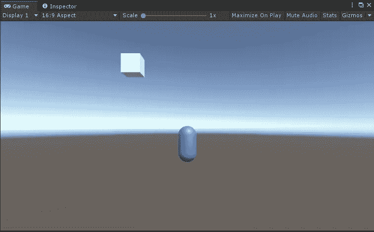
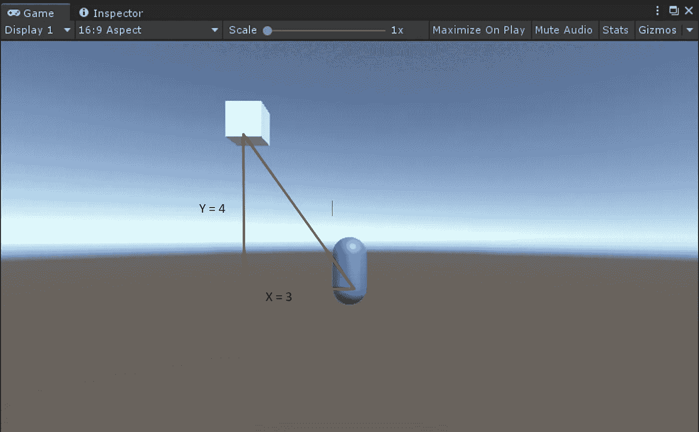
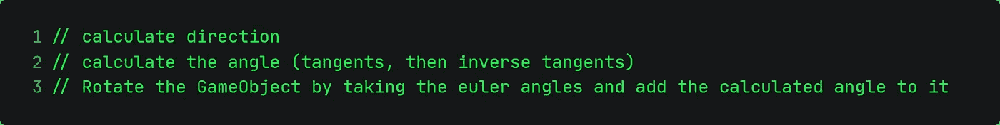
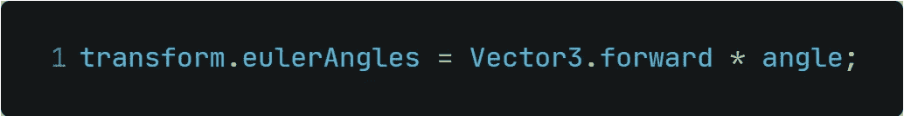
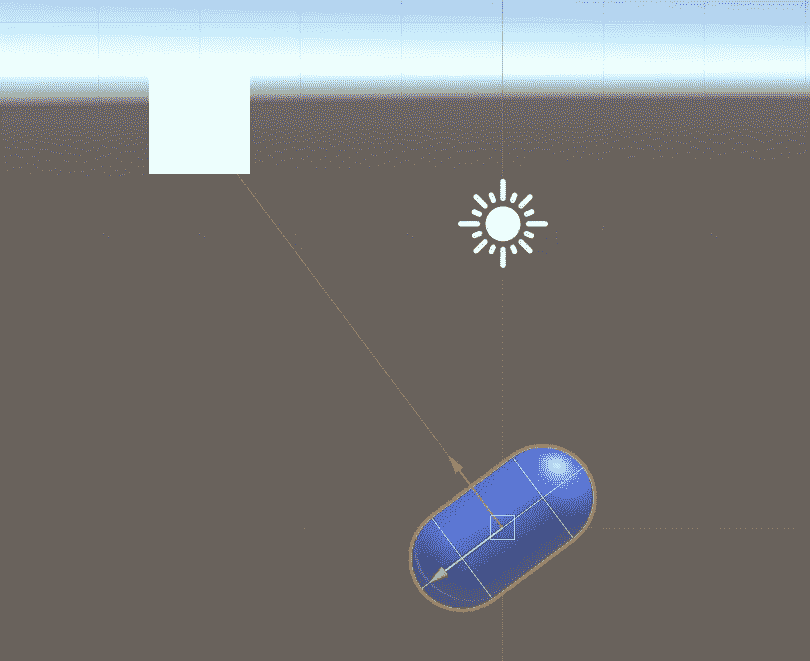
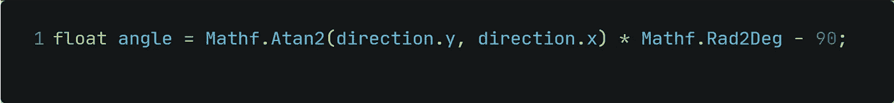
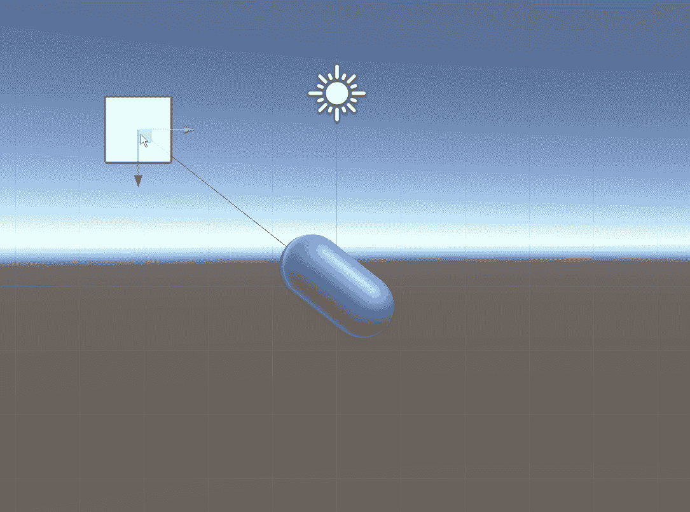
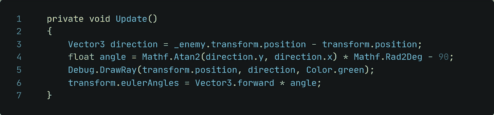

# Unity 中的数学-计算角度

> 原文：<https://medium.com/nerd-for-tech/math-in-unity-calculating-angles-680bb9bc47bc?source=collection_archive---------6----------------------->

## 在拐角处？等等，我需要从哪个角度瞄准你？！

视频游戏中经常用到角度。我们之前讲过旋转，角度在这里是一个完美的组合！当你改变你的方向时，你可能会从另一个角度看到你。为了跟踪你，它需要计算看你的角度。今天就来看看如何实现这种行为吧！

一、目标是什么？
目的是让胶囊“指向”玩家立方体。

**二。数学方面
T5【我们需要一些数学函数来计算角度。我们已经给定了三角形的两条边。斜边上的值丢失，需要计算。为此， *tan* 将派上用场，因为公式是对面的长度除以相邻的长度，简称为 *Opp/Adj* 。**

tan 方法将返回一个值，但没有角度。要将值转换成角度，我们需要执行反正切数学函数。

让我们创建一个简单的例子:

对面是 4，相邻的是 3
→ 4/3 = 1.25

要获得角度，使用反切线函数
→tan^-1(1.25)=***51.34***

我们需要的角度是 51.34。
现在让我们通过代码实现计算！

**三。实现计算** 我们先把要做的事情写下来。

为了能够计算方向，我们还需要给敌人分配一个参考。

我们已经在昨天的文章中讨论了如何计算方向。为了计算角度，我们使用 *Mathf。Atan2()。* Atan2 因为它会把负值转化为正值。阿坦不允许任何负值。由于我们想把 tan 值转换成度数，我们需要用 *Mathf.Rad2Deg.* 进行转换

最后要做的是旋转游戏对象。为此，我们将操纵欧拉角。

在 Unity 中运行这个会带回一些奇怪的东西。计算的角度似乎是正确的，然而，胶囊并没有指向玩家立方体。

胶囊上的方向箭头在这里很有帮助！太空舱旋转 90 度太远了！这是 Unity 独有的问题，因为 Unity 的单位圆不同于你从数学中知道的那个。要解决这个问题，我们只需将计算出的角度偏移 90°。

**四。工作最终结果** 做完这些，让我们来看看最终结果:

无论立方体想去哪里，他现在都会一直被胶囊追踪。

哦，和往常一样，这里是完整的代码:

另一个新发现的东西肯定会很有帮助！数学变得如此有趣真是令人兴奋。只希望学校的数学会如此有趣…

无论如何，感谢您的时间和兴趣来阅读这篇文章！下次再见！