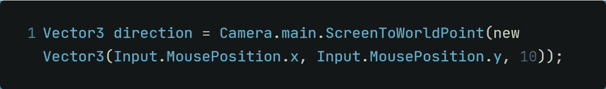
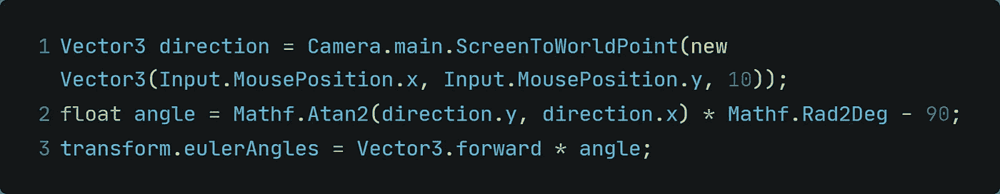
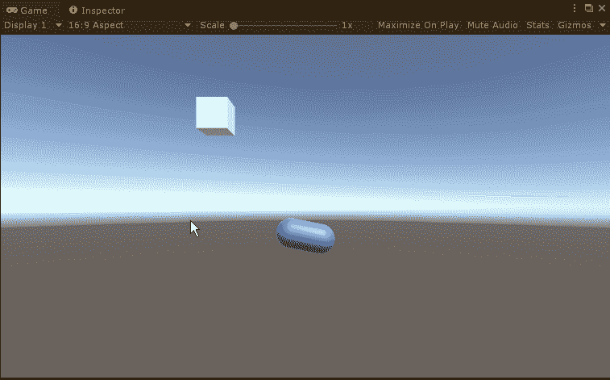

# Unity 中的数学——跟踪鼠标光标

> 原文：<https://medium.com/nerd-for-tech/math-in-unity-tracking-the-mouse-cursor-a9410a65d0af?source=collection_archive---------18----------------------->

## 想玩猫捉老鼠吗？

另一个可怕的双关语开始这篇文章。不错！

不管怎样，你可能玩过一些游戏，其中一些对象总是在看鼠标指针。这实际上可以用于各种原因。只是为了好玩，为了让背景细节更详细，为了让玩家不断地看着他的光标感到恐惧，为了让点击游戏更详细，…

这真的有很多用例。让我们今天就实现它。你会感到惊讶，但我们已经知道这样做的基础。记得[昨天的文章](https://guilbomadev.medium.com/math-in-unity-calculating-angles-680bb9bc47bc)吗？

**一、目标** 今天的目标是胶囊将跟踪鼠标指针并相应地更新它的旋转。

**二。为目标** 装箱逻辑我们昨天已经讲过数学方面了，这里就不需要再讨论了。请记住，我们需要反向切线函数。

让我们来分解一下我们想做的事情:

*   我们需要计算方向向量。
    *这一次，目标是鼠标指针而不是游戏对象。*
*   需要一个角度，所以我们也要计算它
*   角度应转换为度
*   用欧拉角更新胶囊的旋转

这将为我们带来以下计算方向的代码:

其余的和昨天一样:

**三。在 Unity 中运行这段代码的最终结果是这样的:**

现在鼠标光标也被跟踪。伙计，这里再也没有隐私了…

感谢您的时间和兴趣！
下次见！