# 梯度下降背后的数学..简单解释

> 原文：<https://medium.com/nerd-for-tech/mathematics-behind-gradient-descent-simply-explained-c9a17698fd6?source=collection_archive---------10----------------------->

亚当·本特利在 [Unsplash](https://unsplash.com?utm_source=medium&utm_medium=referral) 上的照片

到目前为止，我们已经在之前的文章中讨论了[线性回归](https://bassemessam-10257.medium.com/linear-regression-9c91172239b1)和[梯度下降](https://bassemessam-10257.medium.com/gradient-descent-simply-explained-with-a-tutorial-e515b0d101e9)。我们得到了一个简单的概念概述和一个实用教程来理解它们是如何工作的。在本文中，我们将看到梯度下降背后的数学原理，以及“优化器”如何获得全局极小点。如果术语“优化器”对您来说是新的，它只是用来确定全局极小点的函数，它指的是线性回归算法中最佳拟合线的系数。顺便说一下，深度学习算法中也使用了类似的概念。让我们来看看这些事情是如何进行的。

当使用“均方误差”来确定最佳拟合线的系数时，我们的主要任务是找到 MSE 最小的点。换句话说，全局极小点是曲线斜率等于零的点。如果我们能得到 MSE(成本函数)对最佳拟合线系数(斜率和截距)的导数，我们就成功了。

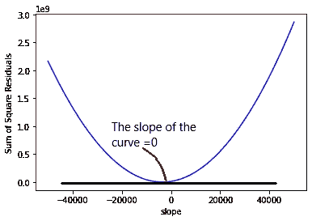

拟合线的方程式是 y=mx+b(其中 m 是直线的斜率，b 是 y 轴的截距。回到导数规则，我们可以将它们应用到我们的 MSE 方程中。首先，让我们将成本函数 J(m)中的(y^-y)项表示为误差，以简化方程。

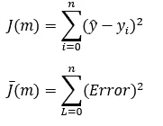

利用链式法则，我们可以求出 J(m)的导数如下。

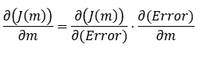

等式的两个分量可以通过以下等式计算。

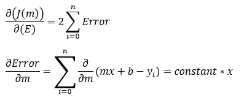

回到成本函数对斜率(m)的求导，我们会发现它等于某些常数乘以误差(预测 y 值与实际数据点的差值)。

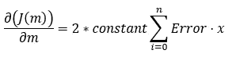

这个等式可以解释为成本函数相对于斜率的变化量，因此，如果我们逐渐改变斜率，直到误差最小，我们就到达了全局最小值点。

m = m+∏m

b = b+⇼b

类似地，截距的值可以通过计算成本函数对截距(b)的导数来找到。

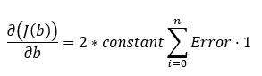

变量(m 和 b)移动的值被称为“学习率”,它由一个小值定义，该小值可以在拟合过程中以这样一种方式确定，即它不会太小而使收敛到全局最小值的时间很快，也不会太大而导致永远达不到全局最小值点。

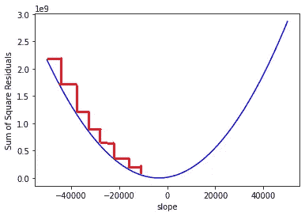

具有小学习率值的梯度下降。

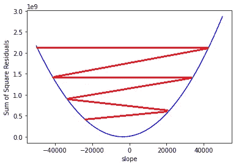

具有高学习率值的梯度下降

确定最佳拟合线系数的最终方程如下。

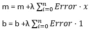

现在，我们可以定义一个学习率(λ),并慢慢向最小误差点移动，得到我们的最佳拟合线。

这里必须提到的最后一点是，斜率的值可以从理论上由下式确定。

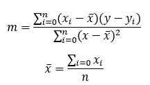

因此，截距可以如下找到。

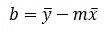

但是在 DL 中构建线性回归算法或任何优化器的代码中，使用了一个学习速率，并且一直移动，直到它到达全局极小点。

# **参考文献:**

[3.5:梯度下降数学——智力与学习](https://www.youtube.com/watch?v=jc2IthslyzM)

[StatQuest:对数据拟合直线，又名最小二乘法，又名线性回归](https://www.youtube.com/watch?v=PaFPbb66DxQ)