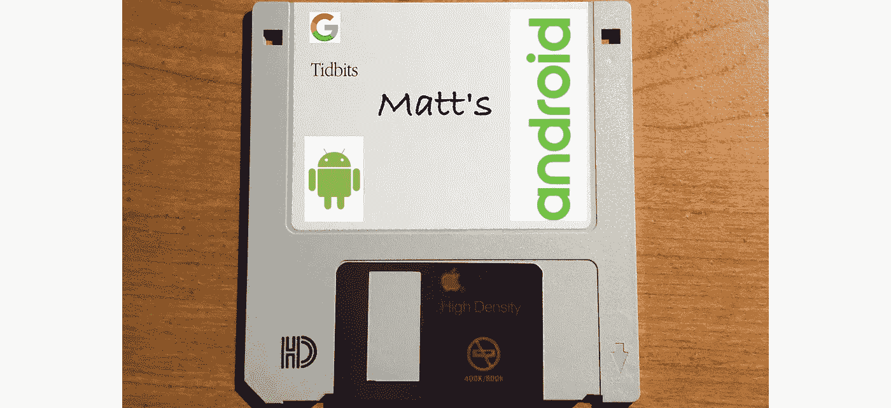

# Matt 的花絮#102 —调试一个复杂的视图绑定问题

> 原文：<https://medium.com/nerd-for-tech/matts-tidbits-102-debugging-a-perplexing-view-binding-issue-69d2bb81999c?source=collection_archive---------5----------------------->



本周我有一个花絮(外加奖金！)分享关于将现有应用程序转换为使用 Android 视图绑定的信息。上次，我写了关于如何写一份好的 bug 报告。

第一，奖金！(甜点不应该总是放在第一位吗？)我最近开始回到一些 Android 开发中(在过去 6 个多月的 React Native 工作之后)，并开放了 Android studio 闪亮的新北极狐版本。然而，在这样做的时候，我注意到许多我熟悉的键盘快捷键不再工作了(比如用于关闭编辑器窗口的⌘W)。似乎 Android Studio 改变了默认的键盘映射——所以如果你遇到这种情况，只需进入首选项->键盘映射并选择“macOS”而不是“IntelliJ IDEA Classic”。

现在，主要的花絮。😉

我回到 Android 的原因是因为我正在更新一个内部项目，以使用所有最新的工具/范例等。这款 app 依然以 MVP 为范式，甚至依然使用 Butterknife(已经弃用一年多了)。这款应用的用户界面相当简单——它有一个 RecyclerView，当你点击其中一个项目时，它会启动一个新的活动。然而，在切换到 Android 视图绑定的过程中，我遇到了一个 bug——在我的 RecyclerView 中没有呈现任何东西！

我花了比我愿意承认的更长的时间来调试它——放入断点，打印语句，反复检查数据是否被传递到正确的位置，尝试调用`notifyDataSetChanged()`和`submitList()`的各种组合——都无济于事。无论我做什么，我的适配器的`onCreateViewHolder()`和`onBindViewHolder()`方法都不会被调用。

难倒了？幸运的是，解决方案非常简单。有一次，我查看了一个屏幕的完整实现，这个屏幕有一个工作的 RecyclerView，我注意到了一个关键的区别。

在不起作用的活动中，我在`onCreate()`方法中使用了下面一行:

```
setContentView(R.layout.my_activity)
```

然而，起作用的活动却是这样的:

```
setContentView(binding.getRoot())
```

就是这样！切换到使用我保存的`binding`对象的新版本就足够了。

我从中学到了什么？

1.  我需要做更多的研究，以确保我与最新的工具保持同步(老实说，我还没有那么多地使用视图绑定——我喜欢我目前所看到的，但我一开始并不知道要寻找什么)。
2.  休息一下/和其他人谈谈——这一点我要归功于我的妻子——她不是程序员，但她问我想解决什么，只是在试图解释和向她展示代码的过程中，我偶然发现了这个关键的区别。
3.  简化问题/挑战你的假设——我应该早点这么做——去掉所有不必要的代码，自我检查以确保我能重现一个可行的解决方案，然后将其与不可行的方案进行比较。

我希望你学到了一些东西，如果/当你转换你的旧 Android UI 代码使用视图绑定，这是一个比我更平滑/更快的过渡！

有兴趣和我一起在埃森哲出色的数字产品团队工作吗？我们有几个空缺职位，包括:

*   [移动开发者(东北地区)](https://www.accenture.com/us-en/careers/jobdetails?id=00960587_en&title=Native+Mobile+Developer)
*   [高级 iOS 开发者(南部地区)](https://www.accenture.com/us-en/careers/jobdetails?id=R00036232_en&title=Senior+iOS+Developer)
*   [安卓移动开发者(南部地区)](https://www.accenture.com/us-en/careers/jobdetails?id=R00027147_en&title=Android+Mobile+Developer)
*   [iOS 移动开发主管(南部地区)](https://www.accenture.com/us-en/careers/jobdetails?id=R00027113_en&title=iOS+Mobile+Development+Lead)

您使用视图绑定的体验如何？请在下面的评论中告诉我！