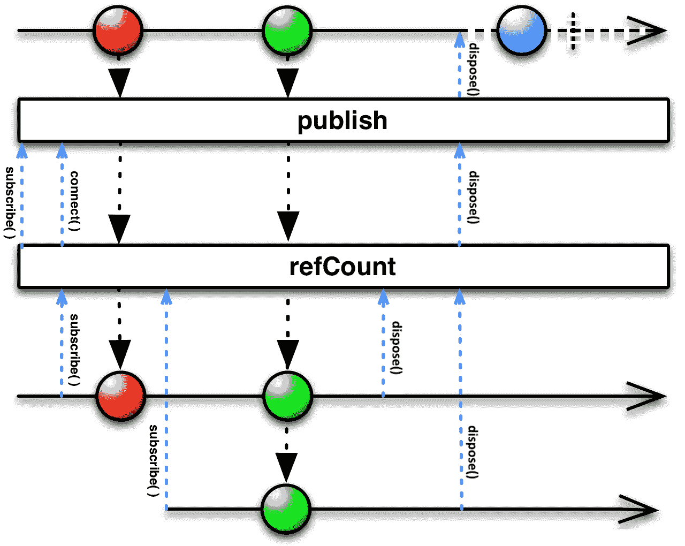

# Matt 的第 91 期花絮——分享的力量

> 原文：<https://medium.com/nerd-for-tech/matts-tidbits-91-the-power-of-sharing-31e5407d456c?source=collection_archive---------23----------------------->

[上周，我写了关于仪表盘和庆祝马特两周年的花絮！](https://matthew-b-groves.medium.com/matts-tidbits-90-all-about-dashboards-and-another-milestone-9695a68f0ee)这一次，我想分享…关于分享！

你写过类似这样的代码吗？

如果是这样，你可能遇到了问题——如果某个特定的`start()`呼叫者忘记呼叫`stop()`或者更糟——呼叫它不止一次怎么办？这类问题非常普遍，尤其是在多线程环境中。

如果再加上尝试将引用计数与 RxJava 结合起来，问题就变得更加复杂了。然而，我最近发现了一个相当神奇的操作者——`share`。

从文档中:

> 返回一个新的`Observable`，它多播(并共享一个订阅)当前的`Observable`。只要至少有一个`Observer`，电流`Observable`就会保持订阅，不断发出信号。当所有观察者都被处置后，操作员将处置对当前`Observable`的订阅。

这意味着我们可以使用这个操作符来导致底层的可观察对象被重新计数！但是，除此之外——您的底层代码实际上不必使用 RxJava——我们可以使用 rx Java 作为实现引用计数的机制，在我看来，这提供了一个稍微干净的实现。

下面是一个可能的例子:

这个解决方案的神奇之处在于，我们让 RxJava 为我们执行引用计数！

浏览代码，主要部分如下:

1.  想要使用它的客户机将调用`runSomeOperationThatStartsAndStopsAutomatically()`，订阅返回的`Completable`，并在它们不再希望操作运行时处理它。
2.  在幕后，我们的 manager 类检查操作是否已经在运行——如果没有，就启动它(以线程安全的方式)。
3.  当可观察对象被创建时(注意它实际上是一个可观察对象——rx Java 没有为`Single`或`Completable`类型提供`share()`操作符)，我们使用`.doOnSubscribe`和`.doOnDispose`操作符来启动/停止底层操作。使这个工作的是对`share()`的调用，这意味着这些副作用方法只运行一次。
4.  当所有客户端都取消订阅时，底层操作将停止，`completable`将被清除，因此下一个尝试使用它的客户端将再次启动操作。

这种机制允许多个客户端使用这种共享功能，并确保它实际上只运行一次。这种解决方案的一个好处是底层操作可能会抛出一个错误，任何订阅的人都会得到通知，以便他们可以对此做出反应。

请注意，这种方法仍然容易受到某人忘记取消订阅的影响(因此可能会阻止底层操作关闭)——但是单个客户端取消订阅超过一次是不可能的。这是我喜欢这种模式的主要原因之一——它通过使用更具表现力的 API 减少了程序员出错的可能性。

[本着分享的精神，你也应该看看我的同事杰夫·帕吉特关于 ViewModel 生命周期管理的精彩新帖！](https://jeff-padgett.medium.com/how-to-make-viewmodel-observe-android-lifecycle-events-and-how-to-unit-test-lifecycle-events-d5be727da8d7)

您是如何在项目中使用`share()`操作符的？请在下面的评论中分享！

有兴趣和我一起在埃森哲出色的数字产品团队工作吗？[我们在招人！](https://www.intrepid.io/careers)