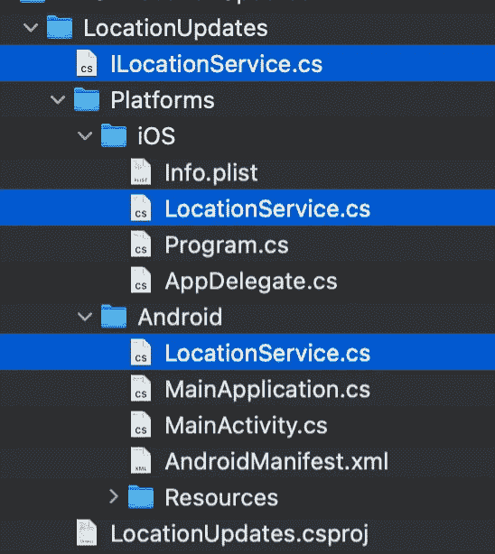
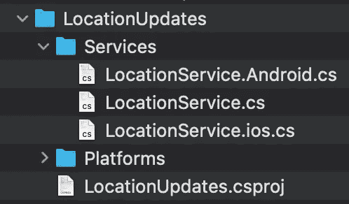
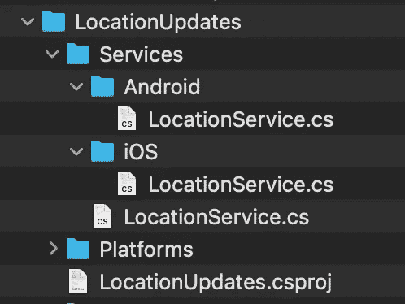

# 毛伊岛—本地移动位置更新

> 原文：<https://medium.com/nerd-for-tech/maui-native-mobile-location-updates-444939dff3af?source=collection_archive---------0----------------------->

## 几行代码中的原生 Android 和 iOS 位置更新

欢迎回来伙计们👋。在今天的《如何烹饪毛伊岛》一集中，我们将看看原生的 Android & iOS 实现，而不是使用毛伊岛的`IGeolocation`接口。

葡萄酒供应调查

首先，这里的权限并不新鲜；我们需要地理位置毛伊岛文档中显示的所有内容:

 [## 地理定位。网毛伊岛

### 本文描述了如何使用？NET 多平台 App UI(。NET MAUI)I 地理位置接口。这个…

learn.microsoft.com](https://learn.microsoft.com/en-us/dotnet/maui/platform-integration/device/geolocation?view=net-maui-7.0&tabs=android) 

下一步是决定我们希望如何实施它:

*   我们可以在每个平台上使用接口和实现。

*   或者我们可以使用没有接口的分部类。在这里，我们也可以将我们的实现拆分到不同的平台文件夹中，甚至是带有平台文件扩展名的同一个文件夹中。

在这里，如果我们只有一些 Android 和 iOS 文件夹的服务，看起来有些过头了。但是如果我们要有五个或更多的服务，这是必须的，因为这个文件夹太大了，不便于导航。

此外，我不建议对每个平台上需要几行以上的代码使用`#if ANDROID and #if IOS`,因为它很快变得难以维护。

在我们的解决方案中，我们将在服务文件夹中使用`partial service`,将 Android 和 iOS 文件分开。

# 位置服务的共享逻辑

这里没什么复杂的；在我们的例子中，我希望得到服务更改的通知，比如提供者状态或初始化，以及获得单独的事件位置更新。

# 位置服务的 Android 实现

我们将请求对`LocationWhenInUse`的许可，如果未获批准，我们将发送通知。此外，我们将检查设备上的`Location`是否为`Enabled`，以及`GPS Provider`是否为`Available`。

# 位置服务的 iOS 实现

与 Android 实现非常相似，但这里我们有一个可选的`RequestAlwaysAuthorization`行，如果我们不打算在你的应用程序在后台时获取位置更新，这是不必要的。

没错，就是它！一个简单的解决方案是展示我们可以使用什么，以及如何针对基本场景进行设置。是的，它在每个平台下都有一些更令人兴奋的东西，但是你正在使用的 knowing 类，你可以在苹果和谷歌文档中找到所有信息。

链接到包含所有源代码的回购:

 [## GitHub-bbenetskyy/MAUI-Location Updates:原生 iOS 和 Android 位置更新

### 此时您不能执行该操作。您已使用另一个标签页或窗口登录。您已在另一个选项卡中注销，或者…

github.com](https://github.com/bbenetskyy/MAUI-LocationUpdates) 

[https://twitter.com/bbenetskyy](https://twitter.com/bbenetskyy)

 [## Bohdan Benetskyi 正在为 Xamarin 创建高级 CSS 渐变，在会议上发言

### Bohdan 是 Rzeszow 的 Xamarin 软件开发人员，是 Rzeszow & Cracow 的 Xamarin 本地活动的共同组织者，本地 CSS…

www.buymeacoffee.com](https://www.buymeacoffee.com/bbenetskyy)