# Maven 出租车挑战赛

> 原文：<https://medium.com/nerd-for-tech/maven-taxi-challenge-dca9b2abd4ab?source=collection_archive---------5----------------------->

出租车

**简介**

这一次，我们将分析一个庞大的数据集，其中包含纽约市超过 2700 万次出租车出行的记录。

我们的任务是整理这些庞大的数据集，对数据进行彻底的质量保证和清理，并提供一个仪表板，让首席调度员能够准确了解历史行程信息。

**数据集**

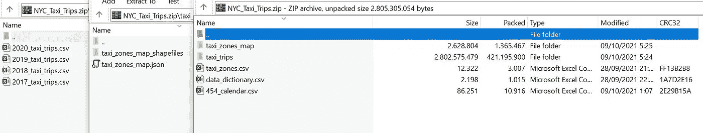

数据集

我们有 5 种类型的数据集，旅行数据集，地图区，日历，区和字典。

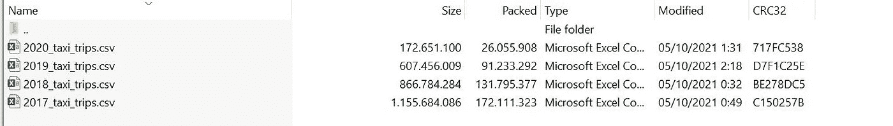

行程数据

首先，我们将看到 2017 年、2018 年、2019 年和 2020 年 4 年的出行数据。我们可以看到旅行数据非常大，大约有 2700 万条记录。

地图数据

第二个是 taxi_zones_map.json 文件中的地图数据，我们将使用该文件在 Power BI 中创建特定的地图。

会计日历数据

下一步，财政日历数据，我们可以看到在数据像上面的图片，有日期，财政年度，日名称等。

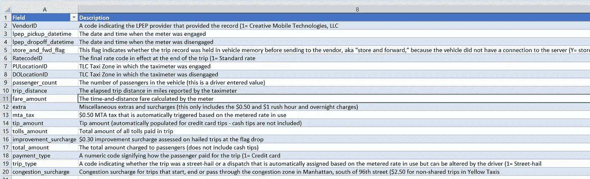

字典数据

最后是字典数据，我们可以用这些数据来理解这些数据。

**数据准备&数据清理**

第一个问题，数据非常大，大约有 2700 万条记录，因此 Power BI 很难处理，并且需要很长时间来处理。因此，在这种情况下，我必须将数据导入某个工具，以便更容易、更快地处理数据。我选择 SQL 来解决这个问题。

**SSIS**

SQL Server Integration Services 是一个用于构建企业级数据集成和数据转换解决方案的平台。使用 Integration Services 通过复制或下载文件、加载数据仓库、清理和挖掘数据以及管理 SQL Server 对象和数据来解决复杂的业务问题。

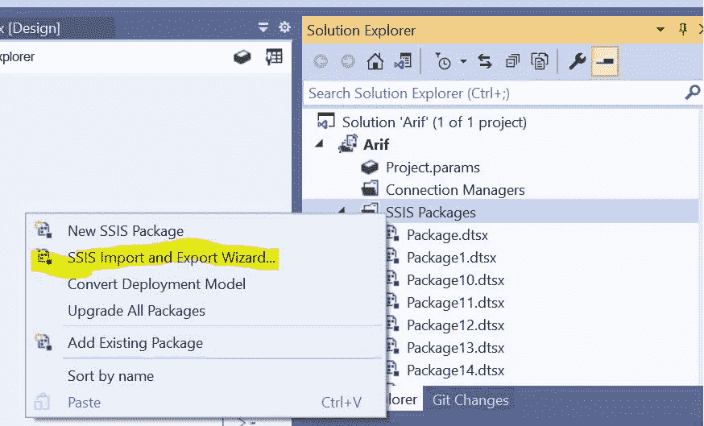

创建包

在 SSIS，我们需要先创建一个项目，然后我们可以通过简单的过程创建一个包。我们可以右键单击 SSIS 包裹，然后选择&申请 SSIS 进出口向导…如上图所示。

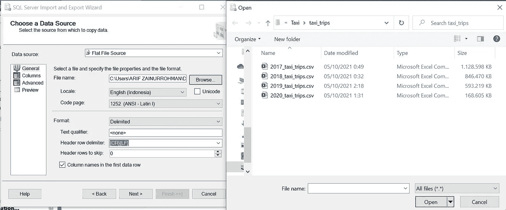

选择数据源

接下来，我们选择数据源，我们可以一个一个地导入，也可以创建一个全部导入，但是在这个例子中，我创建了一个一个地导入的包。

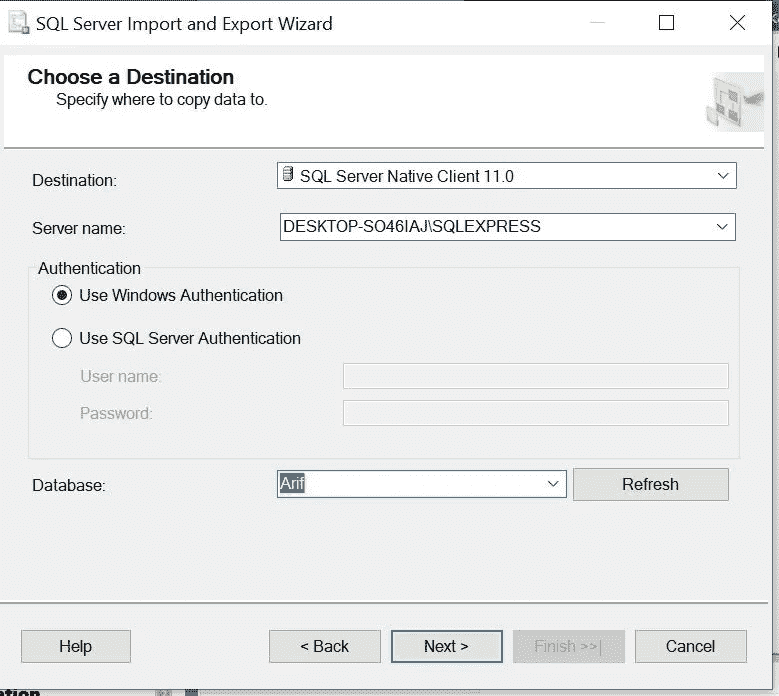

选择目标源

在我们选择了一个数据源之后，我们需要选择一个目标源，如上图所示。

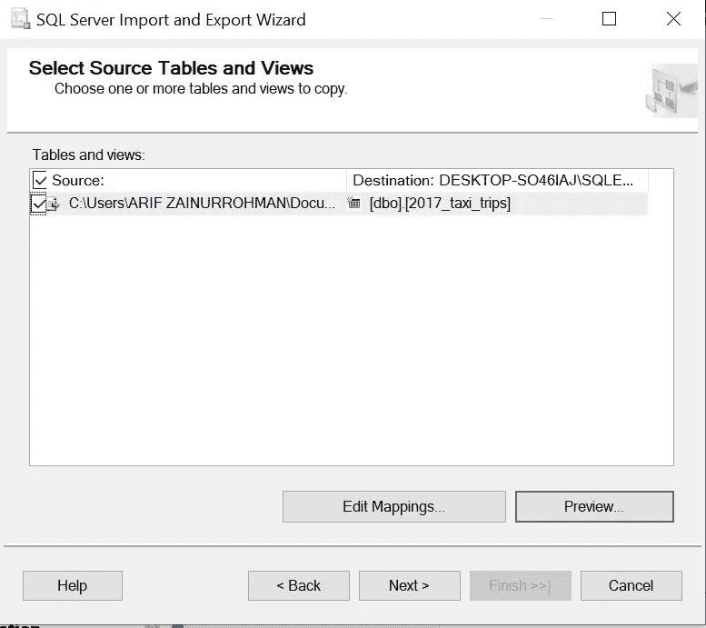

预览数据

在结束之前，我们可以预览数据，以确保在此之后执行包时没有错误。

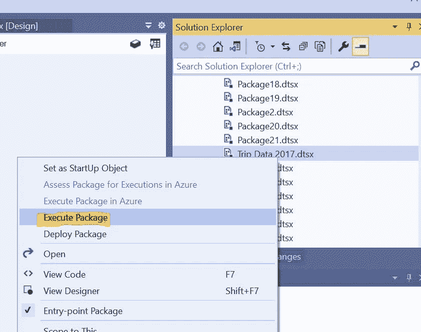

执行包

对于执行包，我们可以选择&右键单击包，然后单击 Execute Package。

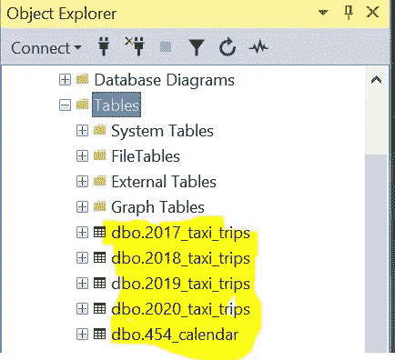

结果导入数据

最后，在我们完成并成功导入数据后，在我们的数据库中，我们将看到如上图所示的表格。

**合并数据，为 Power BI 准备数据**

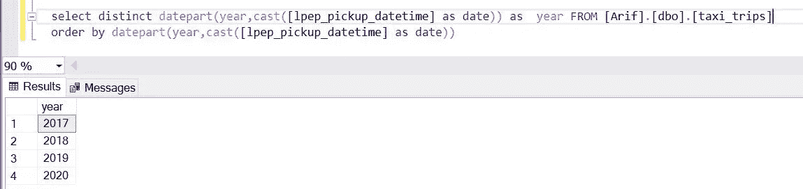

合并数据

完成数据导入后，我们需要将数据合并到一个表中，以减少 Power BI 中的流程。

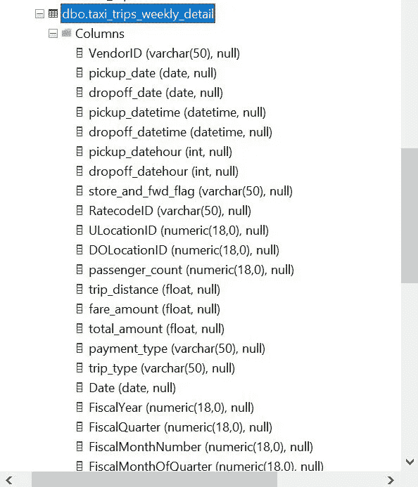

数据集可用于 Power BI

合并数据 trip 后，我发现数据非常大，为了减少 Power BI 中的流程，我决定将 Trip 数据和 Calendar 数据合并到一个表中。

Power BI 的查询数据集

查询连接如上图所示。

**Power BI 中的可视化**

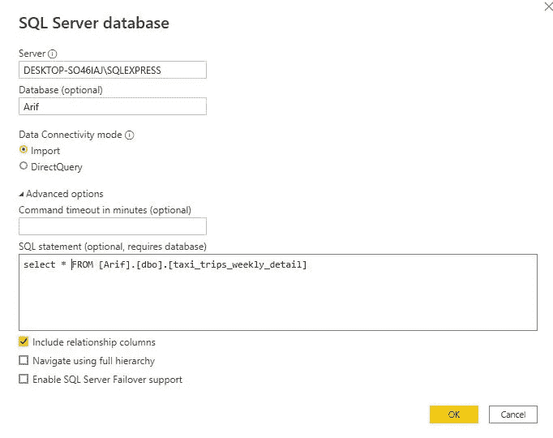

将数据从 SQL 导入 Power BI

首先，我们需要将数据从 SQL 导入 Power BI，我们需要在 SQL 和 Power BI 之间创建一个连接。不要忘记导入区域数据。

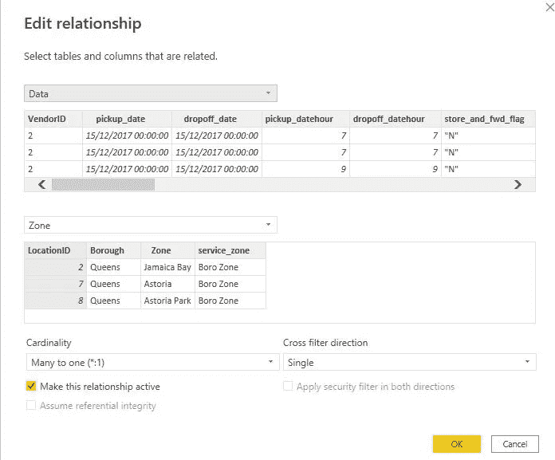

创建数据和区域之间的关系

看看这个，首先，我们有 5 个数据集(旅行数据、地图数据、区域数据、财政日历数据和字典数据)，但是在 Power BI 中，我们已经减少了 SQL 中的流程，因此我们在 Power BI 中只创建了 3 个数据集，这非常有帮助。

我们只创建 1 个关系表(数据表和区域表)。在我们建立了关系，并喜欢用 BI 提供给我们的图表创造创造力之后。

**地图可视化**

对于这个挑战，我很兴奋，因为我可以使用 Power BI 中的 Map Shapefile 功能，终于…哈哈哈…

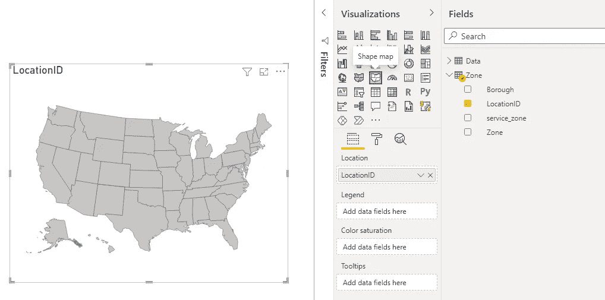

地图可视化

首先，我们选择并应用形状映射图，并将 LocationID 字段拖放到 Location 中。

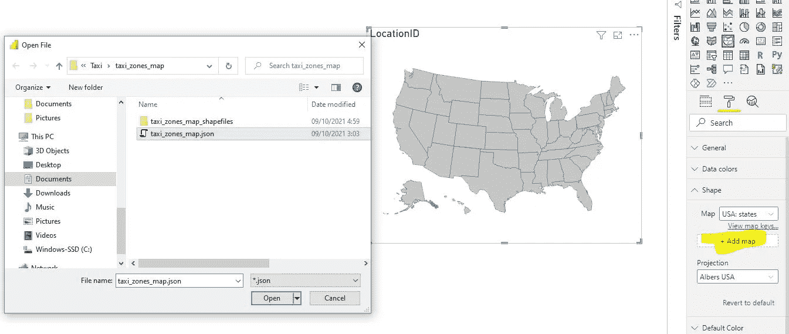

添加地图

接下来，我们需要将地图聚焦到我们将根据数据集显示的地图中。

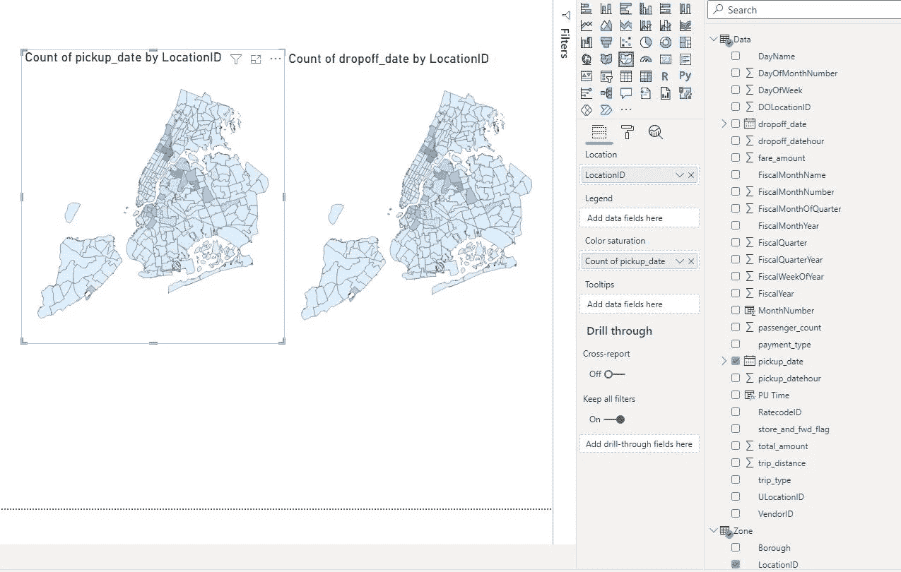

上下车区

最后，我们需要将取货和卸货数量添加到色彩饱和度中。最后，我们创建了地图可视化。

**结果与结论**

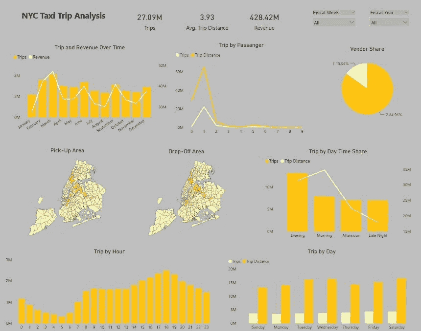

纽约市出租车出行分析仪表板

Power BI 是一个强大的数据可视化工具，我们可以在 Power BI 中使用许多功能，我非常兴奋地探索更多的功能。

**参考**

[SQL Server 集成服务— SQL Server 集成服务(SSIS) |微软文档](https://docs.microsoft.com/en-us/sql/integration-services/sql-server-integration-services?view=sql-server-ver15)