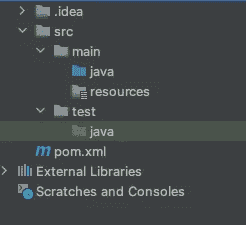
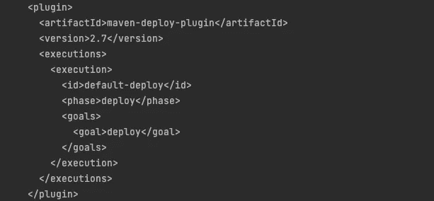
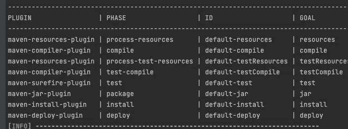
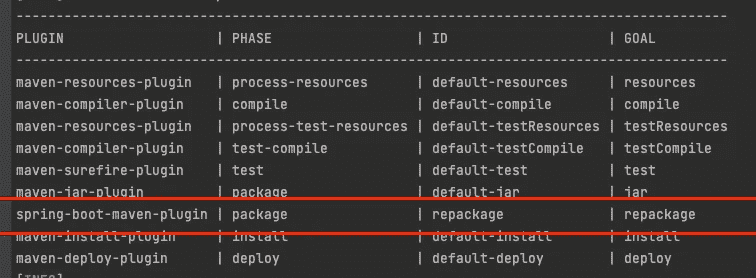

# Maven，适合所有季节的构建工具

> 原文：<https://medium.com/nerd-for-tech/maven-the-build-tool-for-all-seasons-498593e5307a?source=collection_archive---------17----------------------->


[Jay Ee](https://unsplash.com/@da_b_da?utm_source=unsplash&utm_medium=referral&utm_content=creditCopyText) 在 [Unsplash](https://unsplash.com/s/photos/scaffolding?utm_source=unsplash&utm_medium=referral&utm_content=creditCopyText) 上的照片

从源代码构建一个包有许多连续的步骤。源代码不能独立存在。它需要依赖、编译、测试等过程才能转换成包。这个最终的包被其他包或用户使用。

# 创建包的步骤

1.  从像 [mvn 仓库](https://mvnrepository.com)这样的仓库下载依赖项
2.  编译代码
3.  单元测试
4.  将其制作成一个包(war、jar 或 zip)
5.  集成测试
6.  将包推入存储库或服务器。

为了自动化以上所有步骤并将代码转换成包，我们可以使用 [Maven](https://maven.apache.org/index.html) 。

# 专家

Maven 是一个软件构建工具。这是一个通用工具，可用于所有语言。一个项目的建设给了一个包。这些包也被称为**工件**、**包或模块**。

# Maven 文件夹结构

在 maven 项目中，默认的文件夹结构将源代码和测试代码分开。在 **src/main** 中所有的源代码都写好了。在 **src/test** 中，编写了所有的测试代码，如单元测试和集成测试。



Maven 文件夹结构

# POM.xml 示例

Pom.xml 定义了创建包所涉及的各个步骤，开发人员可以使用它来配置构建步骤。

```
<?xml version="1.0" encoding="UTF-8"?>
<project 
         xmlns:xsi="http://www.w3.org/2001/XMLSchema-instance"
         xsi:schemaLocation="http://maven.apache.org/POM/4.0.0 http://maven.apache.org/xsd/maven-4.0.0.xsd">
    <modelVersion>4.0.0</modelVersion>

    <groupId>org.example</groupId>
    <artifactId>Sample</artifactId>
    <version>1.0.0-SNAPSHOT</version>

</project>
```

**groupId** 、 **artifactId** 和**版本**用于唯一标识项目。GroupId 是唯一的组名，便于识别项目。ArtifactId 是项目的名称。该版本遵循[版本](https://semver.org)。版本中的快照表明该版本正在开发中。

在 **x.y.z** 版本中，x 表示不向后兼容情况下的重大变化，y 表示功能更新，z 表示 bug 修复。

# 生命周期、阶段、插件和目标

maven 的生命周期是

1.  **清理**(清除目标文件夹)，
2.  **默认**(建筑)和
3.  **站点**(文档)

默认的生命周期是最突出的。这些是构建生命周期的阶段。

1.  使生效
2.  编制
3.  测试(单元测试)
4.  包裹
5.  验证(集成测试)
6.  安装(推送到本地存储库)
7.  部署

每个阶段都有**个目标**。这些目标和阶段是由**插件定义的。**以下插件具有部署阶段和部署目标。



maven-de poly-插件

这些是示例项目的默认插件、阶段和目标。



mvn fr . jcgay . maven . plugins:build plan-maven-plugin:list

当我们添加自己的插件时，它将被添加到默认插件之上。我已经添加了 **spring-boot-maven-plugin** 。

```
<build>
  <plugins>
    <plugin>
      <groupId>org.springframework.boot</groupId>
      <artifactId>spring-boot-maven-plugin</artifactId>
    </plugin>
  </plugins>
</build>
```



# 属国

我们的软件项目所依赖的手段叫做依赖。这些工件中的一些被放置到最终的包中，这些工件中的一些仅用于测试目的。

```
<dependency>
  <groupId>junit</groupId>
  <artifactId>junit</artifactId>
  <version>4.13.2</version>
  <scope>test</scope>
</dependency>
```

# MVN 的遗产

maven POM 可以通过包含其他 POM 作为父 POM 来从其他 POM 继承其插件和属性。这是管理 POM 的有效方法。

```
<parent>
  <groupId>org.springframework.boot</groupId>
  <artifactId>spring-boot-dependencies</artifactId>
  <version>2.4.1</version>
</parent>
```

# MVN 命令

maven 的目标可以通过 mvn 命令来执行。运行目标将包括它之前的目标。例如，运行 deploy 将在它之前运行所有其他目标，如编译、测试和打包、安装。如果构建过程中的任何步骤失败，将生成报告。

```
mvn help:effective-pom (Includes inherited pom from parent)
mvn dependency:tree (Gets transitive depedency)
mvn package (Makes the package)
mvn install (Install the package in local repository)
mvn install -DskipTests=true (Skips the tests)
mvn site
```