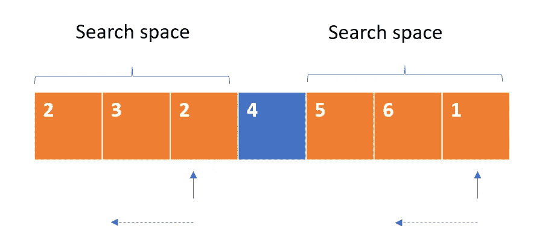
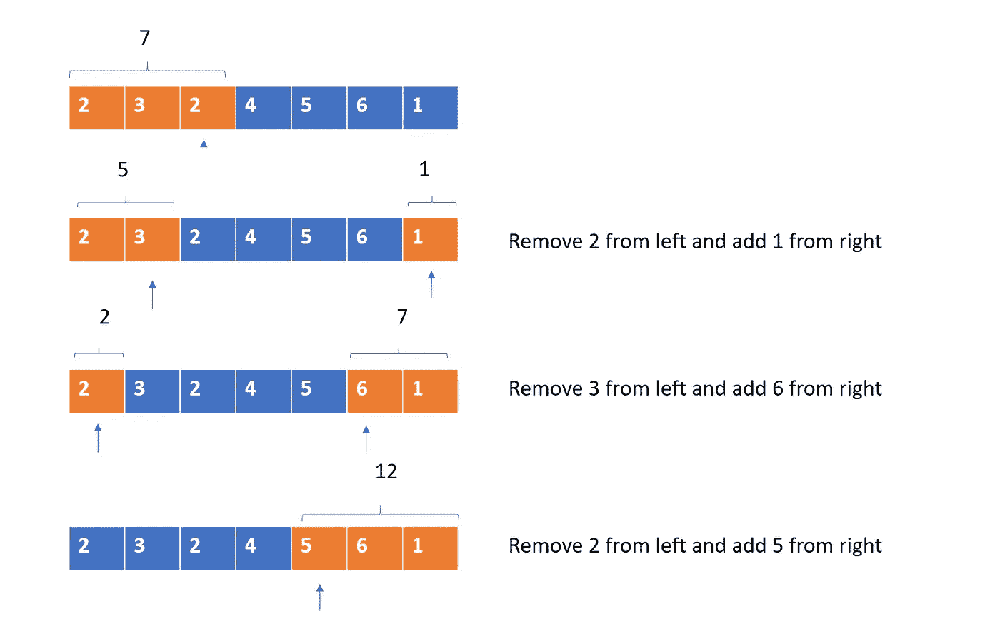
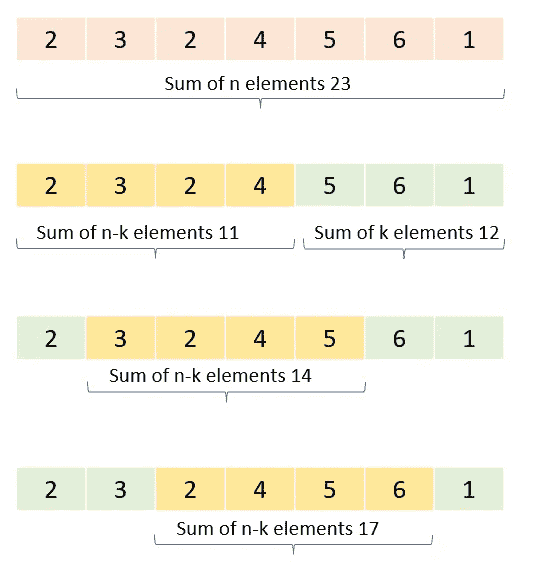

# 卡片的最大点数——谷歌面试问题

> 原文：<https://medium.com/nerd-for-tech/max-point-from-cards-daily-challenge-may-7a34f5b92a41?source=collection_archive---------26----------------------->


在 [Unsplash](https://unsplash.com/s/photos/collect?utm_source=unsplash&utm_medium=referral&utm_content=creditCopyText) 上[戴永吉](https://unsplash.com/@daipdaip?utm_source=unsplash&utm_medium=referral&utm_content=creditCopyText)的照片

这个问题来自每日 Leetcode 编码挑战赛——五月版。这是一个中等标签的问题。看看 Leetcode 的统计数据，在过去的 6 个月里，这个问题在 google 访谈中被问了 12 次。让我们看看问题陈述。

## [1423。](https://leetcode.com/problems/maximum-points-you-can-obtain-from-cards/)您可以从卡片中获得的最高点数

有几个卡片**排成一行**，每张卡片都有相关的点数，点数在整数数组`cardPoints`中给出。

在一个步骤中，您可以从该行的开头或结尾抽取一张牌。你得拿正好`k`张牌。

你的分数是你所拿的牌的分数之和。

给定整数数组`cardPoints`和整数`k`，返回你可以获得的最大分数*。*

***示例***

```
***Input:** cardPoints = [1,2,3,4,5,6,1], k = 3
**Output:** 12
**Explanation:** After the first step, your score will always be 1\. However, choosing the rightmost card first will maximize your total score. The optimal strategy is to take the three cards on the right, giving a final score of 1 + 6 + 5 = 12.*
```

## *理解问题:*

*让我们首先了解一下我们感兴趣的指标。我们对项目 0、1、2 … k 和 n-1、n-2、n-3… n-k 感兴趣。因此，在上面的示例中，我们的搜索空间仅限于索引 0、1、2 — 4、5 和 6。中间项目无助于解决问题。*

**

*换句话说，我们有两个极端，从左边选择 k 个元素或者从右边选择 k 个元素。所有其他组合将通过从一侧减少元素并从另一侧增加元素来实现。*

*在这些指数中，我们可以取 3，并尝试最大化它们的总和。让我们看看一些选择。[1，2，3]，[1，2，1]，[1，1，6]，[1，6，1]等等..唯一的限制是，只有在我们之前也选择了 0 的情况下，我们才能使用索引 1。同样，我们不能从右边选择元素 6，除非我们也取了 1。*

## *方法 1:*

*因为我们在选择时有连续性条件，所以我们可以在选择时使用运行和。我们使用两个指针的方法来实现这一点。*

**

*我们从左边开始，选择前 k 个元素并得到它们的和。如果我们从左边一个接一个地选择所有的 k 个元素，这将给出点数的总和。我们将左指针放在第 k-1 个索引处，右指针放在最后一个索引 6 处。*

*现在我们移除索引 k-1 处的元素，这里是 2。这将使左边的和减少 2。这意味着我们已经从左边选择了前两个元素。我们已经收集了 5 个点，还剩下一个元素需要选择。这是在选择第 n-1(6)个索引处的元素时。所以现在 k 个元素的总点数是 5 (2 和 3)从左边开始，1 从右边开始，总共是 6。我们继续这样做，直到第 0 个索引(包括)。此时，左边和将变成零，右边和变成最后 k 个元素的和。*

## ***代码实现:***

```
*def maxScore(cardPoints, k):
    left_sum = sum(cardPoints[:k])
    right_sum = 0
    max_points = left_sum + right_sum
    lp = k-1
    rp = len(cardPoints)-1

    while lp >= 0:
        left_sum -= cardPoints[lp]
        right_sum += cardPoints[rp]
        max_points = max(max_points, left_sum + right_sum)

        lp -= 1
        rp -= 1
    return max_points*
```

## *复杂性分析:*

*   *时间复杂度:因为我们使用两个指针来遍历 k 个元素，所以复杂度是 O(k)*
*   *空间复杂度:我们有两个变量来跟踪左右和。所以这个解是在常数空间里解的。*

## ***接近 2***

*问题说的是最大化数组中 k 个元素的和。*

*假设我们有一个大小为`n`的数组，总和为 s。如果我们减去`k`元素的总和为 K，那么我们将使用 n-k 个元素得到总和 Z。如果我们最小化这 n-k 个元素的总和，那么 k 个元素的总和将最大化。*

**

```
*sum of n elements = sum of k elements + sum of n-k elements
sum of k elements = sum of n element — sum of n-k elements*
```

*根据上面的等式，如果我们想最大化左边的值，那么我们必须最小化右边的减法元素。因此，这个问题可以重新表述为*

> *求最小的子阵列长度之和`n - k`*

*解决办法*

*我们可以使用滑动窗口方法来寻找大小为 n-k 的子阵列的最小和。*

## *代码实现*

```
*def maxScore(cardPoints, k):
    n = len(cardPoints)
    window = n - k
    min_window_sum = curr = sum(cardPoints[:window])

    for i in range(k):
        curr += cardPoints[window + i] - cardPoints[i]
        min_window_sum = min(min_window_sum, curr)

    return sum(cardPoints) - min_window_sum*
```

*编码快乐！！*