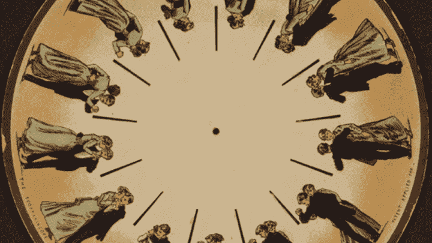
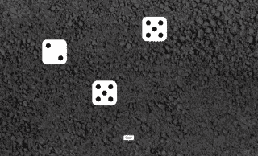

# 5 月 14 日:在 React 中使用样式化组件的随机 CSS 动画

> 原文：<https://medium.com/nerd-for-tech/may-14-random-css-animations-using-styled-components-in-react-dda83d9afb62?source=collection_archive---------8----------------------->



纸动物实验镜，埃德沃德·迈布里奇，1893 年

没有动画，网络就没那么有趣了。这是吸引用户的最简单的方法，因为[动画模仿了真实世界](https://www.nngroup.com/articles/response-times-3-important-limits/)的自然节奏，使网站更具关联性。如果做得好，它会给一个应用程序带来完美的、专业的光芒，这是其他地方无法轻易弥补的。

[我以前在这个博客上写过关于](https://joshgoestoflatiron.medium.com/april-2-intervals-and-event-listeners-when-working-with-react-hooks-14bc069affe0) **React** 的文章，这是一个用于构建用户界面的开源 JavaScript 库，因为尽管它很受欢迎，功能强大，但它的许多怪癖甚至会让最有经验的开发人员感到困惑。其中一个特质是 React 应用程序与 CSS 的关系，既然 CSS 是 web 动画事实上的标准，现在 Adobe 终于理所应当地在 Flash 的核心部分占有一席之地，理解这种关系对于使用它创建引人注目的动画至关重要。让我们在今天的帖子中关注这种关系！

# 背景

[David Ceddia](https://daveceddia.com/what-react-does/) 提出了我想在开始之前强调的一个重要观点: **React 做的事情并没有你想象的那么多。它在网页上绘制 HTML 就是这样。因此，当你创建和调整自己的动画 React 应用程序时，请记住，许多“React 问题”实际上只是 JavaScript 问题或 CSS 问题。**

在这篇博文中，我将使用一个简单的掷骰子作为例子，灵感来自纽约的生活，每年这个时候街头掷骰子游戏很常见。按下“滚动”按钮后，三个骰子旋转到顶部，从“墙壁”上“反弹”，并“降落”在屏幕上随机的某个地方:



要考虑的一个关键术语:关键帧**是一个平滑过渡的起点或终点的快照——一个在时间上冻结的时刻。它被称为*帧*是因为很久很久以前，在一个很远很远的星系里，动画是在被称为“胶片”的纸质材料的实际物理条上完成的，被分成称为帧的方块。**

# 通往王国的钥匙

在纯 CSS 中，我们将使用`@keyframes` CSS 规则来制作骰子动画，这允许我们定义动画的起点、终点和中间点，具有很大的灵活性和简单明了的细节:

```
@keyframes dieAnimation {
   from {
      top: 110%;
      left: 50%;
   }
   to {
      top: 0%;
      left: 50%;
      transform: rotate( 360deg );
   }
}
```

这个动画将使我们的骰子从视窗的底部缩放到顶部，旋转 360 °,并始终保持在视窗的中间。这个动画非常简单，因为它只有两个关键帧:开始`from:`和结束`to:`。我们可以通过指定其他关键帧来进一步了解细节:

```
@keyframes dieAnimation {
   0% {
      top: 110%;
      left: 50%;
   }
   50% {
      top: 0%;
      left: 50%;
      transform: rotate( 360deg );
   }
   100% {
      top: 50%;
      left: 50%;
      transform: rotate( 360deg );
   }
}
```

现在，我们的旋转骰子将在动画进行到一半时停在视口的顶部，然后停在屏幕的中央。

这很可爱，但它并没有真正公平地对待掷骰子的体验。骰子总是沿着相同的路径，落在相同的地方…但是在现实生活中，当然，骰子是随机的，落在随机的地方。那么，*我们如何给我们的骰子动画添加随机性呢？*有些 CSS 预处理程序中有随机数发生器，比如 [SASS](https://sass-lang.com/) :

```
$randomDuration: random( 5 );.dice { animation-duration: $randomDuration; }
```

但是这里有一个巨大的问题:SASS 只在运行时随机化，这意味着只要 SASS 处理你的 CSS，这个数字就不会改变(直到 SASS 再次运行)。每当代码像`Math.random()`一样运行时，这个“随机”数字就不会产生。借用[杰克·阿尔博](https://twitter.com/jake_albaugh/status/814510609219911680)的一个比喻，在 SASS 中用`random`挑选一个随机数就像用一个随机总统的名字挑选一个随机的名字。

# 风格警察

很明显，我们需要将 JavaScript 引入到图片中来随机化我们的 CSS 骰子动画。但是因为我们使用的是 React 而不是纯 JavaScript，所以我们将通过引入`styled-components`来做到这一点，这是一个[包](https://github.com/styled-components/styled-components)，它允许我们一起使用 CSS 和 JavaScript，并和谐地使用两者——这是一个被称为[**“CSS-in-JS”的概念**](/dailyjs/what-is-actually-css-in-js-f2f529a2757)

在之前的博客文章中，我已经探讨了 React 的*声明性*本质以及这给习惯于编写*过程化*代码(比如纯 JavaScript 和 CSS)的程序员带来的挫败感。JavaScript 和 CSS 通常从头到尾都以一种(相对)简单的方式运行，但是 React……并不像那样运行(这是重点)。因此，像`styled-components`这样的各种工具已经被开发出来，通过允许开发人员定义和使用 CSS 片段作为模板或模块来弥合这一差距，就像 React 对 JavaScript 和 HTML 所做的那样。CSS-in-JS 不是一个单独的库或包，而是这种模块化方法以及为实现它而创建的思想和代码包的统称。

首先，我将在我们的`Die`组件的顶部运行`yarn add styled-components`(或`npm install --save styled-components`)和`import`，这基本上只是一个骰子正面的 SVG:

```
import styled from "styled-components";export default function Die( { number } ) {
   return <svg className="die">
      ...
   </svg>;
}
```

接下来，我将用我刚刚导入的`styled`模板替换我们的`svg`标签，并将其应用于`svg`，使用我希望应用于反勾号的样式:

```
import styled from "styled-components";**const DieSvg = styled.svg`
   position: absolute;
   top: ${ props => props.randomX }%;
   left: ${ props => props.randomY }%;
   animation: ${ dieAnimation( props => props.randomY ) } 0.5s linear;
`;**export default function Die( { number } ) {
   return <**DieSvg** className="die">
      ...
   </**DieSvg**>;
}
```

请特别注意两件事:

1.  **我在定义** `**DieSvg**` ***外*我们的** `**Die**` **分量！如果我不这样做，React 将会在每次我们的`Die`重新渲染时创建一个新的`DieSvg`。这不会破坏你的代码，但是这是低效和多余的，并且`styled-components`会在你的控制台中相应地抱怨。**
2.  **我在用回调函数调用** `**props**` **！**试图用`randomX`甚至`props.randomX`直接调用它们*不会*起作用。

最后，我将把`randomX`和`randomY`作为`props`添加到`Die`和`DieSvg`中:

```
...
export default function Die( { number, **randomX, randomY** } ) {
   return <DieSvg className="die" **randomX={ randomX } randomY={ randomY }**>
      ...
   </DieSvg>;
}
```

# 每个人都得到 rannn-dom

我们的`Die`组件现在准备好接受一个`randomX`和`randomY`，所以它将出现在屏幕上的一个随机位置。现在到了困难的部分:动画他们如何真正到达那里！幸运的是，`styled-components`在纯 CSS 中有一个与`@keyframes`规则相对应的规则，我们将对其使用 do:

```
import styled**, { keyframes }** from "styled-components";**const dieAnimation = randomY => keyframes`
   0% {
      top: 110%;
      left: 50%;
   }
   50% {
      top: 0%;
      left: ${ randomY / 2 }%;
      transform: rotate( 360deg );
   }
   100% { transform: rotate( 0deg ); }
`;**const DieSvg = styled.svg`
   ...
`;
```

请再次注意，**整个** `**dieAnimation**` **被包裹在一个回调中，以获取它需要的** `**props**` **！**再来一遍:*不要试图直接叫*`*props*`*不然你会很难受。*

*现在我们已经在`dieAnimation`中定义了`keyframes`，让我们的`DieSvg`实际使用它:*

```
*const DieSvg = styled.svg`
   position: absolute;
   top: ${ props => props.randomX }%;
   left: ${ props => props.randomY }%;
   **animation: ${ dieAnimation( props => props.randomY ) } 0.5s linear;**
`;*
```

*我们现在将*作为函数调用* `dieAnimation()`，将`props => props.randomY`作为回调传入，并且还指定它是一个运行时为`0.5s`的`linear`动画，就像我们在纯 CSS 中一样。*

*现在是时候把这一切结合在一起了！我将编写一个新的 React 组件，`Dice`，在屏幕上一次显示三个骰子，并显示我们移山倒海编写的新动画:*

```
*import Die from "./Die";export default function Dice( { roll } ) {const randomX = [ Math.floor( ( Math.random() * 25 ) + 5 ), Math.floor( ( Math.random() * 25 ) + 5 ), Math.floor( ( Math.random() * 25 ) + 5 ) ];const randomY = [ Math.floor( ( Math.random() * 25 ) + 5 ), Math.floor( ( Math.random() * 25 ) + 5 ), Math.floor( ( Math.random() * 25 ) + 5 ) ]; return <div>
      <Die number={ roll[ 0 ] } randomX={ randomX[ 0 ] } randomY={ randomY[ 0 ] } />
      <Die number={ roll[ 1 ] } randomX={ randomX[ 1 ] } randomY={ randomY[ 1 ] } />
      <Die number={ roll[ 2 ] } randomX={ randomX[ 2 ] } randomY={ randomY[ 2 ] } />
   </div>;}*
```

*这个组件接受一个`roll`，一个由 1 到 6 之间的三个随机数组成的数组，作为它的`props`的一部分。然后它定义了两个数组，每个数组都有实际的实数`Math.random()`随机数，而*不是*随机的总统，并返回一个`<div>`，里面有我们动画`Die`的三个副本——每个副本都在屏幕上不同的随机位置结束！*

*[派生并克隆链接的库](https://github.com/josh-frank/cee-lo)，在终端运行`yarn start`或`npm start`，你会看到结果。*

# *结论*

*在我的演示中，您可能会注意到骰子偶尔会重叠，这显然不是真正的骰子的行为方式。这暗示了模拟真实世界随机性的困难之一——物理比计算机代码复杂和微妙得多。与运动学角力，让你的应用逼真是一个巨大的挑战，只有你可以征服——但我希望这个简短的教程给你信心，抓住机会，掷骰子！*