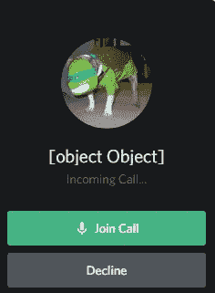

# 5 月 20 日:从非原语的 JavaScript 数组中删除重复项(没有 lodash！)

> 原文：<https://medium.com/nerd-for-tech/may-20-removing-duplicates-from-a-javascript-array-of-non-primitives-without-lodash-c71e57251ee9?source=collection_archive---------23----------------------->


啊，不起眼的**阵！这是 JavaScript 数据结构的瑞士军刀:没什么特别的，但是它确实做到了它在罐子上说的。数组是将变量和值组合在一起的一种便捷方式，理解数组对于使用 web APIs 至关重要。**

但不幸的是，像 JavaScript 中的其他东西一样，数组有很多限制、怪癖和警告——有效地使用它们需要聪明的思维和 MacGyver 式的变通方法。特别是，**过滤非原始重复项**是一个常见的数组问题，几乎是无处不在的采访主题。例如，如果我将客户的邮件列表作为一个数组来处理，我可能不希望在我的地址数组中出现重复的收件人。也许我的客户是阿尔·帕西诺在《T21》中扮演的角色，他坚持让我在没有像 [lodash](https://lodash.com/) 这样的外部库的情况下工作。

因为我在职业生涯和个人项目中遇到过这个问题，所以让我们探索一些方法吧！

# 背景:原始爱情

在 JavaScript 中，**原语**是**四个 Ts 之一，**代表*文本*，一个*总计，*一个*真值*或*无类型:*

*   **文字:**一个字符，`'c'`，或者一个`'string'`；
*   **总计:**一个`Number()`像`3`或者`3.14`或者`0b11`；
*   **真相:** a `Boolean()` ( `true`或`false`)
*   **无类型:** `undefined`、`null`或`NaN`

四个 t 的相关定义和区别特征是**严格** **可比性:**两个图元如果具有严格相同的值，则它们相等；

```
1 === 1;
   > true
'primitive' === 'primitive';
   > true
false === false;
   > true
```

因为像`includes()`和`indexOf()`这样的`Array`方法依赖于严格的可比性，所以原语的这种属性使得从数组中过滤它们的副本变得相对容易:

```
function filterPrimitiveDuplicates( array ) {
   return array.filter( ( element, index ) => {
      return !array.slice( 0, index ).includes( element );
   } );
}filterPrimitiveDuplicates( [ 5, 4, 5, 2, 5 ] )
   > [ 5, 4, 2 ]
filterPrimitiveDuplicates( "there is no there there".split( " " ) )
   > [ 'there', 'is', 'no' ]
```

JavaScript 工具包中还有另一个相对较新的依赖于严格相等的特性: [**集合**](https://developer.mozilla.org/en-US/docs/Web/JavaScript/Reference/Global_Objects/Set) **。一个 JavaScript 是一个严格唯一值的非索引集合，就像一个 T21 数学集合一样。大多数浏览器都支持快速的`Set()` s，我们可以在函数中利用它们的唯一性约束来`filterPrimitiveDuplicates()`，就像上面的函数一样:**

```
function filterPrimitiveDuplicates( array ) {
   return [ ...new Set( array ) ];
}
```

要去除原始副本，我们所要做的就是将我们的`array`变成一个`Set()`，然后将其展开回到一个数组中！这可能很难相信，但是在一个数组和一个`Set()`之间来回转换比遍历一个`array`的`element`并将它们与`includes()`进行比较要稍微快一点([大约 25%](https://jsben.ch/5c9EW) )。

# 回归原始

不幸的是，对于我们的 Advil 预算来说，**非原语**如数组和对象**是不可比的。**如果两个数组在内存中有不同的地址，那么即使它们的值完全相同，顺序也完全相同，它们也不完全相等。

```
[ 5 ] === [ 5 ];
   > false           // ugh
[ 1, 2 ] == [ 1, 2 ];
   > false           // yuck
```

这适用于`Set()`、`includes()`和`indexOf()`，就像它适用于十二等分和三等分一样:

```
const arrayOfNonPrimitives = [ [ 1, 2 ], [ 3, 4 ], [ 5, 6 ], [ 1, 2 ] ];new Set( arrayOfNonPrimitives ) ;
   > Set(4) { [ 1, 2 ], [ 3, 4 ], [ 5, 6 ], [ 1, 2 ] } // fail
arrayOfNonPrimitives.includes( [ 1, 2 ] );
   > false                                             // awful
arrayOfNonPrimitives.indexOf( [ 1, 2 ] );
   > -1                                                // my eyes
```

那么，如果元素不是严格可比的，我们如何从非基元数组中过滤出重复的元素呢？我们把它们转换成一个基本的数据类型怎么样?*和*是严格可比的——就像字符串一样？我已经知道这会变得很混乱…

## 将数组转换为字符串

JavaScript 的`toString()`或`join()`方法将很好地完成这项任务；当在数组上没有参数的情况下调用时，要么产生一个由逗号分隔的每个元素组成的字符串——而*这些*字符串，*与*具有可比性:

```
[ 1, 2, 3 ].join();
   > '1,2,3'
[ 1, 2, 3 ].toString();
   > '1,2,3'
[ 1, 2, 3 ].toString() === [ 1, 2, 3 ].join();
   > true
```

让我们像以前一样过滤，但添加一些铸造:

```
function filterArrayDuplicates( array ) {
   return array.filter( ( element, index ) => {
      return !array.slice( 0, index ).join().includes( element.join() );
   } );
}filterArrayDuplicates( [ [ 1, 2 ], [ 3, 4 ], [ 1, 2 ] ] );
   > [ [ 1, 2 ], [ 3, 4 ] ]           // hallelujah
```

同样的想法也适用于我们的方法，其中包含图形内容，可能不适合年轻读者:

```
function filterArrayDuplicates( array ) {
   return [ ...new Set( array.map( element => element.join() ) ) ].map( element => element.split( "," ).map( element => parseInt( element ) ) );
}
```

在*我*尖叫着跑进树林成为原始人之前，让我们把这个梳理成多行:

```
const castToString = element => element.join();const castToInteger = element => parseInt( element );const splitByCommasThenCastToInteger = element => element.split( "," ).map( castToInteger );function filterArrayDuplicates( array ) {
   const castEachElementToString = array.map( castToString );
   const castToSetAndBackAgain = [ ...new Set( castEachElementToString ) ];
   return castToSetAndBackAgain.map( splitByCommasThenCastToInteger );
}
```

当我预定义了所有那些讨厌的(但是重要的！)回调。首先，我用一个`map()`函数`castEachElementToString`；然后，我`castToSetAndBackAgain`；最后，我使用另一个`map()`函数来`splitByCommasThenCastToInteger`。咻！

## 将对象转换为字符串

当我意识到`toString()`和`join()`将*而不是*作用于对象时，我活下去的意愿慢慢变得越来越弱——因为没有`Object.join()`方法，并且`Object` `toString()`的默认转换是荒谬且无益的:

```
{ one: 1, two: 2, three: 3 }.toString();
   > '[object Object]'           // what is this sorcery
{ one: 1, two: 2, three: 3 }.join();
   > Uncaught: TypeError         // how could a merciful God do this
```



在[对象对象]打电话之前，一切都是娱乐和游戏

我们需要发挥创造力，找到另一种方式来比较`Object`的值，以正确确定它们是否包含相同的值。一种方法是`JSON.stringify()`，它几乎肯定*不是*打算用于这样的用途，但仍然产生了一个`Object`的可接受的原始版本:

```
JSON.stringify( { one: 1, two: 2, three: 3 } );
   > '{"one":1,"two":2,"three":3}'     // I guess that's better (?!)
```

`JSON.stringify()`的唯一问题是，如果键/值对以不同的顺序插入，它将产生不同的结果，即使那些键/值对完全相同:

```
thisObject = { one: 1, two: 2, three: 3 };
thatObject = { three: 3, two: 2, one: 1 };JSON.stringify( thisObject );
   > '{"one":1,"two":2,"three":3}'
JSON.stringify( thatObject );
   > '{"three":3,"two":2,"one":1}'
JSON.stringify( thisObject ) === JSON.stringify( thatObject );
   > false                       // this is the life I've chosen
```

为了解决这个歇斯底里和可笑的问题，我将使用两个`Object`原型方法:`Object.keys()`和`Object.values()`。我们将把对象分割成它们的`keys()`和`values()`数组，然后`sort()`并对每个`toString()`进行造型。当这样做时，具有相同键/值对的两个对象将总是产生相同的结果，即使这些对是无序的:

```
function compareObjects( thisObject, thatObject ) {
   return Object.keys( thisObject ).sort().toString() === Object.keys( thatObject ).sort().toString() && Object.values( thisObject ).sort().toString() === Object.values( thatObject ).sort().toString();
}compareObjects( thisObject, thatObject )
   > true                       // it's over, Mr. Frodo
```

记得我在上面解释过,`Set()`依赖于其元素的可比性来加强其独特性。因为没有直接的方法可以有效地将对象转换为原语，同时保证其可比性，所以我们不能像上面那样使用`Set()`。但是，我们*可以通过将我们的`compareObjects()`方法与`findIndex()`方法结合起来使用`filter()`，后者返回数组中满足测试回调的第一个元素的索引:*

```
function compareObjects( thisObject, thatObject ) {
   ...
}function filterObjectDuplicates( array ) {
   return array.filter( ( element, index ) => {
      return index === array.findIndex( elementToCompare => compareObjects( element, elementToCompare ) );
   } );
}filterObjectDuplicates( [ { one: 1 }, { two: 2 }, { three: 3 }, { one: 1 } ] )
   > [ { one: 1 }, { two: 2 }, { three: 3 } ] // sweet victory
```

# 结论:原始的感觉，原始的方式

重要的是要注意，在我在上面的恐怖马戏团中使用的所有例子中，非原语数组元素*本身只包含原语。*在非原语中没有非原语的**嵌套**，比如…

```
[
  {
    name: 'Josh',
    languages: [ 'English', 'Spanish' ],
    diet: { vegetarian: false, glutenFree: false }
  },
  {
    name: 'Worf',
    languages: [ 'English', 'Klingon' ],
    diet: { vegetarian: false, glutenFree: true }
  },
]
```

也没有任何**不规则的**数组具有一种以上的数据类型:

```
[ 56, null, true, { name: "Josh"}, 9.5, "Spanish" ]
```

你的数组越不规则，嵌套越多，就越需要调整和绞尽脑汁来消除重复。只有你能决定如何最好地调整和处理边缘情况和不规则情况。请记住核心思想:**将元素转换为原语**和**确保这些原语是严格的、唯一的可比较的！**