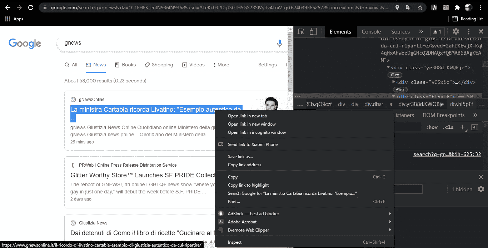
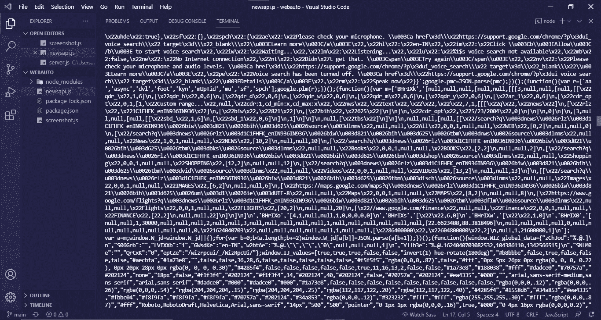
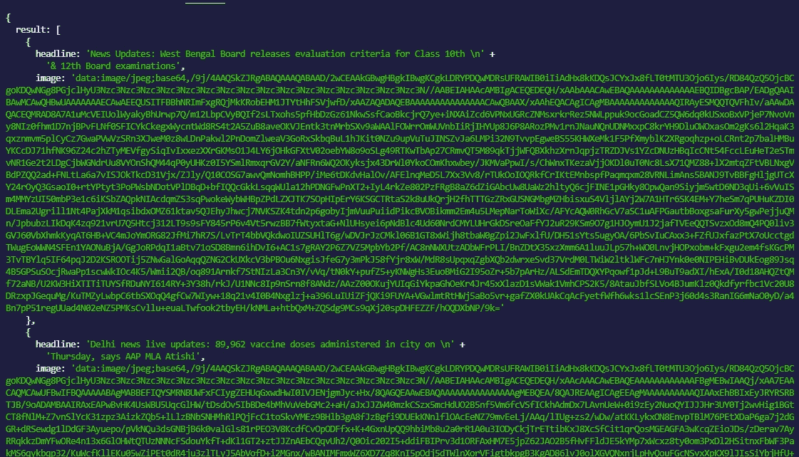

# 也许木偶师是你想要的网络自动化工具

> 原文：<https://medium.com/nerd-for-tech/may-be-puppeteer-is-the-tool-you-want-for-web-automation-1cd2a1e3fcdf?source=collection_archive---------12----------------------->

# 介绍

**木偶师**是由 **Chrome** 开发团队创建的一个节点库，它提供了一个高级 API 来通过**开发工具协议**控制**无头 Chrome** 或**Chrome**。也可以配置使用全(非无头)**铬**或**铬**。基本上，它可以为您执行任何自动化任务。

# 木偶师能做什么？

使用**木偶师**，你在浏览器中手动做的大多数事情都可以轻松高效地完成！让我们看看一些最有用和最流行的任务。

1.  爬行和抓取单页 Web 应用程序以及预呈现的 Web 应用程序。
2.  生成任何网站的 pdf 和图像。
3.  自动化登录、表单提交、用户界面测试等。
4.  您可以创建一个自动化测试环境，并直接在最新版本的 **Chromium 中运行测试。**

# 入门指南

让我们通过使用这个示例命令启动一个新的节点项目来开始我们的项目。

# 装置

安装**木偶师**是相当简单的任务。感谢 **NPM** 和**纱。你需要使用这个简单的命令来安装**木偶师。****

当我们安装**木偶师**时，它下载了一个最新版本的 **Chrome 浏览器**或 **Chromium** (约 170 MB MacOS，~280MB Windows)。你可以通过安装**木偶核心**而不是**木偶来跳过下载。它没有集成的浏览器。它将使用现有的浏览器，而不是安装一个新的。**

# 让我们创造一些令人敬畏的东西

熟悉其他测试框架的人会很容易理解。我们将创建一个**浏览器**实例，打开网页并用**木偶师的 API 操纵它们。**

1.  **创建一个应用程序来从网页上截取屏幕截图**

让我们创建一个名为 screenshot.js 的文件，并使用 require 函数导入木偶师模块。然后我们将编写一个**匿名异步**函数来初始化一个**浏览器**实例，并打开一个 **URL** 来捕获一个截图。代码将如下所示:

我们简单地启动了一个浏览器，然后去[https://www.youtube.com](https://www.youtube.com)拍了一张截图。默认的视窗尺寸是 **800 × 600 像素**，有点小。这就是为什么我们通过 **setViewport()** 函数定义了一个自定义视口。现在在你的终端中运行 ***节点截图. js*** 。

它将生成一个 PNG 文件。就我而言，程序的输出相当令人满意。

让我们探索更多。

2.**创建一个应用程序将网页转换成 PDF 格式**

将**文章页面**转换成可读的 pdf 可能是非常有用的实时应用程序。因此，让我们开始创建一个新文件，并将其命名为 **createpdf.js.** 一切都将保持不变，我们将只更改一个函数。我们将使用 use **page.pdf()** 函数，而不是 **page.screenshot()** 。代码将如下所示:

使用命令 ***节点 createpdf.js*** 通过终端运行这个脚本。对我来说，输出是令人满意的。

我们看到了两个最基本的应用**木偶师**。现在，让我们来谈谈木偶师更高级的用法。要创建任何动态的应用程序，我们需要数据。比如，你想开发一个新闻应用。在这种情况下，你需要新闻数据。有很多 **API** 会为你的项目提供 **JSON** 数据，但是如果你不想使用外部 API 呢？答案是**网页抓取。Web 抓取**是从 web 上收集信息的过程。废掉一个网站主要有两个步骤。

1.  **报废一个网站的全部源代码。**
2.  **从完整源代码中抓取所需数据。**

我们将使用**木偶师**删除源代码，使用 **Cheerio** 过滤数据。 **Cheerio** 是使用 **jQuery** like 语法过滤数据的高效库。

我们将废弃谷歌新闻来获取新闻数据…

首先，创建一个新文件，命名为 **newapi.js.** ，然后通过终端安装 **cheerio** 。

它将在您的项目目录中安装 cheerio。假设我们想从**谷歌新闻中收集标题和图片。**现在转到谷歌新闻页面，通过点击 ctrl+shift+i 打开 **DevTool** ，现在选择新闻栏的**标题**文本，右击它，然后点击 inspect。可以看看源代码。记下课程。在我的例子中，我找到了**“JheGif ndgy 9d”**作为这个元素的类名。

现在，对图像做同样的操作。我没有找到图像的类名。因此，我记下了它的父 div 元素的类，即**“KNcnob”。**最后，我们准备废除**谷歌新闻。**

在这段代码中，我们引入了两个模块，**木偶师**和 **Cheerio。**为**谷歌新闻**标签定义默认 URL。在匿名函数中，我们启动一个浏览器，然后通过 **page.goto()** 函数转到 **URL** 。 **page.content()** 函数帮助我们获得源代码。现在，用 ***节点 newsapi.js*** 命令运行这个程序。结果会是这样:

但这种无组织和肮脏的，对不对？来了，再见。我们将用它来过滤我们需要的数据。

在 14 号线之前，一切都是一样的。我们加载了**谷歌新闻**页面的源代码来过滤数据。定义一个空数组对于收集筛选的数据很重要。我们记下了**标题**和**图片的类别。**所以，我们遍历这个类的每个外观，通过 **cheerio text()** 函数提取它的内部文本，通过 **attr()** 函数提取图像源。并且将值添加到**结果**数组。最后通过 console.log()函数打印**结果**。再次运行这个脚本！！！你得到了这样一个结构良好的 JSON 数据:

# 结论

在这篇文章中，我试图解释**木偶师**最基本的应用以及它最高级的应用。网络抓取是每一个数据传输网站使用的秘密技术，从互联网上收集数据并传递给用户。现在，你可以编写你自己的**网页抓取器**来从互联网上收集数据并用于你自己的应用程序。

**快乐编码！！！**